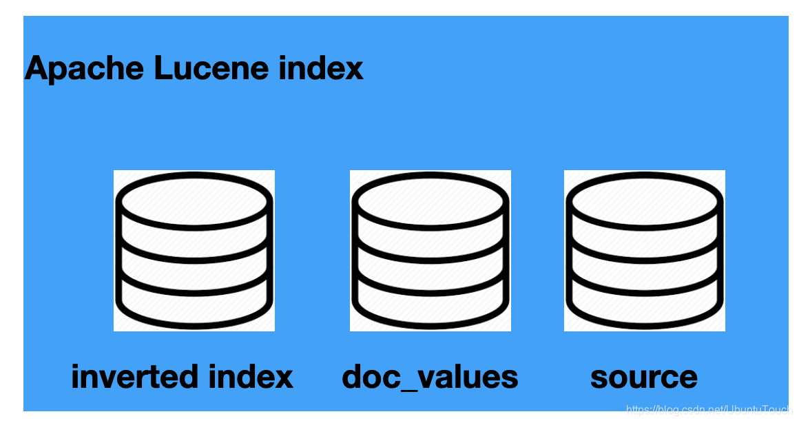
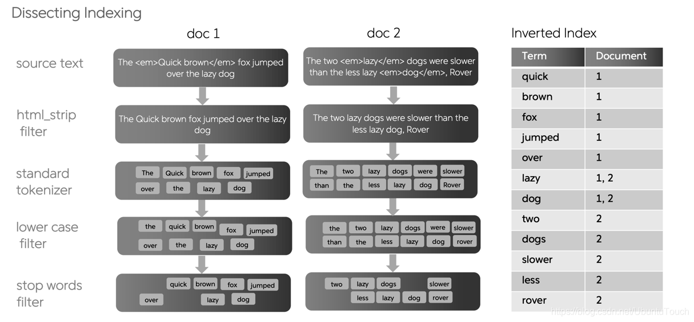
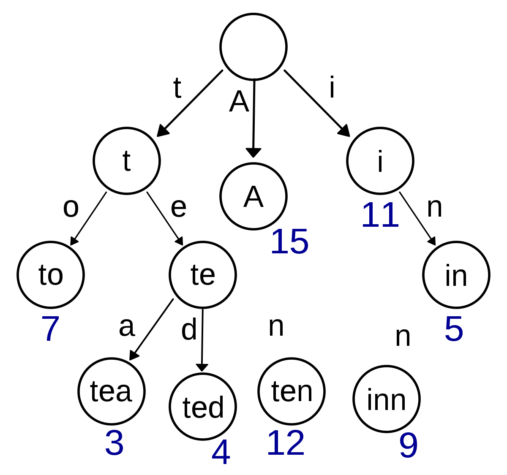

# inverted index，doc_values 及 source

如下的几个概念：

- inverted index
- doc_values
- source



## Inverted index

在 Elasticsearch 中，最基本的数据存储单位是 shard。 但是，通过 Lucene 镜头看，情况会有所不同。 在这里，每个 Elasticsearch 分片都是一个 Lucene 索引 (index)，每个 Lucene 索引都包含几个 Lucene segments。 一个 Segment 包含映射到文档里的所有术语（terms）及 一个倒排索引 (inverted index)。
 [Inverted index](https://www.elastic.co/blog/found-elasticsearch-from-the-bottom-up)（也叫倒排索引）是 Elasticsearch 和任何其他支持全文搜索的系统的核心数据结构。当一段文字从最原始的文字导入到 Elasticsearch 中，需要经过一个叫做 indexing 的过程。



倒排索引类似于你在任何书籍结尾处看到的索引。 它将出现在文档中的术语映射到文档。通过这个索引，我们可以很快地查找到术语所在的页面。这个术语在索引中也是按照字母的先后顺序来进行排序的。例如，你可以从以下字符串构建倒排索引：


Elasticsearch 从已建立索引的三个文档中构建数据结构。 以下数据结构称为**倒排索引 (inverted index)**：

| Term     | Frequency | Document (postings) |
| :------- | :-------- | :------------------ |
| choice   | 1         | 3                   |
| day      | 1         | 2                   |
| s        | 3         | 1,2,3               |
| it       | 1         | 1                   |
| last     | 1         | 2                   |
| of       | 1         | 2                   |
| of       | 1         | 2                   |
| sunday   | 2         | 1,2                 |
| the      | 3         | 2,3                 |
| tomorrow | 1         | 1                   |
| week     | 1         | 2                   |
| yours    | 1         | 3                   |

在这里倒排索引指的的是，我们根据 term 来寻找相应的文档 IDs。这和常规的根据文档 ID 来 寻找 term 相反。请不要将此数据结构混淆为哈希表。 在 Elasticsearch 下，Apache Lucene 使用一种特殊的数据结构，称为 BlockTree 术语字典。BlockTree 术语词典帮助我们使用前缀树通过前缀查找术语。

请注意以下几点：

- 删除标点符号并将其小写后，文档会按术语进行细分。
- 术语按字母顺序排序
- “Frequency” 列捕获该术语在整个文档集中出现的次数
- 第三列捕获了在其中找到该术语的文档。 此外，它还可能包含找到该术语的确切位置（文档中的偏移）

在文档中搜索术语时，查找给定术语出现在其中的文档非常快捷。 如果用户搜索术语 “sunday”，那么从 “Term” 列中查找 sunday 将非常快，因为这些术语在索引中进行了排序。 即使有数百万个术语，也可以在对术语进行排序时快速查找它们。

考虑一种情况，其中用户搜索两个单词，例如 last sunday。 倒排索引可用于分别搜索 last 和 sunday 的发生； 文档 2 包含这两个术语，因此比仅包含一个术语的文档 1 更好。倒排索引是执行快速搜索的基础。 同样，很容易查明索引中出现了多少次术语。 这是一个简单的计数汇总。 当然，Elasticsearch 在我们在这里解释的简单的倒排排索引的基础上使用了很多创新。 它兼顾搜索和分析。

默认情况下，Elasticsearch 在文档中的所有字段上构建一个倒排索引，指向该字段所在的 Elasticsearch 文档。也就是说在每个 Elasticsearch 的 Lucene里，有一个位置存放这个 inverted index。如果你的索引包含包含五个全文字段的文档，你将有五个倒排索引。在 Kibana 中，我们建立一个如下的文档：

```cobol
PUT twitter/_doc/1
{
  "user" : "双榆树-张三",
  "message" : "今儿天气不错啊，出去转转去",
  "uid" : 2,
  "age" : 20,
  "city" : "北京",
  "province" : "北京",
  "country" : "中国",
  "name": {
    "firstname": "三",
    "surname": "张"
  },
  "address" : [
    "中国北京市海淀区",
    "中关村29号"
  ],
  "location" : {
    "lat" : "39.970718",
    "lon" : "116.325747"
  }
}
```

当这个文档被建立好以后，Elastic 就已经帮我们建立好了相应的 inverted index 供我们进行搜索，比如：

```cobol
GET twitter/_search
{
  "query": {
    "match": {
      "user": "张三"
    }
  }
}
```

想不让我们的某个字段不被搜索，也就是说不想为这个字段建立 inverted index，那么我们可以这么做：

```cobol
DELETE twitter
PUT twitter
{
  "mappings": {
    "properties": {
      "city": {
        "type": "keyword",
        "ignore_above": 256
      },
      "address": {
        "type": "text",
        "fields": {
          "keyword": {
            "type": "keyword",
            "ignore_above": 256
          }
        }
      },
      "age": {
        "type": "long"
      },
      "country": {
        "type": "text",
        "fields": {
          "keyword": {
            "type": "keyword",
            "ignore_above": 256
          }
        }
      },
      "location": {
        "properties": {
          "lat": {
            "type": "text",
            "fields": {
              "keyword": {
                "type": "keyword",
                "ignore_above": 256
              }
            }
          },
          "lon": {
            "type": "text",
            "fields": {
              "keyword": {
                "type": "keyword",
                "ignore_above": 256
              }
            }
          }
        }
      },
      "message": {
        "type": "text",
        "fields": {
          "keyword": {
            "type": "keyword",
            "ignore_above": 256
          }
        }
      },
      "name": {
        "properties": {
          "firstname": {
            "type": "text",
            "fields": {
              "keyword": {
                "type": "keyword",
                "ignore_above": 256
              }
            }
          },
          "surname": {
            "type": "text",
            "fields": {
              "keyword": {
                "type": "keyword",
                "ignore_above": 256
              }
            }
          }
        }
      },
      "province": {
        "type": "text",
        "fields": {
          "keyword": {
            "type": "keyword",
            "ignore_above": 256
          }
        }
      },
      "uid": {
        "type": "long"
      },
      "user": {
        "type": "object",
        "enabled": false
      }
    }
  }
}
 
PUT twitter/_doc/1
{
  "user" : "双榆树-张三",
  "message" : "今儿天气不错啊，出去转转去",
  "uid" : 2,
  "age" : 20,
  "city" : "北京",
  "province" : "北京",
  "country" : "中国",
  "name": {
    "firstname": "三",
    "surname": "张"
  },
  "address" : [
    "中国北京市海淀区",
    "中关村29号"
  ],
  "location" : {
    "lat" : "39.970718",
    "lon" : "116.325747"
  }
}
```

通过 mapping 对 user 字段进行了修改：

```cobol
"user": {
      "type": "object",
      "enabled": false
      }
```

也就是说这个字段将不被建立索引，同时也不会建立 doc values。这个字段将不能被用于搜索和做聚合。我们如果使用这个字段进行搜索的话，不会产生任何的结果：

```cobol
GET twitter/_search
{
  "query": {
    "match": {
      "user": "张三"
    }
  }
}
```

但是如果我们对这个文档进行查询的话：

```cobol
GET twitter/_doc/1
```

显然 user 的信息是存放于 source 里的。只是它不被我们所搜索而已。如果我们不想我们的整个文档被搜索，我们甚至可以直接采用如下的方法：

```cobol
DELETE twitter
 
PUT twitter 
{
  "mappings": {
    "enabled": false 
  }
}
```

那么整个 twitter 索引将不建立任何的 inverted index，那么我们通过如下的命令：

```cobol
PUT twitter/_doc/1
{
  "user" : "双榆树-张三",
  "message" : "今儿天气不错啊，出去转转去",
  "uid" : 2,
  "age" : 20,
  "city" : "北京",
  "province" : "北京",
  "country" : "中国",
  "name": {
    "firstname": "三",
    "surname": "张"
  },
  "address" : [
    "中国北京市海淀区",
    "中关村29号"
  ],
  "location" : {
    "lat" : "39.970718",
    "lon" : "116.325747"
  }
}
 
GET twitter/_search
{
  "query": {
    "match": {
      "city": "北京"
    }
  }
}
```

上面的命令执行的结果是，没有任何搜索的结果。

使用如下的方式来使得我们禁止对一个字段进行查询：

```cobol
{
  "mappings": {
    "properties": {
      "http_version": {
        "type": "keyword",
        "index": false
      }
     ...
    }
  }
}
```

上面的设置使得 http_version 不被索引。上面的 mapping 使得我们不能对 http_version 字段进行搜索，从而节省磁盘空间，但是它并不妨碍我们对该字段进行 aggregation 及对 source 的访问。我们不能对上面的字段进行如下的查询：

```cobol
GET _search
{
    “query": {
       "match": {
         "http_version": "1.2"
        }
    }
}
```

## Source

在 Elasticsearch 中，通常每个文档的每一个字段都会被存储在 shard 里存放 source 的地方，比如：

```cobol
PUT twitter/_doc/2
{
  "user" : "双榆树-张三",
  "message" : "今儿天气不错啊，出去转转去",
  "uid" : 2,
  "age" : 20,
  "city" : "北京",
  "province" : "北京",
  "country" : "中国",
  "name": {
    "firstname": "三",
    "surname": "张"
  },
  "address" : [
    "中国北京市海淀区",
    "中关村29号"
  ],
  "location" : {
    "lat" : "39.970718",
    "lon" : "116.325747"
  }
}
```

创建了一个 id 为2的文档。我们可以通过如下的命令来获得它的所有的存储的信息。

```cobol
GET twitter/_doc/2
```

 _source 里我们可以看到 Elasticsearch 为我们所存下的所有的字段。如果我们不想存储任何的字段，那么我们可以做如下的设置：

```cobol
DELETE twitter
 
PUT twitter
{
  "mappings": {
    "_source": {
      "enabled": false
    }
  }
}
```

使用如下的命令来创建一个 id 为 1 的文档：

```cobol
PUT twitter/_doc/1
{
  "user" : "双榆树-张三",
  "message" : "今儿天气不错啊，出去转转去",
  "uid" : 2,
  "age" : 20,
  "city" : "北京",
  "province" : "北京",
  "country" : "中国",
  "name": {
    "firstname": "三",
    "surname": "张"
  },
  "address" : [
    "中国北京市海淀区",
    "中关村29号"
  ],
  "location" : {
    "lat" : "39.970718",
    "lon" : "116.325747"
  }
}
```

那么同样地，我们来查询一下这个文档：

```cobol
GET twitter/_doc/1
```

显然这个文档 id 为 1 的文档可以被正确地搜索，也就是说它有完好的 inverted index 供我们查询，虽然它没有它的 source。这种情况适用于我们想节省自己的存储空间，只存储那些我们需要的字段到 source 里去。我们可以做如下的设置：

```cobol
DELETE twitter
 
PUT twitter
{
  "mappings": {
    "_source": {
      "includes": [
        "*.lat",
        "address",
        "name.*"
      ],
      "excludes": [
        "name.surname"
      ]
    }    
  }
}
```

在上面，我们使用 include 来包含我们想要的字段，同时我们通过 exclude 来去除那些不需要的字段。我们尝试如下的文档输入：

```cobol
PUT twitter/_doc/1
{
  "user" : "双榆树-张三",
  "message" : "今儿天气不错啊，出去转转去",
  "uid" : 2,
  "age" : 20,
  "city" : "北京",
  "province" : "北京",
  "country" : "中国",
  "name": {
    "firstname": "三",
    "surname": "张"
  },
  "address" : [
    "中国北京市海淀区",
    "中关村29号"
  ],
  "location" : {
    "lat" : "39.970718",
    "lon" : "116.325747"
  }
}
```

通过如下的命令来进行查询，我们可以看到：

```cobol
GET twitter/_doc/1
```

显然，我们只有很少的几个字段被存储下来了。通过这样的方法，我们可以有选择地存储我们想要的字段。

在实际的使用中，我们在查询文档时，也可以有选择地进行显示我们想要的字段，尽管有很多的字段被存于 source 中（在这里，我们只想显示和 name 及 location 相关的字段）：

```cobol
GET twitter/_doc/1?_source=name,location
```

## Doc_values

默认情况下，大多数字段都已编入索引，这使它们可搜索。倒排索引允许查询在唯一的术语排序列表中查找搜索词，并从中立即访问包含该词的文档列表。sort，aggregtion 和访问脚本中的字段值需要不同的数据访问模式。除了查找术语和查找文档外，我们还需要能够查找文档并查找其在字段中具有的术语。

Doc values 是在文档索引时构建的磁盘数据结构，这使这种数据访问模式成为可能。它们存储与 _source 相同的值，但以面向列（column）的方式存储，这对于排序和聚合而言更为有效。几乎所有字段类型都支持 doc 值，但对字符串字段除外 （text 及 annotated_text）。Doc values 告诉你对于给定的文档 ID，字段的值是什么。比如，当我们向 Elasticsearch 中加入如下的文档：

```cobol
PUT cities
{
  "mappings": {
    "properties": {
      "city": {
        "type": "keyword"
      }
    }
  }
}
 
PUT cities/_doc/1
{
  "city": "Wuhan"
}
 
PUT cities/_doc/2
{
  "city": "Beijing"
}
 
PUT cities/_doc/3
{
  "city": "Shanghai"
}
```

那么将在在 Elasticsearch 中将创建像如下的 doc_values 的一个列存储（Columnar store）表格:

| doc id | city     |
| :----- | :------- |
| 1      | Wuhan    |
| 2      | Beijing  |
| 3      | Shanghai |

默认情况下，所有支持 doc 值的字段均已启用它们。如果你确定不需要对字段进行排序或汇总，也不需要通过脚本访问字段值，则可以禁用 doc 值以节省磁盘空间。可以通过如下的方式来使得 city 字段不可以做 sort 或 aggregation：

```cobol
DELETE twitter
PUT twitter
{
  "mappings": {
    "properties": {
      "city": {
        "type": "keyword",
        "doc_values": false,
        "ignore_above": 256
      },
      "address": {
        "type": "text",
        "fields": {
          "keyword": {
            "type": "keyword",
            "ignore_above": 256
          }
        }
      },
      "age": {
        "type": "long"
      },
      "country": {
        "type": "text",
        "fields": {
          "keyword": {
            "type": "keyword",
            "ignore_above": 256
          }
        }
      },
      "location": {
        "properties": {
          "lat": {
            "type": "text",
            "fields": {
              "keyword": {
                "type": "keyword",
                "ignore_above": 256
              }
            }
          },
          "lon": {
            "type": "text",
            "fields": {
              "keyword": {
                "type": "keyword",
                "ignore_above": 256
              }
            }
          }
        }
      },
      "message": {
        "type": "text",
        "fields": {
          "keyword": {
            "type": "keyword",
            "ignore_above": 256
          }
        }
      },
      "name": {
        "properties": {
          "firstname": {
            "type": "text",
            "fields": {
              "keyword": {
                "type": "keyword",
                "ignore_above": 256
              }
            }
          },
          "surname": {
            "type": "text",
            "fields": {
              "keyword": {
                "type": "keyword",
                "ignore_above": 256
              }
            }
          }
        }
      },
      "province": {
        "type": "text",
        "fields": {
          "keyword": {
            "type": "keyword",
            "ignore_above": 256
          }
        }
      },
      "uid": {
        "type": "long"
      },
      "user": {
        "type": "text",
        "fields": {
          "keyword": {
            "type": "keyword",
            "ignore_above": 256
          }
        }
      }
    }
  }
}
```

把 city 字段的 doc_values 设置为 false。

```cobol
"city": {
      "type": "keyword",
      "doc_values": false,
      "ignore_above": 256
},
```

通过如下的方法来创建一个文档：

```cobol
PUT twitter/_doc/1
{
  "user" : "双榆树-张三",
  "message" : "今儿天气不错啊，出去转转去",
  "uid" : 2,
  "age" : 20,
  "city" : "北京",
  "province" : "北京",
  "country" : "中国",
  "name": {
    "firstname": "三",
    "surname": "张"
  },
  "address" : [
    "中国北京市海淀区",
    "中关村29号"
  ],
  "location" : {
    "lat" : "39.970718",
    "lon" : "116.325747"
  }
}
```

使用如下的方法来进行 aggregation 时：

```cobol
GET twitter/_search
{
  "size": 0,
  "aggs": {
    "city_bucket": {
      "terms": {
        "field": "city",
        "size": 10
      }
    }
  }
}
```

显然，我们的操作是失败的。尽管我们不能做 aggregation 及 sort，但是我们还是可以通过如下的命令来得到它的 source：

```cobol
GET twitter/_doc/1
```

# Metadata fields - 元数据字段介绍

每个文档都有与之关联的元数据，例如 _index 和 _id 元数据字段。 创建映射时，可以自定义其中一些元数据字段的行为。创建如下的一个文档：

```cobol
PUT test
{
  "mappings": {
    "properties": {
      "id": {
        "type": "keyword"
      },
      "message": {
        "type": "text"
      }
    }
  }
}
 
PUT test/_doc/1
{
  "id": "1234",
  "message": "This is so lovely"
}
```

上面的最后一个命令的返回信息如下：

```cobol
{
  "_index": "test",
  "_id": "1",
  "_version": 1,
  "result": "created",
  "_shards": {
    "total": 2,
    "successful": 1,
    "failed": 0
  },
  "_seq_no": 0,
  "_primary_term": 5
}
```

从上面的响应中，我们可以看出来 _index 字段为 test，而 _id 为 1。这个是上述文档的身份元数据字段。

## 身份元数据字段

<center>身份元数据字段</center>

| _index | 文档所属的索引。 |
| ------ | ---------------- |
| _id    | 文档的 ID。      |

## 文档源元数据字段

<center>文档源元数据字段</center>

| _source | 表示文档正文的原始 JSON。                                    |
| ------- | ------------------------------------------------------------ |
| _size   | _source 字段的大小（以字节为单位），由 mapper-size 插件提供。 |

 要获得 _size 元数据，你必须按照上面表格中的链接按照 mapper-size 插件，并重新启动 Elasticsearch。

```cobol
DELETE test
 
PUT test
{
  "mappings": {
    "_size": {
      "enabled": true
    },
    "properties": {
      "id": {
        "type": "keyword"
      },
      "message": {
        "type": "text"
      }
    }
  }
}
 
PUT test/_doc/1
{
  "id": "1234",
  "message": "This is so lovely"
}
```

在上面，我们在 mappings 里启动 _size。我们写入一个文档后，我们可以做如下的搜索：

```cobol
GET test/_search?filter_path=**.hits
{
  "query": {
    "range": {
      "_size": {
        "gte": 10
      }
    }
  },
  "fields": [
    "_size"
  ]
}
```

返回结果为：

```json
{
  "hits": {
    "hits": [
      {
        "_index": "test",
        "_id": "1",
        "_score": 1,
        "_source": {
          "id": "1234",
          "message": "This is so lovely"
        },
        "fields": {
          "_size": [
            53
          ]
        }
      }
    ]
  }
}
```

## 文档计数元数据字段

<center>文档计数元数据字段</center>

| _doc_count | 当文档表示预聚合（pre-aggregation）数据时，用于存储文档计数的自定义字段。 |
| ---------- | ------------------------------------------------------------ |

桶聚合总是返回一个名为 doc_count 的字段，显示每个桶中聚合和分区的文档数。 doc_count 值的计算非常简单。 对于每个存储桶中收集的每个文档，doc_count 都会增加 1。虽然这种简单的方法在计算单个文档的聚合时很有效，但它不能准确地表示存储预聚合数据的文档（例如 histogram 或 aggregate_metric_double 字段），因为一个汇总字段可能代表多个文档。

为了在处理预聚合数据时正确计算文档数量，我们引入了一个名为 _doc_count 的元数据字段类型。 _doc_count 必须始终是一个正整数，表示在单个汇总字段中聚合的文档数。当字段 _doc_count 添加到文档中时，所有存储桶聚合都将尊重其值并将存储桶 doc_count 增加该字段的值。 如果文档不包含任何 _doc_count 字段，则默认隐含 _doc_count = 1。

> **重要**：
>
> - 每个文档的 _doc_count 字段只能存储一个正整数。 不允许嵌套数组。
> - 如果文档不包含 _doc_count 字段，聚合器将递增 1，这是默认行为。

以下创建索引 API 请求创建具有以下字段映射的新索引：

```cobol
PUT my_index
{
  "mappings" : {
    "properties" : {
      "my_histogram" : {
        "type" : "histogram"
      },
      "my_text" : {
        "type": "text",
      	"fielddata": true
      }
    }
  }
}
```

以下 index API请求存储两个直方图的预聚合数据：histogram_1 和 histogram_2。

```cobol
PUT my_index/_doc/1
{
  "my_text" : "histogram_1",
  "my_histogram" : {
      "values" : [0.1, 0.2, 0.3, 0.4, 0.5],
      "counts" : [3, 7, 23, 12, 6]
   },
  "_doc_count": 45 
}
 
PUT my_index/_doc/2
{
  "my_text" : "histogram_2",
  "my_histogram" : {
      "values" : [0.1, 0.25, 0.35, 0.4, 0.45, 0.5],
      "counts" : [8, 17, 8, 7, 6, 2]
   },
  "_doc_count": 62 
}
```

在 my_index 上运行以下术语聚合：

```cobol
GET my_index/_search?filter_path=aggregations
{
  "size": 0,
  "aggs": {
    "histogram_titles": {
      "terms": {
        "field": "my_text"
      }
    }
  }
}
```

得到以下响应：

```cobol
{
  "aggregations": {
    "histogram_titles": {
      "doc_count_error_upper_bound": 0,
      "sum_other_doc_count": 0,
      "buckets": [
        {
          "key": "histogram_2",
          "doc_count": 62
        },
        {
          "key": "histogram_1",
          "doc_count": 45
        }
      ]
    }
  }
}
```

## 索引元数据字段

| _field_names | 文档中包含非空值的所有字段。                               |
| ------------ | ---------------------------------------------------------- |
| _ignored     | 由于 ignore_malformed 而在索引时被忽略的文档中的所有字段。 |

_field_names 字段用于索引文档中包含除 null 之外的任何值的每个字段的名称。 exists 查询使用此字段来查找具有或不具有特定字段的任何非空值的文档。现在 _field_names 字段仅索引禁用了 doc_values 和 norms 的字段的名称。 对于启用了 doc_values 或 norm 的字段，exists 查询仍然可用，但不会使用 _field_names 字段。

```cobol
DELETE test
 
PUT test
{
  "mappings": {
    "_size": {
      "enabled": true
    },
    "properties": {
      "id": {
        "type": "keyword",
        "doc_values": true
      },
      "message": {
        "type": "text",
        "norms": false
      }
    }
  }
}
 
PUT test/_doc/1
{
  "id": "1234",
  "message": "This is so lovely"
}
```

对上面的文档进行搜索：

```cobol
GET test/_search?filter_path=**.hits
{
  "query": {
    "match": {
      "_field_names": "id"
    }
  }
}
```

返回：

```cobol
{
  "hits": {
    "hits": []
  }
}
```

再查询：

```cobol
GET test/_search?filter_path=**.hits
{
  "query": {
    "match": {
      "_field_names": "message"
    }
  }
}
```

返回：

```cobol
{
  "hits": {
    "hits": [
      {
        "_index": "test",
        "_id": "1",
        "_score": 0.18232156,
        "_source": {
          "id": "1234",
          "message": "This is so lovely"
        }
      }
    ]
  }
}
```

https://elasticstack.blog.csdn.net/article/details/125410952