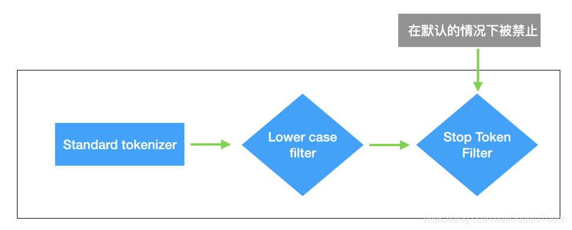

# 简介

Elasticsearch 是 Elastic Stack 核心的分布式搜索和分析引擎。Logstash 和 Beats 有助于收集、聚合和丰富您的数据并将其存储在 Elasticsearch 中。Kibana 使您能够以交互方式探索、可视化和分享对数据的见解，并管理和监控堆栈。Elasticsearch 是索引、搜索和分析魔术发生的地方。

Elasticsearch 为所有类型的数据提供近乎实时的搜索和分析。无论您拥有结构化或非结构化文本、数字数据还是地理空间数据，Elasticsearch 都可以以支持快速搜索的方式高效地存储和索引这些数据。您可以超越简单的数据检索和聚合信息来发现数据中的趋势和模式。随着数据和查询量的增长，Elasticsearch 的分布式特性使您的部署能够随之无缝增长。

 Elasticsearch 提供了速度和灵活性来处理各种用例中的数据：

- 将搜索框添加到应用程序或网站
- 存储和分析日志、指标和安全事件数据
- 使用机器学习实时自动建模数据行为
- 使用 Elasticsearch 作为存储引擎来自动化业务工作流
- 使用 Elasticsearch 作为地理信息系统 (GIS) 管理、集成和分析空间信息
- 使用 Elasticsearch 作为生物信息学研究工具存储和处理遗传数据

Elasticsearch 提供了一个简单、连贯的 REST API，用于管理您的集群以及索引和搜索您的数据。出于测试目的，您可以直接从命令行或通过 Kibana 中的开发人员控制台轻松提交请求。在您的应用程序中，您可以将 [Elasticsearch 客户端](https://www.elastic.co/guide/en/elasticsearch/client/index.html) 用于您选择的语言：Java、JavaScript、Go、.NET、PHP、Perl、Python 或 Ruby。

# 重要概念


## Cluster

Cluster 也就是集群的意思。Elasticsearch 集群由一个或多个节点组成，可通过其集群名称进行标识。通常这个 Cluster 的名字是可以在 Elasticsearch 里的配置文件中设置的。在默认的情况下，如我们的 Elasticsearch 已经开始运行，那么它会自动生成一个叫做 “elasticsearch” 的集群。我们可以在 config/elasticsearch.yml 里定制我们的集群的名字：

```yaml
# ---------------------------------- Cluster -----------------------------------
#
# Use a descriptive name for your cluster:
cluster.name: my-application


```

 一个单节点的集群像如下的结构。这个通常会用于开发环境：


我们可以向现有的集群里添加新的节点从而达到扩展集群的目的。这也是 Elasticsearch 最重要的一个特性：可扩展性。


我们可以根据我们的数据需求创建一个包含任意数量节点的集群。 如下图所示，我们还可以创建多集群，但这取决于你组织的用例。


可以通过水平扩展（由更多的节点组成）或垂直扩展（把每个节点的性能进行提高，比如增加更多的内存或存储或提高 CPU 的速度）来扩展集群。 当其他节点启动时，只要 cluster.name 属性相同，它们就可以加入与现有节点相同的集群。 因此，一组节点可以形成一个多节点集群，如下图所示。一个由多种角色组成的多节点 Elasticsearch 的集群就像是下面的一个布局：


带有 NGINX 代理及 Balancer 的架构图是这样的：


GET _cluster/state，来获取整个 cluster 的状态。这个状态只能被 master [node](https://so.csdn.net/so/search?q=node&spm=1001.2101.3001.7020) 所改变。上面的接口返回的结果是：

```json
{
  "cluster_name": "elasticsearch",
  "compressed_size_in_bytes": 1920,
  "version": 10,
  "state_uuid": "rPiUZXbURICvkPl8GxQXUA",
  "master_node": "O4cNlHDuTyWdDhq7vhJE7g",
  "blocks": {},
  "nodes": {...},
  "metadata": {...},
  "routing_table": {...},
  "routing_nodes": {...},
  "snapshots": {...},
  "restore": {...},
  "snapshot_deletions": {...}
}
```

## node

单个 Elasticsearch 实例。 在大多数环境中，每个节点都在单独的盒子或虚拟机上运行。一个集群由一个或多个 node 组成。在测试的环境中，我可以把多个 node 运行在一个 server 上。在实际的部署中，大多数情况还是需要一个 server 上运行一个 node。 根据 node 的作用，可以分为如下的几种：

- **master-eligible**：可以作为主 node。一旦成为主 node，它可以管理整个 cluster 的设置及变化：创建，更新，删除 index；添加或删除 node；为 node 分配 shard，应用的集群设置，其他与管理相关的人物等。master 节点角色通常不是非常占用资源，因此，一个主节点就足够整个集群，并且可以共同位于在较小集群中运行其他角色的节点上。如果这个主节点崩溃，集群将选择其他节点之一作为主节点，这样接力棒就会继续。 主节点不参与文档的 CRUD 操作，但主节点仍然知道文档的位置。
- **data**：数据 node。数据节点是实际的索引、搜索、删除和其他与文档相关的操作发生的地方。 这些节点托管索引文档。 一旦收到索引请求，它们就会通过调用 Lucene 段上的编写器来将文档保存到其索引中。 可以想象，它们在 CRUD 操作期间经常与磁盘通信，因此它们是磁盘 I/O 和内存密集型操作。在最新的 Elastic Stack 发布版中 (7.9 之后），当我们部署多层（multi-tier）部署时，将使用数据节点角色的特定变体。 它们是 data_hot、data_cold、data_warm 和 data_frozen 角色。
- **ingest**: 数据接入

Elasticsearch 的主要目标是索引、搜索和分析，但通常需要在将文档存储到 Elasticsearch 之前对其进行修改或增强。以下是这种情况下最常见的情况：

1. 预处理日志字符串以提取有意义的数据
2. 使用 NLP 工具丰富文本字段的内容
3. 使用 ML 计算字段丰富内容
4. 在摄取期间添加数据修改或转换，例如：在地理定位中转换 IP；在摄入时添加 DateTime 字段；在摄入时构建自定义字段（通过脚本）

- **machine learning**：顾名思义，机器学习节点执行 ML 算法并检测异常。 它是商业许可证的一部分，因此你必须购买 XPack 许可证才能启用机器学习功能。
- **Transform node**：严格地说， transform 节点角色是列表中的最新成员。 它用于数据的汇总。 此节点是执行 transform API 调用所必需的，这将创建（转换）基于现有索引进行透视的新索引。
- **coordinating node**：严格来说，这个不是一个种类的节点。它甚至可以是上面的任何一种节点。顾名思义，协调节点负责端到端地处理客户端的请求。这种节点通常是接受客户端的 HTTP 请求的。当向 Elasticsearch 提出请求时，其中一个节点（协调节点）会接收该请求并戴上协调员的帽子。 在接受请求后，协调器请求集群中的其他节点处理请求。 它在收集和整理结果并将它们发送回客户端之前等待响应。 它本质上充当工作管理器，将传入的请求分发到适当的节点并响应客户端。针对大的集群而言，通常的部署时使用一些专用的节点来接受客户端的请求。这样的节点可以不配置上面的任何角色，也就是它既不是 master，也不是 data，也不是 ingest，也不是 machine learning。


协调节点是一个特殊的节点，作为集群的代理/传递思想。它的主要优点如下：

1. 它可以很容易地被 kill 掉或从集群中删除，而不会造成任何问题。 它不是 master 服务器，因此不参与集群功能，也不包含数据，因此不会因故障而发生数据重定位/复制。
2. 它可以防止由于开发人员/用户的错误查询而导致集群不稳定。 有时，用户执行的聚合过大（即，日期直方图的范围为若干年，间隔为 10 秒）。 在这里，Elasticsearch 节点可能会崩溃。 在其最新版本中，Elasticsearch 有一称为断路器（circuit breaker）的结构来防止类似的问题，但总是有边界情况可能会导致使用脚本的不稳定。 协调节点不是主节点，它的过载不会对集群稳定性造成任何问题。
3. 如果协调器或客户端节点嵌入到应用程序中，则数据的往返次数会减少，从而加快应用程序的速度。你可以添加它们以平衡搜索和聚合吞吐量，而不会在集群中产生更改和数据重定位。

一般来说，一个 node 可以具有上面的一种或几种功能。我们可以在命令行或者 Elasticsearch 的配置文件（elasticsearch.yml）来定义：

| Node类型         | 配置参数    | 默认值                |
| :--------------- | :---------- | :-------------------- |
| master-eligible  | node.master | true                  |
| data             | node.data   | true                  |
| ingest           | node.ingest | true                  |
| machine learning | node.ml     | true (除了OSS发布版） |

你也可以让一个 node 做专有的功能及角色。如果上面 node 配置参数没有任何配置，那么我们可以认为这个 node 是作为一个 coordination node。在这种情况下，它可以接受外部的请求，并转发到相应的节点来处理。针对 master node，有时我们需要设置 cluster.remote.connect: false，这样它不可以作为 CCS/CCR 用途。

在实际的使用中，我们可以把请求发送给 data/ingest/coordination 节点，而不能发送给 master 节点。了解了四种 Elasticsearch 节点后，你可以很容易地理解为与 Elasticsearch 一起工作而设计的完美架构应该与此类似：


我们可以通过对 config/elasticsearch.yml 文件中配置来定义一个 node 在集群中的角色：


在有些情况中，我们可以通过设置 node.voting_only 为 true 从而使得一个 node 在 node.master 为真的情况下，只作为参加 voting 的功能，而不当选为 master node。这种情况为了避免脑裂情况发生。它通常可以使用一个 CPU 性能较低的 node 来担当。在一个集群中，我们可以使用如下的一个命令来获取当前可以进行 vote 的所有 master-eligible 节点：

`GET /_cluster/state?filter_path=metadata.cluster_coordination.last_committed_config`

```json
{
  "metadata" : {
    "cluster_coordination" : {
      "last_committed_config" : [
        "Xe6KFUYCTA6AWRpbw84qaQ",
        "OvD79L1lQme1hi06Ouiu7Q",
        "e6KF9L1lQUYbw84CTAemQl"
      ]
    }
  }
}
```

在整个 Elastic 的架构中，Data Node 和 Cluster 的关系表述如下：


### 7.9 之后版本

在 Elastic Stack 7.9 之后的发布中，我们可以直接在 Elasticsearch 的配置文件中配置 Node 的角色 （node roles）。这是一个新的变化。在 7.9 发布版之前，我们使用 node.master: true 这样的方式来定义一个 master 节点，但是从 7.9 开始之后，我们也可以使用另外一个方法来定义一个 master 节点。我们可以通过 node.roles 来定义一个 master 节点。但是这两种方法只可以选其一，不能两种方法同时使用。从 7.9 发布后，建议使用  node.roles 来定义 node 的角色。

每当你启动 Elasticsearch 实例时，你都在启动节点。 连接的节点的集合称为群集。 如果你正在运行 Elasticsearch 的单个节点，那么你将拥有一个节点的集群。默认情况下，群集中的每个节点都可以处理 [HTTP](https://www.elastic.co/guide/en/elasticsearch/reference/7.x/modules-http.html) 和 [Transport](https://www.elastic.co/guide/en/elasticsearch/reference/7.x/modules-transport.html) 流量。 Transport 层专门用于节点之间的通信。 HTTP 层由 REST 客户端使用。所有节点都知道群集中的所有其他节点，并且可以将客户端请求转发到适当的节点。默认情况下，节点为以下所有类型：master-eligible, data, ingest 和（如果可用）machine learning。 所有 data 节点也是 transform 节点。

你可以通过设置 node.roles 来定义节点的角色。 如果你未配置此设置，则该节点默认具有以下角色：

- `master`: 具有 master role（默认）的节点，这使其有资格被选作控制群集的主节点。
- `data`: 数据节点保存数据并执行与数据相关的操作，例如 CRUD，搜索和聚合。 具有数据角色的节点可以填充任何专门的数据节点角色。
- `data_content`
- `data_hot`
- `data_warm`
- `data_cold`
- `ingest`:  摄入节点能够将提取管道应用于文档，以便在建立索引之前转换和丰富文档。 在繁重的摄取负载下，使用专用的摄取节点并且不包含具有master role 或 data role 的节点中的摄取角色是有意义的。
- `ml`: 具有 xpack.ml.enabled 和 ml 角色的节点，这是 Elasticsearch 默认发布中的默认行为。 如果要使用机器学习功能，则集群中必须至少有一个机器学习节点。
- `remote_cluster_client`: 具有 remote_cluster_client 角色（默认）的节点，这使其有资格充当远程客户端。 默认情况下，集群中的任何节点都可以充当跨集群客户端并连接到远程集群。


## Document

Elasticsearch 是面向文档的，这意味着你索引或搜索的最小数据单元是文档。文档在 Elasticsearch 中有一些重要的属性：

- 它是独立的。文档包含字段（名称）及其值。
- 它可以是分层的。可以将其视为文档中的文档。字段的值可以很简单，就像位置字段的值可以是字符串一样。它还可以包含其他字段和值。例如，位置字段可能包含城市和街道地址。
- 结构灵活。你的文档不依赖于预定义的架构。例如，并非所有事件都需要描述值，因此可以完全省略该字段。但它可能需要新的字段，例如位置的纬度和经度。

文档通常是数据的 JSON 表示形式。JSON over HTTP 是与 Elasticsearch 进行通信的最广泛使用的方式，它是我们在本书中使用的方法。例如，你的聚会网站中的事件可以在以下文档中表示：

```json
{
    "name": "Elasticsearch Denver",
    "organizer": "Lee",
    "location": "Denver, Colorado, USA"
}
```
很多人认为 document 相比较于关系数据库，它相应于其中每个 record。


当文档被 Elasticsearch 索引时，它存储在 _source 字段中。 每个文档中还添加了以下附加系统字段：

- 存储文档的索引名称由 _index 字段指示。
- 文档的索引范围的唯一标识符存储在 _id 字段中。

```json
{
    "_index" : "parties",
    "_id" : "1",
    "_score" : 1.0,
    "_source" : {
        "name" : "Elasticsearch Denver",
        "organizer" : "Lee",
        "location" : "Denver, Colorado, USA"
    }
}
```

当我们通过 RESTFul API 与 Elasticsearch 通信时，我们将查询作为 JSON 对象发送到 Elasticsearch。 反过来，Elasticsearch 会序列化这些 JSON 文档，并在分析后将它们存储在其分布式文档存储中。我们的数据（表示为 JSON 文档）在索引过程中由 Elasticsearch 解析。比如下面的图表示学生对象的 JSON 文档：


## type

类型是文档的逻辑容器，类似于表是行的容器。 你将具有不同结构（模式）的文档放在不同类型中。 例如，你可以使用一种类型来定义聚合组，并在人们聚集时为事件定义另一种类型。每种类型的字段定义称为映射。 例如，name 将映射为字符串，但 location 下的 geolocation 字段将映射为特殊的 geo_point 类型。 每种字段的处理方式都不同。 例如，你在名称字段中搜索单词，然后按位置搜索组以查找位于你居住地附近的组。

很多人认为 Elasticsearch 是 schema-less 的。大家都甚至认为 Elasticsearch 中的数据库是不需要 mapping 的。其实这是一个错误的概念。schema-less 在 Elasticsearch 中正确的理解是，我们不需要事先定义一个类型关系数据库中的 table 才使用数据库。在 Elasticsearch 中，我们可以不开始定义一个 mapping，而直接写入到我们指定的 index 中。这个 index 的 mapping 是动态生成的 （当然我们也可以禁止这种行为）。其中的数据项的每一个数据类型是动态识别的。比如时间，字符串等，虽然有些的数据类型还是需要我们手动调整，比如 geo_point 等地理位置数据。另外，它还有一个含义，同一个 type，我们在以后的数据输入中，可能增加新的数据项，从而生产新的 mapping。这个也是动态调整的。

Elasticsearch 具有 schema-less 的能力，这意味着无需显式指定如何处理文档中可能出现的每个不同字段即可对文档建立索引。 启用动态映射后，Elasticsearch 自动检测并向索引添加新字段。 这种默认行为使索引和浏览数据变得容易-只需开始建立索引文档，Elasticsearch 就会检测布尔值，浮点数和整数值，日期和字符串并将其映射到适当的 Elasticsearch 数据类型。

由于一些原因，在 Elasticsearch 6.0 以后，一个 Index 只能含有一个 type。这其中的原因是：相同 index 的不同映射 type 中具有相同名称的字段是相同； 在 Elasticsearch 索引中，不同映射 type 中具有相同名称的字段在 Lucene 中被同一个字段支持。在默认的情况下是 _doc。**在未来 8.0 的版本中，type 将被彻底删除。**

## index 

在 Elasticsearch 中，索引是文档的集合。


Elasticsearch 起源于 Apache Lucene 。一个 Elasticsearch 的 index 分布于一个或多长 shard 之中，而每个 shard 相应于一个 Aache Lucene 的 index。每个 Index 一个或许多的 documents 组成，并且这些 document 可以分布于不同的 shard 之中。

很多人认为 index 类似于关系数据库中的 database。这中说法是有些道理，但是并不完全相同。其中很重要的一个原因是，在Elasticsearch 中的文档可以有 object 及 nested 结构。一个 index 是一个逻辑命名空间，它映射到一个或多个主分片，并且可以具有零个或多个副本分片。

每当一个文档进来后，根据文档的 id 会自动进行 hash 计算，并存放于计算出来的 shard 实例中，这样的结果可以使得所有的 shard 都比较有均衡的存储，而不至于有的 shard 很忙。
在默认的情况下，上面的 _routing 既是文档的 _id。如果有 routing 的参与，那么这些文档可能只存放于一个特定的 shard，这样的好处是对于一些情况，我们可以很快地综合我们所需要的结果而不需要跨 node 去得到请求。比如针对 join 的数据类型。

从上面的公式我们也可以看出来，我们的 shard 数目是不可以动态修改的，否则之后也找不到相应的 shard 号码了。必须指出的是，**replica 的数目是可以动态修改的**。

## shard

Shard 也被称作为分片。由于 Elasticsearch 是一个分布式搜索引擎，因此索引通常会拆分为分布在多个节点上的称为分片的元素。 Elasticsearch 自动管理这些分片的排列。 它还根据需要重新平衡分片，因此用户无需担心细节。

分片是保存数据、创建支持的数据结构（如倒排索引）、管理查询和分析 Elasticsearch 中的数据的软件组件。 它们是 Apache Lucene 的实例，在索引创建期间分配给索引。 在建立索引的过程中，文档会经过分片。 Shards 创建不可变文件段以将文档保存到持久文件系统中。Lucene 是一种用于高效索引文档的高性能引擎。 在为文档编制索引时，很多事情都在幕后进行，而 Lucene 高效地完成了这项工作。 例如，文档最初被复制到分片上的内存缓冲区中，然后在合并和最终确定它们到底层文件系统存储之前写入可写段。 该图演示了 Lucene 引擎在索引期间的内部工作：


 一个索引可以存储超出单个结点硬件限制的大量数据。比如，一个具有 10 亿文档的索引占据 1 TB 的磁盘空间，而任一节点都没有这样大的磁盘空间；或者单个节点处理搜索请求，响应太慢。

为了解决这个问题，Elasticsearch 提供了将索引划分成多份的能力，这些份就叫做分片（shard）。当你创建一个索引的时候，你可以指定你想要的分片（shard）的数量。每个分片本身也是一个功能完善并且独立的索引，这个索引可以被放置到集群中的任何节点上。 分片之所以重要，主要有两方面的原因：

- 允许你水平分割/扩展你的内容容量
- 允许你在分片（潜在地，位于多个节点上）之上进行分布式的、并行的操作，进而提高性能/吞吐量

有两种类型的分片：primary shard 和 replica shard。

- **Primary shard:** 每个文档都存储在一个 primary shard。 索引文档时，它首先在 primary shard上编制索引，然后在此分片的所有副本上（replica）编制索引。索引可以包含一个或多个主分片。 此数字确定索引相对于索引数据大小的可伸缩性。 创建索引后，无法更改索引中的主分片数。Primary 可以同时出来读和写操作。一个索引可以由多个主分片组成，每个分片都具有索引（或写入）文档的能力。 当 Elasticsearch 试图在集群中均匀分布分片时，每个主分片都可以利用节点资源来实现写入可扩展性。。当一个文档被索引到 Elasticsearch 中时，它会在被复制到副本分片之前由主分片索引。 只有在成功更新副本分片后才会确认索引请求，从而确保跨 Elasticsearch 集群的读取一致性。

- **Replica shard**: 每个主分片可以具有零个或多个副本。 replica 是主分片的副本。replica 只能是只读的，不可以进行写入操作。replica 分片可以独立于主分片响应搜索（或读取）请求。 由于主分片和副本分片被分配到不同的节点（为索引提供更多计算资源），因此可以通过添加 replica 来实现读取可扩展性。如果一个索引的 primary shard 一旦被丢失（有宕机或者网络连接问题），那么相应的 replica shard 会被自动提升为新的 primary shard，进而新的 replica 也会在不同的 node 上生成。replica 有两个目的：

  - 增加故障转移：如果主要故障，可以将副本分片提升为主分片。即使你失去了一个 node，那么副本分片还是拥有所有的数据

  - 提高性能：get 和 search 请求可以由主 shard 或副本 shard 处理。

我们需要记住的一点是：Primary 及 replica shards 一直是分配在不同的 node 上的，这样既提供了冗余度，也同时提供了可扩展行。

默认情况下，每个主分片都有一个副本，但可以在现有索引上动态更改副本数。我们可以通过如下的方法来动态修改副本数：

`PUT my_index/_settings`
`{`
    `"number_of_replicas": 2`
`}`

永远不会在与其主分片相同的节点上启动副本分片。在最新的 Elasticsearch 集群设计中，我们可以使用 auto_expand_replica 这个配置来让 Elasticsearch 自动决定有多少个 replica。当我们有一个节点时，通过这个设置，我们可能会得到 0 个 replica 从而保证整个集群的健康状态。

通常一个 shard 可以存储许多文档。在实际的使用中，增加副本 shard 的数量，可以提高搜索的速度，这是因为更多的 shard 可以帮我们进行同时进行搜索。但是副本 shard 数量的增多，也会影响数据写入的速度。在很多的情况下，在大批量数据写入的时候，我们甚至可以把 replica 的数量设置为 0。详细阅读可以参考文章 “Elasticsearch：如何提高 Elasticsearch 数据摄入速度”。增加 primary shard 的数量可以提高数据的写入速度，这是因为有更多的 shard 可以帮我们同时写入数据。可能有很多的开发者认为是不是 shard 的数量越多越好啊？oversharding 是 Elasticsearch 用户经常会遇到的一个问题。许多小的 shard 会消耗很多的资源，这是因为每一个 shard 其实对应的是一个 Lucene 的 index。一个 shard 通常可以存储几十个 G 的数据。如果你需要更多的 shard，你可以：

- 创建更多的索引从而使得它容易扩展，比如针对一些时序数据，我们可以为它们每天或者每个星期创建新的索引
- 使用 Split API 来时一个大的索引增加 shard 的数量。我们可以阅读文章 “Elasticsearch：Split index API - 把一个大的索引分拆成更多分片”。

一个 shard 的性能会随着它的大小而改变：


如上图所示，我们建议 50G 为索引的大小以求得最好的性能。在我们实际的 Beats 的使用中，默认的 ILM 索引大小就是 50G。为了最大限度地提高索引/搜索性能，分片应尽可能均匀分布在节点之间，以利用底层节点资源。 每个分片应保存 30 GB 到 50 GB 的数据，具体取决于数据类型及其使用方式。 例如，高性能搜索用例可以受益于整体较小的分片以运行快速搜索和聚合请求，而日志记录用例可能适合稍大的分片以在集群中存储更多数据。 可以根据你的性能要求、硬件和用例根据需要调整分片大小和每个节点的分片数量。

下面的图表示的是一个 index 有5个 shard 及1个 replica


这些 shard 分布于不同的物理机器上：


我们可以为每个 index 设置相应的 shard 数值：

```shell
curl -XPUT http://localhost:9200/another_user?pretty -H 'Content-Type: application/json' -d '
{
    "settings" : {
        "index.number_of_shards" : 2,
        "index.number_of_replicas" : 1
    }
}'
```

another_user 这个 index 设置了2个 shards，并且有一个 replica。一旦设置好 primary shard 的数量，我们就不可以修改了。这是因为 Elasticsearch 会依据每个 document 的 id 及 primary shard 的数量来把相应的 document 分配到相应的 shard 中。如果这个数量以后修改的话，那么每次搜索的时候，可能会找不到相应的 shard。

## replica

默认情况下，Elasticsearch 为每个索引创建一个主分片和一个副本。这意味着每个索引将包含一个主分片，每个分片将具有一个副本。分配多个分片和副本是分布式搜索功能设计的本质，提供高可用性和快速访问索引中的文档。主副本和副本分片之间的主要区别在于只有主分片可以接受索引请求。副本和主分片都可以提供查询请求。在上图中，我们有一个 Elasticsearch 集群，由默认分片配置中的两个节点组成。 Elasticsearch 自动排列分割在两个节点上的一个主分片。有一个副本分片对应于每个主分片，但这些副本分片的排列与主分片的排列完全不同。

可以通过如下的命令来查看集群的健康状态：

```cobol
GET _cluster/health
```


Shard 健康：

- 红色：集群中未分配至少一个主分片。这表明缺少一些主分片，并且这些索引处于红色状态。 你不能写入处于红色状态的索引，此外，结果可能不完整，或者可能仅返回部分结果。 通常，你需要重新启动已关闭的节点并可能创建一些副本。
- 黄色：已分配所有主副本，但未分配至少一个副本。这意味着缺少一些节点或分片，但它们不会损害集群的功能。 例如，一些副本可能会丢失（节点已关闭或副本的节点不足），但每个活动分片至少有一个副本； 此外，读取和写入功能正在工作。 黄色状态在开发阶段非常常见，此时用户通常启动单个 Elasticsearch 服务器。
- 绿色：分配所有分片

如果某些节点处于恢复模式，黄色或红色状态可能是暂时的。 在这种情况下，只需等待恢复完成即可。

集群健康 API 包含大量信息，如下所示：

- cluster_name：这是集群的名称。

- timeout：这是一个布尔值，指示 REST API 是否达到调用中设置的超时。

- number_of_nodes：这表示集群中的节点数。

- number_of_data_nodes：这表示可以存储数据的节点数

- active_primary_shards：显示活跃主分片的数量； 主分片是负责写操作。

- active_shards：显示活跃分片的数量； 这些分片可用于搜索。

- relocating_shards：这显示了从一个节点重新定位或迁移到另一个节点的分片数量——这主要是由于集群节点平衡。

- initializing_shards：显示处于初始化状态的分片数量。 初始化过程在分片启动时完成。 它是激活之前的瞬态状态，由几个步骤组成； 最重要的步骤如下：

  1. 如果其translog 太旧或需要新副本，则从主副本复制分片数据。

  2. 检查 Lucene 索引。

  3. 根据需要处理事务日志

- unassigned_shards：显示未分配给节点的分片数量。 这通常是由于设置的副本数大于节点数。 在启动过程中，尚未初始化或正在初始化的分片将被计入此处。

- delay_unassigned_shards：这显示将分配的分片数量，但它们的节点配置为延迟分配。 你可以在https://www.elastic.co/guide/en/elasticsearch/reference/master/delayedallocation.html 找到有关延迟分片分配的更多信息。

- number_of_pending_tasks：这是集群级别的待处理任务的数量，例如集群状态的更新、索引的创建和分片重定位。 它应该很少是 0 以外的任何值。

- number_of_in_flight_fetch：这是必须在分片中执行的集群更新的数量。 由于集群更新是异步的，这个数字会跟踪有多少更新仍然需要在分片中执行。

- task_max_waiting_in_queue_millis：这是一些集群任务在队列中等待的最长时间。 它应该很少是 0 以外的任何值。如果该值与 0 不同，则意味着存在某种集群资源饱和或类似问题。

- active_shards_percent_as_number：这是集群所需的活动分片的百分比。 在生产环境中，它应该很少与 100% 不同——除了一些重定位和分片初始化。

## SQL 和 Elasticsearch 的概念对比

针对大多数的数据开发者来说，他们更为熟悉的是 RMDB 里的概念。虽然 SQL 和 Elasticsearch 对数据的组织方式（以及不同的语义）有不同的术语，但本质上它们的目的是相同的。所以让我们从底部开始； 这些大致是：

| SQL                  | Elasticsearch    | 描述                                                         |
| -------------------- | ---------------- | ------------------------------------------------------------ |
| column（列）         | field（字段）    | 在这两种情况下，在最低级别，数据都存储在命名条目中，具有多种数据类型，包含一个值。 SQL 将这样的条目称为列，而 Elasticsearch 称为字段。 请注意，在 Elasticsearch 中，一个字段可以包含多个相同类型的值（本质上是一个列表），而在 SQL 中，一个列可以只包含一个所述类型的值。 Elasticsearch SQL 将尽最大努力保留 SQL 语义，并根据查询拒绝那些返回具有多个值的字段的查询。 |
| row（行）            | document（文档） | 列和字段本身并不存在； 它们是行或文档的一部分。 两者的语义略有不同：一行往往是严格的（并且有更多的强制执行），而一个文档往往更灵活或松散一些（同时仍然具有结构）。 |
| table （表格）       | index（索引）    | 执行查询的目标，无论是 SQL 还是 Elasticsearch。              |
| schema               | （模式）         | 隐含的	在 RDBMS 中，模式主要是表的命名空间，通常用作安全边界。 Elasticsearch 没有为它提供等效的概念。 但是，当启用安全性时，Elasticsearch 会自动应用安全性强制，以便角色只能看到它被允许访问的数据（在 SQL 术语中，它称作为模式）。 |
| catalog或者 database | cluster 集群实例 | 在 SQL 中，catalog 或 database 可互换使用，并表示一组模式（schema），即多个表。 在 Elasticsearch 中，可用的索引集被分组在一个集群中。 语义也有所不同。 数据库（database）本质上是另一个命名空间（可能对数据的存储方式产生一些影响），而 Elasticsearch 集群是一个运行时实例，或者更确切地说是一组至少一个 Elasticsearch 实例（通常是分布式运行）。 在实践中，这意味着在 SQL 中，一个实例中可能有多个 catalogs，而在 Elasticsearch 中，仅限于一个 catalog。 |
| cluster              | cluster(联合）   | 传统上，在 SQL 中，集群（cluster）是指包含多个 catalogs 或数据库（database）的单个 RDMBS 实例（见上文）。 同一个词也可以在 Elasticsearch 中重复使用，但是它的语义更加清晰。虽然 RDBMS 往往只有一个运行实例，但在单台机器上（非分布式），Elasticsearch 则相反，默认情况下是分布式和多实例。此外，Elasticsearch 集群可以以联合方式连接到其他集群，因此集群意味着：<br/>单个集群:: 多个 Elasticsearch 实例通常分布在机器上，在同一个命名空间中运行。<br/>多个集群:: 每个集群都有自己的命名空间，在联合设置中相互连接<br/> |

# 安装

https://elasticstack.blog.csdn.net/article/details/99413578
elastic/Hs=6R_NZMkd1qO+zwYDH

8061dd5ce5cabb4117cad79307b34a66dd6d9109cf2a4455c3d3b0bad824502a

访问https://localhost:9200/

```json
{
	"name": "XM-HANZB-873",
	"cluster_name": "elasticsearch",
	"cluster_uuid": "7gykd7yNRWeKiwD2oC2PQQ",
	"version": {
		"number": "8.6.1",
		"build_flavor": "default",
		"build_type": "zip",
		"build_hash": "180c9830da956993e59e2cd70eb32b5e383ea42c",
		"build_date": "2023-01-24T21:35:11.506992272Z",
		"build_snapshot": false,
		"lucene_version": "9.4.2",
		"minimum_wire_compatibility_version": "7.17.0",
		"minimum_index_compatibility_version": "7.0.0"
	},
	"tagline": "You Know, for Search"
}
```

# Elasticsearch 使用

## 什么是 JSON

JSON (JavaScript Object Notation) 是一种轻量级的数据交换格式。易于人阅读和编写。同时也易于机器解析和生成。它基于JavaScript Programming Language, Standard ECMA-262 3rd Edition - December 1999 的一个子集。在 Elasticsearch 中，所以的数据都是以 JSON 的格式来进行表述的。这个和其它的有些数据库，比如 Solr，它支持更多格式的数据，比如 xml, csv 等。

``` json
{
  "name" : "Elastic",
  "location" : {
    "state" : "CA",
    "zipcode" : 94123
  }
}
```

## 什么是 REST 接口

REST 即表述性状态传递（英文：Representational State Transfer，简称 REST）是 Roy Fielding 博士在2000年他的博士论文中提出来的一种软件架构风格。REST 是一种规范。即参数通过封装后进行传递，响应也是返回的一个封装对象。一个 REST 的接口就像如下的接口：

来对数据进行增加（Create），查询（Read)，更新（Update）及删除（Delete）。也就是我们通常说是的 CRUD。

| 方法         | 用法                                      |
| :----------- | :---------------------------------------- |
| GET          | 读取数据                                  |
| POST         | 插入数据                                  |
| PUT 或 PATCH | 更新数据，或如果是一个新的 id，则插入数据 |
| DELETE       | 删除数据                                  |

## 查看 Elasticsearch 信息

就像之前在浏览器其中打入地址 [http://localhost:9200](http://localhost:9200/) 看到的效果一样，我们直接打入

```cobol
GET /
```


我们可以使用 cURL 将请求从命令行提交到本地 Elasticsearch 实例。对 Elasticsearch 的请求包含与任何 HTTP 请求相同的部分：

```shell
 curl -X<VERB> '<PROTOCOL>://<HOST>:<PORT>/<PATH>?<QUERY_STRING>' -d '<BODY>'
```

本示例使用以下变量：

- <VERB> ：适当的 HTTP 方法或动词。 例如，GET，POST，PUT，HEAD 或 DELETE
- <PROTOCOL>：http 或 https。 如果你在 Elasticsearch 前面有一个 HTTPS 代理，或者你使用 Elasticsearch 安全功能来加密 HTTP 通信，请使用后者
- <HOST>：Elasticsearch 集群中任何节点的主机名。 或者，将 localhost 用于本地计算机上的节点
- <PORT>：运行 Elasticsearch HTTP 服务的端口，默认为9200
- <PATH>：API 端点，可以包含多个组件，例如 _cluster/stats 或 _nodes/stats/jvm
- <QUERY_STRING>：任何可选的查询字符串参数。 例如，?pretty 将漂亮地打印 JSON 响应以使其更易于阅读
- <BODY>：JSON 编码的请求正文（如有必要）

如果启用了 Elasticsearch 安全功能，则还必须提供有权运行 API 的有效用户名（和密码）。 例如，使用 -u 或 --u cURL 命令参数。比如：

```shell
curl -u elastic:password -X<VERB> '<PROTOCOL>://<HOST>:<PORT>/<PATH>?<QUERY_STRING>' -d '<BODY>'
```

这里的 elastic 及 password 代表用超级用户名 elastic 及其密码。你也可以可以使用其它用户账号，如果你的安装是带有安全的。比如一个写入文档到 Elasticsearch 的 curl 命令如下：

``` shell
curl -XPUT "https://10.211.55.2:9200/twitter/_doc/1" -H "Content-Type: application/json" -d'
{
  "content": "This is Xiaoguo from Elastic"
}'
```

打入一个命令时，Kibana 会帮我们自动地显示可以输入的选择项，它具有 autocomplete 的功能。

## 创建索引及文档

接下来创建一个叫做 twitter 的索引（index），并插入一个文档（document)。我们知道在 RDMS 中，我们通常需要有专用的语句来生产相应的数据库，表格，让后才可以让我们输入相应的记录，但是针对 Elasticsearch 来说，这个是不必须的。我们在左边的窗口中输入：

``` shell
PUT twitter/_doc/1
{
  "user": "GB",
  "uid": 1,
  "city": "Beijing",
  "province": "Beijing",
  "country": "China"
}
```

Kibana 右边的窗口中有下面的输出：


put文档写入过程：


在通常的情况下，新写入的文档并不能马上被用于搜索。新增的索引必须写入到 Segment 后才能被搜索到。需要等到 refresh 操作才可以。在默认的情况下每隔一秒的时间 refresh 一次。这就是我们通常所说的近实时。

**注意**：在上面创建文档的过程中，我们并没有像其他 RDMS 系统一样，在输入文档之前需要定义各个字段的类型及长度等。为了提高入门时的易用性，Elasticsearch 可以自动动态地为你创建索 mapping。当我们建立一个索引的第一个文档时，如果你没有创建它的  schema，那么 Elasticsearch 会根据所输入字段的数据进行猜测它的数据类型，比如上面的 user 被被认为是 text 类型，而 uid 将被猜测为整数类型。这种方式我们称之为 schema on write，也即当我们写入第一个文档时，Elasticsearch 会自动帮我们创建相应的 schema。在 Elasticsearch 的术语中，mapping 被称作为 Elasticsearch 的数据 schema。文档中的所有字段都需要映射到 Elasticsearch 中的数据类型。 mapping 指定每个字段的数据类型，并确定应如何索引和分析字段以进行搜索。 在 SQL 数据库中定义表时，mapping 类似于 schema。 mapping 可以显式声明或动态生成。一旦一个索引的某个字段的类型被确定下来之后，那么后续导入的文档的这个字段的类型必须是和之前的是一致，否则写入将导致错误。schema on write 可能在某些时候不是我们想要的，那么在这种情况下，我们可以事先创建一个索引的 schema。你将在文章的下面部分中看到如何创建这个 schema。在最新的 Elasticsearch 设计中，也出现了一种叫做 schema on read 的设计。

在写入文档时，如果该文档的 ID 已经存在，那么就更新现有的文档；如果该文档从来没有存在过，那么就创建新的文档。如果更新时该文档有新的字段并且这个字段在现有的 mapping 中没有出现，那么 Elasticsearch 会根据 schem on write 的策略来推测该字段的类型，并更新当前的 mapping 到最新的状态。

动态 mapping 还可能导致某些字段未映射到你的预期，从而导致索引请求失败。显式 mapping 允许更好地控制索引中的字段和数据类型。 一旦知道索引 schema，明确定义索引映射是一个好主意。在运行完上面的命令后，可以通过如下的命令来查看当前索引的 mapping：

``` shell
GET twitter/_mapping
```

``` json
{
  "twitter": {
    "mappings": {
      "properties": {
        "city": {
          "type": "text",
          "fields": {
            "keyword": {
              "type": "keyword",
              "ignore_above": 256
            }
          }
        },
        "country": {
          "type": "text",
          "fields": {
            "keyword": {
              "type": "keyword",
              "ignore_above": 256
            }
          }
        },
        "province": {
          "type": "text",
          "fields": {
            "keyword": {
              "type": "keyword",
              "ignore_above": 256
            }
          }
        },
        "uid": {
          "type": "long"
        },
        "user": {
          "type": "text",
          "fields": {
            "keyword": {
              "type": "keyword",
              "ignore_above": 256
            }
          }
        }
      }
    }
  }
}
```

keyword类型解释：。究其实上面的这个字段是一个 mulit-field 字段。为不同目的以不同方式索引同一字段通常很有用。比如在上面，我们定义字段 city 为 text 类型。text 类型的数据在摄入的时候会分词，这样它可以实现搜索的功能。同时，这个字段也被定义为 keyword 类型的数据。这个类型的数据可以让我们针对它进行精确匹配（比如区分大小写，空格等符号），聚合和排序。

Elasticsearch 的数据类型：

- text：全文搜索字符串
- keyword：用于精确字符串匹配和聚合
- date 及 date_nanos：格式化为日期或数字日期的字符串
- byte, short, integer, long：整数类型
- boolean：布尔类型
- float，double，half_float：浮点数类型
- 分级的类型：object 及 nested。


在默认的情况下，Elasticsearch 可以理解你正在索引的文档的结构并自动创建映射（mapping）定义。 这称为显式映射（Explicit mapping）创建。在绝大多数的情况下，它工作的非常好。使用显式映射可以开始使用无模式（schemaless）方法快速摄取数据，而无需担心字段类型。  因此，为了在索引中获得更好的结果和性能，我们有时需要需要手动定义映射。 微调映射带来了一些优势，例如：

- 减少磁盘上的索引大小（禁用自定义字段的功能）
- 仅索引感兴趣的字段（一般加速）
- 用于快速搜索或实时分析（例如聚合）
- 正确定义字段是否必须分词为多个 token 或单个 token
- 定义映射类型，例如地理点、suggester、向量等

创建一个索引 test，并且含有 id 及 message 字段。id 字段为 keyword 类型，而 message 字段为 text 类型，那么我们可以使用如下的方法来创建：

``` shell
PUT test
{
  "mappings": {
    "properties": {
      "id": {
        "type": "keyword"
      },
      "message": {
        "type": "text"
      }
    }
  }
}
```

用如下的 API 来追加一个新的字段 age，并且它的类型为 long 类型：

``` shell
PUT test/_mapping
{
  "properties": {
    "age": {
      "type": "long"
    }
  }
}
```

查看索引 test 的最终 mapping：

```shell
GET test/_mapping
{
  "test": {
    "mappings": {
      "properties": {
        "age": {
          "type": "long"
        },
        "id": {
          "type": "keyword"
        },
        "message": {
          "type": "text"
        }
      }
    }
  }
}
```

通常对一个通过上面方法写入到 Elasticsearch 的文档，在默认的情况下并不马上可以进行搜索。这是因为在 Elasticsearch 的设计中，有一个叫做 refresh 的操作。它可以使更改可见以进行搜索的操作。通常会有一个 refresh timer 来定时完成这个操作。这个周期为1秒。这也是我们通常所说的 Elasticsearch 可以实现秒级的搜索。当然这个 timer 的周期也可以在索引的设置中进行配置。如果我们想让我们的结果马上可以对搜索可见，我们可以用如下的方法：

```shell
PUT twitter/_doc/1?refresh=true
{
  "user": "GB",
  "uid": 1,
  "city": "Beijing",
  "province": "Beijing",
  "country": "China"
}
```

上面的方式可以强制使 Elasticsearch 进行 refresh 的操作，当然这个是有代价的。频繁的进行这种操作，可以使我们的 Elasticsearch 变得非常慢。另外一种方式是通过设置 refresh=wait_for。这样相当于一个同步的操作，它等待下一个 refresh 周期发生完后，才返回。这样可以确保我们在调用上面的接口后，马上可以搜索到我们刚才录入的文档：

```shell
PUT twitter/_doc/1?refresh=wait_for
{
  "user": "GB",
  "uid": 1,
  "city": "Beijing",
  "province": "Beijing",
  "country": "China"
}
```

它也创建了一个被叫做 _doc 的 type。自从 Elasticsearch 6.0 以后，一个 index 只能有一个 type。如果我们创建另外一个 type 的话，系统会告诉我们是错误的。这里我们也会发现有一个版本（_version）信息，它显示的是4。如果这个 _id 为 1 的 document 之前没有被创建过的话，它会显示为 1。之后如果我们更改这个 document，它的版本会每次自动增加1。比如，输入：

``` shell
POST twitter/_doc/1
{
  "user": "GB",
  "uid": 1,
  "city": "Shenzhen",
  "province": "Guangdong",
  "country": "China"
}
```


左边修改了我们的数据，在右边到版本信息增加到3。这是因为我们把左边的命令执行了两次同时，我们也可以看出来，我们也把左边的数据进行了修改，我们也看到了成功被修改的返回信息。在上面我们可以看出来，我们每次执行那个 POST 或者 PUT 接口时，如果文档已经存在，那么相应的版本（_version）就会自动加1，之前的版本抛弃。如果这个不是我们想要的，那么我们可以使 _create  端点接口来实现：

```shell
PUT twitter/_create/1
{
  "user": "GB",
  "uid": 1,
  "city": "Shenzhen",
  "province": "Guangdong",
  "country": "China"
}
```


在 Elasticsearch 7.0 之后，在 type 最终要被废除的情况下，我们建立使用如下的方法来获得 _source:

```cobol
GET twitter/_source/1
```

## 自动 ID 生成

在实际的应用中，并不需要自己设置id。相反，当我们分配一个 ID 时，在数据导入的时候会检查这个 ID 的文档是否存在，如果是已经存在，那么就更新到版本。如果不存在，就创建一个新的文档。如果我们不指定文档的 ID，转而让 Elasticsearch 自动帮我们生成一个 ID，这样的速度更快。在这种情况下，我们必须使用 POST，而不是 PUT，比如：

```shell
POST my_index/_doc
{
  "content": "this is really cool"
}
```

```json
{
  "_index": "my_index",
  "_id": "LF2zSIYBt0f5aXhHJ0Hd",
  "_version": 1,
  "result": "created",
  "_shards": {
    "total": 2,
    "successful": 1,
    "failed": 0
  },
  "_seq_no": 0,
  "_primary_term": 1
}
```

系统会为我们自动分配一个 ID ，在正常的情况下，当当前复制组的所有分片都执行了索引操作时，Elasticsearch 从索引操作返回。


设置异步复制允许我们在主分片上同步执行索引操作，在副本分片上异步执行。这样，API 调用会更快地返回响应操作。我们可以这样来进行调用：

```shell
POST my_index/_doc?replication=async
{
  "content": "this is really cool"
}
```

只获取 source 的部分字段：

```cobol
GET twitter/_doc/1?_source=city,age,province
```

``` json
{
  "_index": "twitter",
  "_id": "1",
  "_version": 3,
  "_seq_no": 2,
  "_primary_term": 1,
  "found": true,
  "_source": {
    "city": "Shenzhen",
    "province": "Guangdong"
  }
}
```

一次请求查找多个文档，我们可以使用 _mget 接口：

``` shell
GET _mget
{
  "docs": [
    {
      "_index": "twitter",
      "_id": 1
    },
    {
      "_index": "twitter",
      "_id": 2
    }
  ]
}
```

只获得部分字段：

``` shell
GET _mget
{
  "docs": [
    {
      "_index": "twitter",
      "_id": 1,
      "_source":["age", "city"]
    },
    {
      "_index": "twitter",
      "_id": 2,
      "_source":["province", "address"]
    }
  ]
}
```


也可以简单地写为：

```shell
GET twitter/_doc/_mget
{
  "ids": ["1", "2"]
}
```

## 修改文档

使用POST 的命令来修改或者创建文档。在使用 POST 的时候，我们甚至不用去指定特定的 id，系统会帮我们自动生成。但是我们修改一个文档时，我们通常会使用 PUT 来进行操作，并且，我们需要指定一个特定的 id 来进行修改：

```cobol
PUT twitter/_doc/1
{
   "user": "GB",
   "uid": 1,
   "city": "北京",
   "province": "北京",
   "country": "中国",
   "location":{
     "lat":"29.084661",
     "lon":"111.335210"
   }
}
```


使用 PUT 的这个方法，每次修改一个文档时，我们需要把文档的每一项都要写出来。这对于有些情况来说，并不方便，我们可以使用如下的方法来进行修改：

```cobol
POST twitter/_update/1
{
  "doc": {
    "city": "成都",
    "province": "四川"
  }
}
```


在关系数据库中，我们通常是对数据库进行搜索，让后才进行修改。在这种情况下，我们事先通常并不知道文档的 id。我们需要通过查询的方式来进行查询，让后进行修改。ES 也提供了相应的 REST 接口。

``` cobol
POST twitter/_update_by_query
{
  "query": {
    "match": {
      "user": "GB"
    }
  },
  "script": {
    "source": "ctx._source.city = params.city;ctx._source.province = params.province;ctx._source.country = params.country",
    "lang": "painless",
    "params": {
      "city": "上海",
      "province": "上海",
      "country": "中国"
    }
  }
}
```

对于那些名字是中文字段的文档来说，在 painless 语言中，直接打入中文字段名字，并不能被认可。我们可以使用如下的方式来操作：

``` cobol
POST edd/_update_by_query
{
  "query": {
    "match": {
      "姓名": "张彬"
    }
  },
  "script": {
    "source": "ctx._source[\"签到状态\"] = params[\"签到状态\"]",
    "lang": "painless",
    "params" : {
      "签到状态":"已签到"
    }
  }
}
```

在上面我们使用一个中括号并 escape 引号的方式来操作。通过 update 接口，使用 script 的方法来进行修改。这个方法也是需要知道文档的 id:

``` cobol
POST twitter/_update/1
{
  "script" : {
      "source": "ctx._source.city=params.city",
      "lang": "painless",
      "params": {
        "city": "长沙"
      }
  }
}
```

在我们使用上面的方法更新文档时，如果当前的文档 id 不存在，那么我们甚至可以使用 **upsert** 属性来创建一个文档：
``` shell
POST twitter/_update/1
{
  "script" : {
      "source": "ctx._source.city=params.city",
      "lang": "painless",
      "params": {
        "city": "长沙"
      }
  },
  "upsert": {
    "city": "长沙"
  }
}
```


我们甚至可以使用 _update 接口使用 ctx['_op'] 来达到删除一个文档的目的，比如：

``` cobol

POST twitter/_update/1
{
  "script": {
    "source": """
    if(ctx._source.uid == 1) {
      ctx.op = 'delete'
    } else {
      ctx.op = "none"
    }
    """
  }
}
```

当检测文档的 uid 是否为 1，如果为 1 的话，那么该文档将被删除，否则将不做任何事情。

我还可以充分使用 script 的一些高级操作，比如我们可以通过如下的方法来添加一个崭新的字段：

``` cobol
POST twitter/_update/1
{
  "script" : {
      "source": "ctx._source.newfield=4",
      "lang": "painless"
  }
}
```

通过上面的操作，我们可以发现，我们新增加了一个叫做 newfield 的字段。当然我们也可以使用如下的方法来删除一个字段：

```cobol
POST twitter/_update/1
{
  "script" : {
      "source": "ctx._source.remove(\"newfield\")",
      "lang": "painless"
  }
}
```

在上面的命令中，我们通过 remove 删除了刚才被创建的 newfiled 字段。我们可以通过如下的命令来进行查看：

GET twitter/_doc/1
在这里请注意的是：一旦一个字段被创建，那么它就会存在于更新的 mapping 中。即便针对 id 为 1 的文档删除了 newfield，但是 newfield 还将继续存在于 twitter 的 mapping 中。我们可以使用如下的命令来查看 twitter 的 mapping：

```cobol
GET twitter/_mapping
```


这里值得注意是：对于多用户，我们可以从各个客户端同时更新，这里可能会造成更新数据的一致性问题。

## UPSERT 文档

仅在文档事先存在的情况下，我们在前面的代码中看到的部分更新才有效。 如果具有给定 id 的文档不存在，Elasticsearch 将返回一个错误，指出该文档丢失。 让我们了解如何使用更新 API 进行 upsert 操作。 术语 “upsert” 宽松地表示更新或插入，即更新文档（如果存在），否则，插入新文档。
doc_as_upsert 参数检查具有给定ID的文档是否已经存在，并将提供的 doc 与现有文档合并。 如果不存在具有给定 id 的文档，则会插入具有给定文档内容的新文档。下面的示例使用 doc_as_upsert 合并到 id 为 3 的文档中，或者如果不存在则插入一个新文档：

```cobol
POST /catalog/_update/3
{
  "doc": {
    "author": "Albert Paro",
    "title": "Elasticsearch 5.0 Cookbook",
    "description": "Elasticsearch 5.0 Cookbook Third Edition",
    "price": "54.99"
  },
  "doc_as_upsert": true
}
```

## 检查文档是否存在

可以使用如下的方法：

```cobol
HEAD twitter/_doc/1
```

这个 HEAD 接口可以很方便地告诉我们在 twitter 的索引里是否有一 id 为1的文档：


## 删除文档

如果我们想删除一个文档的话，我们可以使用如下的命令：

```cobol
DELETE twitter/_doc/1
```


在关系数据库中，我们通常是对数据库进行搜索，让后才进行删除。在这种情况下，我们事先通常并不知道文档的 id。我们需要通过查询的方式来进行查询，让后进行删除。ES 也提供了相应的 REST 接口。

``` cobol
POST twitter/_delete_by_query
{
  "query": {
    "match": {
      "city": "上海"
    }
  }
}
```

## 检查索引是否存在

使用如下的命令来检查一个索引是否存在：

```cobol
HEAD twitter
```

如果 twitter 索引存在，那么上面的命令会返回：

```json
200 - OK
```

否则就会返回：

```json
{"statusCode":404,"error":"Not Found","message":"404 - Not Found"}
```

## 删除一个索引

删除一个索引 是非常直接的。我们可以直接使用如下的命令来进行删除：

```sql
DELETE twitter
```


## 批处理命令

上面我们已经了解了如何使用 REST 接口来创建一个 index，并为之创建（Create），读取（Read），修改（Update），删除文档（Delete）（CRUD）。因为每一次操作都是一个 REST 请求，对于大量的数据进行操作的话，这个显得比较慢。ES 创建一个批量处理的命令给我们使用。这样我们在一次的 REST 请求中，我们就可以完成很多的操作。这无疑是一个非常大的好处。我们使用如下的命令来进行 bulk 操作：

```cobol
POST _bulk
{ "index" : { "_index" : "twitter", "_id": 1} }
{"user":"双榆树-张三","message":"今儿天气不错啊，出去转转去","uid":2,"age":20,"city":"北京","province":"北京","country":"中国","address":"中国北京市海淀区","location":{"lat":"39.970718","lon":"116.325747"}}
{ "index" : { "_index" : "twitter", "_id": 2 }}
{"user":"东城区-老刘","message":"出发，下一站云南！","uid":3,"age":30,"city":"北京","province":"北京","country":"中国","address":"中国北京市东城区台基厂三条3号","location":{"lat":"39.904313","lon":"116.412754"}}
{ "index" : { "_index" : "twitter", "_id": 3} }
{"user":"东城区-李四","message":"happy birthday!","uid":4,"age":30,"city":"北京","province":"北京","country":"中国","address":"中国北京市东城区","location":{"lat":"39.893801","lon":"116.408986"}}
{ "index" : { "_index" : "twitter", "_id": 4} }
{"user":"朝阳区-老贾","message":"123,gogogo","uid":5,"age":35,"city":"北京","province":"北京","country":"中国","address":"中国北京市朝阳区建国门","location":{"lat":"39.718256","lon":"116.367910"}}
{ "index" : { "_index" : "twitter", "_id": 5} }
{"user":"朝阳区-老王","message":"Happy BirthDay My Friend!","uid":6,"age":50,"city":"北京","province":"北京","country":"中国","address":"中国北京市朝阳区国贸","location":{"lat":"39.918256","lon":"116.467910"}}
{ "index" : { "_index" : "twitter", "_id": 6} }
{"user":"虹桥-老吴","message":"好友来了都今天我生日，好友来了,什么 birthday happy 就成!","uid":7,"age":90,"city":"上海","province":"上海","country":"中国","address":"中国上海市闵行区","location":{"lat":"31.175927","lon":"121.383328"}}
```

在上面的命令中，我们使用了 bulk 指令来完成我们的操作。在输入命令时，我们需要特别的注意：千万不要添加除了换行以外的空格，否则会导致错误。在上面我们使用的 index 用来创建一个文档。为了说明问题的方便，我们在每一个文档里，特别指定了每个文档的 id。当执行完我们的批处理 bulk 命令后，我们可以看到：


bulk 指令是高效的，因为一个请求就可以处理很多个操作。在实际的使用中，我们必须注意的是：一个好的起点是批量处理 1,000 到 5,000 个文档，总有效负载在 5MB 到 15MB 之间。如果我们的 payload 过大，那么可能会造成请求的失败。

询到所有的输入的文档，我们可以使用如下的命令来进行查询：

```cobol
POST twitter/_search
```


_count 命令来查询有多少条数据：

```cobol
GET twitter/_count
```


注意：通过 bulk API 为数据编制索引时，你不应在集群上进行任何查询/搜索。 这样做可能会导致严重的性能问题。对脚本编程比较熟悉的话，你可能更希望通过脚本的方法来把大量的数据通过脚本的方式来导入：

```shell
$ curl -s -H "Content-Type: application/x-ndjson" -XPOST localhost:9200/_bulk --data-binary @request_e
```

这里的 request_example.json 就是我们的 JSON 数据文件。

## 索引统计

Elasticsearch 提供有关进入索引的数据以及提取的数据的详细统计信息。 它提供 API 来生成报告，例如索引包含的文档数、已删除的文档、合并和刷新统计信息等。每个索引都会生成统计信息，例如它拥有的文档总数、已删除文档的计数、分片的内存、获取和搜索请求数据等。_stats API 帮助我们检索索引的统计信息，包括主分片和副本分片。

```shell
GET twitter/_stats
```


响应指示 total 属性，它是与该索引关联的总分片（包括主分片和副本分片）的数量。 由于我们只有一个主分片，所以 successful 属性指向这个分片号。甚至可以同时获得多个索引的统计数据：

```cobol
GET twitter1,twitter2,twitter3/_stats
```

使用通配符来匹配多个索引：

```cobol
GET twitter*/_stats
```

## Open/close Index

Elasticsearch 支持索引的在线/离线模式。 使用脱机模式时，在群集上几乎没有任何开销地维护数据。 关闭索引后，将阻止读/写操作。 当你希望索引重新联机时，只需打开它即可。 但是，关闭索引会占用大量磁盘空间。 你可以通过将 cluster.indices.close.enable 的默认值从 true 更改为 false 来禁用关闭索引功能，以避免发生意外。


一旦 twitter 索引被关闭了，那么我们再访问时会出现如下的错误：


关于关闭索引有很多用例：

- 它可以禁用基于日期的索引（按日期存储其记录的索引）— 例如，当你将索引保留一周、一个月或一天，并且你希望保留固定数量的旧索引（即 2 个月 旧）在线和一些离线（即从 2 个月到 6 个月）。
- 当你搜索集群的所有 active 索引并且不想搜索某些索引时（在这种情况下，使用 alias 是最好的解决方案，但你可以使用具有关闭索引的 alias 来实现相同的效果）。

## Freeze/unfreeze index

冻结索引（freeze index）在群集上几乎没有开销（除了将其元数据保留在内存中），并且是只读的。 只读索引被阻止进行写操作，例如 [docs-index](https://www.elastic.co/guide/en/elasticsearch/reference/7.5/search-suggesters.html#indexing) 或 [force merge](https://www.elastic.co/guide/en/elasticsearch/reference/7.5/indices-forcemerge.html)。

冻结索引受到限制，以限制每个节点的内存消耗。 每个节点的并发加载的冻结索引数受 search_throttled 线程池中的线程数限制，默认情况下为1。 默认情况下，即使已明确命名冻结索引，也不会针对冻结索引执行搜索请求。 这是为了防止由于误将冻结的索引作为目标而导致的意外减速。 如果要包含冻结索引做搜索，必须使用查询参数 ignore_throttled = false 来执行搜索请求。对 twitter 索引来冻结：

```cobol
POST twitter/_freeze
```

**冻结索引 API 在 8.0 中被移除。[对堆内存使用的改进，](https://www.elastic.co/blog/significantly-decrease-your-elasticsearch-heap-memory-usage)冻结索引不再有用 。**

# Elasticsearch 搜索

在 Elasticsearch 中的搜索中，有两类搜索：

- queries
- aggregations

它们之间的区别在于：query 可以帮我们进行全文搜索，而 aggregation可以帮我们对数据进行统计及分析。我们有时也可以结合 query 及 aggregation一起使用，比如我们可以先对文档进行搜索然后再进行 aggregation:

``` shell
GET blogs/_search
{
  "query": {
    "match": {
      "title": "community"
    }
  },
  "aggregations": {
    "top_authors": {
      "terms": {
        "field": "author"
      }
    }
  }
}
```

在上面的搜索中，先搜寻在 title 含有 community 的文档，然后再对数据进行 aggregation。 在上面的查询中，我们使用了 Query DSL。 Elasticsearch 提供了一个基于 JSON 的完整 Query DSL（Domain Specific Language）来定义查询。 将查询 DSL 视为查询的 AST（抽象语法树）。它提供：

- 全文搜索
- 聚合
- 排序，分页及操控响应 

Elasticsearch 不仅支持简单的搜索功能，还支持考虑多个条件的高级搜索，包括地理空间查询。 Elasticsearch 世界中有两种搜索变体：**结构化搜索**和**非结构化搜索**。

## 搜索所有的文档

使用下面的指令搜索所有的文档：

```shell
GET /_all/_search
GET /*/_search*
GET /_search
```

在这里我们没有指定任何index，我们将搜索在该 cluster 下的所有的 index。目前默认的返回个数是10个，除非我们设定 size:

```
GET /_search?size=20
```

上面的命令也等同于：

```cobol
GET /_all/_search
```

我们也可以这样对多个 index 进行搜索：

```cobol
POST /index1,index2,index3/_search
POST /index*,-index3/_search
```

上面的查询类似于 DSL 查询的如下语句： 

```cobol
GET twitter/_search
{
  "size": 2,
  "from": 2, 
  "query": {
    "match_all": {}
  }
}
```

可以通过 [filter_path](https://www.elastic.co/guide/en/elasticsearch/reference/current/common-options.html#common-options-response-filtering) 来控制输出的较少的字段，比如：

```cobol
GET twitter/_search?filter_path=hits.total
```

### source filtering

可以通过 _source 来定义返回想要的字段：

```cobol
GET twitter/_search
{
  "_source": ["user", "city"],
  "query": {
    "match_all": {
    }
  }
}
```

返回的结果:

```json
"hits" : [
    {
        "_index" : "twitter",
        "_type" : "_doc",
        "_id" : "1",
        "_score" : 1.0,
        "_source" : {
            "city" : "北京",
            "user" : "张三"
        }
    },
    {
        "_index" : "twitter",
        "_type" : "_doc",
        "_id" : "2",
        "_score" : 1.0,
        "_source" : {
            "city" : "北京",
            "user" : "老刘"
        }
    },
    ...
]
```

在实际的使用中，我们可以使用 fields 来指定返回的字段，而不用 _source。这样做更加高效。上面的搜索可以写成如下的格式：

``` json
GET twitter/_search
{
  "_source": false,
  "fields": ["user", "city"],
  "query": {
    "match_all": {
    }
  }
}
```

想要的 field 可能在 _source 里根本没有，那么我们可以使用 script field 来生成这些 field。允许为每个匹配返回[ script evaluation](https://www.elastic.co/guide/en/elasticsearch/reference/7.5/modules-scripting.html)（基于不同的字段），例如：

``` cobol
GET twitter/_search
{
  "query": {
    "match_all": {}
  },
  "script_fields": {
    "years_to_100": {
      "script": {
        "lang": "painless",
        "source": "100-doc['age'].value"
      }
    },
    "year_of_birth":{
      "script": "2019 - doc['age'].value"
    }
  }
}
```

返回的结果是：

``` cobol
"hits" : [
      {
        "_index" : "twitter",
        "_type" : "_doc",
        "_id" : "1",
        "_score" : 1.0,
        "fields" : {
          "years_to_100" : [
            80
          ],
          "year_of_birth" : [
            1999
          ]
        }
      },
      {
        "_index" : "twitter",
        "_type" : "_doc",
        "_id" : "2",
        "_score" : 1.0,
        "fields" : {
          "years_to_100" : [
            70
          ],
          "year_of_birth" : [
            1989
          ]
        }
      },
    ...
  ]
```

必须注意的是这种使用 script 的方法来生成查询的结果对于大量的文档来说，可能会占用大量资源。doc 在这里指的是 doc value。否则的话，我们需要使用 ctx._source 来做一些搜索的动作。

## Count API

我们经常会查询我们的索引里到底有多少文档，那么我们可以使用_count重点来查询：

```cobol
GET twitter/_count
```

想知道满足条件的文档的数量，我们可以采用如下的格式：

```cobol
GET twitter/_count
{
  "query": {
    "match": {
      "city": "北京"
    }
  }
}
```

```json
{
  "count": 5,
  "_shards": {
    "total": 1,
    "successful": 1,
    "skipped": 0,
    "failed": 0
  }
}
```

## 修改 settings

我们可以通过如下的接口来获得一个 index 的 settings

```cobol
GET twitter/_settings
```


twitter 索引有多少个 shards 及多少个 replicas。我们也可以通过如下的接口来设置：

```cobol
PUT twitter
{
  "settings": {
    "number_of_shards": 1,
    "number_of_replicas": 1
  }
}
```

一旦我们把 number_of_shards 定下来了，我们就不可以修改了，除非把 index 删除，并重新 index 它。这是因为每个文档存储到哪一个 shard 是和 number_of_shards这 个数值有关的。一旦这个数值发生改变，那么之后寻找那个文档所在的 shard 就会不准确。

## 修改索引的 mapping

Elasticsearch 号称是 schemaless，在实际所得应用中，每一个 index 都有一个相应的 mapping。这个 mapping 在我们生产第一个文档时已经生产。它是对每个输入的字段进行自动的识别从而判断它们的数据类型。我们可以这么理解 schemaless：

1. 不需要事先定义一个相应的 mapping 才可以生产文档。字段类型是动态进行识别的。这和传统的数据库是不一样的
2. 如果有动态加入新的字段，mapping 也可以自动进行调整并识别新加入的字段

自动识别字段有一个问题，那就是有的字段可能识别并不精确，比如对于我们例子中的位置信息。那么我们需要对这个字段进行修改。可以通过如下的命令来查询目前的 index 的 mapping:

```cobol
GET twitter/_mapping
```

**注意：**我们不能为已经建立好的 index 动态修改 mapping。这是因为一旦修改，那么之前建立的索引就变成不能搜索的了。一种办法是 reindex 从而重新建立我们的索引。如果在之前的 mapping 加入**新**的字段，那么我们可以不用重新建立索引。为了能够正确地创建我们的 mapping，我们必须先把之前的 twitter 索引删除掉，并同时使用 settings 来创建这个 index。

## 查询数据

### match query

```cobol
GET twitter/_search
{
  "query": {
    "match": {
      "city": "北京"
    }
  }
}
```


查询出来的结果是按照相关性（relavance）来进行排序的，分数越高，就越排在前面。我们再做如下的一个查询：

``` cobol
GET twitter/_search?filter_path=**.hits
{
  "fields": [
    "message"
  ], 
  "query": {
    "match": {
      "message": "出"
    }
  },
  "_source": false
}
```

上面的查询搜索在 message 中含有 “**出**” 这个字的文档。如果我们想限定一个分数的最小值来减少返回文档的数，我们可以定义 min_score：

``` cobol
GET twitter/_search?filter_path=**.hits
{
  "min_score": 1.0,
  "fields": [
    "message"
  ], 
  "query": {
    "match": {
      "message": "出"
    }
  },
  "_source": false
}
```

在很多的情况下，我们也可以使用 [script query](https://www.elastic.co/guide/en/elasticsearch/reference/current/query-dsl-script-query.html) 来完成：

``` cobol
GET twitter/_search
{
  "query": {
    "script": {
      "script": {
        "source": "doc['city.keyword'].contains(params.name)",
        "lang": "painless",
        "params": {
          "name": "北京"
        }
      }
    }
  }
}
```

上面的 script query 和上面的查询是一样的结果，但是我们不建议大家使用这种方法。相比较而言，script query 的方法比较低效。另外，假如我们的文档是几百万或者 PB 级的数据量，那么上面的运算可能被执行无数次，那么可能需要巨大的计算量。在这种情况下，我们需要考虑在 ingest 的时候做计算。
可以在 filter 下使用 script 来进行过滤：

``` cobol
GET twitter/_search?filter_path=**.hits
{
  "query": {
    "bool": {
      "filter": {
        "script": {
          "script": {
            "source": "doc['age'].value > 30"
          }
        }
      }
    }
  }
}
```

这个运行的结果和上面的是一模一样的，除了一点之外，那就是它的分数为 0。这个是因为 filter 是不计入分数的。

我们也可以使用 URI 的形式来进行搜索：

```cobol
GET twitter/_search?q=city:"北京"
```

在我们使用 match query 时，默认的操作是 OR，我们可以做如下的查询：

``` cobol
GET twitter/_search
{
  "query": {
    "match": {
      "user": {
        "query": "朝阳区-老贾",
        "operator": "or"
      }
    }
  }
}

GET twitter/_search
{
 "query": {
   "match": {
     "user": "朝阳区-老贾"
   }
 }
}
```

这是因为默认的操作是 or 操作。上面查询的结果是任何文档匹配：“**朝**”，“**阳**”，“**区**”，“**老**”及“**贾**”这5个字中的任何一个将被显示。

可以设置参数 minimum_should_match 来设置至少匹配的 term。比如（至少要匹配“**朝**”，“**阳**”，“**区**”，“**老**” 及 “**贾”** 这5个中的3个字才可以）：

``` cobol
GET twitter/_search
{
  "query": {
    "match": {
      "user": {
        "query": "朝阳区-老贾",
        "operator": "or",
        "minimum_should_match": 3
      }
    }
  }
}
```

改为 and 操作，在这种情况下，需要同时匹配索引的5个字才可以。显然我们可以通过使用 and 来提高搜索的精度：

``` cobol
GET twitter/_search
{
  "query": {
    "match": {
      "user": {
        "query": "朝阳区-老贾",
        "operator": "and"
      }
    }
  }
}
```

### Highlighting

突出显示（highlighting）使你能够从搜索结果中的一个或多个字段中获取突出显示的片段，以便向用户显示查询匹配的位置。 当你请求突出显示时，响应包含每个搜索命中的附加突出显示元素，其中包括突出显示的字段和突出显示的片段。

``` cobol
GET twitter/_search
{
  "query": {
    "match": {
      "address": "北京"
    }
  },
  "highlight": {
    "fields": {
      "address": {}
    }
  }
}
```

在返回结果中，我们可以看到:

```xml
"中国<em>北</em><em>京</em>市海淀区"
```

这是在默认情况下的返回结果。它是用 [em](https://www.w3schools.com/tags/tag_em.asp) 来进行高亮显示的。这个格式可以在 HTML 中进行高亮显示。在实际的运用中，我们可能不希望高亮使用 em 来进行表述的。如果是这种情况，我们可以使用如下的方式（通过 pre_tags 及 post_tags 来定义我们想要的 tag）：

``` cobol
GET twitter/_search
{
  "query": {
    "match": {
      "address": "北京"
    }
  },
  "highlight": {
    "pre_tags": ["<my_tag>"],
    "post_tags": ["</my_tag>"], 
    "fields": {
      "address": {}
    }
  }
}
```

### Ids query

可以通过 id 来进行查询，比如：

```cobol
GET twitter/_search
{
  "query": {
    "ids": {
      "values": ["1", "2"]
    }
  }
}
```

### multi_match

在上面的搜索之中，我们特别指明一个专有的 field 来进行搜索，但是在很多的情况下，我们并不知道是哪一个 field 含有这个关键词，那么在这种情况下，我们可以使用 multi_match 来进行搜索：

``` cobol
GET twitter/_search
{
  "query": {
    "multi_match": {
      "query": "朝阳",
      "fields": [
        "user",
        "address^3",
        "message"
      ],
      "type": "best_fields"
    }
  }
}
```

multi_search 的 type 为 **best_fields**，也就是说它搜索了3个字段。最终的分数 _score 是按照得分最高的那个字段的分数为准。可以同时对三个 fields: user，adress 及 message进行搜索，但是我们对 address 含有 “**朝阳**” 的文档的分数进行3倍的加权。

### Prefix query

返回在提供的字段中包含特定前缀的文档。（查询 user 字段里以“**朝**”为开头的所有文档）

``` cobol
GET twitter/_search
{
  "query": {
    "prefix": {
      "user": {
        "value": "朝"
      }
    }
  }
}
```

### Term query 

Term query 会在给定字段中进行精确的字词匹配。 因此，您需要提供准确的术语以获取正确的结果。（使用 user.keyword 来对“**朝阳区-老贾**”进行精确匹配查询相应的文档）

``` cobol
GET twitter/_search
{
  "query": {
    "term": {
      "user.keyword": {
        "value": "朝阳区-老贾"
      }
    }
  }
}
```

### Terms query

如果我们想对多个 terms 进行查询，我们可以使用如下的方式来进行查询（查询 user.keyword 里含有“**双榆树-张三**”或“**东城区-老刘**”的所有文档）：

``` cobol
GET twitter/_search
{
  "query": {
    "terms": {
      "user.keyword": [
        "双榆树-张三",
        "东城区-老刘"
      ]
    }
  }
}
```

### Terms_set query

查询在提供的字段中包含最少数目的精确术语的文档。除你可以定义返回文档所需的匹配术语数之外，terms_set查询与术语查询相同。

``` cobol
PUT /job-candidates
{
  "mappings": {
    "properties": {
      "name": {
        "type": "keyword"
      },
      "programming_languages": {
        "type": "keyword"
      },
      "required_matches": {
        "type": "long"
      }
    }
  }
}
 
PUT /job-candidates/_doc/1?refresh
{
  "name": "Jane Smith",
  "programming_languages": [ "c++", "java" ],
  "required_matches": 2
}
 
 
PUT /job-candidates/_doc/2?refresh
{
  "name": "Jason Response",
  "programming_languages": [ "java", "php" ],
  "required_matches": 2
}
 
GET /job-candidates/_search
{
  "query": {
    "terms_set": {
      "programming_languages": {
        "terms": [ "c++", "java", "php" ],
        "minimum_should_match_field": "required_matches"
      }
    }
  }
}
```

在上面，我们为 job-candiates 索引创建了两个文档。我们需要找出在 programming_languages 中同时含有 c++, java 以及 php 中至少有两个 term 的文档。在这里，我们使用了一个在文档中定义的字段 required_matches 来定义最少满足要求的 term 个数。另外一种方式是使用 minimum_should_match_script 来定义，如果没有一个专有的字段来定义这个的话：
``` cobol
GET /job-candidates/_search
{
  "query": {
    "terms_set": {
      "programming_languages": {
        "terms": [ "c++", "java", "php" ],
        "minimum_should_match_script": {
          "source": "2"
        }
      }
    }
  }
}
```

### 复合查询（compound query）

在上面，我们用到了许多的 leaf 查询，比如：

``` cobol
"query": {
    "match": {
        "city": "北京"
    }
}
```

复合查询可以把很多个 leaf 查询组合起来从而形成更为复杂的查询。它一般的格式是：

``` cobol
POST _search
{
  "query": {
    "bool" : {
      "must" : {
        "term" : { "user" : "kimchy" }
      },
      "filter": {
        "term" : { "tag" : "tech" }
      },
      "must_not" : {
        "range" : {
          "age" : { "gte" : 10, "lte" : 20 }
        }
      },
      "should" : [
        { "term" : { "tag" : "wow" } },
        { "term" : { "tag" : "elasticsearch" } }
      ],
      "minimum_should_match" : 1,
      "boost" : 1.0
    }
  }
}
```

是由 bool 下面的 **must**, **must_not**, **should** 及 **filter** 共同来组成的。可以使用 minimum_should_match 参数指定返回的文档必须匹配的应当子句的数量或百分比。如果布尔查询包含至少一个 should 子句，并且没有 must 或 filter 子句，则默认值为1。否则，默认值为0。

<center>布尔（bool）查询子句列表</center>

| 子句     | 解释                                                         |
| :------- | :----------------------------------------------------------- |
| must     | must 子句包含查询，其中搜索条件必须在文档中匹配。 正匹配有助于提高相关性分数。 我们可以使用尽可能多的叶子查询来构建 must 子句 |
| must_not | 在 must_not 子句中，条件不得与文档匹配。 该子句不会对分数做出贡献（它在过滤上下文执行上下文中运行） |
| should   | 不强制要求在 should 子句中定义的标准必须匹配。 但是，如果匹配，相关性得分就会提高。有一个特殊情况必须匹配：在不含有 must, must_not 及 filter 的情况下，一个或更多的 should 必须有一个匹配才会有结果 |
| filter   | 在 filter 子句中，条件必须与文档匹配，类似于 must 子句。 唯一的区别是分数在过滤子句中是不相关的。 （它在过滤上下文执行上下文中运行） |

``` cobol
GET twitter/_search
{
  "query": {
    "bool": {
      "must": [
        {
          "match": {
            "city": "北京"
          }
        },
        {
          "match": {
            "age": "30"
          }
        }
      ]
    }
  }
}
```

想知道为什么得出来这样的结果，我们可以在搜索的指令中加入**"explain" : true**

``` cobol
GET twitter/_search
{
  "query": {
    "bool": {
      "must": [
        {
          "match": {
            "city": "北京"
          }
        },
        {
          "match": {
            "age": "30"
          }
        }
      ]
    }
  },
  "explain": true
}
```

把一些满足条件的排出在外，我们可以使用 must_not：

``` cobol
GET twitter/_search
{
  "query": {
    "bool": {
      "must_not": [
        {
          "match": {
            "city": "北京"
          }
        }
      ]
    }
  }
}
```

 should属性它表述 “**或**” 的意思，也就是有就更好，没有就算了。比如：

``` cobol
GET twitter/_search
{
  "query": {
    "bool": {
      "must": [
        {
          "match": {
            "age": "30"
          }
        }
      ],
      "should": [
        {
          "match_phrase": {
            "message": "Happy birthday"
          }
        }
      ]
    }
  }
}
```

在使用上面的复合查询时，bool 请求通常是 must，must_not, should 及 filter 的一个或其中的几个一起组合形成的。我们必须注意的是：

<center>查询类型对 hits 及 _score 的影响</center>

| Clause   | 影响 #hits | 影响 _score |
| :------- | :--------- | :---------- |
| must     | Yes        | Yes         |
| must_not | Yes        | No          |
| should   | **No\***   | Yes         |
| filter   | Yes        | No          |

should 只有在特殊的情况下才会影响 hits。在正常的情况下它不会影响搜索文档的个数。那么在哪些情况下会影响搜索的结果呢？这种情况就是针对只有 should 的搜索情况，也就是如果你在 bool query 里，不含有 must, must_not 及 filter 的情况下，一个或更多的 should 必须有一个匹配才会有结果，比如：
```cobol
GET twitter/_search
{
  "query": {
    "bool": {
      "should": [
        {
          "match": {
            "city": "北京"
          }
        },
        {
          "match": {
            "city": "武汉"
          }
        }
      ]
    }
  }
}
```

在这种情况下，should 是会影响查询的结果的。如果我们使用 minimum_should_match 为2，也就是：

``` cobol
GET twitter/_search
{
  "query": {
    "bool": {
      "should": [
        {
          "match": {
            "city": "北京"
          }
        },
        {
          "match": {
            "city": "武汉"
          }
        }
      ],
      "minimum_should_match": 2
    }
  }
}
```

### 位置查询

Elasticsearch 最厉害的是位置查询。这在很多的关系数据库里并没有。我们举一个简单的例子：

```cobol
GET twitter/_search
{
  "query": {
    "bool": {
      "must": [
        {
          "match": {
            "address": "北京"
          }
        }
      ]
    }
  },
  "post_filter": {
    "geo_distance": {
      "distance": "3km",
      "location": {
        "lat": 39.920086,
        "lon": 116.454182
      }
    }
  }
}
```

查找在地址栏里有“北京”，并且在以位置(116.454182, 39.920086)为中心的3公里以内的所有文档。找出在5公里以内的所有位置信息，并按照远近大小进行排序：

``` cobol
GET twitter/_search
{
  "query": {
    "bool": {
      "must": [
        {
          "match": {
            "address": "北京"
          }
        }
      ]
    }
  },
  "post_filter": {
    "geo_distance": {
      "distance": "5km",
      "location": {
        "lat": 39.920086,
        "lon": 116.454182
      }
    }
  },
  "sort": [
    {
      "_geo_distance": {
        "location": "39.920086,116.454182",
        "order": "asc",
        "unit": "km"
      }
    }
  ]
}
```

在 sort 里我们可以看到距离是越来越大啊。另外我们可以看出来，如果 _score 不是 sort 的field，那么在使用 sor t后，所有的结果的 _score 都变为 **null**。如果排序的如果在上面的搜索也可以直接写作为：

### 范围查询

在 ES 中，我们也可以进行范围查询。我们可以根据设定的范围来对数据进行查询：

``` 
GET twitter/_search
{
  "query": {
    "range": {
      "age": {
        "gte": 30,
        "lte": 40
      }
    }
  }
}
```

针对一些搜索，我们甚至可以使用 _doc 来进行排序。这中排序是基于 _id 来进行排序的：

``` cobol
GET twitter/_search
{
  "query": {
    "range": {
      "age": {
        "gte": 30,
        "lte": 40
      }
    }
  },
  "sort": [
    "_doc"
  ]
}
```

### Exists 查询

我们可以通过 exists 来查询一个字段是否存在。比如我们再增加一个文档：

``` cobol
PUT twitter/_doc/20
{
  "user" : "王二",
  "message" : "今儿天气不错啊，出去转转去",
  "uid" : 20,
  "age" : 40,
  "province" : "北京",
  "country" : "中国",
  "address" : "中国北京市海淀区",
  "location" : {
    "lat" : "39.970718",
    "lon" : "116.325747"
  }
}
```

在这个文档里，我们的 city 这一个字段是不存在的，那么一下的这个搜索将不会返回上面的这个搜索。

```cobol
GET twitter/_search
{
  "query": {
    "exists": {
      "field": "city"
    }
  }
}
```

文档里只要 city 这个字段不为空，那么就会被返回。反之，如果一个文档里city这个字段是空的，那么就不会返回。查询不含 city 这个字段的所有的文档，可以这样查询：

``` cobol
GET twitter/_search
{
  "query": {
    "bool": {
      "must_not": {
        "exists": {
          "field": "city"
        }
      }
    }
  }
}
```

### 匹配短语

我们可以通过如下的方法来查找 happy birthday。

```cobol
GET twitter/_search
{
  "query": {
    "match": {
      "message": "happy birthday"
    }
  }
}
```

在默认的情况下，这个匹配是“**或**”的关系，也就是找到文档里含有 “Happy" 或者 “birthday” 的文档。如果我们想得到“**与**”的关系，我们可以采用如下的办法：

``` cobol
GET twitter/_search
{
  "query": {
    "match": {
      "message": {
        "query": "happy birthday",
        "operator": "and"
      }
    }
  }
}
```

我们还有一种方法，那就是：

```cobol
GET twitter/_search
{
  "query": {
    "match": {
      "message": {
        "query": "happy birthday",
        "minimum_should_match": 2
      }
    }
  }
}
```

采用了 “minimum_should_match” 来表面至少有2个是匹配的才可以。而且在搜索到的结果中，无论我们搜索的是大小写字母，在搜索的时候，我们都可以匹配到，并且在 message 中，happy birthday 这两个词的先后顺序也不是很重要。

match 查询时时不用分先后顺序的。使用 match_phrase 则不同（它要求 Happy 必须是在 birthday 的前面）：

```cobol
GET twitter/_search
{
  "query": {
    "match_phrase": {
      "message": "Happy birthday"
    }
  },
  "highlight": {
    "fields": {
      "message": {}
    }
  }
}
```

如果文档在 Happy 和 Birthday之前加入了一个 Good，match_phrase 是找不到这个文档的。为了能够找到上面这个修正的结果，我们可以使用：

```cobol
GET twitter/_search
{
  "query": {
    "match_phrase": {
      "message": {
        "query": "Happy birthday",
        "slop": 1
      }
    }
  },
  "highlight": {
    "fields": {
      "message": {}
    }
  }
}
```

转置项（transposed terms）的 slop 为 2。也就是说当 Happy 和 Birthday 进行位置转换后，它的 slop 值为 2。

### Match phrase prefix query

以与提供的相同顺序返回包含所提供文本的单词的文档。 所提供文本的最后一个词被视为前缀，匹配以该词开头的任何单词。比如：

```cobol
GET twitter/_search?filter_path=**.hits
{
  "query": {
    "match_phrase_prefix": {
      "message": {
        "query": "happy birthday m"
      }
    }
  }
}
```

在上面我们搜索 message 里含有 happy birthday，并且 happy 和 birthday 是按照顺序出现的，happy 在 birtday 的前面，而后面的一个单词的首字母是 m。这个类似于在一个搜索引擎里打入如下的词：


### Match boolean prefix query

match_bool_prefix 查询分析其输入并根据这些词构造一个bool 查询。 除了最后一个术语之外的每个术语都用于术语查询。 最后一个词用于前缀查询。 match_bool_prefix 查询，例如：

```cobol
GET twitter/_search?filter_path=**.hits
{
  "query": {
    "match_bool_prefix" : {
      "message" : "happy birthday m"
    }
  }
}
```

这个查询相当于如下查询：

```cobol
GET twitter/_search?filter_path=**.hits
{
  "query": {
    "bool" : {
      "should": [
        { "term": { "message": "happy" }},
        { "term": { "message": "birthday" }},
        { "prefix": { "message": "f"}}
      ]
    }
  }
}
```

### Named queries

可以使用 _name 为一个 filter 或 query 来取一个名字，比如：

```
GET twitter/_search
{
  "query": {
    "bool": {
      "must": [
        {
          "match": {
            "city": {
              "query": "北京",
              "_name": "城市"
            }
          }
        },
        {
          "match": {
            "country": {
              "query": "中国",
              "_name": "国家"
            }
          }
        }
      ],
      "should": [
        {
          "match": {
            "_id": {
              "query": "1",
              "_name": "ID"
            }
          }
        }
      ]
    }
  }
}
```

返回结果的结果会多了一个叫做 matched_queries 的字段。在它的里面罗列了每个匹配了的查询。

### 通配符查询

可以使用 wildcard 查询一个字符串里含有的字符：

```cobol
GET twitter/_search
{
  "query": {
    "wildcard": {
      "city.keyword": {
        "value": "*海"
      }
    }
  }
}
```

### Disjunction max 查询

返回与一个或多个包在一起的查询（称为查询子句或子句）匹配的文档。如果返回的文档与多个查询子句匹配，则 dis_max 查询为该文档分配来自任何匹配子句的最高相关性得分，并为任何其他匹配子查询分配平局打破增量。使用 dis_max 在以不同 boost 因子映射的字段中搜索术语。比如：

```cobol
GET twitter/_search
{
  "query": {
    "dis_max": {
      "queries": [
        {
          "term": {
            "city.keyword": "北京"
          }
        },
        {
          "match": {
            "address": "北京"
          }
        }
      ],
      "tie_breaker": 0.7
    }
  }
}
```

在上面的 dis_max 查询中，它将返回任何一个在 queries 中所定的查询的文档。每个匹配分分数是按照如下的规则来进行计算的：

- 如果一个文档匹配其中的一个或多个查询，那么最终的得分将以其中最高的那个得分来进行计算
- 在默认的情况下，tie_breaker 的值为0。它可以是 0 到 1.0 之间的数

如果文档匹配多个子句，则 dis_max 查询将计算该文档的相关性得分，如下所示：

- 从具有最高分数的匹配子句中获取相关性分数。
- 将来自其他任何匹配子句的得分乘以 tie_breaker 值。
- 将最高分数加到相乘的分数上。

如果 tie_breaker 值大于0.0，则所有匹配子句均计数，但得分最高的子句计数最高。

### SQL 查询


对于与很多已经习惯用 RDMS 数据库的工作人员，他们更喜欢使用 SQL 来进行查询。Elasticsearch 也对 SQL 有支持：

```cobol
GET /_sql?
{
  "query": """
    SELECT * FROM twitter 
    WHERE age = 30
  """
}
```

利用 SQL 端点我们可以很快地把我们的 SQL 知识转化为 Elasticsearch 的使用场景中来。我们可以通过如下的方法得到它对应的 DSL 语句：

```cobol
GET /_sql/translate
{
  "query": """
    SELECT * FROM twitter 
    WHERE age = 30
  """
}
```

### Multi Search API

使用单个 API 请求执行几次搜索。这个 API 的好处是节省 API 的请求个数，把多个请求放到一个 API 请求中来实现。为了说明问题的方便，我们可以多加一个叫做 twitter1 的 index。它的内容如下：

```json
POST _bulk
{"index":{"_index":"twitter1","_id":1}}
{"user":"张庆","message":"今儿天气不错啊，出去转转去","uid":2,"age":20,"city":"重庆","province":"重庆","country":"中国","address":"中国重庆地区","location":{"lat":"39.970718","lon":"116.325747"}}
```

这样在我们的 Elasticsearch 中就有两个索引了。我们可以做如下的 _msearch。

```json
GET twitter/_msearch
{"index":"twitter"}
{"query":{"match_all":{}},"from":0,"size":1}
{"index":"twitter"}
{"query":{"bool":{"filter":{"term":{"city.keyword":"北京"}}}}, "size":1}
{"index":"twitter1"}
{"query":{"match_all":{}}}
```

通过 _msearch 终点来实现在一个 API 请求中做多个查询，对多个 index 进行同时操作。显示结果为：


### Contant score 查询

在上面的一个例子中，我们已经使用过 [constant_score](https://www.elastic.co/guide/en/elasticsearch/reference/current/query-dsl-constant-score-query.html) 查询。我们知道 filter 查询是不会对结果进行打分的，在默认的情况下，它返回的分数是 1.0，比如：

```cobol
GET twitter/_search?filter_path=**.hits
{
  "query": {
    "bool": {
      "filter": [
        {
          "match": {
            "city": "北京"
          }
        }
      ]
    }
  }
}
```

costant_score 查询包装 [filter 查询](https://www.elastic.co/guide/en/elasticsearch/reference/current/query-dsl-bool-query.html) 查询并返回每个匹配的文档，其相关性分数等于 boost 参数值。比如：

```cobol
GET twitter/_search?filter_path=**.hits
{
  "query": {
    "constant_score": {
      "filter": {
        "match": {
          "city": "北京"
        }
      },
      "boost": 1.2
    }
  }
}
```

## 多个索引操作

在实际的操作中，我们可以通过通配符，或者直接使用多个索引来进行搜索：

```cobol
GET twitter*/_search
```

上面的操作是对所有的以 twitter 为开头的索引来进行搜索，显示的结果是在所有的 twitter 及 twitter1 中的文档：


```cobol
GET /twitter,twitter1/_search
```

也可以做同样的事。在写上面的查询的时候，在两个索引之间不能加入空格。

### Index boost

搜索多个索引时，你可以使用 indices_boost 参数来提升一个或多个指定索引的结果。 当来自某些索引的命中比来自其他索引的命中更重要时，这很有用。 

> **注意**： 你不能针对 data stream 来使用 indices_boost

```cobol
GET /_search
{
  "indices_boost": [
    { "twitter": 1.4 },
    { "twitter1": 1.3 }
  ]
}
```

# Aggregation 

Aggregation 在中文中也被称作聚合。简单地说，Elasticsearch 中的 aggregation 聚合将你的数据汇总为指标、统计数据或其他分析。聚合可帮助您回答以下问题：

- 我的网站的平均加载时间是多少？
- 根据交易量，谁是我最有价值的客户？
- 什么会被认为是我网络上的大文件？
- 每个产品类别有多少产品？

聚合框架有助于基于搜索查询提供聚合数据。它基于称为聚合的简单构建块，可以组合以构建复杂的数据摘要。聚合可以被视为在一组文档上构建分析信息的工作单元。执行的上下文定义了该文档集的内容（例如，在执行的查询的上下文中执行顶级聚合/搜索请求的过滤器）。有许多不同类型的聚合，每个聚合都有自己的目的和输出。为了更好地理解这些类型，通常更容易将它们分为四个主要方面：

- Bucketing：构建存储桶的一系列聚合，其中每个存储桶与密钥和文档标准相关联。执行聚合时，将在上下文中的每个文档上评估所有存储桶条件，并且当条件匹配时，文档被视为“落入”相关存储桶。在聚合过程结束时，我们最终会得到一个桶列表 - 每个桶都有一组“属于”它的文档。

  

​		常见的 Bucket 聚合如下：

​			 \- date_histogram

 			\- terms

​			\- filter

​			- range

​    		\- global 

- Metric：聚合可跟踪和计算一组文档的指标。计算从数据中提取的数值，比如最大值，最小值，平均值，基数等。

- Martrix：一系列聚合，它们在多个字段上运行，并根据从请求的文档字段中提取的值生成矩阵结果。与度量标准和存储区聚合不同，此聚合系列尚不支持脚本。

- Pipeline：聚合其他聚合的输出及其关联指标的聚合，比如：

  ​	\- bucket min/max/sum/avg

  ​    \- cumulative_sum

  ​    \- moving_aggs

  ​    \- bucket_sort

由于每个存储桶( bucket )有效地定义了一个文档集（属于该 bucket 的所有文档），因此可以在 bucket 级别上关联聚合，**并且这些聚合将在该存储桶的上下文中执行**。这就是聚合的真正力量所在：聚合可以嵌套！

> **注意一**：bucketing聚合可以具有子聚合（bucketing 或 metric）。 将为其父聚合生成的桶计算子聚合。 嵌套聚合的级别/深度没有硬性限制（可以在“父”聚合下嵌套聚合，“父”聚合本身是另一个更高级聚合的子聚合）。
>
> **注意二**：聚合可以操作于 double 类型的上限的数据。 因此，当在绝对值大于2 ^ 53的 long 上运行时，结果可能是近似的。

## 准备数据

```cobol
DELETE twitter
 
PUT twitter
{
  "mappings": {
    "properties": {
      "DOB": {
        "type": "date",
      	"format": "yyyy-MM-dd||epoch_millis"
      },
      "address": {
        "type": "text",
        "fields": {
          "keyword": {
            "type": "keyword",
            "ignore_above": 256
          }
        }
      },
      "age": {
        "type": "long"
      },
      "city": {
        "type": "keyword"
      },
      "country": {
        "type": "keyword"
      },
      "location": {
        "type": "geo_point"
      },
      "message": {
        "type": "text",
        "fields": {
          "keyword": {
            "type": "keyword",
            "ignore_above": 256
          }
        }
      },
      "province": {
        "type": "keyword"
      },
      "uid": {
        "type": "long"
      },
      "user": {
        "type": "text",
        "fields": {
          "keyword": {
            "type": "keyword",
            "ignore_above": 256
          }
        }
      }
    }
  }
}
```

数据导入：

```json
POST _bulk
{"index":{"_index":"twitter","_id":1}}
{"user":"张三","message":"今儿天气不错啊，出去转转去","uid":2,"age":20,"city":"北京","province":"北京","country":"中国","address":"中国北京市海淀区","location":{"lat":"39.970718","lon":"116.325747"}, "DOB": "1999-04-01"}
{"index":{"_index":"twitter","_id":2}}
{"user":"老刘","message":"出发，下一站云南！","uid":3,"age":22,"city":"北京","province":"北京","country":"中国","address":"中国北京市东城区台基厂三条3号","location":{"lat":"39.904313","lon":"116.412754"}, "DOB": "1997-04-01"}
{"index":{"_index":"twitter","_id":3}}
{"user":"李四","message":"happy birthday!","uid":4,"age":25,"city":"北京","province":"北京","country":"中国","address":"中国北京市东城区","location":{"lat":"39.893801","lon":"116.408986"}, "DOB": "1994-04-01"}
{"index":{"_index":"twitter","_id":4}}
{"user":"老贾","message":"123,gogogo","uid":5,"age":30,"city":"北京","province":"北京","country":"中国","address":"中国北京市朝阳区建国门","location":{"lat":"39.718256","lon":"116.367910"}, "DOB": "1989-04-01"}
{"index":{"_index":"twitter","_id":5}}
{"user":"老王","message":"Happy BirthDay My Friend!","uid":6,"age":26,"city":"北京","province":"北京","country":"中国","address":"中国北京市朝阳区国贸","location":{"lat":"39.918256","lon":"116.467910"}, "DOB": "1993-04-01"}
{"index":{"_index":"twitter","_id":6}}
{"user":"老吴","message":"好友来了都今天我生日，好友来了,什么 birthday happy 就成!","uid":7,"age":28,"city":"上海","province":"上海","country":"中国","address":"中国上海市闵行区","location":{"lat":"31.175927","lon":"121.383328"}, "DOB": "1991-04-01"}
```

要特别注意的是，并不是所有的字段都可以做聚合的。一般来说，具有 keyword 或者数值类型的字段是可以做聚合的。可以通过 _field_caps 接口来进行查询：

```cobol
GET twitter/_field_caps?fields=country
```

```json
{
  "indices": [
    "twitter"
  ],
  "fields": {
    "country": {
      "keyword": {
        "type": "keyword",
        "metadata_field": false,
        "searchable": true,
        "aggregatable": true
      }
    }
  }
}
```

## 聚合操作

简单地说，聚合的语法是这样的：

```json
"aggregations" : {
    "<aggregation_name>" : {
        "<aggregation_type>" : {
            <aggregation_body>
        }
        [,"meta" : {  [<meta_data_body>] } ]?
        [,"aggregations" : { [<sub_aggregation>]+ } ]?
    }
    [,"<aggregation_name_2>" : { ... } ]*
}
```

可以使用 aggs 来代替上面的 “aggregations”。

### range 聚合

用户进行年龄分段，查出来在不同的年龄段的用户：

```
GET twitter/_search
{
  "size": 0,
  "aggs": {
    "age": {
      "range": {
        "field": "age",
        "ranges": [
          {
            "from": 20,
            "to": 22
          },
          {
            "from": 22,
            "to": 25
          },
          {
            "from": 25,
            "to": 30
          }
        ]
      }
    }
  }
}
```

在这里，我们使用 range 类型的聚合。在上面我们定义了不同的年龄段。通过上面的查询，我们可以得到不同年龄段的 bucket。把 size 设置为0。这是因为针对聚合，我们并不关心返回的结果，也就是在默认情况下返回的10个文档。这样做的好处是更快的响应以及较小的负载。当然，额外的好处是可以缓存聚合的结果。在第二次进行同样的聚合时，速度会比以前快。

可以在 bucket 聚合之下，做 sub-aggregation：

```json
GET twitter/_search
{
  "size": 0,
  "aggs": {
    "age": {
      "range": {
        "field": "age",
        "ranges": [
          {
            "from": 20,
            "to": 22
          },
          {
            "from": 22,
            "to": 25
          },
          {
            "from": 25,
            "to": 30
          }
        ]
      },
      "aggs": {
        "avg_age": {
          "avg": {
            "field": "age"
          }
        }
      }
    }
  }
}
```

上面的意思是我们针对每个桶 20-22，22-25，25-30，分别计算它们的平均年龄。上面显示的结果是：

```json
{
  "took": 5,
  "timed_out": false,
  "_shards": {
    "total": 1,
    "successful": 1,
    "skipped": 0,
    "failed": 0
  },
  "hits": {
    "total": {
      "value": 6,
      "relation": "eq"
    },
    "max_score": null,
    "hits": []
  },
  "aggregations": {
    "age": {
      "buckets": [
        {
          "key": "20.0-22.0",
          "from": 20,
          "to": 22,
          "doc_count": 1,
          "avg_age": {
            "value": 20
          }
        },
        {
          "key": "22.0-25.0",
          "from": 22,
          "to": 25,
          "doc_count": 1,
          "avg_age": {
            "value": 22
          }
        },
        {
          "key": "25.0-30.0",
          "from": 25,
          "to": 30,
          "doc_count": 3,
          "avg_age": {
            "value": 26.333333333333332
          }
        }
      ]
    }
  }
}
```

甚至可以在 sub-aggregation 之下做更多的聚合，比如：

```json
GET twitter/_search
{
  "size": 0,
  "aggs": {
    "age": {
      "range": {
        "field": "age",
        "ranges": [
          {
            "from": 20,
            "to": 22
          },
          {
            "from": 22,
            "to": 25
          },
          {
            "from": 25,
            "to": 30
          }
        ]
      },
      "aggs": {
        "avg_age": {
          "avg": {
            "field": "age"
          }
        },
        "min_age": {
          "min": {
            "field": "age"
          }
        },
        "max_age": {
          "max": {
            "field": "age"
          }
        }
      }
    }
  }
}
```

### Filters 聚合

在上面，我们使用 ranges 把数据分成不同的 bucket。通常这样的方法只适合字段为数字的字段。我们按照同样的思路，可以使用 filter 来对数据进行分类。在这种方法中，我们甚至可以针对非数字字段来进行建立不同的 bucket。这类聚合我们称之为 Filter aggregagation。定义一个多存储桶聚合，其中每个存储桶都与一个过滤器相关联。 每个存储桶将收集与其关联的过滤器匹配的所有文档。我们可以使用如下的例子：

```json
GET twitter/_search
{
  "size": 0,
  "aggs": {
    "by_cities": {
      "filters": {
        "filters": {
          "beijing": {
            "match": {
              "city": "北京"
            }
          },
          "shanghai": {
            "match": {
              "city": "上海"
            }
          }
        }
      }
    }
  }
}
```

### Filter 聚合

在当前文档集上下文中定义与指定过滤器匹配的所有文档的单个存储桶。 通常，这将用于将当前聚合上下文缩小到一组特定的文档。这类聚合被称之为 Filter aggregation。你也可以理解为是上面的 Filters aggregation 的特殊情况，在它里面只含有一个 filter 的 Filters aggregation。

```json
GET twitter/_search
{
  "size": 0,
  "aggs": {
    "beijing": {
      "filter": {
        "match": {
          "city": "北京"
        }
      },
      "aggs": {
        "avg_age": {
          "avg": {
            "field": "age"
          }
        }
      }
    }
  }
}
```

针对 “北京” 的文档，并求一个平均年龄。

### date_range 聚合

我们可以使用 date_range 来统计在某个时间段里的文档数：

```json
POST twitter/_search
{
  "size": 0,
  "aggs": {
    "birth_range": {
      "date_range": {
        "field": "DOB",
        "format": "yyyy-MM-dd",
        "ranges": [
          {
            "from": "1989-01-01",
            "to": "1990-01-01"
          },
          {
            "from": "1991-01-01",
            "to": "1992-01-01"
          }
        ]
      }
    }
  }
}
```

查询出生年月（DOB）从1989-01-01到1990-01-01及从1991-01-01到1992-01-01的文档。

### terms 聚合

可以通过 terms 聚合来查询某一个关键字出现的频率。在如下的 terms 聚合中，我们想寻找在所有的文档出现 ”Happy birthday” 里按照城市进行分类的一个聚合。

```json
GET twitter/_search
{
  "query": {
    "match": {
      "message": "happy birthday"
    }
  },
  "size": 0,
  "aggs": {
    "city": {
      "terms": {
        "field": "city",
        "size": 10
      }
    }
  }
}
```

在正常的情况下，聚合是按照 doc_count 来进行排序的，也就是说哪一个 key 的 doc_count 越多，那么它就排在第一位，以后依次排序。如果你想按照 key 进行排序的话，你可以尝试如下的方法：

```json
GET twitter/_search
{
  "size": 0,
  "aggs": {
    "top_cities": {
      "terms": {
        "field": "city",
        "order": {
          "_key": "asc"
        }
      }
    }
  }
}
```

可以使用 _count 来进行升序的排列：

```json
GET twitter/_search
{
  "size": 0,
  "aggs": {
    "top_cities": {
      "terms": {
        "field": "city",
        "order": {
          "_count": "asc"
        }
      }
    }
  }
}
```

可以通过在 terms 聚合中指定顺序来使用 nested aggreation 的结果进行排序，而不是按计数对结果进行排序：

```json
GET twitter/_search
{
  "size": 0,
  "aggs": {
    "top_cities": {
      "terms": {
        "field": "city",
        "order": {
          "avg_age": "desc"
        }
      },
      "aggs": {
        "avg_age": {
          "avg": {
            "field": "age"
          }
        }
      }
    }
  }
}
```

可以使用 [script](https://elasticstack.blog.csdn.net/article/details/100576555) 来生成一个在索引里没有的术语来进行统计。比如，我们可以通过如下的 script 来生成一个对文档人出生年份的统计：

```cobol
POST twitter/_search
{
  "size": 0,
  "aggs": {
    "birth_year": {
      "terms": {
        "script": {
          "source": "2019 - doc['age'].value"
        }, 
        "size": 10
      }
    }
  }
}
```

在实际的使用中，我们甚至可以通过查询来替换我们的 key。我们用一个例子来进行展示：

```cobol
GET twitter/_search?filter_path=aggregations
{
  "size": 0,
  "aggs": {
    "city_distribution": {
      "terms": {
        "field": "city",
        "size": 2,
        "script": {
          "source": """
            if(params.replace.containsKey(_value)) {
              params.replace[_value]
            } else {
              "Unknown city"
            }
          """,
          "params": {
            "replace": {
              "上海": "Shanghai",
              "北京": "Beijing"
            }
          }
        }
      }
    }
  }
}
```

在上面，我们可能想把中文的 key 改为 英文的 key，这样在我们的统计中是 Beijing 及 Shanghai 而不是 “**北京**” 及 “**上海**”。请注意上面的 _value 指的是 city 字段的值。

### Histogram Aggregation

基于多桶值源的汇总，可以应用于从文档中提取的数值或数值范围值。 它根据值动态构建固定大小（也称为间隔）的存储桶。

```cobol
GET twitter/_search
{
  "size": 0,
  "aggs": {
    "age_distribution": {
      "histogram": {
        "field": "age",
        "interval": 2
      }
    }
  }
}
```

可以进行 sub aggregation，并按照 sub aggregation 的值进行排序：

```cobol
GET twitter/_search
{
  "size": 0,
  "aggs": {
    "age_distribution": {
      "histogram": {
        "field": "age",
        "interval": 2,
        "order": {
          "avg_age": "desc"
        }
      },
      "aggs": {
        "avg_age": {
          "avg": {
            "field": "age"
          }
        }
      }
    }
  }
}
```

默认按照按照 avg_age 的值进行降序排列的。

### date_histogram

这种聚合类似于正常的直方图，但只能与日期或日期范围值一起使用。 由于日期在 Elasticsearch 中内部以 long 类型值表示，因此也可以但不准确地对日期使用正常的直方图。

```cobol
GET twitter/_search
{
  "size": 0,
  "aggs": {
    "age_distribution": {
      "date_histogram": {
        "field": "DOB",
        "interval": "year"
      }
    }
  }
}
```

> **请注意**：在新的一些版本中，interval 不再适用。取而代之的是 calendar_interval。

估计日期直方图聚合将产生的桶数非常困难。 通常，生成大量存储桶并存在内存和性能问题是很常见的，不仅在 Elasticsearch 端，而且在应用程序级别。 为了防止这个问题，Elasticsearch 引入了一个日期直方图聚合，它可以自动调整间隔以生成所需数量的桶：auto_date_histogram。
```cobol
GET twitter/_search?filter_path=aggregations
{
  "size": 0,
  "aggs": {
    "age_distribution": {
      "auto_date_histogram": {
        "field": "DOB",
        "buckets": 10,
        "format": "yyy-MM-dd"
      }
    }
  }
}
```

### cardinality 聚合

我们也可以使用 cardinality 聚合来统计到底有多少个城市：

```cobol
GET twitter/_search
{
  "size": 0,
  "aggs": {
    "number_of_cities": {
      "cardinality": {
        "field": "city"
      }
    }
  }
}
```

### Metric 聚合

我们可以使用 Metrics 来统计我们的数值数据，比如我们想知道所有用户的平均年龄是多少？我们可以用下面的聚合：

```cobol
GET twitter/_search
{
  "size": 0,
  "aggs": {
    "average_age": {
      "avg": {
        "field": "age"
      }
    }
  }
}
```

我们可以针对这个字段做其它的指标聚合，比如 sum：

```cobol
GET twitter/_search?filter_path=aggregations
{
  "size": 0,
  "aggs": {
    "sum_age": {
      "sum": {
        "field": "age"
      }
    }
  }
}
```

可以查询这些文档里的年龄最大的值：

```cobol
GET twitter/_search?filter_path=aggregations
{
  "size": 0,
  "aggs": {
    "max_age": {
      "max": {
        "field": "age"
      }
    }
  }
}
```

除了上面的最为基本的指标聚合，我们还可以使用脚本来进行指标聚合。我们来使用 script 来实现 age 的2倍相加的结果：

```cobol
GET twitter/_search?filter_path=aggregations
{
  "size": 0,
  "aggs": {
    "two_times_age_sum": {
      "sum": {
        "script": {
          "source": "doc['age'].value * 2"
        }
      }
    }
  }
}
```

在 Elastic Stack 7.11 的发布版之后，我们可以使用 runtime fields 来实现同样的功能：

```cobol
GET twitter/_search?filter_path=aggregations
{
  "size": 0,
   "runtime_mappings": {
    "age.corrected": {
      "type": "double",
      "script": {
        "source": "emit(doc['age'].value * params.correction)",
        "params": {
          "correction": 2.0
        }
      }
    }
  },
  "aggs": {
    "two_times_age_sum": {
      "sum": {
        "field": "age.corrected"
      }
    }
  }
}
```

聚合通常在查询搜索结果上执行。 Elasticsearch 提供了一个特殊的 **global** 聚合，该全局全局对所有文档执行，而不受查询的影响。

```cobol
POST twitter/_search
{
  "size": 0,
  "query": {
    "match": {
      "city": "北京"
    }
  },
  "aggs": {
    "average_age_beijing": {
      "avg": {
        "field": "age"
      }
    },
    "average_age_all": {
      "global": {},
      "aggs": {
        "age_global_avg": {
          "avg": {
            "field": "age"
          }
        }
      }
    }
  }
}
```

聚合通常适用于从聚合文档集中提取的值。 可以使用聚合体内的字段键从特定字段提取这些值，也可以使用脚本提取这些值。我们可以通过 script 的方法来对我们的 aggregtion 结果进行重新计算：

```json
GET twitter/_search
{
  "size": 0,
  "aggs": {
    "average_age_1.5": {
      "avg": {
        "field": "age",
        "script": {
          "source": "_value * params.correction",
          "params": {
            "correction": 1.5
          }
        }
      }
    }
  }
}
```

我们也可以直接使用 script 的方法来进行聚合。在这种情况下，我们可以不指定特定的 field。我们可能把很多项进行综合处理，并把这个结果来进行聚合：

```json
GET twitter/_search
{
  "size": 0,
  "aggs": {
    "average_2_times_age": {
      "avg": {
        "script": {
          "source": "doc['age'].value * params.times",
          "params": {
            "times": 2.0
          }
        }
      }
    }
  }
}
```

### Percentile aggregation

百分位数（percentile）表示观察值出现一定百分比的点。 例如，第 95 个百分位数是大于观察值的 95％ 的值。该聚合针对从聚合文档中提取的数值计算一个或多个百分位数。 这些值可以从文档中的特定数字字段中提取，也可以由提供的脚本生成。百分位通常用于查找离群值。 在正态分布中，第 0.13 和第 99.87 个百分位数代表与平均值的三个标准差。 任何超出三个标准偏差的数据通常被视为异常。这在统计的角度是非常有用的。

假如我们考虑如下的一个系列的数据：

> 77, 78, 85, 86, 86, 86, 87, 87, 88, 94, 99, 103, 111

在上面的 13 个数据中，它的中间位数据为 87，这是因为这个系列的数据是奇数个。我们再来考虑下面偶数个系列的数据：

> 77, 78, 85, 86, 86, 86, 87, 87, 94, 98, 99, 103

那么显然上面数据的中间为： (86 + 87) / 2 = 86.5。

展示 Percentile aggregation 的用法：

```cobol
GET twitter/_search
{
  "size": 0,
  "aggs": {
    "age_quartiles": {
      "percentiles": {
        "field": "age",
        "percents": [
          25,
          50,
          75,
          100
        ]
      }
    }
  }
}
```

在上面，我们使用了以叫做 age 的字段。它是一个数值的字段。我们通过 percentile aggregation 可以得到 25%，50% 及75% 的人在什么范围。

在上面，我们能够查出来，50%的人的年龄是多少，但是在实际的应用中，我们有时也很希望知道满足我们的 SLA (Service Level Aggreement) 百分比是多少，这样你可以找到自己服务的差距，比如达到一个标准的百分比是多少。针对我们的例子，我们可以使用 Percentile Ranks Aggregation。我们使用如下的查询：
```json
GET twitter/_search
{
  "size": 0,
  "aggs": {
    "age_40_percentage": {
      "percentile_ranks": {
        "field": "age",
        "values": [
          40
        ]
      }
    }
  }
}
```

在我们的实际应用中，比如我们输入一个指标，我们可以看出来有多少比例是在那个指标以内的。这样我们可以看出来我们的 SLA 是否满足条件。我们可以使用 string stats 聚合来对 string 类型的数据进行统计。

```json
GET twitter/_search
{
  "size": 0,
  "aggs": {
    "message_stats": {
      "string_stats": {
        "field": "message.keyword"
      }
    }
  }
}
```

### 复杂的聚合

可以结合上面的 bucket 聚合及 metric 聚合形成更为复杂的搜索：

```cobol
GET twitter/_search
{
  "size": 0,
  "aggs": {
    "cities": {
      "terms": {
        "field": "city",
        "order": {
          "average_age": "desc"
        }, 
        "size": 5
      },
      "aggs": {
        "average_age": {
          "avg": {
            "field": "age"
          }
        }
      }
    }
  }
}
```

在上面，我们首先通过 terms 来生成每个城市的桶聚合，让后在每个桶里计算所有文档的平均年龄。在正常的情况下，这个排序是按照每个城市里文档的多少由多到少来排序的。在我们上面的搜索中，我们特意添加 average_age 来进行降序排序。

### geo distance 聚合

Elasticsearch 允许您针对 GeoPoint 执行聚合：地理距离聚合。使用文档中可用的 location 字段，我们将聚合以下五个范围内的其他文档：

- 不到 10 公里
- 从 10 公里到 20 公里
- 从 20 公里到 50 公里
- 从 50 公里到 100 公里
- 100 公里以上

```cobol
POST twitter/_search?filter_path=aggregations
{
  "size": 0,
  "aggs": {
    "NAME": {
      "geo_distance": {
        "field": "location",
        "origin": {
          "lat": 39.970718,
          "lon": 116.325747
        },
        "ranges": [
          {
            "to": 10
          },
          {
            "from": 10,
            "to": 20
          },
          {
            "from": 20,
            "to": 50
          },
          {
            "from": 50,
            "to": 100
          },
          {
            "from": 100
          }
        ]
      }
    }
  }
}
```

### Geo bounds 聚合

有一组与查询匹配的文档是一个非常常见的场景，你需要知道包含它们的框； 这种情况的解决方案是地理边界指标聚合。比如，我们使用如下的查询：

```cobol
POST twitter/_search?filter_path=aggregations
{
  "size": 0,
  "aggs": {
    "box": {
      "geo_bounds": {
        "field": "location",
        "wrap_longitude": true
      }
    }
  }
}
```

地理边界聚合是一种度量聚合，能够计算存储桶中所有文档的框。它允许你使用以下参数：

- field：这是包含文档地理点的字段。
- wrap_longitude：这是一个可选参数，指定是否应允许边界框与国际日期变更线重叠（默认为 true）。

返回的框（正方形）由两个地理点给出：左上角和右下角。

### Geo centroid 聚合

如果你有很多地理定位事件并且你需要知道这些事件的中心，则地理质心聚合允许你计算此地理点。
常见的场景可能如下：

- 在 Twitter 监控事件（例如地震或海啸）期间：通过监控前 n 个事件的推文来检测事件的中心。
- 拥有具有坐标的文档：找到这些文档的共同中心。

要执行地理质心聚合，我们将执行以下步骤：

```cobol
POST twitter/_search?filter_path=aggregations
{
  "size": 0,
  "aggs": {
    "centroid": {
      "geo_centroid": {
        "field": "location"
      }
    }
  }
}
```

地理质心聚合是一种度量聚合，可以计算一桶文档的地理点质心。 它允许你在包含文档地理点的字段中仅定义一个参数。 返回的结果是一个地理点，它是文档分布的质心。例如，如果你的文档包含地震事件，通过使用地理质心聚合，你可以计算地震的震中。

geotile 聚合适用于文档桶，并返回包含匹配文档的所有瓦片。必须提供的唯一强制参数是 field，它是用于计算数据的地理点映射字段。 为了控制生成的图块，其他可用参数如下：

- **precision**（默认 6）：即从 0 到 29 的缩放级别。29 值是一个高精度值，覆盖大约 10 cm x 10 cm 的土地。 通常，更常用的值在 6 到 12 之间。
- **size**（默认 10,000）：这是要返回的最大瓦片块数。
- **bounds**：边界框查询，用于过滤桶以减少返回的瓦片数量。 这对于减少聚合的内存消耗非常有用。

### Geo tile 聚合

使用 Elasticsearch 在地图上显示数据是 Elasticsearch 用户之间非常常见的模式。 最常用的地图格式之一是瓦片格式，其中地图被分成几个小的正方形部分，当需要渲染位置时，服务器会获取该位置附近的瓦片。除了商业解决方案，OpenStreetMap地图是最常用的，而且很多 Kibana 地图都是基于它们的瓦片服务器。OpenStreetMap 是开源的，你可以通过 Docker轻松提供自己的瓦片服务器。 geotile 网格聚合允许以用于单元格 “{zoom}/{x}/{y}” 的标准地图图块格式返回具有地理点或地理形状的文档桶。

要在 twitter 中可用的 location 字段上执行 geotile_grid 聚合，我们将执行以下步骤：

```cobol
POST twitter/_search?filter_path=aggregations
{
  "size": 0,
  "aggs": {
    "tiles": {
      "geotile_grid": {
        "field": "location",
        "precision": 5
      }
    }
  }
}
```

上面的命令返回的结果是：

```cobol
{
  "aggregations": {
    "tiles": {
      "buckets": [
        {
          "key": "5/26/12",
          "doc_count": 5
        },
        {
          "key": "5/26/13",
          "doc_count": 1
        }
      ]
    }
  }
}
```

在 OpenStreetMap 地图上搜索第一个值 “5/26/12”，地址将是以下地址：https://a.tile.openstreetmap.org/5/26/12.png。

当然，如果我们设置更高的精度，我们可以得到更小的瓦片图。precision 最低为0，最高的精度为29。我们设置精度为18来看看：

```cobol
POST twitter/_search?filter_path=aggregations
{
  "size": 0,
  "aggs": {
    "tiles": {
      "geotile_grid": {
        "field": "location",
        "precision": 18
      }
    }
  }
}
```

### Missing 聚合

我们可以通过这个聚合来统计出来缺失某个字段的文档个数。我们先添加如下的一个文档：

```cobol
PUT twitter/_doc/7
{
  "user": "张三",
  "message": "今儿天气不错啊，出去转转去",
  "uid": 2,
  "city": "北京",
  "province": "北京",
  "country": "中国",
  "address": "中国北京市海淀区",
  "location": {
    "lat": "39.970718",
    "lon": "116.325747"
  },
  "DOB": "1999-04-01"
}
```

在上面的文档中，我们故意漏掉 age 这个字段。我们使用如下的聚合来查询有多少文档缺失 age 这个字段：

```cobol
GET twitter/_search
{
  "size": 0,
  "aggs": {
    "total_missing_age": {
      "missing": {
        "field": "age"
      }
    }
  }
}
```

# Analyzer 简介

我们知道 Elasticsearch 可以实现秒级的搜索速度，其中很重要的一个原因就当一个文档被存储的时候，同时它也对文档的数据进行了索引（indexing）。这样在以后的搜索中，就可以变得很快。简单地说，当一个文档进入到 Elasticsearch 时，它会经历如下的步骤：


中间的那部分就叫做 Analyzer。我们可以看出来，它分为三个部分：Char Filters, Tokenizer 及 Token Filters。它们的作用分别如下：

- Char Filters: 字符过滤器的工作是执行清除任务，例如剥离 HTML 标记。
- Tokenizer: 下一步是将文本拆分为称为标记的术语。 这是由 tokenizer 完成的。 可以基于任何规则（例如空格）来完成拆分。 
- Token filters: 一旦创建了 token，它们就会被传递给 token filters，这些过滤器会对 token 进行规范化。 Token filters 可以更改 token，删除术语或向 token 添加术语。


Elasticsearch 已经提供了比较丰富的 analyzer。我们可以自己创建自己的 token analyzer，甚至可以利用已经有的 char filters，tokenizer 及 token filters 来重新组合成一个新的 analyzer，并可以对文档中的每一个字段分别定义自己的 analyzer。

在默认的情况下，standard analyzer 是 Elasticsearch 的默认分析器：

- 没有 Char Filter
- 使用 standard tokonizer
- 把字符串变为小写，同时有选择地删除一些 stop words 等。默认的情况下 stop words 为 _none_，也即不过滤任何 stop words。



展示 analyzer 是如何实现的：

```cobol
GET twitter/_analyze
{
  "text": [
    "Happy Birthday"
  ],
  "analyzer": "standard"
}
```


可以看到有两个 token: happy 和 birthday。两个 token 都变成小写的了。同时我们也可以看到它们在文档中的位置信息。


可以使用 whitespace analyzer：

```cobol
GET twitter/_analyze
{
  "text": [
    "Happy Birthday"
  ],
  "analyzer": "whitespace"
}
```

显示的结果为：

```cobol
{
  "tokens" : [
    {
      "token" : "Happy",
      "start_offset" : 0,
      "end_offset" : 5,
      "type" : "word",
      "position" : 0
    },
    {
      "token" : "Birthday",
      "start_offset" : 6,
      "end_offset" : 14,
      "type" : "word",
      "position" : 1
    }
  ]
}
```

没有经过大小写的处理。这对于精确的搜索是有用的，比如我们想区分字母的大小写。

中文如何进行划分：

```cobol
GET twitter/_analyze
{
  "text": [
    "生日快乐"
  ],
  "analyzer": "standard"
}
```

结果：

```cobol
{
  "tokens": [
    {
      "token": "生",
      "start_offset": 0,
      "end_offset": 1,
      "type": "<IDEOGRAPHIC>",
      "position": 0
    },
    {
      "token": "日",
      "start_offset": 1,
      "end_offset": 2,
      "type": "<IDEOGRAPHIC>",
      "position": 1
    },
    {
      "token": "快",
      "start_offset": 2,
      "end_offset": 3,
      "type": "<IDEOGRAPHIC>",
      "position": 2
    },
    {
      "token": "乐",
      "start_offset": 3,
      "end_offset": 4,
      "type": "<IDEOGRAPHIC>",
      "position": 3
    }
  ]
}
```

```cobol
GET twitter/_analyze
{
  "text": ["Happy Birthday"],
  "tokenizer": "keyword"
}
```

当我们使用 keyword 分析器时，我们可以看到上面的整个字符串无论有多长，都被当做是一个 token。这个对我们的 term 相关的搜索及聚合是有很大的用途的。上面的分析结果显示：

```cobol
{
  "tokens": [
    {
      "token": "Happy Birthday",
      "start_offset": 0,
      "end_offset": 14,
      "type": "word",
      "position": 0
    }
  ]
}
```

## 如何使用 Analyzer

可以在一个索引的 mapping 中来定义字段的 analyzer，比如：

```cobol
PUT my-index-000001
{
  "mappings": {
    "properties": {
      "text": { 
        "type": "text",
        "fields": {
          "english": { 
            "type":     "text",
            "analyzer": "english"
          }
        }
      }
    }
  }
}
```

在上面，我们的索引的字段 text 在默认的情况下使用的是 standard analyzer。

上面的 text 字段使用的是默认的 standard 分词器，而 text.english 使用的是 english 分词器。我们尝试写入如下的文档：

```cobol
PUT my-index-000001/_doc/1
{
  "text": "quick brown fox"
}
 
PUT my-index-000001/_doc/2
{
  "text": "quick brown foxes"
}
```

使用如下的命令来进行搜索：

```cobol
GET my-index-000001/_search
{
  "query": {
    "multi_match": {
      "query": "quick brown foxes",
      "fields": [
        "text",
        "text.english"
      ],
      "type": "most_fields"
    }
  }
}
```

在上面：

- text 字段使用的是 standard 分词器
- text.english 字段使用的是 english 分词器
- 我们分别写入两个文档，一个含有 fox，而另外一个含有 foxes
- 我们针对两个字段 text 及 text.english 进行查询并结合分数。它的使用的是 multi-match 的 most_fields 计分方法

参考：https://elasticstack.blog.csdn.net/article/details/102728604