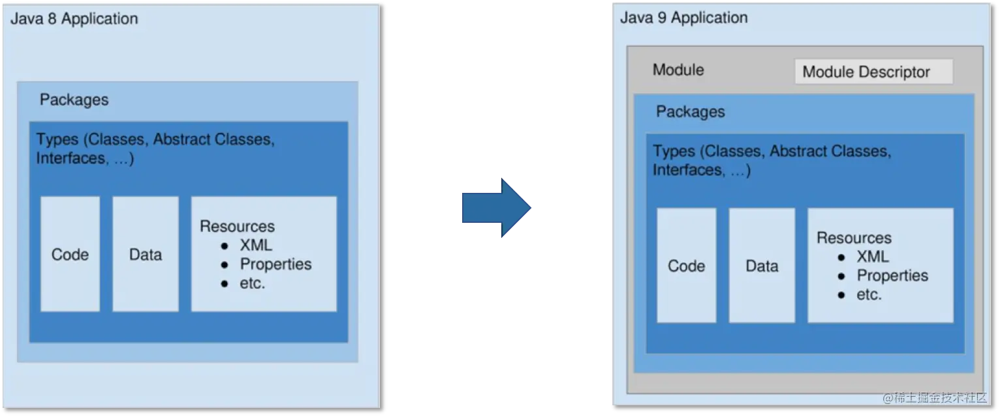
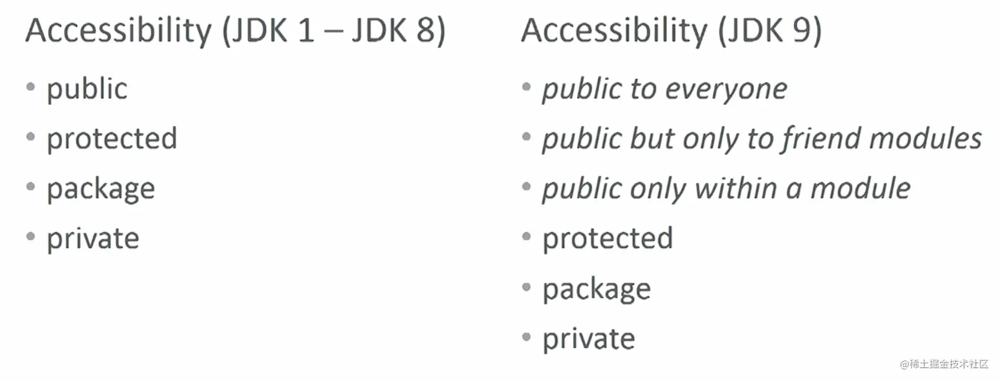
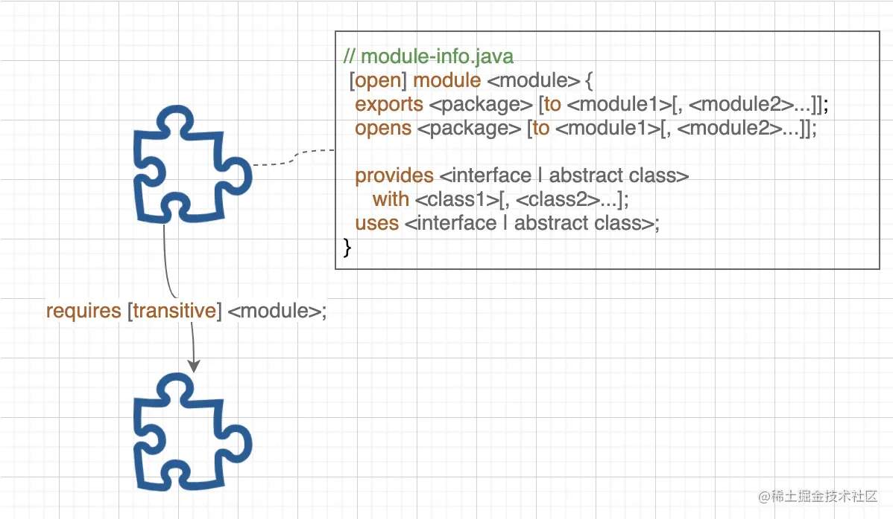
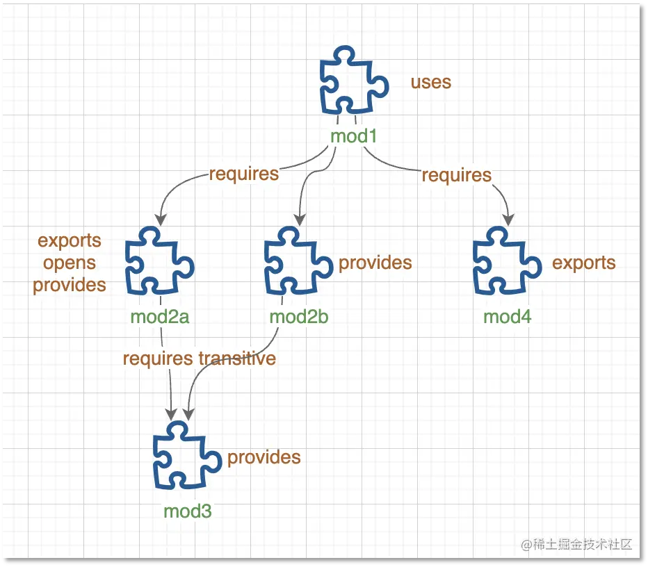
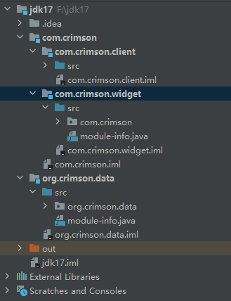

# Java 语言的变化

Java SE 9 及后续版本中更新的语言功能。

| 版本       | 功能                          | 描述                                                         |
| ---------- | ----------------------------- | ------------------------------------------------------------ |
| Java SE 9  | Java 平台模块系统             | 在此版本中引入。Java 平台模块系统引入了一种新的 Java 编程组件，即模块，它是一个命名的、自描述的代码和数据的集合。它的代码被组织为一组包含类型的包，即Java类和接口；其数据包括资源和其他类型的静态信息。模块可以导出或封装包，并且它们显式地表达对其他模块的依赖关系。 |
| Java SE 9  | try-with-resources 语句       | 如果您已经将资源作为变量`final`或有效`final`变量，则可以在`try-with-resources`语句中使用该变量，而无需声明新变量。“有效最终”变量是指其值在初始化后永远不会更改的变量。 |
| Java SE 9  | @SafeVarargs注释              | 私有实例方法允许使用@SafeVarargs注释                         |
| Java SE 9  | Diamond 语法和匿名内部类      |                                                              |
| Java SE 9  | 下划线字符不是合法名称        | 如果使用下划线字符（“_”）作为标识符，则无法再编译源代码。    |
| Java SE 9  | 支持私有接口方法              | 支持私有接口方法。这种支持允许接口的非抽象方法在它们之间共享代码。 |
| Java SE 10 | 局部变量类型推断              | 局部变量类型推断将类型推断扩展到带有初始值设定项的局部变量的声明。 |
| Java SE 11 | 局部变量类型推断              | 在Java SE 10中引入。在这个版本中，它得到了增强，支持在声明隐式类型lambda表达式的形式参数时使用var。局部变量类型推理将类型推理扩展到具有初始值设定项的局部变量的声明。 |
| Java SE 12 | Switch 表达式                 | 此功能扩展了switch语句，使其既可以用作语句也可以用作表达式，并且这两种形式都可以使用“传统”或“简化”的作用域和控制流行为。 |
| Java SE 13 | Text Blocks                   | 文本块是一个多行字符串文字，它避免了大多数转义序列的需要，以可预测的方式自动格式化字符串，并在需要时让开发人员控制格式。 |
| Java SE 13 | Switch Expressions            | 此功能扩展了switch，使其可以用作语句或表达式，并且使两种形式都可以使用传统的大小写…：标签（有故障）或新案例…->标签（没有失败），还有一个用于从开关表达式中生成值的新语句。 |
| Java SE 15 | Sealed Classes                | 密封类或接口限制哪些类或接口可以扩展或实现它。               |
| Java SE 17 | Sealed Classes                | 在此版本中是永久性的                                         |
| Java SE 17 | switch 表达式和语句的模式匹配 | 作为此版本的预览功能引入。                                   |

# Java 平台模块系统

官方的定义是 ：*A uniquely named, reusable group of related packages, as well as resources (such as images and XML files) and a module descriptor.*（一组唯一命名、可重复使用的相关包，以及资源（如图像和XML文件）和模块描述符。）模块的载体是 jar 文件，一个模块就是一个 jar 文件，但相比于传统的 jar 文件，模块的根目录下多了一个 **`module-info.class`** 文件，也即 `module descriptor`。 `module descriptor` 包含以下信息：

- 模块名称
- 依赖哪些模块
- 导出模块内的哪些包（允许直接 `import` 使用）
- 开放模块内的哪些包（允许通过 Java 反射访问）
- 提供哪些服务
- 依赖哪些服务



也就是说，任意一个 jar 文件，只要加上一个合法的 `module descriptor`，就可以升级为一个模块。其中的优势在于：

1.**原生的依赖管理。**有了模块系统，Java 可以根据 `module descriptor` 计算出各个模块间的依赖关系，一旦发现循环依赖，启动就会终止。同时，由于模块系统不允许不同模块导出相同的包（即 `split package`，分裂包），所以在查找包时，Java 可以精准的定位到一个模块，从而获得更好的性能。

2.**精简 JRE。**引入模块系统之后，JDK 自身被划分为 94 个模块（参见*图-2*）。通过 Java 9 新增的 `jlink` 工具，开发者可以根据实际应用场景随意组合这些模块，去除不需要的模块，生成自定义 JRE，从而有效缩小 JRE 大小。得益于此，JRE 11 的大小仅为 JRE 8 的 53%，从 218.4 MB缩减为 116.3 MB，JRE 中广为诟病的巨型 jar 文件 `rt.jar` 也被移除。更小的 JRE 意味着更少的内存占用，这让 Java 对嵌入式应用开发变得更友好。

3.**更好的兼容性。**自打 Java 出生以来，就只有 4 种包可见性，Java 9 之后，利用 `module descriptor` 中的 `exports` 关键词，模块维护者就精准控制哪些类可以对外开放使用，哪些类只能内部使用，换句话说就是不再依赖文档，而是由编译器来保证。类可见性的细化，除了带来更好的兼容性，也带来了更好的安全性。



4.**提升 Java 语言开发效率。**Java 9 之后，严格遵循每半年一个大版本的发布策略，从 2017 年 9 月到 2020 年 3 月，从 Java 9 到 Java 14，三年时间相继发布了 6 个版本，无一延期。Java 9 之后，JDK 被拆分为 94 个模块，每个模块有清晰的边界（`module descriptor`）和独立的单元测试，对于每个 Java 语言的开发者而言，每个人只需要关注其所负责的模块，开发效率因此大幅提升。

## module descriptor

模块的核心在于 `module descriptor`，对应根目录下的 `module-info.class` 文件，而这个 class 文件是由源代码根目录下的 `module-info.java` 编译生成。Java 为 `module-info.java` 设计了专用的语法，包含 `module`、 `requires`、`exports` 等多个关键词。



语法解读：

- `[open] module <module>`: 声明一个模块，模块名称应全局唯一，不可重复。加上 `open` 关键词表示模块内的所有包都允许通过 Java 反射访问，模块声明体内不再允许使用 `opens` 语句；
  - 模块名和包名可以完全相同，如 java.sql 模块包含 java.sql、javax.sql 和 javax.transaction.xa 这三个包；
  - 模块之间无任何层次关系，如 com.horstmann 和 com.horstmann.corejava 没有关系；

- `requires [transitive] <module>`: 声明模块依赖，一次只能声明一个依赖，如果依赖多个模块，需要多次声明。加上 `transitive` 关键词表示传递依赖，比如模块 A 依赖模块 B，模块 B 传递依赖模块 C，那么模块 A 就会自动依赖模块 C，类似于 Maven；
- `exports <package> [to <module1>[, <module2>...]]`: 导出模块内的包（允许直接 `import` 使用），一次导出一个包，如果需要导出多个包，需要多次声明。如果需要定向导出，可以使用 `to` 关键词，后面加上模块列表（逗号分隔）；
  - 包被导出：public 和 protected 的类和接口，以及 public 和 protected 的成员，在模块外部可以访问	（protected 的类型和成员只有在子类中是可访问的）；
  - 没有导出的包：模块外不可访问（这与模块化之前很不相同）；

- `opens <package> [to <module>[, <module2>...]]`: 开放模块内的包（允许通过 Java 反射访问），一次开放一个包，如果需要开放多个包，需要多次声明。如果需要定向开放，可以使用 `to` 关键词，后面加上模块列表（逗号分隔）；
- `provides <interface | abstract class> with <class1>[, <class2> ...]`: 声明模块提供的 Java SPI 服务，一次可以声明多个服务实现类（逗号分隔）；
- `uses <interface | abstract class>`: 声明模块依赖的 Java SPI 服务，加上之后模块内的代码就可以通过 `ServiceLoader.load(Class)` 一次性加载所声明的 SPI 服务的所有实现类；

Java 9 引入了一系列新的参数用于编译和运行模块，其中最重要的两个参数是 `-p` 和 `-m`。

- `-p` 参数指定模块路径，多个模块之间用 ":"（Mac, Linux）或者 ";"（Windows）分隔，同时适用于 `javac` 命令和 `java` 命令，用法和Java 8 中的 `-cp` 非常类似。
- `-m` 参数指定待运行的模块主函数，输入格式为`模块名/主函数所在的类名`，仅适用于 `java` 命令。两个参数的基本用法如下：
  - `javac -p <module_path> <source>`
  - `java -p <module_path> -m <module>**/**<main_class>`


## 代码示例

设计了一个示例工程，其内包含了 5 个模块：

- mod1 模块: 主模块，展示了使用服务实现类的两种方式。
- mod2a 模块: 分别导出和开放了一个包，并声明了两个服务实现类。
- mod2b 模块: 声明了一个未公开的服务实现类。
- mod3 模块: 定义 SPI 服务（`IEventListener`），并声明了一个未公开的服务实现类。
- mod4 模块: 导出公共模型类。



模块代码结构



# try-with-resources

使用try-with-resources可以确保代码块执行完毕后，系统会自动关闭资源，从而避免资源泄漏和错误。常规try-catch示例：

```java
try {    // 执行语句    
    resource1;
} catch (exceptionType1 e1) {    
    // 处理异常
} finally {    
    // 执行清理操作
}
```

在try块中，如果发生异常，会被传递到相应的catch块进行处理。finally块中的语句无论如何都会被执行，用于执行清理操作，例如关闭打开的流、释放占用的资源等。

try-with-resources示例：

```java
String readFirstLineFromFile(String path) throws IOException {    
    try (BufferedReader br = new BufferedReader(new FileReader(path))) {        
        return br.readLine();    
    }
}
```

使用try-with-resources语法糖来打开文件并读取它的第一行。在try-with-resources语句块中，我们创建一个BufferedReader对象并将其包装在try语句的括号中，这样在try块执行结束后，它会自动关闭资源。由于BufferedReader实现了AutoCloseable接口，因此它可以作为try-with-resources语句的一部分。

# @SafeVarargs注释

在声明具有模糊类型（比如：泛型）的可变参数的构造函数或方法时，Java编译器会报unchecked警告。鉴于这些情况，如果程序员断定声明的构造函数和方法的主体不会对其varargs参数执行潜在的不安全的操作，可使用@SafeVarargs进行标记，这样的话，Java编译器就不会报unchecked警告。在 JDK 9 中，JDK 开发人员扩展了@ safevarags 注释的使用，现在除了 final 或 static 方法之外，我们还可以在 private 方法中使用@ safevarags 注释。这是因为不能重写私有方法。

## **不安全操作警告**

Java 5 引入了 [Varargs](https://www.moonapi.com/go?url=https://www.geeksforgeeks.org/variable-arguments-varargs-in-java/) 的概念，或者说是一个可变长度的方法参数，以及 [Generics](https://www.moonapi.com/go?url=https://www.geeksforgeeks.org/generics-in-java/) ，这次只增加了未检查或者不安全操作的警告。现在的问题是，为什么当将方法与 varargs 一起使用或使用泛型时，编译器会抛出警告？当编译器抛出不安全操作警告时，编译器通常会以某种方式要求您更明确地说明类型。

# Diamond 语法和匿名内部类

可以将菱形语法与匿名内部类结合使用。可以在 Java 程序中编写的类型（例如`int`或 `String`）称为可指示类型。无法在 Java 程序中编写的编译器内部类型称为不可表示类型。不可表示类型可以作为菱形运算符使用的推理结果而出现。由于使用 Diamond 和匿名类构造函数推断的类型可能超出类文件中签名属性支持的类型集，因此 Java SE 7 中不允许将 Diamond 与匿名类一起使用。

# 局部变量类型推断

在Java 10中，引入了一项新的功能——局部变量类型推断（Local Variable Type Inference）。这个功能允许我们在声明变量时不显式地指定变量的类型，而是使用var关键字进行推断。局部变量类型推断在提高代码的可读性和简洁性方面具有很大的优势。它可以减少冗长的类型声明，并使代码更加清晰明了。在Java 10中，var关键字只能在局部变量中使用，而不能用于类的成员变量、接口方法或构造函数参数。

# Sealed Classes

密封类和接口限制其他类或接口可以扩展或实现它们。在面向对象语言中，我们可以通过继承（extend）来实现类的能力复用、扩展与增强。但有的时候，有些能力我们不希望被继承了去做一些不可预知的扩展。所以，我们需要对继承关系有一些限制的控制手段。而密封类的作用就是**限制类的继承**。

为了进一步增强限制能力，Java 17中的密封类增加了几个重要关键词：

- sealed：修饰类/接口，用来描述这个类/接口为密封类/接口
- non-sealed：修饰类/接口，用来描述这个类/接口为非密封类/接口
- permits：用在extends和implements之后，指定可以继承或实现的类

每个被允许的子类都需要添加修饰符来说明该类如何把父类的密封行为传递下去，一共有3种情况：

- 声明为 **final** ，禁止继续往下继承。
- 声明为 **sealed** ，允许继续往下进行受限继承。
- 声明为 **non-sealed** ，允许继续往下进行不受限的继承。

**final、sealed 和 non-sealed 这3个修饰符必须且只能出现一次** ，否则会出现编译错误。

在密封类引入之后，Java 的反射API也进行了修改。 java.lang .Class 类增加了两个新的方法：

- boolean isSealed() 判断当前 Class 对象是否表示密封类或接口。
- Class<?>[] getPermittedSubclasses() 返回包含了密封类或接口所允许的子类或子接口的数组。

在 JVM 方面，字节代码中在 Class File 结构中新增了一个 PermittedSubclasses 属性，用来记录允许的子类。PermittedSubclasses 属性的格式如下所示，其中记录了全部允许的类。

```java
 PermittedSubclasses_attribute {
    u2 attribute_name_index;
    u4 attribute_length;
    u2  number _of_classes;
    u2 classes[number_of_classes];
}  
```

当 JVM 尝试加载一个类时，如果它的父类或父接口的定义中包含了 PermittedSubclasses 属性，那么当前类必须出现在 PermittedSubclasses 属性的数组中，否则 JVM 会抛出 IncompatibleClassChangeError 错误。


