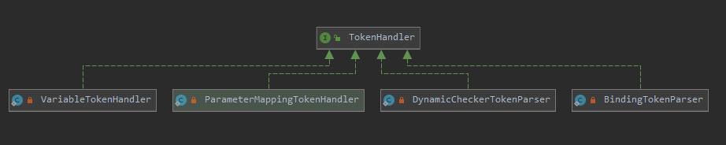
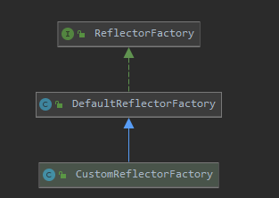
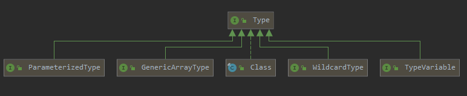
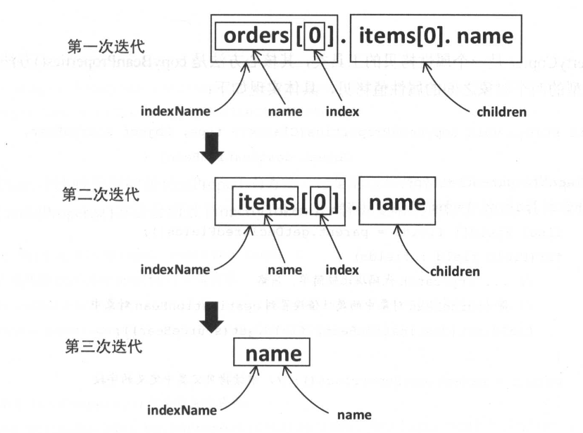

# 整体架构

Mybatis的整体架构分为三层：基础支持层、核心处理层和接口层。


[Mybatis源码结构](MyBatis源码结构.xmind)

## 解析模块

My Batis 在初始化过程中处理 mybatis-config配置文件以及映射文件时，使用的是 DOM 解析方式，井结合使用 XPath 解析 XML 配置文件。XPath 使用路径表达式来选取 XML 文档中指定的节点或者节点集合，与常见的 URL 路径 有些类似。下表展示了 XPath 中常用的表达式：

| 表达式   | 含义                                                         |
| -------- | ------------------------------------------------------------ |
| nodename | 选取指定节点的所有子节点                                     |
| /        | 从根节点选取指定节点                                         |
| //       | 根据指定的表达式，在整个文档中选取匹配的节点                 |
| .        | 选取当前节点                                                 |
| ..       | 选取当前节点的父节点                                         |
| @        | 选取属性                                                     |
| *        | 匹配任何元素的节点                                           |
| @*       | 匹配任何属性节点                                             |
| node()   | 匹配任何类型的节点                                           |
| text()   | 匹配文本节点                                                 |
| \|       | 选取若干个路径                                               |
| []       | 指定某个条件，用于查找某个特定的节点或者包含某个指定值的节点 |

下面提供一个简单的示例程序：

```java
public static void main(String[] args) throws Exception{
    DocumentBuilderFactory documentBuilderFactory = DocumentBuilderFactory.newInstance();

    // 开启验证
    documentBuilderFactory.setValidating(true);
    documentBuilderFactory.setNamespaceAware(false);
    documentBuilderFactory.setIgnoringComments(true);
    documentBuilderFactory.setIgnoringElementContentWhitespace(false);
    documentBuilderFactory.setCoalescing(false);
    documentBuilderFactory.setExpandEntityReferences(true);

    // 创建
    DocumentBuilder builder = documentBuilderFactory.newDocumentBuilder();
    builder.setErrorHandler(new ErrorHandler() {
        @Override
        public void warning(SAXParseException exception) throws SAXException {
            System.out.println("warning:" + exception.getMessage());
        }

        @Override
        public void error(SAXParseException exception) throws SAXException {
            System.out.println("error::" + exception.getMessage());
        }

        @Override
        public void fatalError(SAXParseException exception) throws SAXException {
            System.out.println("fatalError::" + exception.getMessage());
        }
    });

    // 将文档加载到Document
    Document doc = builder.parse("mybatis-example/src/main/java/org/example/test/inventory.xml");
    // 创建 XPathFactory
    XPathFactory factory = XPathFactory.newInstance();
    // 创建 XPath 对象
    XPath xPath = factory.newXPath();
    // 编译 XPath 表达式
    XPathExpression expr = xPath.compile("//book[author='Neal Stephenson']/title/text()");
    // 通过 XPath 表达式得到结采，第一个参数指定了 XPath 表达式进行查询的上下文节点，也就是在指定
    // 节点下查找符合 XPath 的节点。 本例中的上下文节点是整个文档；第二个参数指定了 XPath 表达式
    // 的返回类型。
    Object result = expr.evaluate(doc, XPathConstants.NODESET);
    System.out.println("查询作者为 Neal Stephenson 的图书的标题：");
    NodeList nodes= (NodeList) result;
    // 强制类型转换
    for (int i = 0; i < nodes.getLength() ; i++) {
        System.out.println(nodes.item(i).getNodeValue());
    }

    System.out.println("查询1997年之后的图书的标题：");
    nodes = (NodeList)xPath.evaluate( " //book[@year>1997] /title/text ()", doc , XPathConstants.NODESET);
    for(int i  = 0; i < nodes.getLength();i++){
        System. out.println(nodes.item(i).getNodeValue());
    }

    System.out.println("查询 1997 年之后的图书的属性和标题：");
    nodes = (NodeList)xPath.evaluate("//book [@year>1997] /@*|//book [@year>1997] /title/text()", doc , XPathConstants. NODESET);
    for (int i  = 0; i < nodes.getLength(); i++) {
        System. out. println (nodes.item(i).getNodeValue());
    }
}
```

XPathExpression.evaluate（）方法的第二参数，它指定了 XP础 表达式查找的结果类型， 在 XPathConstants 类中提供了 nodeset、 boolean、 number、 string 和 Node 五种类型。 如果XPath表达式只使用一次， 可以跳过编译步骤直接调用 XPath 对象的 evaluate()。方法进行查询。但是如果同一个 XPath 表达式要重复执行多次，则建议先进行编译，然后进行查询，这样性能会好一点。

###  XPathParser

MyBatis 提供的 XPathParser 类封装了前面涉及的 XPath、 Document 和 EntityResolver。XPathParser 中各个字段的含义和功能如下所示：

```java
// Document对象
private final Document document;
// 是否开启验证
private boolean validation;
// 用于加载本地的DTD文件
private EntityResolver entityResolver;
// Mbatis-config.xml 中<propteries>标签定义的键位对集合
private Properties variables;
// XPath对象
private XPath xpath;
```

默认情况下，对 XML 文档进行验证时，会根据 XML 文档开始位置指定的网址加载对应的 DTD 文 件或 XSD 文件 。如果解析 mybatis-config.xml 配置文件，默认联网加载 http://mybatis.org/dtd/mybatis-3-config.dtd 这个DTD 文档，当网络比较慢时会导致验证过程缓慢。在实践中往往会提前设置 EntityResolver 接口对象加载本地的 DTD 文件，从而避免联网加载DTD 文件。

XMLMapperEntityResolver 是 MyBatis 提供的 EntityResoIver 接口的实现类。Entity Resolver接口的核心是 resolveEntity()方法， XMLMapperEntityResolver 的实现如下所示：

```java
// 指定mybatis-config.xm文件和映射文件对反的DTD的SystemId 
private static final String IBATIS_CONFIG_SYSTEM = "ibatis-3-config.dtd";
private static final String IBATIS_MAPPER_SYSTEM = "ibatis-3-mapper.dtd";
private static final String MYBATIS_CONFIG_SYSTEM = "mybatis-3-config.dtd";
private static final String MYBATIS_MAPPER_SYSTEM = "mybatis-3-mapper.dtd";

// 指定mybatis-config.xm 文件和映射文件对应的 DTD 文件的具体位置
private static final String MYBATIS_CONFIG_DTD = "org/apache/ibatis/builder/xml/mybatis-3-config.dtd";
private static final String MYBATIS_MAPPER_DTD = "org/apache/ibatis/builder/xml/mybatis-3-mapper.dtd";

public InputSource resolveEntity(String publicId, String systemId) throws SAXException {
  try {
    if (systemId != null) {
      String lowerCaseSystemId = systemId.toLowerCase(Locale.ENGLISH);
      // 查找systemId指定的DTD文档，并调用 getinputSource()方法读取DTD文档
      if (lowerCaseSystemId.contains(MYBATIS_CONFIG_SYSTEM) || lowerCaseSystemId.contains(IBATIS_CONFIG_SYSTEM)) {
        return getInputSource(MYBATIS_CONFIG_DTD, publicId, systemId);
      } else if (lowerCaseSystemId.contains(MYBATIS_MAPPER_SYSTEM)
          || lowerCaseSystemId.contains(IBATIS_MAPPER_SYSTEM)) {
        return getInputSource(MYBATIS_MAPPER_DTD, publicId, systemId);
      }
    }
    return null;
  } catch (Exception e) {
    throw new SAXException(e.toString());
  }
}
```

在 XPathParser.createDocument()方法中封装了前面介绍的创建Document对象的过程并触发了加载XML文挡的 过程，具体实现如下：

```java
private void commonConstructor(boolean validation, Properties variables, EntityResolver entityResolver) {
  this.validation = validation;
  this.entityResolver = entityResolver;
  this.variables = variables;
  XPathFactory factory = XPathFactory.newInstance();
  this.xpath = factory.newXPath();
}

private Document createDocument(InputSource inputSource) {
    // 调用 createDocument()方法之前一定要先调用 commonConstructor 
    try {
        // 创建DocumentBuilderFactory对象
        DocumentBuilderFactory factory = DocumentBuilderFactory.newInstance();
        factory.setFeature(XMLConstants.FEATURE_SECURE_PROCESSING, true);
        factory.setValidating(validation);

        factory.setNamespaceAware(false);
        factory.setIgnoringComments(true);
        factory.setIgnoringElementContentWhitespace(false);
        factory.setCoalescing(false);
        factory.setExpandEntityReferences(true);
        
        // 创建DocumentBuilder对象并进行自己置
        DocumentBuilder builder = factory.newDocumentBuilder();
        // 设置EntityResolver接口对象
        builder.setEntityResolver(entityResolver);
        builder.setErrorHandler(new ErrorHandler() {
            @Override
            public void error(SAXParseException exception) throws SAXException {
                throw exception;
            }

            @Override
            public void fatalError(SAXParseException exception) throws SAXException {
                throw exception;
            }

            @Override
            public void warning(SAXParseException exception) throws SAXException {
                // NOP
            }
        });
        // 加载 XML 文件
        return builder.parse(inputSource);
    } catch (Exception e) {
        throw new BuilderException("Error creating document instance.  Cause: " + e, e);
    }
}
```

XPathParser 中提供了一系列的 eval*()方法用于解析 boolean、 short、 long、 int、 String、 Node 等类型的信息，它通过调用前面介绍的 XPath.evaluate()方法查找指定路径的节点或属性，并进行相应的类型装换 。XPatharser.eva!String()方法，其中会调用PropertyParser. parse()方法处理节点中相应的默认值。 具体实现如下： 

```java
public String evalString(Object root, String expression) {
  String result = (String) evaluate(expression, root, XPathConstants.STRING);
  result = PropertyParser.parse(result, variables);
  return result;
}
```

### PropertyParser

在 ProperyParser中指定了是否开启使用默认值的功能以及默认的分隔符，相关字段如下所示。 

```java

private static final String KEY_PREFIX = "org.apache.ibatis.parsing.PropertyParser.";
// 在 mybatis-config.xml中<properties>节点下自己置是否开启默认值功能的对应配置项 
public static final String KEY_ENABLE_DEFAULT_VALUE = KEY_PREFIX + "enable-default-value";
// 配置占位符与默认值之间的默认分隔符的对应配置项
public static final String KEY_DEFAULT_VALUE_SEPARATOR = KEY_PREFIX + "default-value-separator";
// 默认情况下，关闭默认值的功能 
private static final String ENABLE_DEFAULT_VALUE = "false";
// 默认分隔符是冒号
private static final String DEFAULT_VALUE_SEPARATOR = ":";
```

Property Parser. parse()方法中会创建GenericTokenParser解析器，井将默认值的处理委托给GenericTokenParser.parse()方法，实现如下：

```java
public static String parse(String string, Properties variables) {
  VariableTokenHandler handler = new VariableTokenHandler(variables);
  // 创建GenericTokenParser 对象，并指定其处理的占位符格式为"${}"
  GenericTokenParser parser = new GenericTokenParser("${", "}", handler);
  return parser.parse(string);
}
```

### GenericTokenParser

GenericTokenParser 是一个通用的宇占位符解析器，其宇段的含义如下：

```java
// 占位符的开始标识
private final String openToken;
// 占位符的结束标记
private final String closeToken;
// TokenHandler接口的实现会按照一定的逻辑解析占位符
private final TokenHandler handler;
```

GenericTokenParser . parse()方法的逻辑并不复杂，它会顺序查找 openToken 和 closeToken, 解析得到占位符的字面值，并将其交给 TokenHandler 处理， 然后将解析结果重新拼装成字符串并返回。该方法的实现如下：

```java
public String parse(String text) {
  // 校验text是否为空
  if (text == null || text.isEmpty()) {
    return "";
  }
  // 查找开始标记
  int start = text.indexOf(openToken);
  if (start == -1) {
    return text;
  }
  char[] src = text.toCharArray();
  int offset = 0;
  // 记录解析后的字符串
  final StringBuilder builder = new StringBuilder();
  // 用来记录一个占位符的字面值
  StringBuilder expression = null;
  do {
    if (start > 0 && src[start - 1] == '\\') {
      // 遇到转义的开始标记，则直接将前面的字符串以及开始标记追加到 builder 中.
      builder.append(src, offset, start - offset - 1).append(openToken);
      offset = start + openToken.length();
    } else {
      // 查找到开始标记，且未转义
      if (expression == null) {
        expression = new StringBuilder();
      } else {
        expression.setLength(0);
      }
      // 将前面的字符串追加到 builder 中 
      builder.append(src, offset, start - offset);
      // 修改 offset 的位置 
      offset = start + openToken.length();
      // 从 offset 向后继续查找结束标记 
      int end = text.indexOf(closeToken, offset);
      while (end > -1) {
        if (end > offset && src[end - 1] == '\\') {
          // 处理转义的结束标记 
          expression.append(src, offset, end - offset - 1).append(closeToken);
          offset = end + closeToken.length();
          end = text.indexOf(closeToken, offset);
        } else {
          // 将开始标记和结束标记之间的字符串追加到 expression 中保存 
          expression.append(src, offset, end - offset);
          break;
        }
      }
      if (end == -1) {
        // 未找到结束标记
        builder.append(src, start, src.length - start);
        offset = src.length;
      } else {
        // 将占位符的字面值交给TokenHandler处理，并将处理结果追加到builder中保存。
        // 最终拼凑出解析后的完整内容
        builder.append(handler.handleToken(expression.toString()));
        offset = end + closeToken.length();
      }
    }
    // 移动 start 
    start = text.indexOf(openToken, offset);
  } while (start > -1);
  if (offset < src.length) {
    builder.append(src, offset, src.length - offset);
  }
  return builder.toString();
}
```

### VariableTokenHandler

占位符由 TokenHandler 接口的实现进行解析， TokenHandler 接口总共有四个实现：



通过对 PropertyParser. parse()方法的介绍，我们知道 Prope向1Parser 是使用 VariableTokenHandler 与 GenericTokenParser 配合完成占位符解析的。VariableTokenHandler 是 PropertyParser中的一个私有静态内部类，其字段的含义如下：

```java
// <Properties>节点下定义的键位对，用于替换占位符
private final Properties variables;
// 支持占位符中使用默认值的功能
private final boolean enableDefaultValue;
// 占位符和默认值之间的分隔符
private final String defaultValueSeparator;
```

VariableTokenHandler 实现了 TokenHandler 接口中的 handleToken()方法，该实现首先会按照 defaultValueSeparator 宇段指定的分隔符对整个占位符切分， 得到占位符的名称和默认值，然后 按照切分得到的占位符名称查找对应的值， 如果在＜properties＞节点下未定义相应的键值对，则 将切分得到的默认值作为解析结果返回。

```java
public String handleToken(String content) {
    // 检测不为空
    if (variables != null) {
      String key = content;
      // 测是否支持占位符中使用默认佳的功能
      if (enableDefaultValue) {
        final int separatorIndex = content.indexOf(defaultValueSeparator);
        String defaultValue = null;
        if (separatorIndex >= 0) {
          // 获取占位符的名称
          key = content.substring(0, separatorIndex);
          // 获取默认值
          defaultValue = content.substring(separatorIndex + defaultValueSeparator.length());
        }
        if (defaultValue != null) {
          // 在 variables 集合中查找指定的占位符 
          return variables.getProperty(key, defaultValue);
        }
      }
      // 不支持默认值的功能， 则直接查找variables 集合
      if (variables.containsKey(key)) {
        return variables.getProperty(key);
      }
    }
    // 为空时，原样返回
    return "${" + content + "}";
  }
}
```

需要注意的是， GenericTokenParser 不仅仅用于这里的默认值解析，还会用于后面对动态SQL 语句的解析。很明显， GenericTokenParser 只是查找到指定的占位符， 而具体的解析行为会根据其持有的 TokenHandler 实现的不同而有所不同。

XPathParser.eva!Node()方法返回值类型是 XNode，它对org.w3c.dom.Node 对象做了封装和解析，其各个字段的含义如下： 

```java
// org.w3c.dorn.Node 对象
private final Node node;
// Node 节点名称
private final String name;
// 节点的内容
private final String body;
// 节点属性集合 
private final Properties attributes;
// rnybatis-config.xrnl 配置文件中<properties>节点下定义的键位对 
private final Properties variables;
// 前面介绍的XPathParser对象，该XNode对象由此XPathParser对象生成
private final XPathParser xpathParser;
```

XNode 的构 造函数中会调用其 parseAttributes()方法和 parseBody()方法解析，org.w3c.dom.Node 对象中的信息，初始化 attributes 集合和 body 字段，具体初始化过程如下：

```java
private Properties parseAttributes(Node n) {
    Properties attributes = new Properties();
    // 获取节点的属性集合
    NamedNodeMap attributeNodes = n.getAttributes();
    if (attributeNodes != null) {
        for (int i = 0; i < attributeNodes.getLength(); i++) {
            Node attribute = attributeNodes.item(i);
            // 使用 PropertyParser 处理每个属性中的占位符
            String value = PropertyParser.parse(attribute.getNodeValue(), variables);
            attributes.put(attribute.getNodeName(), value);
        }
    }
    return attributes;
}

private String parseBody(Node node) {
    String data = getBodyData(node);
    // 前节点不是文本节点
    if (data == null) {
        // 处理子节点
        NodeList children = node.getChildNodes();
        for (int i = 0; i < children.getLength(); i++) {
            Node child = children.item(i);
            data = getBodyData(child);
            if (data != null) {
                break;
            }
        }
    }
    return data;
}

private String getBodyData(Node child) {
    // 只处理文本内容
    if (child.getNodeType() == Node.CDATA_SECTION_NODE || child.getNodeType() == Node.TEXT_NODE) {
        String data = ((CharacterData) child).getData();
        // 使用 PropertyParser 处理文本节点中的占位符
        data = PropertyParser.parse(data, variables);
        return data;
    }
    return null;
}
```

XNode 中提供了多种 get＊()方法获取所需的节点信息，这些信息主要来自上面介绍的attribute 集合、 body 宇段、 node字段。可以使用 XNode.eval＊()方法结合 XPath 查询需要的信息， eval*()系列方法是通过调用其封装的 XPathParser 对象的 eval＊()方法实现的。这里要注意的是， eval＊()系列方法的上下 文节点是当前的XNode.node，也就是查找该节点下的符合 XPath 表达式的信息。

## 反射模块

MyBatis提供了专门的反射模块，该模块位于 org.apache.ibatis.reflection 包中，它对常见的反射操作做了进一步封装，提供了更加简洁方便的反射 API。

### Rflector

Reflector是MyBatis中反射模块的基础，每个Reflector对象都对应一个类，在 Reflector中缓存了反射操作需要使用的类的元信息。Reflector中各个字段的含义如下：

```java
// 获取方法句柄
private static final MethodHandle isRecordMethodHandle = getIsRecordMethodHandle();
// 应的 Class 类型
private final Class<?> type;
// 可读属性的名称集合，可读属性就是存在相应 getter 方法的属性，初始值为空数纽
private final String[] readablePropertyNames;
// 可写属性的名称集合，可写属性就是存在相应 setter 方法的属性，初始值为空数纽
private final String[] writablePropertyNames;
//记录了属性相应的setter方法，key 是属性名称，value是Invoker对象，它是对setter方法对应Method对象的封装
private final Map<String, Invoker> setMethods = new HashMap<>();
// 属性相应的 getter 方法集合，key是属性名称，value也是Invoker对象
private final Map<String, Invoker> getMethods = new HashMap<>();
// 记录了属性相应的 setter 方法的参数值类型， key 是属性名称， value 是 setter 方法的参数类型
private final Map<String, Class<?>> setTypes = new HashMap<>();
// 记录了属性相应的 getter 方法的返回位类型， key 是属性名称， value 是 getter 方法的返回位类型
private final Map<String, Class<?>> getTypes = new HashMap<>();
// 记录了默认构造方法
private Constructor<?> defaultConstructor;
// 记录了所有属性名称的集合
private Map<String, String> caseInsensitivePropertyMap = new HashMap<>();
```

在 Reflector 的构造方法中会解析指定的 Class 对象，并填充上述集合，具体实现如下：

```java
public Reflector(Class<?> clazz) {
  // 始化 type 字段
  type = clazz;
  // 查找 clazz 的默认构造方法（元参构造方法）， 具体实现是通过反射遥历所有构造方法，
  addDefaultConstructor(clazz);
  Method[] classMethods = getClassMethods(clazz);
  if (isRecord(type)) {
    addRecordGetMethods(classMethods);
  } else {
    // 处理clazz中的getter方法，填充 getMethods 集合和 getTypes 集合
    addGetMethods(classMethods);
    // 处理clazz中的setter方法，填充setMethods集合和setTypes集合
    addSetMethods(classMethods);
    // 处理没有getter/setter方法的字段
    addFields(clazz);
  }
  // 根据 getMethods/setMethods 集合，初始化可读／写属性的名称集合
  readablePropertyNames = getMethods.keySet().toArray(new String[0]);
  writablePropertyNames = setMethods.keySet().toArray(new String[0]);
  // 初始化 caseinsensitivePropertyMap 集合，其中记录了所有大写格式的属性名称
  for (String propName : readablePropertyNames) {
    caseInsensitivePropertyMap.put(propName.toUpperCase(Locale.ENGLISH), propName);
  }
  for (String propName : writablePropertyNames) {
    caseInsensitivePropertyMap.put(propName.toUpperCase(Locale.ENGLISH), propName);
  }
}
```

Reflector.addGetMethods()方法主要负责解析类中定义的 getter 方法， Reflector.addSetMethods()方法负责解析类中定义的 se忧er 方法，两者的逻辑类似，这里以 addGetMethods()方法为例进行介绍。Reflector.addGetMethods()方法有如下三个核心步骤。

1. 首先，调用Reflector.getClassMethods()方法获取当前类以及其父类中定义的所有方法的唯一签名以及相应的Method 对象。

```java
private Method[] getClassMethods(Class<?> clazz) {
  // 用于记录指定类中定义的全部方法的唯一签名以及对应的 Method 对象
  Map<String, Method> uniqueMethods = new HashMap<>();
  Class<?> currentClass = clazz;
  while (currentClass != null && currentClass != Object.class) {
    // 记录 currentClass 这个类中定义的全部方法
    addUniqueMethods(uniqueMethods, currentClass.getDeclaredMethods());
    // 记录接口中定义的方法
    Class<?>[] interfaces = currentClass.getInterfaces();
    for (Class<?> anInterface : interfaces) {
      addUniqueMethods(uniqueMethods, anInterface.getMethods());
    }
    // 取父类，继续 while 循环
    currentClass = currentClass.getSuperclass();
  }
  Collection<Method> methods = uniqueMethods.values();
  // 换成 Methods 数组返回
  return methods.toArray(new Method[0]);
}
```

在Reflector.addUniqueMethods()方法中会为每个方法生成唯 一签名，井记录到uniqueMethods 集合中，具体实现如下：

```java
private void addUniqueMethods(Map<String, Method> uniqueMethods, Method[] methods) {
  for (Method currentMethod : methods) {
    if (!currentMethod.isBridge()) {
      // 通过 Reflector.getSignature()方法得到的方法签名是：返回值类型＃方法名称：参
      // 数类型列表。 例如， Reflector.getSignature(Method）方法的唯一签名是： 
      // java.lang.String#getSignature: ] ava.lang.reflect.Method
      // 通过 Reflector.getSignature()方法得到的方法签名是全局唯一的，可以作为该方法的唯一标识
      String signature = getSignature(currentMethod);
      // 检测是否在子类中已经添加过该方法，如果在子类中已经添加过，则表示子类覆盖了该方法， 
      // 无须再向uniqueMethods集合中添加该方法了 
      if (!uniqueMethods.containsKey(signature)) {
        uniqueMethods.put(signature, currentMethod);
      }
    }
  }
}
```

2. 按照 JavaBean 的规范，从 Reflector.getClassMethods()方法返回的 Method 中查找该类中定义的 getter 方法，将其记录到 conflictingGetters 集合中。 conflictingGetters 集合（HashMap<String， List<Method＞()类型） 的 key 为属性名称， value 是该属性对应的 getter 方法集合。 

3. 当子类覆盖了父类的getter方法且返回值发生变化时，在步骤 l 中就会产生两个签名不同的方法。 例如现有类 A 及其子类 SubA, A 类中定义了 getNames()方法，其返回值类型是List<String＞ ， 而在其子类 SubA 中， 覆写了其getNames()方法且将返回值修改成 ArrayList<String>类型，这种覆写在 Java 语言中是合法的。最终得到的两个方法签名分别是 java.util.List#getNames和java.util.ArrayList#getNames，在Reflector.addUniqueMethods()方法中会被认为是两个不同的方法并添加到 uniqueMethods 集合中。但是在某些情况下，只需要子类覆盖的的方法，所以需要调用Reflector.resolveGetterConflicts()方法对这种覆写进行处理，同时会将处理得到的 getter 方法记录到 getMethods 集合，并将其返回值类型填充到 getTypes 集合。 Reflector.resolveGetterConflicts()方法的具体实现如下： 

   ```java
     /**
      *
      * 解决Getter冲突
      * 根据JavaBeans的规范，检验POJO是否按照规范，且取出最优的getter/setter方法，没有找到的话，会抛出异常。
      */
   private void resolveGetterConflicts(Map<String, List<Method>> conflictingGetters) {
     // 遍历 conflictingGetters 集合
     for (Entry<String, List<Method>> entry : conflictingGetters.entrySet()) {
       Method winner = null;
       String propName = entry.getKey();
       boolean isAmbiguous = false;
       for (Method candidate : entry.getValue()) {
         if (winner == null) {
           winner = candidate;
           continue;
         }
         Class<?> winnerType = winner.getReturnType();
         Class<?> candidateType = candidate.getReturnType();
         if (candidateType.equals(winnerType)) {
           if (!boolean.class.equals(candidateType)) {
             // 当返回值不为boolean的iser方法又有getter时，会被抛出异常
             isAmbiguous = true;
             break;
           } else if (candidate.getName().startsWith("is")) {
             // 属于is...
             winner = candidate;
           }
         } else if (candidateType.isAssignableFrom(winnerType)) {
           // 属于继承关系
         } else if (winnerType.isAssignableFrom(candidateType)) {
           // 属于继承关系
           winner = candidate;
         } else {
           //当发现属性存在一个getter和一个iser的时候，两个方法返回值类型不一样，也没有继承关系，就会抛出异常
           isAmbiguous = true;
           break;
         }
       }
       addGetMethod(propName, winner, isAmbiguous);
     }
   }
   
   private void addGetMethod(String name, Method method, boolean isAmbiguous) {
       MethodInvoker invoker = isAmbiguous ? new AmbiguousMethodInvoker(method, MessageFormat.format(
           "Illegal overloaded getter method with ambiguous type for property ''{0}'' in class ''{1}''. This breaks the JavaBeans specification and can cause unpredictable results.",
           name, method.getDeclaringClass().getName())) : new MethodInvoker(method);
       // 将属性名以及对应的 Methodinvoker 对象添加Ji] getMethods 集合中，
       getMethods.put(name, invoker);
       // 获取~回佳的 Type,
       Type returnType = TypeParameterResolver.resolveReturnType(method, type);
       // 将属性名称及其 getter 方法的返回位类型添加到 getTypes 集合中保存，
       getTypes.put(name, typeToClass(returnType));
   }
   ```

Reflector.addGetMethods()方法的三个核心步骤的具体实现：

```java
public Reflector(Class<?> clazz) {
    type = clazz;
    addDefaultConstructor(clazz);
    // 步骤 l： 获取指定类以及其父类和接口中定义的方法
    Method[] classMethods = getClassMethods(clazz);
    if (isRecord(type)) {
        addRecordGetMethods(classMethods);
    } else {
        addGetMethods(classMethods);
        addSetMethods(classMethods);
        addFields(clazz);
    }
    readablePropertyNames = getMethods.keySet().toArray(new String[0]);
    writablePropertyNames = setMethods.keySet().toArray(new String[0]);
    for (String propName : readablePropertyNames) {
        caseInsensitivePropertyMap.put(propName.toUpperCase(Locale.ENGLISH), propName);
    }
    for (String propName : writablePropertyNames) {
        caseInsensitivePropertyMap.put(propName.toUpperCase(Locale.ENGLISH), propName);
    }
}

private void addGetMethods(Method[] methods) {
  // conflictingGetters 集合的 key 为属性名称， value 是相应 getter 方法集合，因为子类可能覆盖父 
  // 类的 getter 方法，所以同一属性名称可能会存在多个 getter 方法
  Map<String, List<Method>> conflictingGetters = new HashMap<>();
  // 步骤 2：按照 JavaBean 规范查找 getter 方法，并记录到 conflictingGetters 集合中
  Arrays.stream(methods).filter(
      // JavaBean 中 getter 方法的方法名长度大于 3 且必须以”get”开头
      m -> m.getParameterTypes().length == 0 && PropertyNamer.isGetter(m.getName()))
      .forEach(
      // 按照 JavaBean 的规范，获取对应的属性名称,将属性名与 getter 方法的对反关系记录圭1] conflictingGetters 集合中 
      m -> addMethodConflict(conflictingGetters,PropertyNamer.methodToProperty(m.getName()), m));
  // 步骤 3：对 conflictingGetters 集合进行处理
  resolveGetterConflicts(conflictingGetters);
}
```

Reflector.addFields()方法会处理类中定义的所有字段 ， 并且将处理后的字段信息添加到setMethods 集合、setTypes 集合、 getMethods 集合以及 getTypes 集合中，这一点与上述的Reflector.addGetMethods（）方法是一致的 。 Reflector.addFields()方法的具体实现如下： 

```java
private void addFields(Class<?> clazz) {
  // 获取 clazz 中定义的全部字段
  Field[] fields = clazz.getDeclaredFields();
  for (Field field : fields) {
    // 当 setMethods 集合不包含同名属性时，将其记录到 setMethods 集合和 setTypes 集合
    if (!setMethods.containsKey(field.getName())) {
      // 删除了final的检查，因为JDK1.5允许通过反射修改final字段。final静态只能由类加载器设置
      // 过滤掉final和static修饰的字段
      int modifiers = field.getModifiers();
      if (!(Modifier.isFinal(modifiers) && Modifier.isStatic(modifiers))) {
        // addSetField()方法的主要功能是填充setMethods集合和setypes集合,与addGetMethod()方法类似
        addSetField(field);
      }
    }
    //  getMethods 集合中不包含同名属性时，将其记录到 getMethods 集合和 getTypes 集合 
    if (!getMethods.containsKey(field.getName())) {
      addGetField(field);
    }
  }
  if (clazz.getSuperclass() != null) {
    // 处理父类中定义的字段 
    addFields(clazz.getSuperclass());
  }
}
```

还有一点需要注意的是， add * Method()方法和 add*Field()方法在向上述集合添加元素时，会将 getter/setter 方法对应的 Method 对象以及字段对应的 Field 对象统一封装成 Invoker 对象。 Invoker 接口的定义如下所示。

```java
public interface Invoker {
  // 调用获取指定字段的值或执行指定的方法
  Object invoke(Object target, Object[] args) throws IllegalAccessException, InvocationTargetException;
  // 回属性相应的类型
  Class<?> getType();
}
```


GetFieldlnvoker/SetFieldlnvoker通过field字段封装了对应的 Field 对象，两者的 invoke()方 法是通过调用 Field.get()/set()方法实现的。 Methodlnvoker 通过 method 宇段封装了对应方法的 Method 对象，其 invoke()方法是通过调用 Method.invoke()方法实现。

### ReflectorFactory 

ReflectorFactory 接口主要实现了对 Reflector 对象的创建和缓存，该接口定义如下： 

```java
public interface ReflectorFactory {
  
  // 测该 ReflectorFactory 对象是否会缓存 Reflector 对象 
  boolean isClassCacheEnabled();

  // 置是否缓存 Reflector 对象
  void setClassCacheEnabled(boolean classCacheEnabled);

  // 建指定 Class 对应的 Reflector 对象
  Reflector findForClass(Class<?> type);
}
```



DefaultRefl ectorF actory 中字段的含义如下： 

```java
// 该字段决定是否开启对Reflector对象的缓存
private boolean classCacheEnabled = true;
// 使用 ConcurrentMap 集合实现对 Reflector 对象的缓存 
private final ConcurrentMap<Class<?>, Reflector> reflectorMap = new ConcurrentHashMap<>();
```

DefaultReflectorFactory提供的 findForClass()方法实现会为指定的 Class 创建 Reflector对象， 并将 Reflector 对象缓存到 reflectorMap 中， 具体代码如下： 

```java
public Reflector findForClass(Class<?> type) {
  // 检测是否开启缓存
  if (classCacheEnabled) {
    // 创建 Reflector 对象，放入 ConcurrentMap 中缓存 
    return MapUtil.computeIfAbsent(reflectorMap, type, Reflector::new);
  } else {
    return new Reflector(type);
  }
}
```

### TypeParameterResolver

Type 是所有类型的父接口，它有四个子接口和一个实现类：



- Class比较常见，它表示的是原始类型。Class类的对象表示NM中的一个类或接口，每个Java类在NM里都表现为一个Class对象。在程序中可以通过“类名.class”、“对 象.getClass()”或是 "Class.forName("类名")"等方式获取Class对象。数组也被映射为Class对象，所有元素类型相同且维数相同的数组都共享同一个Class对象。

- ParameterizedType表示的是参数化类型，例如List<String＞、Map<Integer,String＞、Service<User＞这种带有泛型的类型。ParameterizedType接口中常用的方法有三个，分别是： 

  - Type getRawType（）一一返回参数化类型中的原始类型，例如List<String＞的原始类型为List。
  - Type[] getActualTypeArguments（）一一获取参数化类型的类型变量或是实际类型列表，例如Map<Integer,String＞的实际泛型列表Integer和String。需要注意的是，该列表的元素类型都是Type，也就是说，可能存在多层嵌套的情况。
  - Type getOwnerType（）一一返回是类型所属的类型，例如存在A<T>类，其中定义了内部类lnnerA<l＞，则InnerA<l＞所属的类型为A<T＞，如果是顶层类型则返回null。这种关系比较常见的示例是Map<K,V＞接口与Map.En盯＜K,V＞接口，Map<K,V>接口是Map.Entry＜K,V＞接口的所有者。

- TypeVariable表示的是类型变量，它用来反映在NM编译该泛型前的信息。例如List<T>中的T就是类型变量，它在编译时需被转换为一个具体的类型后才能正常使用。该接口中常用的方法有三个，分别是：

  - Type[] getBounds（）一一获取类型变量的上边界，如果未明确声明上边界则默认为Object。例如classTest<K extends Person＞中K的上界就是Person。

  - DgetGenericDeclaration（）一一获取声明该类型变量的原始类型，例如classTest<K extends Person＞中的原始类型是Test。 

  - String getNameO一一获取在源码中定义时的名字，上例中为K。

- GenericArrayType表示的是数组类型且组成元素是ParameterizedType或TypeVariable. 例如 List<String＞[]或 T[]。该接口只有 Type getGenericComponentType()一个方法，它返回数组的组成元素。
- WildcardType表示的是通配符泛型，例如:extends Number和？super Integer。WildcardType接口有两个方法，分别是： 
  - Type[] getUpperBounds（）一一返回泛型变量的上界。 
  - Type[] getLowerBounds（）一一返回泛型变量的下界。

TypeParameterResolver的身影，它是一个工具类，提供了一系列静态方法来解析指定类中的宇段、方法返回值或方法参数的类型。TypeParameterResolver中通过 resolveFieldType()方法、resolveReturnType()方法、 resolveParamTypes()方法分别解析宇段类型、方法返回值类型和方法参数列表中各个参数的类型。这三个方法的逻辑基本类似，这里以 resolveFieldType()方法为例进行介绍：

```java
public static Type resolveFieldType(Field field, Type srcType) {
  // 字段的声明类型
  Type fieldType = field.getGenericType();
  // 获取字段定义所在的类的 Class对象 
  Class<?> declaringClass = field.getDeclaringClass();
  // 调用 resolveType()方法进行后续处理
  return resolveType(fieldType, srcType, declaringClass);
}
```

上述三个方法都会调用 resolveType（）方法， 该方法会根据其第一个参数的类型， 即字段、方法返回值或方法参数的类型，选择合适的方法进行解析。第二个参数表示查找该字段、返回值或方法参数的起始位置。第三个参数则表示该字段、 方法定义所在的类。 TypeParameterResolver.resolveType（）方法代码如下：

```java
private static Type resolveType(Type type, Type srcType, Class<?> declaringClass) {
  if (type instanceof TypeVariable) {
    // TypeVariable 类型
    return resolveTypeVar((TypeVariable<?>) type, srcType, declaringClass);
  } else if (type instanceof ParameterizedType) {
    // ParameterizedType 类型
    return resolveParameterizedType((ParameterizedType) type, srcType, declaringClass);
  } else if (type instanceof GenericArrayType) {
    // GenericArrayType 类型
    return resolveGenericArrayType((GenericArrayType) type, srcType, declaringClass);
  } else {
    return type;
  }
}
```

字段声明的类型Map<K,V＞是Parameterized Type类型， resolveType()方法会调用resolveParameterizedType()方法进行解析。resolveParameterizedType（）方法的参数： 

- 第一个参数是待解析的 ParameterizedType 类型； 
- 第二个参数是解析操作的起始类型：
- 第三个参数为定义该字段或方法的类的 Class 对象。

TypeParameterResolver.resolveParameterizedType()方法代码如下：

```java
private static ParameterizedType resolveParameterizedType(ParameterizedType parameterizedType, Type srcType,
    Class<?> declaringClass) {
  // 得到原始类型对应的 Class 对象 
  Class<?> rawType = (Class<?>) parameterizedType.getRawType();
  // 型交量为 K 和 V
  Type[] typeArgs = parameterizedType.getActualTypeArguments();
  // 保存解析后的结果
  Type[] args = new Type[typeArgs.length];
  for (int i = 0; i < typeArgs.length; i++) {
    // 解析K和V
    if (typeArgs[i] instanceof TypeVariable) {
      // 解析类型变量
      args[i] = resolveTypeVar((TypeVariable<?>) typeArgs[i], srcType, declaringClass);
    } else if (typeArgs[i] instanceof ParameterizedType) {
      // 如果嵌套了 ParameterizedType，则调用 resolveParameterizedType （）方法进行处理
      args[i] = resolveParameterizedType((ParameterizedType) typeArgs[i], srcType, declaringClass);
    } else if (typeArgs[i] instanceof WildcardType) {
      // 如采嵌套了 WildcardType，则调用 resolveWildcardType （）方法进行处理
      args[i] = resolveWildcardType((WildcardType) typeArgs[i], srcType, declaringClass);
    } else {
      args[i] = typeArgs[i];
    }
  }
  // 将解析结果封装成 TypeParameterResolver 中定义的 Parameter工zedType 实现并返回，本例中 args 
  // 数组中的元素都是 Long.class
  return new ParameterizedTypeImpl(rawType, null, args);
}
```

TypeParameterResolver.resolveTypeVar()方法负责解析 TypeVariable，一个参数是类型变量 K 对应的 TypeVariable 对象，第二个参数依然是 TypeText.SubA<Long＞对应的 ParameterizedType 对象，第三个参数是 ClassA （声明 map 字段的类）对应的 Class 对象。 TypeParameterResolver.resolveTypeVar()方法的具体实现如下：

```java
private static Type resolveTypeVar(TypeVariable<?> typeVar, Type srcType, Class<?> declaringClass) {
  Type result;
  Class<?> clazz;
  if (srcType instanceof Class) {
    clazz = (Class<?>) srcType;
  } else if (srcType instanceof ParameterizedType) {
    ParameterizedType parameterizedType = (ParameterizedType) srcType;
    clazz = (Class<?>) parameterizedType.getRawType();
  } else {
    throw new IllegalArgumentException(
        "The 2nd arg must be Class or ParameterizedType, but was: " + srcType.getClass());
  }

  if (clazz == declaringClass) {
    // 获取上界 
    Type[] bounds = typeVar.getBounds();
    if (bounds.length > 0) {
      return bounds[0];
    }
    return Object.class;
  }

  // 获取声明的父类类型。
  Type superclass = clazz.getGenericSuperclass();
  // 通过扫描父类进行后续解析，这是递归的入口
  result = scanSuperTypes(typeVar, srcType, declaringClass, clazz, superclass);
  if (result != null) {
    return result;
  }

  Type[] superInterfaces = clazz.getGenericInterfaces();
  for (Type superInterface : superInterfaces) {
    result = scanSuperTypes(typeVar, srcType, declaringClass, clazz, superInterface);
    if (result != null) {
      return result;
    }
  }
  // 若在整个继承结构中都没有解析成功，则返回 Object.class
  return Object.class;
}
```

scanSuperTypes()方法， 该方法会递归整个继承结构井完成类型变量的解析。在该示例之中， 第一个参数是 K 对应的 TypeVariable 对象， 第二个参数是 TypeText.SubA<Long>对应的 ParameterizedType 对象， 第三个参数是 ClassA（声明 map 字段的类）对应的 Class 对象，第四个参数是 SubClassA 对应的 Class 对象，第五个参数是 Class<T,T>对应的 ParameterizedType对象。 scanSuperTypes()方法的具体实现如下： 

```java
private static Type scanSuperTypes(TypeVariable<?> typeVar, Type srcType, Class<?> declaringClass, Class<?> clazz,
    Type superclass) {
  if (superclass instanceof ParameterizedType) {
    ParameterizedType parentAsType = (ParameterizedType) superclass;
    // 查看原始的class
    Class<?> parentAsClass = (Class<?>) parentAsType.getRawType();
    // 原始类型中定义的变量
    TypeVariable<?>[] parentTypeVars = parentAsClass.getTypeParameters();
    if (srcType instanceof ParameterizedType) {
      parentAsType = translateParentTypeVars((ParameterizedType) srcType, clazz, parentAsType);
    }
    if (declaringClass == parentAsClass) {
      for (int i = 0; i < parentTypeVars.length; i++) {
        if (typeVar.equals(parentTypeVars[i])) {
          return parentAsType.getActualTypeArguments()[i];
        }
      }
    }
    if (declaringClass.isAssignableFrom(parentAsClass)) {
      // 继续解析父类，直到解析到定义该字段的类
      return resolveTypeVar(typeVar, parentAsType, declaringClass);
    }
  } else if (superclass instanceof Class && declaringClass.isAssignableFrom((Class<?>) superclass)) {
    // 声明的父类不再含有类型变量且不是定义该字段的类，则继续解析 
    return resolveTypeVar(typeVar, superclass, declaringClass);
  }
  return null;
}
```

scanSuperTypes()方法解析类型变量的核心逻辑。

方法逻辑解析.png)

resolveGenericArrayType()方法法，该方法负责解析 GenericArrayType 类型的变量，它会根据数组元素的类型选择合适的 resolve＊()方法进行解析， 具体实现如下： 

```java
private static Type resolveGenericArrayType(GenericArrayType genericArrayType, Type srcType,
    Class<?> declaringClass) {
  Type componentType = genericArrayType.getGenericComponentType();
  Type resolvedComponentType = null;
  // 根据数纽元素类型选择合适的方法进行解析
  if (componentType instanceof TypeVariable) {
    resolvedComponentType = resolveTypeVar((TypeVariable<?>) componentType, srcType, declaringClass);
  } else if (componentType instanceof GenericArrayType) {
    // 逆归调用 resolveGenericArrayType （） 方法
    resolvedComponentType = resolveGenericArrayType((GenericArrayType) componentType, srcType, declaringClass);
  } else if (componentType instanceof ParameterizedType) {
    resolvedComponentType = resolveParameterizedType((ParameterizedType) componentType, srcType, declaringClass);
  }
  // 根据解析后的数纽项类型构造返回类型
  if (resolvedComponentType instanceof Class) {
    return Array.newInstance((Class<?>) resolvedComponentType, 0).getClass();
  } else {
    return new GenericArrayTypeImpl(resolvedComponentType);
  }
}
```

当存在复杂的继承关系以及泛型定义时， TypeParameterResolver 可以帮助我们解析字段、 方法参数或方法返回值的类型，这是前面介绍的 Reflector 类的基础。

### ObjectFactory

该该接口提供了多个 create()方法的重载， 通过这些 create()方法可以创建指定类型的对象。 ObjectFactory 接口的定义如下：

```java
public interface ObjectFactory {

  /**
   * 设置配置信息
   *
   * @param properties
   *          configuration properties
   */
  default void setProperties(Properties properties) {
    // NOP
  }

  /**
   * 无参构造器创建指定类的对象
   *
   * @param <T>
   *          the generic type
   * @param type
   *          Object type
   *
   * @return the t
   */
  <T> T create(Class<T> type);

  /**
   * 根据参数列表，从指定类型中选择合适的构造器创建对象
   *
   * @param <T>
   *          the generic type
   * @param type
   *          Object type
   * @param constructorArgTypes
   *          Constructor argument types
   * @param constructorArgs
   *          Constructor argument values
   *
   * @return the t
   */
  <T> T create(Class<T> type, List<Class<?>> constructorArgTypes, List<Object> constructorArgs);

  /**
   * 检测指定类型是否为集合类型，主妥处理 java.util.Collection 及其子类
   *
   * @param <T>
   *          the generic type
   * @param type
   *          Object type
   *
   * @return whether it is a collection or not
   *
   * @since 3.1.0
   */
  <T> boolean isCollection(Class<T> type);

}
```

DefaultObjectFactory是MyBatis提供的 ObjectFactory接口的唯一实现，它是一个反射工厂， 其 create()方法通过调用 instantiateClass()方法实现。 DefaultObjectFactory.instantiateClass()方法会 根据传入的参数列表选择合适的构造函数实例化对象，具体实现如下：

```java
private <T> T instantiateClass(Class<T> type, List<Class<?>> constructorArgTypes, List<Object> constructorArgs) {
  try {
    Constructor<T> constructor;
    // 通过无参构造函数创建对象
    if (constructorArgTypes == null || constructorArgs == null) {
      constructor = type.getDeclaredConstructor();
      try {
        return constructor.newInstance();
      } catch (IllegalAccessException e) {
        if (Reflector.canControlMemberAccessible()) {
          constructor.setAccessible(true);
          return constructor.newInstance();
        } else {
          throw e;
        }
      }
    }
    // 根据指定的参数列表查找构造函数，并实例化对象
    constructor = type.getDeclaredConstructor(constructorArgTypes.toArray(new Class[0]));
    try {
      return constructor.newInstance(constructorArgs.toArray(new Object[0]));
    } catch (IllegalAccessException e) {
      if (Reflector.canControlMemberAccessible()) {
        constructor.setAccessible(true);
        return constructor.newInstance(constructorArgs.toArray(new Object[0]));
      } else {
        throw e;
      }
    }
  } catch (Exception e) {
    String argTypes = Optional.ofNullable(constructorArgTypes).orElseGet(Collections::emptyList).stream()
        .map(Class::getSimpleName).collect(Collectors.joining(","));
    String argValues = Optional.ofNullable(constructorArgs).orElseGet(Collections::emptyList).stream()
        .map(String::valueOf).collect(Collectors.joining(","));
    throw new ReflectionException("Error instantiating " + type + " with invalid types (" + argTypes + ") or values ("
        + argValues + "). Cause: " + e, e);
  }
}
```

### Property 工具集 

#### PropertyTokenizer

有如下映射规则：

```xml
<resultMap id="rrn4testProTool" type= "User"> 
    <id column= ”id” property= ” id”/> 
    <result property= ”orders[0].iterns[0].name” column= ”item1”/> 
    <result property=”orders[O].items[1].name” column= ”item2”/> 
    ......
</resultMap>
```

在上例中，“orders[O].items[O].name”这种由“．”和“［］”组成的表达式是由 PropertyTokenizer进行解析的。 PropertyTokenizer 中各宇段的含义如下：

```java
// 当前表达式的名称
private String name;
// 当前表达式的索引名
private final String indexedName;
// 索引下标
private String index;
// 子表达式
private final String children;
```

在PropertyTokenizer的构造方法中会对传入的表达式进行分析，并初始化上述字段， 具体实现如下：

```java
public PropertyTokenizer(String fullname) {
  // 查找"."的位置
  int delim = fullname.indexOf('.');
  if (delim > -1) {
    // 初始化name
    name = fullname.substring(0, delim);
    // 初始化children
    children = fullname.substring(delim + 1);
  } else {
    name = fullname;
    children = null;
  }
  // 初始化ndexedName
  indexedName = name;
  delim = name.indexOf('[');
  if (delim > -1) {
    // 初始化index
    index = name.substring(delim + 1, name.length() - 1);
    name = name.substring(0, delim);
  }
}
```

PropertyTokenizer继承了Iterator接口，它可以法代处理嵌套多层表达式。PropertyTokenizer.next()方法中会创建新的 PropertyTokenizer 对象并解析children宇段记录的子表达式。描述解析属性表达式 “orders[0].items[0].name”的迭代过程：



#### PropertyNamer

PropertyNamer是另一个工具类，提供了下列静态方法帮助完成方法名到属性名的转换，以及多种检测操作。 

```java
public final class PropertyNamer {

  private PropertyNamer() {
    // Prevent Instantiation of Static Class
  }

  // methodToProperty （）方法会将方法名转换成属性名 
  public static String methodToProperty(String name) {
    // 具体逻辑是将方法名开头的”iS”、 ”get”或”set”截掉，并将首字母小写（
    if (name.startsWith("is")) {
      name = name.substring(2);
    } else if (name.startsWith("get") || name.startsWith("set")) {
      name = name.substring(3);
    } else {
      throw new ReflectionException(
          "Error parsing property name '" + name + "'.  Didn't start with 'is', 'get' or 'set'.");
    }

    if (name.length() == 1 || (name.length() > 1 && !Character.isUpperCase(name.charAt(1)))) {
      name = name.substring(0, 1).toLowerCase(Locale.ENGLISH) + name.substring(1);
    }

    return name;
  }

  // isProperty()方法负责检测方法名是否对应属性名 
  public static boolean isProperty(String name) {
    return isGetter(name) || isSetter(name);
  }

  public static boolean isGetter(String name) {
    return (name.startsWith("get") && name.length() > 3) || (name.startsWith("is") && name.length() > 2);
  }

  public static boolean isSetter(String name) {
    return name.startsWith("set") && name.length() > 3;
  }

}
```

#### PropertyCopier

PropertyCopier 是一个属性拷贝的工具类，其核心方法是 copyBeanProperties()方法， 主要实现相同类型的两个对象之间的属性值拷贝，具体实现如下：

```java
public static void copyBeanProperties(Class<?> type, Object sourceBean, Object destinationBean) {
  Class<?> parent = type;
  while (parent != null) {
    final Field[] fields = parent.getDeclaredFields();
    for (Field field : fields) {
      try {
        try {
          field.set(destinationBean, field.get(sourceBean));
        } catch (IllegalAccessException e) {
          if (Reflector.canControlMemberAccessible()) {
            field.setAccessible(true);
            // 将 sourceBean 对象中的属性值设直到 destinationBean 对象中
            field.set(destinationBean, field.get(sourceBean));
          } else {
            throw e;
          }
        }
      } catch (Exception e) {
        // Nothing useful to do, will only fail on final fields, which will be ignored.
      }
    }
    // 续拷贝父类中定义的字段
    parent = parent.getSuperclass();
  }
}
```

### MetaClass

MetaClass 通过 Reflector 和 PropertyTokenizer 组合使用， 实现了对复杂的属性表达式的解 析，并实现了获取指定属性描述信息的功能。 MetaClass 中各个字段的含义如下： 

```java
// 在创建MetaClass 时会指定一个类，该 Reflector 对象会用于记录该类相关的元信息
private final ReflectorFactory reflectorFactory;
// eflectorFactory 对象，用于缓存 Reflector 对象
private final Reflector reflector;
```

MetaClass 的构造函数中会为指定的 Class 创建相应的 Reflector 对象，井用其初始化MetaClass.reflector 字段，具体代码如下：

```java
// MetaClass 的构造方法是使用 private 修饰的
private MetaClass(Class<?> type, ReflectorFactory reflectorFactory) {
  this.reflectorFactory = reflectorFactory;
  // 创建Reflector对象
  this.reflector = reflectorFactory.findForClass(type);
}

// 使用静态方法创建MetaClass对象
public static MetaClass forClass(Class<?> type, ReflectorFactory reflectorFactory) {
  return new MetaClass(type, reflectorFactory);
}
```

MetaClass 中比较重要的是 findProperty()方法，它是通过调用 MetaClass. buildProperty()方法实现的，而 buildProperty()方法会通过PropertyTokenizer解析复杂的属性表达式，具体实现如下：

```java
public String findProperty(String name) {
  // 委托给buildProperty （）方法实现
  StringBuilder prop = buildProperty(name, new StringBuilder());
  return prop.length() > 0 ? prop.toString() : null;
}

private StringBuilder buildProperty(String name, StringBuilder builder) {
    // 解析属性表达式
    PropertyTokenizer prop = new PropertyTokenizer(name);
    // 是否还有子表达式
    if (prop.hasNext()) {
        // 查找 PropertyTokenizer.name 对应的属性
        String propertyName = reflector.findPropertyName(prop.getName());
        if (propertyName != null) {
            // 追加属性名
            builder.append(propertyName);
            builder.append(".");
            // 为该属性创建对应的 MetaClass 对象
            MetaClass metaProp = metaClassForProperty(propertyName);
            // 递归解析 PropertyTokenizer.children 字段，并将解析结果添加到 builder 中保存
            metaProp.buildProperty(prop.getChildren(), builder);
        }
    } else {
        // 递归出口
        String propertyName = reflector.findPropertyName(name);
        if (propertyName != null) {
            builder.append(propertyName);
        }
    }
    return builder;
}

public MetaClass metaClassForProperty(String name) {
    // 指定属性对应的 Class
    Class<?> propType = reflector.getGetterType(name);
    // 为该属性创建对应的 MetaClass 对象
    return MetaClass.forClass(propType, reflectorFactory);
}
```

MetaC!ass. findProperty()方法只查找“．”导航的属性，并没有检测下标。

MetaC!ass.hasGetter()和 hasSetter()方法负责判断属性表达式所表示的属性是否有对应的属性， 这两个方法逻辑类似，这里以 hasGetter()方法为例进行分析。两个方法最终 都 会查 找 Reflector.getMethods 集合或 setMethods 集合。Reflector.addFields()方法 ， 当字段没有对应 的 geter/setter 方法时会添加相应的 GetFieldlnvoker/SetFieldlnvoker 对象，所以 Reflector 有权限访问指定的字段时，这两个方法的 行为并不像其方法名所暗示 的那样 只直接判断属性的 getter/setter 方法。

```java
public boolean hasGetter(String name) {
  // 解析属性表达式
  PropertyTokenizer prop = new PropertyTokenizer(name);
  // 存在待处理的子表达式
  if (prop.hasNext()) {
    // PropertyTokenizer. narne 指定的属性有 getter 方法，才能处理子表达式
    if (reflector.hasGetter(prop.getName())) {
      // metaClassForProperty(String）方法的重载，
      MetaClass metaProp = metaClassForProperty(prop);
      return metaProp.hasGetter(prop.getChildren());
    } else {
      return false;
    }
  } else {
    return reflector.hasGetter(prop.getName());
  }
}
```

MetaClass.metaClassForProperty(PropertyTokenizer)方法底层会调用 MetaClass. getGetterType(PropertyTokenizer)方法， 针对 PropertyTokenizer 中是否包含索引信息做进一步处理，代码如下： 

```java
private MetaClass metaClassForProperty(PropertyTokenizer prop) {
  // 获取表达式所表示的属性的类型
  Class<?> propType = getGetterType(prop);
  return MetaClass.forClass(propType, reflectorFactory);
}

private Class<?> getGetterType(PropertyTokenizer prop) {
    // 获取属性类型
    Class<?> type = reflector.getGetterType(prop.getName());
    // 该表达式中是否使用” ［］ ”指定了下标， 且是 Collection 子类 
    if (prop.getIndex() != null && Collection.class.isAssignableFrom(type)) {
        // 通过 TypeParameterResolver 工具类解析属性的类型
        Type returnType = getGenericGetterType(prop.getName());
        if (returnType instanceof ParameterizedType) {
            // 获取实际参数类型
            Type[] actualTypeArguments = ((ParameterizedType) returnType).getActualTypeArguments();
            if (actualTypeArguments != null && actualTypeArguments.length == 1) {
                // 泛型的类型
                returnType = actualTypeArguments[0];
                if (returnType instanceof Class) {
                    type = (Class<?>) returnType;
                } else if (returnType instanceof ParameterizedType) {
                    type = (Class<?>) ((ParameterizedType) returnType).getRawType();
                }
            }
        }
    }
    return type;
}

private Type getGenericGetterType(String propertyName) {
    try {
        // 根据 Reflector.getMethods 集合中记录的 Invoker 实现类的类型，决定解析 getter 方法返回值
        // 类型还是解析字段类型
        Invoker invoker = reflector.getGetInvoker(propertyName);
        if (invoker instanceof MethodInvoker) {
            Field declaredMethod = MethodInvoker.class.getDeclaredField("method");
            declaredMethod.setAccessible(true);
            Method method = (Method) declaredMethod.get(invoker);
            return TypeParameterResolver.resolveReturnType(method, reflector.getType());
        } else if (invoker instanceof GetFieldInvoker) {
            Field declaredField = GetFieldInvoker.class.getDeclaredField("field");
            declaredField.setAccessible(true);
            Field field = (Field) declaredField.get(invoker);
            return TypeParameterResolver.resolveFieldType(field, reflector.getType());
        }
    } catch (NoSuchFieldException | IllegalAccessException e) {
        // Ignored
    }
    return null;
}
```

通过一个示例分析 MetaClass.hasGetter（）方法的执行流程。假设现在通过orders[O].id 这个属性表达式， 检测 User 类中 orders 字段中的第一个元素（Order 对象）的 id 字段是否有 ge出r 方法，大致步骤如下：

1. 调用 MetaClass.forClass（）方法创建 User 对应的 MetaClass 对象并调用其 hasGeter()方法开始解析，经过 PropertyTokenizer 对属性表达式的解析后， Prope町Tokenizer 对象的 name值为 orders, indexName 为 orders[0], index 为 0, children 为 name。
2. 进入到 MetaClass.getGetterType()方法， 此时1处条件成立，调用 getGenericGetterType() 方法解析 orders 字段的类型， 得到 returnType 为 List<Order＞对应的 ParameterizedType 对象，此时条件2成立，更新 returnType 为 Order 对应的 Class 对象。
3. 继续检测 Order 中的 id 宇段是否有 getter 方法，具体逻辑同上

MetaClass 中有一个 public 修饰的 getGetterType(String）重载，其逻辑与 hasGetter() 类似，也是先对表达式进行解析 ， 然后调用 metaClassFor Property()方法或 getGetterType(PropertyTokenizer）方法进行下一步处理，代码如下：

```java
public Class<?> getGetterType(String name) {
  PropertyTokenizer prop = new PropertyTokenizer(name);
  if (prop.hasNext()) {
    MetaClass metaProp = metaClassForProperty(prop);
    return metaProp.getGetterType(prop.getChildren());
  }
  // issue #506. Resolve the type inside a Collection Object
  return getGetterType(prop);
}
```

MetaClass 中的其他 get*O方法比较简单，大多数是直接依赖于 Reflector 的对应方法实现的。

### ObjectWrapper 

MetaClass是MyBatis对类级别的元信息的封装和处理，下面来看MyBatis对对象级别的元信息的处理。ObjectWrapper 接口是对对象的包装，抽象了对象的属性信息，它定义了一系列查 询对象属性信息的方法，以及更新属性的方法。Object Wrapper 接口的定义如下：

```java
public interface ObjectWrapper {

  // 如果 ObjectWrapper 中封装的是普通的 Bean 对象，则调用相应属性的相应 getter 方法， 
  // 如果封装的是集合类，则获取指定 key 或下标对应的 value 位
  Object get(PropertyTokenizer prop);

  // 如果 ObjectWrapper 中封装的是普通的 Bean 对象， 则调用相应属性的相应 setter 方法，
  // 如果封装的是集合类，则设置指定 key 或下标对应的 value 值
  void set(PropertyTokenizer prop, Object value);

  // 查找属性表达式指定的属性，第二个参数表示是否忽略属性表达式中的下画线
  String findProperty(String name, boolean useCamelCaseMapping);

  // 找可写属性的名称集合
  String[] getGetterNames();

  // 找可读属性的名称集合 
  String[] getSetterNames();

  // 解析属性表达式指定属性的 setter 方法的参数类型 
  Class<?> getSetterType(String name);

  // 解析属性表达式指定属性的 getter 方法的返回值类型
  Class<?> getGetterType(String name);

  // 判断属性表达式指定属性是否有 getter/setter 方法
  boolean hasSetter(String name);
  boolean hasGetter(String name);

  // 为属性表达式指定的属性创建相应的 MetaObject 对象
  MetaObject instantiatePropertyValue(String name, PropertyTokenizer prop, ObjectFactory objectFactory);

  // 装的对象是否为 Collection 类型 
  boolean isCollection();

  // 用 Collection 对象的 add()方法
  void add(Object element);

  //  Collection 对象的 addAll()方法
  <E> void addAll(List<E> element);

}
```

ObjectWrapperFactory负责创建ObjectWrapper对象。DefaultObjectWrapperFactory实现了 ObjectWrapperFactory接口，但它实现的 getWrapperFor()方法始终抛出异常， hasWrapperFor()方法始终返回 false，所以该实现实际上是不可用的。但是 与 ObjectFactory 类似，我们可以在 mybatis-config.xml 中配置自定义的 ObjectWrapperFactory 实现类进行扩展。

BaseWrapper 是一个实现了 ObjectWrapper 接口的抽象类， 其中封装了 MetaObject 对象，并提供了三个常用的方法供其子类使用：BaseWrapper. resolveCollection()方法会调用 MetaObject. getValue()方法，它会解析属性表达式井获取指定的属性。Base Wrapper.getCollection Value()方法和 setCollectionValue()方法会解析属性表达式的索引信息，然后获取／设置对应项。这两个方法的实现类似：

```java

protected Object getCollectionValue(PropertyTokenizer prop, Object collection) {
  if (collection instanceof Map) {
    // 如果是 Map 类型，则index 为 key
    return ((Map) collection).get(prop.getIndex());
  } else {
    // 如果是其他集合类型，则 index 为下标
    int i = Integer.parseInt(prop.getIndex());
    if (collection instanceof List) {
      return ((List) collection).get(i);
    } else if (collection instanceof Object[]) {
      return ((Object[]) collection)[i];
    } else if (collection instanceof char[]) {
      return ((char[]) collection)[i];
    } else if (collection instanceof boolean[]) {
      return ((boolean[]) collection)[i];
    } else if (collection instanceof byte[]) {
      return ((byte[]) collection)[i];
    } else if (collection instanceof double[]) {
      return ((double[]) collection)[i];
    } else if (collection instanceof float[]) {
      return ((float[]) collection)[i];
    } else if (collection instanceof int[]) {
      return ((int[]) collection)[i];
    } else if (collection instanceof long[]) {
      return ((long[]) collection)[i];
    } else if (collection instanceof short[]) {
      return ((short[]) collection)[i];
    } else {
      throw new ReflectionException(
          "The '" + prop.getName() + "' property of " + collection + " is not a List or Array.");
    }
  }
}
```

BeanWrapper继承了BaseWrapper抽象类，其中封装了一个JavaBean对象以及该 JavaBean类相应的MetaClass对象，当然，还有从 BaseWrapper 继承下来的、该 JavaBean 对象相应的MetaObject 对象。BeanWrapper.get()方法和 set()方法会根据指定的属性表达式，获取／设置相应的属性值，两者逻辑类似，这里以 get()方法为例进行介绍，具体代码如下，


# 注解

## @Arg

用于为构造函数参数指定映射定义的注释：

```java
	@Select("select * from mk_user")
	@ConstructorArgs(value = {
			@Arg(column = "id", javaType = Integer.class),
			@Arg(column = "name", javaType = String.class),
			@Arg(column = "gender", javaType = Gender.class, typeHandler = EnumTypeHandler.class),
			@Arg(column = "id", javaType = List.class, select = "com.demo.mapper.RoleMapper.getRoleByUserId")
	})
	List<User> findAll2();
```

可以在@ConstructorArgs重复使用，这点在源码中可以看到：

```java
@Documented
@Retention(RetentionPolicy.RUNTIME)
@Target(ElementType.METHOD)
@Repeatable(ConstructorArgs.class)// @ConstructorArgs中重复使用
public @interface Arg {
```

## @ConstructorArgs

作为实体类的构造函数，结合上面的@Arg进行使用，构建实体类：

```java
@ConstructorArgs(value = {
    @Arg(column = "id", javaType = Integer.class),
    @Arg(column = "other", javaType = String.class),
    @Arg(column = "an_other", javaType = String.class),
    @Arg(column = "date", javaType = Date.class)})
@Select("select * from test")
List<Test> selectFull();
```

<span style="color:red">实体类必须有这个入参的构造函数。</span>

## @AutomapConstructor

用于自动映射的构造函数的标记批注。


## @Case

结合@TypeDiscriminatort条件映射的注解，作为条件选择的注解：

```java
@TypeDiscriminator(column = "type",javaType = String.class,
                   cases = {
                       @Case(value = "1", type = CatTest.class,results = {@Result(property = "catTest",column = "cat_test")}),
                       @Case(value = "2", type = DogTest.class,results = {@Result(property = "dogTest",column = "dog_test")})})
@Select("SELECT id, type, other, date,cat_test, dog_test FROM test")
List<Test> selectFull2();
```

## @TypeDiscriminator

分组映射的注解，与@Case一起使用。

## @CacheNamespace

指定在命名空间上使用缓存的注释，作用于mapper接口上面，是用来实现二级缓存的。

```java
@CacheNamespace
public interface TestMapper {

    /**
     * xml定义查询
     *
     * @param test
     * @return
     */
    List<Test> selectList(Test test);
```

配置文件需要开启缓存：

```xml
<setting name="cacheEnabled" value="true"/>
```

配置文件和接口注释配合使用时，需要在xml配置文件中配置<cache>属性， 同时在接口中修改注释为@CacheNamespaceRef。

## @CacheNamespaceRef

引用缓存注解，只有两个属性vlaue和name，都需要指定。Java里面没有指针，但是Java里面有引用，CacheNamespaceRef就是一个引用。CacheNamespaceRef当做CacheNamespace的短链接、快捷键，它是CacheNamespace的引用。CacheNamespaceRef的作用：

我们知道，MyBatis分为一级缓存和二级缓存。一级缓存是会话（session）级别的，二级缓存是应用（application）级别的。但是，MyBatis并不是简单地对整个Application就只有一个Cache缓存对象，它将缓存划分的更细，即是Mapper级别的，即每一个Mapper都可以拥有一个Cache对象，具体如下： 

1. 为每一个Mapper分配一个Cache缓存对象使用<cache>节点配置或者 @CacheNamespace注解 ）；
2. 多个Mapper共用一个Cache缓存对象（使用<cache-ref>节点配置或者本文所提到的@CacheNamespaceRef注解）；

Mybatis 二级缓存示意图：

## @MapKey

指定键值的属性名（或列名）作为map的key值，实体类作为value：

```
@MapKey("id")
@Select("select * from test")
Map<Integer,Test> selectMapKey();
```

## @One

指定用于检索单个对象的嵌套语句的注释（结合Result使用）。

```java
@Documented
@Retention(RetentionPolicy.RUNTIME)
@Target({})
public @interface One {
  /**
   * 返回字段前缀
   *
   * @return the columnPrefix.
   *
   * @since 3.5.5
   */
  String columnPrefix() default "";
  /**
   * 返回用于映射单个对象的结果映射id。
   *
   * @return the result map id
   *
   * @since 3.5.5
   */
  String resultMap() default "";
  /**
   * 返回检索单个对象的语句id。
   *
   * @return the statement id
   */
  String select() default "";
  /**
   * 返回嵌套语句的获取策略。
   *
   * @return the fetch strategy
   */
  FetchType fetchType() default FetchType.DEFAULT;
}
```

## @Many

指定用于检索集合的嵌套语句的注释。

```java
@Result(property = "roleInfoList",column = "user_id", many = @Many(select = "com.pjb.mapper.UserMapper.getRoleList", fetchType = FetchType.LAZY))
})
public UserInfo getUserAndRolesInfo(@Param("userId")int userId);
```

具体属性与@One一样，结合Result使用。

## @Result

返回结果集属性映射。

```java
public @interface Result {
  /**
   * 是否是id字段
   *
   * @return {@code true} if id column; {@code false} if otherwise
   */
  boolean id() default false;

  /**
   * 数据库字段名
   *
   * @return the column name(or column label)
   */
  String column() default "";

  /**
   * 实体类属性名
   *
   * @return the property name
   */
  String property() default "";

  /**
   * 实体类java类型
   *
   * @return the java type
   */
  Class<?> javaType() default void.class;

  /**
   * 数据库类型
   *
   * @return the jdbc type
   */
  JdbcType jdbcType() default JdbcType.UNDEFINED;

  /**
   * 使用那种类型控制器
   *
   * @return the {@link TypeHandler} type
   */
  Class<? extends TypeHandler> typeHandler() default UnknownTypeHandler.class;

  /**
   * 子查询一对一
   *
   * @return the mapping definition for single relationship
   */
  One one() default @One;

  /**
   * 子查询一对多
   *
   * @return the mapping definition for collection relationship
   */
  Many many() default @Many;
}
```

## @Results

对属性的映射定义进行分组的注释，内部可以包含多个Result。

## @ResultMap

结合注释sql一起使用，指定返回结果集属性映射的map的id。

## @Select

用于填写sql的注释，@Select注解的目的是为了取代xml中的select标签，只作用于方法上面。普通的字符串值，只能实现变量的替换功能，如下所示：

```java
@Select("SELECT id, type, other, date FROM test where id = #{id}")
Test selectById(Long id);
```

实现复杂的逻辑判断，则需要使用`<script></script>`标签，如下所示：

```java
@Select("<script> SELECT id, type, other, date FROM test where id = #{id}<when test='address !=null'> and address = #{address} </when> </script>")
Test selectById(Long id);
```

<script></script> 标签并非是@Select注解专用的，其他的注解，例如@Insert，@Update等等，都可以使用的。

@Update、@Delete、@Insert类似。

# Mybatis初始化

在Mybatis初始化过程中，大致会有以下几个步骤：

1. 创建Configuration全局配置文件，会往typeAliasesPackage别名注册中心添加Mybatis需要用到的类，并设置默认的语言驱动为XMLLanguageDriver；
2. 加载Mybatis-config配置文件，Mapper接口中的注解信息和XML映射文件，解析后的配置信息会设置进Configuration里；
3. 构建DefaultSqlSessionFactory对象，通过这个对象可以创建DefaultSqlSession对象。DefaultSqlSession是Mybatis中SqlSession默认实现类。

## 初始化Configuration配置

结合spring的mybatis配置文件选项汇总：

```java
/**
 * MyBatis的配置项总汇
 *
 * @author Eddú Meléndez
 * @author Kazuki Shimizu
 */
// 前缀
@ConfigurationProperties(prefix = MybatisProperties.MYBATIS_PREFIX)
public class MybatisProperties {

  public static final String MYBATIS_PREFIX = "mybatis";

  private static final ResourcePatternResolver resourceResolver = new PathMatchingResourcePatternResolver();

  /**
   * 本地MyBatis的xml配置文件位置
   */
  private String configLocation;

  /**
   * MyBatis的mapper的mapper文件位置
   */
  private String[] mapperLocations;

  /**
   * 用于搜索类型别名的包。（包分隔符为“，；\t\t”）
   */
  private String typeAliasesPackage;

  /**
   * 用于筛选类型别名的超级类。如果未指定，MyBatis会将从typeAliasesPackage中搜索的所有类作为类型别名处
   * 理。
   */
  private Class<?> typeAliasesSuperType;

  /**
   * 要搜索类型处理程序的包。（包分隔符为“，；\t\t”）
   */
  private String typeHandlersPackage;

  /**
   * 指示是否执行MyBatis xml配置文件的状态检查。
   */
  private boolean checkConfigLocation = false;

  /**
   * sql执行模式（SIMPLE, REUSE, BATCH）。
   */
  private ExecutorType executorType;

  /**
   * 默认脚本语言驱动程序类。（与mybatis spring 2.0.2+一起使用时可用）
   */
  private Class<? extends LanguageDriver> defaultScriptingLanguageDriver;

  /**
   * MyBatis外部配置properties文件
   */
  private Properties configurationProperties;

  /**
   * 用于自定义默认设置的配置对象。如果指定了configLocation，则此属性为未使用。
   */
  private CoreConfiguration configuration;

 /**
   * Mybatis总配置信息类
   *
   * @since 3.0.0
   */
  public static class CoreConfiguration {

    /**
     * 允许在嵌套语句中使用分页（RowBounds）。如果允许使用则设置为 false。
     */
    private Boolean safeRowBoundsEnabled;

    /**
     * 允许在嵌套语句中使用分页（ResultHandler）。如果允许使用则设置为 false。
     */
    private Boolean safeResultHandlerEnabled;

    /**
     * 是否开启自动驼峰命名规则（camel case）映射，即从经典数据库列名 A_COLUMN 到经典 Java 属性名 aColumn 的类似映射。
     */
    private Boolean mapUnderscoreToCamelCase;

    /**
      * 当开启时，任何方法的调用都会加载该对象的所有属性。 否则，每个属性会按需加载（参考 lazyLoadTriggerMethods)。
      * 默认为false （在 3.4.1 及之前的版本默认值为 true）
     */
    private Boolean aggressiveLazyLoading;

    /**
     * 是否允许单一语句返回多结果集（需要驱动支持）。默认为true。
     */
    private Boolean multipleResultSetsEnabled;

    /**
     * 允许 JDBC 支持自动生成主键。
     */
    private Boolean useGeneratedKeys;

    /**
     * 使用列标签代替列名。不同的驱动在这方面会有不同的表现，具体可参考相关驱动文档或通过测试这两种不同的模式来观察所用驱动的结果。
     *<p>
     *isUseColumnLabel，默认为true。根据Javadoc，这个ColumnLabel就是AS后的那个名字，如果没有AS的话，就是获取的原生的字段名
     * </p>
     * 默认为true。
     */
    private Boolean useColumnLabel;

    /**
     * 全局地开启或关闭配置文件中的所有映射器已经配置的任何缓存。默认开启
     */
    private Boolean cacheEnabled;

    /**
     * 指定当结果集中值为 null 的时候是否调用映射对象的 setter（map 对象时为 put）方法，
   	 * 这在依赖于 Map.keySet() 或 null 值初始化的时候比较有用。注意基本类型（int、boolean 等）是不能设置成 null 的。
     */
    private Boolean callSettersOnNulls;

    /**
     * 允许使用构造函数的参数名作为语句参数名称。
     * 为了使用该特性，你的项目必须采用 Java 8 编译。
     */
    private Boolean useActualParamName;

    /**
     * 当返回行的所有列都是空时，MyBatis默认返回 null。
     * 当开启这个设置时，MyBatis会返回一个空实例。 请注意，它也适用于嵌套的结果集 （如集合或关联）。（新增于 3.4.2）
     */
    private Boolean returnInstanceForEmptyRow;

    /**
     * 从SQL中删除多余的空白字符。注意，这也会影响SQL中的文本字符串。
     * 
     */
    private Boolean shrinkWhitespacesInSql;

    /**
     * 指定“foreach”标记上“nullable”属性的默认值。默认值为false。
     */
    private Boolean nullableOnForEach;

    /**
     * 应用构造函数自动映射时，参数名称用于搜索要映射的列，而不是依赖于*列顺序。默认值为false。
     */
    private Boolean argNameBasedConstructorAutoMapping;

    /**
     * 全局启用或禁用延迟加载。启用后，所有关系都将延迟加载。通过使用fetchType属性，可以为特定关系替换此	 * 值。默认值为False。
     */
    private Boolean lazyLoadingEnabled;

    /**
     * 设置驱动程序等待数据库响应的秒数。
     */
    private Integer defaultStatementTimeout;

    /**
     * 为驱动程序设置一个提示，以控制返回结果的获取大小。查询设置可以覆盖此参数值。
     */
    private Integer defaultFetchSize;

    /**
     * MyBatis使用本地缓存来防止循环引用并加快重复的嵌套查询。
     * 默认情况下（SESSION），缓存会话期间执行的所有查询。
     * 如果localCacheScope=STATEMENT本地会话将仅用于语句执行，则不会在对同一SqlSession的两个不同调用
     * 之间共享数据。默认值为SESSION。
     */
    private LocalCacheScope localCacheScope;

    /**
     * 当没有为参数提供特定的JDBC类型时，为空值指定JDBC类型。
     * 一些驱动程序需要指定列JDBC类型，但其他驱动程序使用NULL、VARCHAR或OTHER等泛型值。
     * 默认值为OTHER。
     */
    private JdbcType jdbcTypeForNull;

    /**
     * 指定在忽略每语句设置时的滚动策略。
     */
    private ResultSetType defaultResultSetType;

    /**
     * 配置默认执行器。SIMPLE执行器没有做任何特殊的事情。REUSE执行器重用准备好的语句。
	 * BATCH执行器重用语句和批处理更新。默认值为SIMPLE。
     */
    private ExecutorType defaultExecutorType;

    /**
     * 指定MyBatis是否以及如何自动将列映射到字段。
     * NONE禁用自动映射。PARTIAL将仅自动映射内部未定义嵌套结果映射的结果。
     * FULL将自动映射任何复杂度的结果映射（包含嵌套或其他）。默认值为PARTIAL。
     */
    private AutoMappingBehavior autoMappingBehavior;

    /**
     * 指定检测到自动映射目标的未知列（或未知属性类型）时的行为。
     * 默认值为NONE。
     */
    private AutoMappingUnknownColumnBehavior autoMappingUnknownColumnBehavior;

    /**
     * 指定MyBatis将添加到记录器名称的前缀字符串。
     */
    private String logPrefix;

    /**
     * 指定哪个Object的方法触发延迟加载。默认值为[equals，clone，hashCode，toString]。
     */
    private Set<String> lazyLoadTriggerMethods;

    /**
     * 指定MyBatis应使用的日志记录实现。如果不存在此设置，则记录实现将自动发现。
     * 
     */
    private Class<? extends Log> logImpl;

    /**
     * 指定VFS实现。
     */
    private Class<? extends VFS> vfsImpl;

    /**
     * 指定保存提供程序方法的sql提供程序类。当省略这些属性时，此类应用于sql提供程序注释（例如@SelectProvider）上的类型（或值）属性。
     */
    private Class<?> defaultSqlProviderType;

    /**
     * 指定默认情况下用于枚举的TypeHandler。
     */
    Class<? extends TypeHandler> defaultEnumTypeHandler;

    /**
     * 指定提供Configuration实例的类。返回的Configuration实例用于加载反序列化对象的惰性properties。
     * 此类必须具有具有签名静态配置的方法*getConfiguration（）。
     */
    private Class<?> configurationFactory;

    /**
     * 指定任何配置变量。
     */
    private Properties variables;

   /**
     * 指定任何配置变量（3.0.0后添加新方法）。
     */
 void applyTo(Configuration target) {
      PropertyMapper mapper = PropertyMapper.get().alwaysApplyingWhenNonNull();
      mapper.from(getSafeRowBoundsEnabled()).to(target::setSafeRowBoundsEnabled);
      mapper.from(getSafeResultHandlerEnabled()).to(target::setSafeResultHandlerEnabled);
      mapper.from(getMapUnderscoreToCamelCase()).to(target::setMapUnderscoreToCamelCase);
      mapper.from(getAggressiveLazyLoading()).to(target::setAggressiveLazyLoading);
      mapper.from(getMultipleResultSetsEnabled()).to(target::setMultipleResultSetsEnabled);
      mapper.from(getUseGeneratedKeys()).to(target::setUseGeneratedKeys);
      mapper.from(getUseColumnLabel()).to(target::setUseColumnLabel);
      mapper.from(getCacheEnabled()).to(target::setCacheEnabled);
      mapper.from(getCallSettersOnNulls()).to(target::setCallSettersOnNulls);
      mapper.from(getUseActualParamName()).to(target::setUseActualParamName);
      mapper.from(getReturnInstanceForEmptyRow()).to(target::setReturnInstanceForEmptyRow);
      mapper.from(getShrinkWhitespacesInSql()).to(target::setShrinkWhitespacesInSql);
      mapper.from(getNullableOnForEach()).to(target::setNullableOnForEach);
      mapper.from(getArgNameBasedConstructorAutoMapping()).to(target::setArgNameBasedConstructorAutoMapping);
      mapper.from(getLazyLoadingEnabled()).to(target::setLazyLoadingEnabled);
      mapper.from(getLogPrefix()).to(target::setLogPrefix);
      mapper.from(getLazyLoadTriggerMethods()).to(target::setLazyLoadTriggerMethods);
      mapper.from(getDefaultStatementTimeout()).to(target::setDefaultStatementTimeout);
      mapper.from(getDefaultFetchSize()).to(target::setDefaultFetchSize);
      mapper.from(getLocalCacheScope()).to(target::setLocalCacheScope);
      mapper.from(getJdbcTypeForNull()).to(target::setJdbcTypeForNull);
      mapper.from(getDefaultResultSetType()).to(target::setDefaultResultSetType);
      mapper.from(getDefaultExecutorType()).to(target::setDefaultExecutorType);
      mapper.from(getAutoMappingBehavior()).to(target::setAutoMappingBehavior);
      mapper.from(getAutoMappingUnknownColumnBehavior()).to(target::setAutoMappingUnknownColumnBehavior);
      mapper.from(getVariables()).to(target::setVariables);
      mapper.from(getLogImpl()).to(target::setLogImpl);
      mapper.from(getVfsImpl()).to(target::setVfsImpl);
      mapper.from(getDefaultSqlProviderType()).to(target::setDefaultSqlProviderType);
      mapper.from(getConfigurationFactory()).to(target::setConfigurationFactory);
      mapper.from(getDefaultEnumTypeHandler()).to(target::setDefaultEnumTypeHandler);
    }
  }
}
```

> Currently, we use the `org.apache.ibatis.session.Configuration` as the nested configuration properties in `MybatisPropertes`. But this coding style has not been recommended as Spring Boot development teams. Therefore we rewrite a recommended coding style.
>
> 目前，我们使用org.apache.ibatis.session.Configuration作为MybatisPropertes中的嵌套配置财产。但是这种编码风格并没有被推荐给Spring Boot开发团队。因此，我们重写了推荐的编码样式。

结合spring-boot进行装配初始化。spring boot的自动装配原理是在自动装配包的META-INF下创建spring.factories文件，在文件里面配置EnableAutoConfiguration的配置类全名即可实现自动装配，以下是mybatis-spring-boot-autoconfigure包的spring.factories文件：

```properties
# Auto Configure (3.0.0之后已弃用)
org.springframework.boot.autoconfigure.EnableAutoConfiguration=\
org.mybatis.spring.boot.autoconfigure.MybatisLanguageDriverAutoConfiguration,\
org.mybatis.spring.boot.autoconfigure.MybatisAutoConfiguration

# Depends On Database Initialization Detectors (2.3.0之后使用)
org.springframework.boot.sql.init.dependency.DependsOnDatabaseInitializationDetector=\
org.mybatis.spring.boot.autoconfigure.MybatisDependsOnDatabaseInitializationDetector
```

更改初始化配置的原因为[^p1]：

> Using `spring.factories` to find auto-configuration classes is causing problems with our native work. We initially used it because the code was already available, but we want to offer an alternative in 2.7 and stop using spring.factories for auto-configuration in 3.0.
>
> 使用spring.factories查找自动配置类会导致本机工作出现问题。我们最初使用它是因为代码已经可用，但我们希望在2.7中提供一个替代方案，并在3.0中停止使用spring.factories进行自动配置。

### MybatisLanguageDriverAutoConfiguration

自动加载额外的LanguageDriver配置:

- FreeMarkerLanguageDriver
- VelocityLanguageDriver

#### LanguageDriver

LanguageDriver主要用于构造SqlSource和ParameterHandler，从LanguageDriver在Mybatis中调用链路来看，Configuration#newParameterHandler通过调用LanguageDriver#createParameterHandler完成构建ParameterHandler，通过调用LanguageDriver#createSqlSource来完成构建SqlSource。

```java
/**
 * 语言驱动
 */
public interface LanguageDriver {

  /**
   * Creates a {@link ParameterHandler} that passes the actual parameters to the the JDBC statement.
   * 创建 {@link ParameterHandler} 通过JDBC的实际参数
   * @param mappedStatement The mapped statement that is being executed 映射的正在执行语句
   * @param parameterObject The input parameter object (can be null) 输入的参数对象（可以为空）
   * @param boundSql The resulting SQL once the dynamic language has been executed. 生成的SQL，一旦动态语言被执行
   * @return
   * @author Frank D. Martinez [mnesarco]
   * @see DefaultParameterHandler
   */
  ParameterHandler createParameterHandler(MappedStatement mappedStatement, Object parameterObject, BoundSql boundSql);

  /**
   * Creates an {@link SqlSource} that will hold the statement read from a mapper xml file.
   * It is called during startup, when the mapped statement is read from a class or an xml file.
   * 创建一个{@link SqlSource} 读取映射XML文件
   * @param configuration The MyBatis configuration MyBatis配置
   * @param script XNode parsed from a XML file
   * @param parameterType input parameter type got from a mapper method or specified in the parameterType xml attribute. Can be null.
   *                      输入参数类型从一个xml类型映射器参数中指定的方法或属性。可以为空。;
   * @return
   */
  SqlSource createSqlSource(Configuration configuration, XNode script, Class<?> parameterType);

  /**
   * Creates an {@link SqlSource} that will hold the statement read from an annotation.
   * It is called during startup, when the mapped statement is read from a class or an xml file.
   * 创建一个{@link SqlSource} 从一个字解里，它在启动期间,当映射语句从一个类或读取一个xml文件被调用。;
   * @param configuration The MyBatis configuration
   * @param script The content of the annotation
   * @param parameterType input parameter type got from a mapper method or specified in the parameterType xml attribute. Can be null.
   *                      输入参数类型从一个xml类型映射器参数中指定的方法或属性。可以为空。;
   * @return
   */
  SqlSource createSqlSource(Configuration configuration, String script, Class<?> parameterType);

}
```

#### XMLLanguageDriver

```java
/**
 * XML语言驱动
 * <p>
 *     Mybatis默认XML驱动类为XMLLanguageDriver，其主要作用于解析select|update|insert|delete节点为完整的SQL语句。
 * </p>
 * @author Eduardo Macarron
 */
public class XMLLanguageDriver implements LanguageDriver {
    @Override
  public ParameterHandler createParameterHandler(MappedStatement mappedStatement, Object parameterObject, BoundSql boundSql) {
    return new DefaultParameterHandler(mappedStatement, parameterObject, boundSql);
  }

  @Override
  public SqlSource createSqlSource(Configuration configuration, XNode script, Class<?> parameterType) {
    XMLScriptBuilder builder = new XMLScriptBuilder(configuration, script, parameterType);
    /***
     *  当sql中包含有${}时，就认为是动态SQL
     *       或者 当DML标签存在动态SQL标签名，如&lt;if&gt;,&lt;trim&gt;等，就认为是动态SQL
     *  ，如果是动态返回 {@link DynamicSqlSource} ，否则 {@link RawSqlSource}
     */
    return builder.parseScriptNode();
  }
  @Override
  public SqlSource createSqlSource(Configuration configuration, String script, Class<?> parameterType) {
    // issue #3 此处兼容XML方式的解析，条件以<script>为头结点
    if (script.startsWith("<script>")) {
      XPathParser parser = new XPathParser(script, false, configuration.getVariables(), new XMLMapperEntityResolver());
      return createSqlSource(configuration, parser.evalNode("/script"), parameterType);
    } else {
      // issue #127
      /**
       * 解析Configuration#variable变量,将有${...}形式的字符串转换成对应字符串,
       *    eg:  '${first_name},${initial},${last_name}' => 'James,T,Kirk'
       */
      script = PropertyParser.parse(script, configuration.getVariables());
      TextSqlNode textSqlNode = new TextSqlNode(script);
      //根据TextSqlNode的内部属性isDynamic来进行解析帮助类的分配
      if (textSqlNode.isDynamic()) {
        return new DynamicSqlSource(configuration, textSqlNode);
      } else {
        return new RawSqlSource(configuration, script, parameterType);
      }
    }
  }
```

#### XMLScriptBuilder

```java
/**
 * XML脚本构建器
 * @author Clinton Begin
 */
public class XMLScriptBuilder extends BaseBuilder {

  /**
   * DML标签
   */
  private final XNode context;

  /**
   * 是否是动态SQL脚本.
   * <ol style='margin-top:0px'>
   *     <li>当sql中包含有${}时，就认为是动态SQL</li>
   *     <li>当DML标签存在动态SQL标签名，如&lt;if&gt;,&lt;trim&gt;等，就认为是动态SQL</li>
   * </ol>
   */
  private boolean isDynamic;

  /**
   * DML标签的参数类型
   */
  private final Class<?> parameterType;
   /**
   *
   * @param configuration mybatis全局配置
   * @param context DML标签
   */
  public XMLScriptBuilder(Configuration configuration, XNode context) {
    this(configuration, context, null);
  }

  /**
   *
   * @param configuration mybatis全局配置
   * @param context DML标签
   * @param parameterType 参数类型
   */
  public XMLScriptBuilder(Configuration configuration, XNode context, Class<?> parameterType) {
    super(configuration);
    this.context = context;
    this.parameterType = parameterType;
    initNodeHandlerMap();
  }
  
  /**
   * 将所有的动态SQL标签处理器添加到 {@link #nodeHandlerMap}
   */
  private void initNodeHandlerMap() {
    nodeHandlerMap.put("trim", new TrimHandler());
    nodeHandlerMap.put("where", new WhereHandler());
    nodeHandlerMap.put("set", new SetHandler());
    nodeHandlerMap.put("foreach", new ForEachHandler());
    nodeHandlerMap.put("if", new IfHandler());
    nodeHandlerMap.put("choose", new ChooseHandler());
    nodeHandlerMap.put("when", new IfHandler());
    nodeHandlerMap.put("otherwise", new OtherwiseHandler());
    nodeHandlerMap.put("bind", new BindHandler());
  }
    /**
   * 解析脚本标签节点
   * @return
   *  当sql中包含有${}时，就认为是动态SQL
   *      或者 当DML标签存在动态SQL标签名，如&lt;if&gt;,&lt;trim&gt;等，就认为是动态SQL
   * ，如果是动态返回 {@link DynamicSqlSource} ，否则 {@link RawSqlSource}
   */
  public SqlSource parseScriptNode() {
    //解析DML标签下的子节点，封装成MixedSqlNode
    MixedSqlNode rootSqlNode = parseDynamicTags(context);
    SqlSource sqlSource;
    if (isDynamic) {
      //只创建DynamicSqlSource对象。完整可执行的sql，需要在调用getBoundSql(Parameter)方法时才能组装完成。
      sqlSource = new DynamicSqlSource(configuration, rootSqlNode);
    } else {
      /**
       * 调用 SqlSourceBuilder类将"#{xxx}“ 替换为占位符”?"，并绑定ParameterMapping，
       * 最后返回的RawSqlSource中持有一个由SqlSourceBuilder构建的SqlSource对象。
       */
      sqlSource = new RawSqlSource(configuration, rootSqlNode, parameterType);
    }
    return sqlSource;
  }
 /**
   * 解析动态SQL标签，对 {@code node} 的子节点和文本节点进行解析，
   *  这里会检测是否属于动态就会对isDynamic设置对应的值
   * @param node DML标签或者是动态SQL标签
   * @return 混合着 {@code node} 的子节点的MixedSqlNode实例
   */
  protected MixedSqlNode parseDynamicTags(XNode node) {
    List<SqlNode> contents = new ArrayList<>();
    NodeList children = node.getNode().getChildNodes();
    for (int i = 0; i < children.getLength(); i++) {
      /**
       * XNode.newXNode(Node node)：新建一个XNode,XNode只是mybatis对Node实例的封装，用于方便操作。
       * 并不是添加node节点的功能
       */
      XNode child = node.newXNode(children.item(i));
      /**
       * Node.CDATA_SECTION_NODE:代表文档中的 CDATA 部（不会由解析器解析的文本）
       * Node.TEXT_NODE:代表元素或属性中的文本内容
       */
      if (child.getNode().getNodeType() == Node.CDATA_SECTION_NODE || child.getNode().getNodeType() == Node.TEXT_NODE) {
        //获取文本节点的文本内容
        String data = child.getStringBody("");
        //文本SQL节点。用传入的实际参数对象中的属性值对${}进行直接替换，并且不会进行任何检查！
        TextSqlNode textSqlNode = new TextSqlNode(data);
        //当sql中包含有${}时，就认为是动态SQL.下面就是根据是否是动态SQL来添加对应SqlNode类型
        if (textSqlNode.isDynamic()) {
          contents.add(textSqlNode);
          isDynamic = true;
        } else {
          //StaticTextSqlNode:静态文本SQL节点，其apply方法使得只是将存储的文本内容直接添加到DynamicContext对象中
          contents.add(new StaticTextSqlNode(data));
        }
      } else if (child.getNode().getNodeType() == Node.ELEMENT_NODE) { // issue #628 Node.ELEMENT_NODE:代表元素
        String nodeName = child.getNode().getNodeName();
        //根据标签名找到对应的NodeHandler
        NodeHandler handler = nodeHandlerMap.get(nodeName);
        if (handler == null) {
          throw new BuilderException("Unknown element <" + nodeName + "> in SQL statement.");
        }
        handler.handleNode(child, contents);
        isDynamic = true;
      }
    }
    return new MixedSqlNode(contents);
  }
    
  /**
   * 标签节点处理器,解析标签节点，封装到对应sqlNode中
   */
  private interface NodeHandler {
    /**
     * 解析标签节点，封装到对应sqlNode中，并将sqlNode添加到 {@code targetContents}
     * @param nodeToHandle 动态SQL标签名,如&lt;if&gt;,&lt;trim&gt;等
     * @param targetContents 解析完 {@code nodeToHandle}SqlNode后，
     */
    void handleNode(XNode nodeToHandle, List<SqlNode> targetContents);
  }

  /**
   * &lt;bind&gt;处理器:元素可以从 OGNL 表达式中创建一个变量并将其绑定到上下文
   * <p>如：</p>
   * <p>
   *     &lt;bind name="pattern" value="'%' + _parameter.getTitle() + '%'" /&gt;
   * </p>
   */
  private class BindHandler implements NodeHandler {
    public BindHandler() {
      // Prevent Synthetic Access
    }
      
    @Override
    public void handleNode(XNode nodeToHandle, List<SqlNode> targetContents) {
      //获取bind标签的name属性值
      final String name = nodeToHandle.getStringAttribute("name");
      //获取bind标签的value属性值
      final String expression = nodeToHandle.getStringAttribute("value");
      //OGNL解析
      final VarDeclSqlNode node = new VarDeclSqlNode(name, expression);
      targetContents.add(node);
    }
  }
  /**
   * trim标签处理器
   */
  private class TrimHandler implements NodeHandler {
    public TrimHandler() {
      // Prevent Synthetic Access
    }
      
    @Override
    public void handleNode(XNode nodeToHandle, List<SqlNode> targetContents) {
      //解析trim标签下的字节点，封装成MixedSqlNode
      MixedSqlNode mixedSqlNode = parseDynamicTags(nodeToHandle);
      //获取trim标签的prefix属性，给sql语句拼接的前缀
      String prefix = nodeToHandle.getStringAttribute("prefix");
      /**
       * 获取trim标签的prefixOverrides属性
       * 去除sql语句前面的关键字或者字符，该关键字或者字符由prefixOverrides属性指定，
       * 假设该属性指定为"AND"，当sql语句的开头为"AND"，trim标签将会去除该"AND"
       */
      String prefixOverrides = nodeToHandle.getStringAttribute("prefixOverrides");
      //获取trim标签的suffix属性，给sql语句拼接的后缀
      String suffix = nodeToHandle.getStringAttribute("suffix");
      //获取trim标签的suffixOverride,去除sql语句后面的关键字或者字符，该关键字或者字符由suffixOverrides属性指定
      String suffixOverrides = nodeToHandle.getStringAttribute("suffixOverrides");
      //Trim标签的功能逻辑交给TrimSqlNode
      TrimSqlNode trim = new TrimSqlNode(configuration, mixedSqlNode, prefix, prefixOverrides, suffix, suffixOverrides);
      targetContents.add(trim);
    }
  }
 
  /**
   * where标签处理器
   */
  private class WhereHandler implements NodeHandler {
    public WhereHandler() {
      // Prevent Synthetic Access
    }

    @Override
    public void handleNode(XNode nodeToHandle, List<SqlNode> targetContents) {
      //解析where标签下的字节点，封装成MixedSqlNode
      MixedSqlNode mixedSqlNode = parseDynamicTags(nodeToHandle);
      //where标签的功能逻辑交给whereSqlNode处理
      WhereSqlNode where = new WhereSqlNode(configuration, mixedSqlNode);
      targetContents.add(where);
    }
  }

  /**
   * Set标签处理器
   */
  private class SetHandler implements NodeHandler {
    public SetHandler() {
      // Prevent Synthetic Access
    }

    @Override
    public void handleNode(XNode nodeToHandle, List<SqlNode> targetContents) {
      //解析set标签下的子节点，封装成MixedSqlNode
      MixedSqlNode mixedSqlNode = parseDynamicTags(nodeToHandle);
      //set标签的功能逻辑交给whereSqlNode处理
      SetSqlNode set = new SetSqlNode(configuration, mixedSqlNode);
      targetContents.add(set);
    }
  }

  /**
   * forEach标签接收处理器
   */
  private class ForEachHandler implements NodeHandler {
    public ForEachHandler() {
      // Prevent Synthetic Access
    }

    @Override
    public void handleNode(XNode nodeToHandle, List<SqlNode> targetContents) {
      ///解析forEach标签下的子节点，封装成MixedSqlNode
      MixedSqlNode mixedSqlNode = parseDynamicTags(nodeToHandle);
      //获取foreach标签的collection属性，循环的集合对象名
      String collection = nodeToHandle.getStringAttribute("collection");
      //获取foreach标签的item属性，集合对象的元素名
      String item = nodeToHandle.getStringAttribute("item");
      //获取foreach标签的index属性，在list和数组中,index是元素的序号，在map中，index是元素的key，该参数可选。
      String index = nodeToHandle.getStringAttribute("index");
      //获取foreach标签的open属性，foreach代码的开始符号，一般是(和close=")"合用。常用在in(),values()时。该参数可选。
      String open = nodeToHandle.getStringAttribute("open");
      //获取foreach标签的close属性,foreach代码的关闭符号，一般是)和open="("合用。常用在in(),values()时。该参数可选。
      String close = nodeToHandle.getStringAttribute("close");
      /**
       * 获取foreach标签的separator属性,元素之间的分隔符，例如在in()的时候，
       * separator=","会自动在元素中间用“,“隔开，避免手动输入逗号导致sql错误，如in(1,2,)这样。该参数可选
       */
      String separator = nodeToHandle.getStringAttribute("separator");
      ForEachSqlNode forEachSqlNode = new ForEachSqlNode(configuration, mixedSqlNode, collection, index, item, open, close, separator);
      targetContents.add(forEachSqlNode);
    }
  }

  /**
   * if标签接收处理器
   */
  private class IfHandler implements NodeHandler {
    public IfHandler() {
      // Prevent Synthetic Access
    }

    @Override
    public void handleNode(XNode nodeToHandle, List<SqlNode> targetContents) {
      //解析if标签下的子节点，封装成MixedSqlNode
      MixedSqlNode mixedSqlNode = parseDynamicTags(nodeToHandle);
      //获取if标签的test属性，ognl表达式
      String test = nodeToHandle.getStringAttribute("test");
      IfSqlNode ifSqlNode = new IfSqlNode(mixedSqlNode, test);
      targetContents.add(ifSqlNode);
    }
  }

  /**
   * otherwise标签，当 when 元素中的条件都不生效，就可以使用 otherwise 元素的默认文本。
   */
  private class OtherwiseHandler implements NodeHandler {
    public OtherwiseHandler() {
      // Prevent Synthetic Access
    }

    @Override
    public void handleNode(XNode nodeToHandle, List<SqlNode> targetContents) {
      //解析otherwise标签下的子节点，封装成MixedSqlNode
      MixedSqlNode mixedSqlNode = parseDynamicTags(nodeToHandle);
      /**
       * 因为otherwise标签的应用情况是由choose标签控制，而且应用otherwise标签不过是
       * 应用otherwise标签的所有子节点对应sqlNode，所有otherwise不需要对应的sqlNode
       */
      targetContents.add(mixedSqlNode);
    }
  }

  /**
   * choose标签是按顺序判断其内部when标签中的test条件出否成立，如果有一个成立，则 choose 结束。
   * 当 choose 中所有 when 的条件都不满则时，则执行 otherwise 中的sql。
   * 类似于Java 的 switch 语句，choose 为 switch，when 为 case，otherwise 则为 default。
   */
  private class ChooseHandler implements NodeHandler {
    public ChooseHandler() {
      // Prevent Synthetic Access
    }

    @Override
    public void handleNode(XNode nodeToHandle, List<SqlNode> targetContents) {
      List<SqlNode> whenSqlNodes = new ArrayList<>();
      List<SqlNode> otherwiseSqlNodes = new ArrayList<>();
      //接收处理when标签和otherwise标签
      handleWhenOtherwiseNodes(nodeToHandle, whenSqlNodes, otherwiseSqlNodes);
      //获取otherwise标签
      SqlNode defaultSqlNode = getDefaultSqlNode(otherwiseSqlNodes);
      ChooseSqlNode chooseSqlNode = new ChooseSqlNode(whenSqlNodes, defaultSqlNode);
      targetContents.add(chooseSqlNode);
    }

    /**
     * 接收处理when标签和otherwise标签
     * @param chooseSqlNode choose标签
     * @param ifSqlNodes when标签集合
     * @param defaultSqlNodes otherwise标签集合
     */
    private void handleWhenOtherwiseNodes(XNode chooseSqlNode, List<SqlNode> ifSqlNodes, List<SqlNode> defaultSqlNodes) {
      List<XNode> children = chooseSqlNode.getChildren();
      for (XNode child : children) {
        String nodeName = child.getNode().getNodeName();
        NodeHandler handler = nodeHandlerMap.get(nodeName);
        if (handler instanceof IfHandler) {//when标签的处理器是IfHandler
          //handleNode方法会将child添加到ifSqlNodes集合中
          handler.handleNode(child, ifSqlNodes);
        } else if (handler instanceof OtherwiseHandler) {//Otherwise标签
          //handleNode方法会将child添加到defaultSqlNodes集合中
          handler.handleNode(child, defaultSqlNodes);
        }
      }
    }

    /**
     * 获取otherwise标签
     * @param defaultSqlNodes otherwise标签集合
     * @return 返回集合的第一个元素， {@code defaultSqlNodes} 只能存在一个元素或者没有元素，
     *      超过一个都会抛出BuilderException
     */
    private SqlNode getDefaultSqlNode(List<SqlNode> defaultSqlNodes) {
      SqlNode defaultSqlNode = null;
      if (defaultSqlNodes.size() == 1) {
        defaultSqlNode = defaultSqlNodes.get(0);
      } else if (defaultSqlNodes.size() > 1) {
        throw new BuilderException("Too many default (otherwise) elements in choose statement.");
      }
      return defaultSqlNode;
    }
  }

}
```

#### RawLanguageDriver

```java
/**
 * 这是一个简单的语言驱动，只能针对静态SQL的处里，如果出现动态SQL标签会抛出异常
 * As of 3.2.4 the default XML language is able to identify static statements
 * and create a {@link RawSqlSource}. So there is no need to use RAW unless you
 * want to make sure that there is not any dynamic tag for any reason.
 * 默认XML语言是能够识别静态语句并创建一个{@link RawSqlSource}，所以没有需要使用原始的,除非你想确保没有任何动态标记任何理由。
 * @since 3.2.0
 * @author Eduardo Macarron
 */
public class RawLanguageDriver extends XMLLanguageDriver {

  @Override
  public SqlSource createSqlSource(Configuration configuration, XNode script, Class<?> parameterType) {
    SqlSource source = super.createSqlSource(configuration, script, parameterType);
    checkIsNotDynamic(source);
    return source;
  }
    
  @Override
  public SqlSource createSqlSource(Configuration configuration, String script, Class<?> parameterType) {
    SqlSource source = super.createSqlSource(configuration, script, parameterType);
    checkIsNotDynamic(source);
    return source;
  }

  private void checkIsNotDynamic(SqlSource source) {
    if (!RawSqlSource.class.equals(source.getClass())) {
      throw new BuilderException("Dynamic content is not allowed when using RAW language");
    }
  }

}
```

### MybatisAutoConfiguration

1. 首先是该Enable起作用是当前环境下存在SqlSessionFactory.class, SqlSessionFactoryBean.class这两个类，还记得之前分析mybatis和spring整合的，就是通过SqlSessionFactoryBean,这就表示需要引入mybatis-spring依赖，而SqlSessionFactory则是mybatis本身的依赖，即pom需要引入mybatis和mybatis-spring这两个依赖MybatisAutoConfiguration才会起作用。

~~~java
/**
  * Mybatis的自动配置提供了SqlSessionFactory和SqlSessionTemplate。
  * 如果MapperScan被使用，或者配置文件是被指定
  * 指定为属性时，将考虑这些属性，否则此自动配置将尝试注册映射器
  * 基于根自动配置包中或下的接口定义。
  */
@org.springframework.context.annotation.Configuration(proxyBeanMethods = false)
@ConditionalOnClass({ SqlSessionFactory.class, SqlSessionFactoryBean.class })
@ConditionalOnSingleCandidate(DataSource.class)
@EnableConfigurationProperties(MybatisProperties.class)
@AutoConfigureAfter({ DataSourceAutoConfiguration.class, MybatisLanguageDriverAutoConfiguration.class })
public class MybatisAutoConfiguration implements InitializingBean {

  private static final Logger logger = LoggerFactory.getLogger(MybatisAutoConfiguration.class);

  private final MybatisProperties properties;

  private final Interceptor[] interceptors;

  private final TypeHandler[] typeHandlers;

  private final LanguageDriver[] languageDrivers;

  private final ResourceLoader resourceLoader;

  private final DatabaseIdProvider databaseIdProvider;

  private final List<ConfigurationCustomizer> configurationCustomizers;

  private final List<SqlSessionFactoryBeanCustomizer> sqlSessionFactoryBeanCustomizers;
  
  ``````
~~~

自动配置所拥有的属性变量：

- MybatisProperties：Mybaits以及包括和spring相关的配置；
- interceptors：Mybatis拦截器；
- TypeHandler：Mybatis类型处理器；
- LanguageDriver：语言驱动解析接口；
- ResourceLoader：资源加载类；
- DatabaseIdProvider：数据厂商标识；
- configurationCustomizers：用户自定义配置列表；
- SqlSessionFactoryBeanCustomizer：自定义SqlSessionFactory；

~~~java
  ``````
  @Override
  public void afterPropertiesSet() {
      checkConfigFileExists();
  }
  // 检查是否有且存在本地配置文件
  private void checkConfigFileExists() {
      if (this.properties.isCheckConfigLocation() && StringUtils.hasText(this.properties.getConfigLocation())) {
          Resource resource = this.resourceLoader.getResource(this.properties.getConfigLocation());
          Assert.state(resource.exists(),
                         "Cannot find config location: " + resource + " (please add config file or check your Mybatis configuration)");
      }
  }
  ``````
~~~

2. 获取SqlSessionFactory，如果当前IOC容器没有SqlSessionFactory类型的bean，则这里会创建一个。通过SqlSessionFactoryBean创建SqlSessionFactory：

~~~java
``````
@Bean
@ConditionalOnMissingBean
public SqlSessionFactory sqlSessionFactory(DataSource dataSource) throws Exception {
  SqlSessionFactoryBean factory = new SqlSessionFactoryBean();
  factory.setDataSource(dataSource);
  // 添加vfs配置
  if (properties.getConfiguration() == null || properties.getConfiguration().getVfsImpl() == null) {
    factory.setVfs(SpringBootVFS.class);
  }
  // 查找是否存在本地配置
  if (StringUtils.hasText(this.properties.getConfigLocation())) { factory.setConfigLocation(this.resourceLoader.getResource(this.properties.getConfigLocation()));
  }
  applyConfiguration(factory);
  // 装配一些配置信息
  if (this.properties.getConfigurationProperties() != null) {
    factory.setConfigurationProperties(this.properties.getConfigurationProperties());
  }
  if (!ObjectUtils.isEmpty(this.interceptors)) {
    factory.setPlugins(this.interceptors);
  }
  if (this.databaseIdProvider != null) {
    factory.setDatabaseIdProvider(this.databaseIdProvider);
  }
  if (StringUtils.hasLength(this.properties.getTypeAliasesPackage())) {
    factory.setTypeAliasesPackage(this.properties.getTypeAliasesPackage());
  }
  if (this.properties.getTypeAliasesSuperType() != null) {
    factory.setTypeAliasesSuperType(this.properties.getTypeAliasesSuperType());
  }
  if (StringUtils.hasLength(this.properties.getTypeHandlersPackage())) {
    factory.setTypeHandlersPackage(this.properties.getTypeHandlersPackage());
  }
  if (!ObjectUtils.isEmpty(this.typeHandlers)) {
    factory.setTypeHandlers(this.typeHandlers);
  }
  Resource[] mapperLocations = this.properties.resolveMapperLocations();
  if (!ObjectUtils.isEmpty(mapperLocations)) {
    factory.setMapperLocations(mapperLocations);
  }
  Set<String> factoryPropertyNames = Stream
      .of(new BeanWrapperImpl(SqlSessionFactoryBean.class).getPropertyDescriptors()).map(PropertyDescriptor::getName)
      .collect(Collectors.toSet());
  Class<? extends LanguageDriver> defaultLanguageDriver = this.properties.getDefaultScriptingLanguageDriver();
  if (factoryPropertyNames.contains("scriptingLanguageDrivers") && !ObjectUtils.isEmpty(this.languageDrivers)) {
    // Need to mybatis-spring 2.0.2+
    factory.setScriptingLanguageDrivers(this.languageDrivers);
    if (defaultLanguageDriver == null && this.languageDrivers.length == 1) {
      defaultLanguageDriver = this.languageDrivers[0].getClass();
    }
  }
  if (factoryPropertyNames.contains("defaultScriptingLanguageDriver")) {
    // mybatis-spring版本2.0.2以上
    factory.setDefaultScriptingLanguageDriver(defaultLanguageDriver);
  }
  applySqlSessionFactoryBeanCustomizers(factory);
  // 生成SqlSessionFactory工厂类
  return factory.getObject();
}
// 自带内部配置类和配置类的填充
private void applyConfiguration(SqlSessionFactoryBean factory) {
    MybatisProperties.CoreConfiguration coreConfiguration = this.properties.getConfiguration();
    Configuration configuration = null;
    if (coreConfiguration != null || !StringUtils.hasText(this.properties.getConfigLocation())) {
        configuration = new Configuration();
    }
    if (configuration != null && coreConfiguration != null) {
        coreConfiguration.applyTo(configuration);
    }
    if (configuration != null && !CollectionUtils.isEmpty(this.configurationCustomizers)) {
        for (ConfigurationCustomizer customizer : this.configurationCustomizers) {
            customizer.customize(configuration);
        }
    }
    factory.setConfiguration(configuration);
}
// 自定义SqlSessionFactory的bean添加
private void applySqlSessionFactoryBeanCustomizers(SqlSessionFactoryBean factory) {
    if (!CollectionUtils.isEmpty(this.sqlSessionFactoryBeanCustomizers)) {
        for (SqlSessionFactoryBeanCustomizer customizer : this.sqlSessionFactoryBeanCustomizers) {
            customizer.customize(factory);
    }
}
``````
~~~

3. 创建SqlSessionTemplate，如果当前IOC容器没有SqlSessionTemplate类型bean，则这里会创建一个：


```java
@Bean
@ConditionalOnMissingBean
public SqlSessionTemplate sqlSessionTemplate(SqlSessionFactory sqlSessionFactory) {
  ExecutorType executorType = this.properties.getExecutorType();
  if (executorType != null) {
    return new SqlSessionTemplate(sqlSessionFactory, executorType);
  } else {
    return new SqlSessionTemplate(sqlSessionFactory);
  }
}
```

4. 如果当前IOC容器没有MapperFactoryBean.class, MapperScannerConfigurer.class这两个bean，则会通过：

```java
  /**
   * 这将只扫描与Spring Boot相同的基本包。 {@link org.mybatis.spring.annotation.MapperScan}但这将使键入的映射器能够正常工作，
   * 开箱即用，类似于使用Spring Data JPA存储库。
   */
  public static class AutoConfiguredMapperScannerRegistrar
      implements BeanFactoryAware, EnvironmentAware, ImportBeanDefinitionRegistrar {

```

通过`AutoConfiguredMapperScannerRegistrar`导入，其通过实现`registerBeanDefinitions`方法，将`MapperScannerConfigurer`这个类注入到了IOC容器中。

#### SqlSessionFactoryBean

```java
/**
 * {@inheritDoc}
 */
@Override
public SqlSessionFactory getObject() throws Exception {
  if (this.sqlSessionFactory == null) {
    afterPropertiesSet();
  }

  return this.sqlSessionFactory;
}

@Override
public void afterPropertiesSet() throws Exception {
    notNull(dataSource, "Property 'dataSource' is required");
    notNull(sqlSessionFactoryBuilder, "Property 'sqlSessionFactoryBuilder' is required");
    state((configuration == null && configLocation == null) || !(configuration != null && configLocation != null),
          "Property 'configuration' and 'configLocation' can not specified with together");

    this.sqlSessionFactory = buildSqlSessionFactory();
}
```

buildSqlSessionFactory()方法这里的核心目的就是将configurationProperties解析到Configuration对象中。

```java
/**
 * 构建SqlSessionFactory，使用标准的Mybatis XMLConfigBuilder接口构建。
 */
protected SqlSessionFactory buildSqlSessionFactory() throws Exception {
```


通过buildSqlSessionFactory()解析得到的Configuration对象创建一个DefaultSqlSessionFactory(config)。

#### SqlSessionTemplate

这个自动配置类还创建了SqlSessionTemplate这个类，具体构建源码入下：

```java
public SqlSessionTemplate(SqlSessionFactory sqlSessionFactory, ExecutorType executorType) {
    this(sqlSessionFactory, executorType, new MyBatisExceptionTranslator(sqlSessionFactory.getConfiguration().getEnvironment().getDataSource(), true));
}

public SqlSessionTemplate(SqlSessionFactory sqlSessionFactory, ExecutorType executorType, PersistenceExceptionTranslator exceptionTranslator) {
    Assert.notNull(sqlSessionFactory, "Property 'sqlSessionFactory' is required");
    Assert.notNull(executorType, "Property 'executorType' is required");
    this.sqlSessionFactory = sqlSessionFactory;
    this.executorType = executorType;
    this.exceptionTranslator = exceptionTranslator;
    this.sqlSessionProxy = (SqlSession)Proxy.newProxyInstance(SqlSessionFactory.class.getClassLoader(), new Class[]{SqlSession.class}, new SqlSessionTemplate.SqlSessionInterceptor());
}
```

这里通过动态代理创建了一个SqlSession。

## 解析Mapper接口和xml文件

### XMLMapperBuilder

解析入口为XMLConfigBuilder的mapperElement方法：

```java
private void mapperElement(XNode parent) throws Exception {
  if (parent != null) {
    for (XNode child : parent.getChildren()) {
      if ("package".equals(child.getName())) {
        String mapperPackage = child.getStringAttribute("name");
        configuration.addMappers(mapperPackage);
      } else {
        String resource = child.getStringAttribute("resource");
        String url = child.getStringAttribute("url");
        String mapperClass = child.getStringAttribute("class");
        if (resource != null && url == null && mapperClass == null) {
          ErrorContext.instance().resource(resource);
          try (InputStream inputStream = Resources.getResourceAsStream(resource)) {
            XMLMapperBuilder mapperParser = new XMLMapperBuilder(inputStream, configuration, resource,
                configuration.getSqlFragments());
            mapperParser.parse();
          }
        } else if (resource == null && url != null && mapperClass == null) {
          ErrorContext.instance().resource(url);
          try (InputStream inputStream = Resources.getUrlAsStream(url)) {
            XMLMapperBuilder mapperParser = new XMLMapperBuilder(inputStream, configuration, url,
                configuration.getSqlFragments());
            mapperParser.parse();
          }
        } else if (resource == null && url == null && mapperClass != null) {
          Class<?> mapperInterface = Resources.classForName(mapperClass);
          configuration.addMapper(mapperInterface);
        } else {
          throw new BuilderException(
              "A mapper element may only specify a url, resource or class, but not more than one.");
        }
      }
    }
  }
}
```

调用XMLMapperBuilder中parse：


```java
  /**
   * 解析Mapper.xml，解析mapper标签下的所有标签，并对解析出来的标签信息加以封装，
   * 然后添加到Mybatis全局配置信息中。然后重新解析Mybatis全局配置信息中未能完成解析的
   * ResultMap标签信息，CacheRef标签信息，DML标签信息
   */
  public void parse() {
    //如果没有加载过resource
    if (!configuration.isResourceLoaded(resource)) {
      //解析mapper标签下的所有标签，并对解析出来的标签信息加以封装，然后添加到Mybatis全局配置信息中
      configurationElement(parser.evalNode("/mapper"));
      //将resouce添加到Mybatis全局配置信息中，以防止重新加载对应的resource
      configuration.addLoadedResource(resource);
      //找出对应当前Mapper.xml的java类型,并添加到Mybatis全局配置信息中
      bindMapperForNamespace();
    }
    //重新解析Mybatis全局配置信息中未能完成解析的ResultMap标签信息
    parsePendingResultMaps();
    //重新解析Mybatis全局配置信息中未能完成解析的CacheRef标签信息
    parsePendingCacheRefs();
    //重新解析Mybatis全局配置信息中未能完成解析的DML标签信息
    parsePendingStatements();
  }


  /**
   *  解析mapper标签下的所有标签，并对解析出来的标签信息加以封装，然后添加到Mybatis全局配置信息中
   * @param context mapper标签
   */
  private void configurationElement(XNode context) {
    try {
      //获取命名空间属性
      String namespace = context.getStringAttribute("namespace");
      if (namespace == null || namespace.equals("")) {
        throw new BuilderException("Mapper's namespace cannot be empty");
      }
      builderAssistant.setCurrentNamespace(namespace);
      //解析 cache-ref 标签
      cacheRefElement(context.evalNode("cache-ref"));
      //解析 cache 标签
      cacheElement(context.evalNode("cache"));
      //解析 paramterMap 标签
      parameterMapElement(context.evalNodes("/mapper/parameterMap"));
      //解析 resultMap 表
      resultMapElements(context.evalNodes("/mapper/resultMap"));
      //解析sql标签
      sqlElement(context.evalNodes("/mapper/sql"));
      //构建每个DML标签对应的XMLStatmentBuilder，并通过XMLStatementBuilder对DML标签进行解析
      buildStatementFromContext(context.evalNodes("select|insert|update|delete"));
    } catch (Exception e) {
      throw new BuilderException("Error parsing Mapper XML. The XML location is '" + resource + "'. Cause: " + e, e);
    }
  }

  /**
   * 找出对应当前Mapper.xml的java类型,并添加到Mybatis全局配置信息中
   */
  private void bindMapperForNamespace() {
    //获取当前命名空间
    String namespace = builderAssistant.getCurrentNamespace();
    //如果当前命名空间不为null
    if (namespace != null) {
      Class<?> boundType = null;
      try {
        //获取Mapper.xml需要绑定java类型
        boundType = Resources.classForName(namespace);
      } catch (ClassNotFoundException e) {
        //ignore, bound type is not required 因为绑定的java类型并不是必须的，所有忽略
      }
      //如果绑定类型不为null
      if (boundType != null) {
        //如果Mybatis全局配置信息中没有注册boundType
        if (!configuration.hasMapper(boundType)) {
          // Spring may not know the real resource name so we set a flag
          // to prevent loading again this resource from the mapper interface
          // look at MapperAnnotationBuilder#loadXmlResource
          // 译：
          // Spring框架可能不知道真正的资源名称，所以我们设置一个标签
          // 去防止再次加载这个资源映射接口
          // 查看MapperAnnotationBuilder#loadXmlResource
          //将{@code resource} 添加到mybatis全局配置信息的已加载资源集合里
          configuration.addLoadedResource("namespace:" + namespace);
          //将boundType加入到mybatis全局配置信息的mapperRegistry中
          configuration.addMapper(boundType);
        }
      }
    }
  }

  /**
   * 重新解析Mybatis全局配置信息中未能完成的ResultMap标签信息
   */
  private void parsePendingResultMaps() {
    //获取Mybatis全局配置信息中未能完成的ResultMap标签信息
    Collection<ResultMapResolver> incompleteResultMaps = configuration.getIncompleteResultMaps();
    //同步,防止重新解析
    synchronized (incompleteResultMaps) {
      //获取incompleteResultMaps的迭代器
      Iterator<ResultMapResolver> iter = incompleteResultMaps.iterator();
      //遍历incompleteResultMaps
      while (iter.hasNext()) {
        try {
          //获取ResultMap标签信息解析器重新解析
          iter.next().resolve();
          //如果解析成功，就从集合中移除
          iter.remove();
        } catch (IncompleteElementException e) {
          //抛出异常时，不做任何操作，让未能完成的ResultMap标签信息继续在Mybatis全局配置信息中等待下次解析
          // ResultMap is still missing a resource... ResultMap标签仍然丢失一个资源
        }
      }
    }
  }

  /**
   * 重新解析Mybatis全局配置信息中未能完成解析的CacheRef标签信息
   */
  private void parsePendingCacheRefs() {
    //获取Mybatis全局配置信息中未能完成解析的CacheRef标签信息
    Collection<CacheRefResolver> incompleteCacheRefs = configuration.getIncompleteCacheRefs();
    //同步,防止重新解析
    synchronized (incompleteCacheRefs) {
      //获取incompleteCacheRefs的迭代器
      Iterator<CacheRefResolver> iter = incompleteCacheRefs.iterator();
      //遍历incompleteCacheRefs
      while (iter.hasNext()) {
        try {
          //获取CacheRef标签信息解析器重新解析
          iter.next().resolveCacheRef();
          //如果解析成功，就从集合中移除
          iter.remove();
        } catch (IncompleteElementException e) {
          //抛出异常时，不做任何操作，让未能完成解析的CacheRef标签信息继续在Mybatis全局配置信息中等待下次解析
          // Cache ref is still missing a resource... CacheRef标签仍然丢失一个资源
        }
      }
    }
  }

  /**
   * 重新解析Mybatis全局配置信息中未能完成解析的DML标签信息
   */
  private void parsePendingStatements() {
    //获取Mybatis全局配置信息中未能完成解析的DML标签信息
    Collection<XMLStatementBuilder> incompleteStatements = configuration.getIncompleteStatements();
    //同步,防止重新解析
    synchronized (incompleteStatements) {
      //获取incompleteStatements的迭代器
      Iterator<XMLStatementBuilder> iter = incompleteStatements.iterator();
      //遍历incompleteStatements
      while (iter.hasNext()) {
        try {
          //获取DML标签信息解析器重新解析
          iter.next().parseStatementNode();
          //如果解析成功，就从集合中移除
          iter.remove();
        } catch (IncompleteElementException e) {
          //抛出异常时，不做任何操作，让未能完成解析的DML标签信息继续在Mybatis全局配置信息中等待下次解析
          // Statement is still missing a resource... DML标签仍然丢失一个资源
        }
      }
    }
  }

```
### XMLStatementBuilder

通过statementParser.parseStatementNode方法对Mapper的xml文件进行解析：

```java
  /**
   * 解析DML标签
   * <p>将DML标签中的include标签替换成对应sql标签下的所有子标签</p>
   * <p>将DML标签中的selectKey标签封装成KeyGenerator对象，然后添加到Mybatis全局配置信息信息，然后删除DML标签里的所有selectKey标签</p>
   * <p>将DML标签，封装成MapperStatement对象，然后添加到Mybatis全局配置信息中</p>
   */
  public void parseStatementNode() {
    //获取DML标签的id属性
    String id = context.getStringAttribute("id");
    //获取DML标签的databaseId属性
    String databaseId = context.getStringAttribute("databaseId");
    //如果当前DML标签不对应当前配置的数据库Id
    if (!databaseIdMatchesCurrent(id, databaseId, this.requiredDatabaseId)) {
      //结束方法
      return;
    }
    //获取DML标签名：select|insert|update|delete 标签
    String nodeName = context.getNode().getNodeName();
    //获取对应的DML标签名的SQLCommentType枚举实例
    SqlCommandType sqlCommandType = SqlCommandType.valueOf(nodeName.toUpperCase(Locale.ENGLISH));
    //只有不是select语句，isSelect才会为true
    boolean isSelect = sqlCommandType == SqlCommandType.SELECT;
    //获取DML标签的flushCache属性，flushCache表示执行DML语句时是否刷新缓存，默认是只要不是select语句就会刷新缓存
    boolean flushCache = context.getBooleanAttribute("flushCache", !isSelect);
    //获取DML标签的flushCache属性，useCache表示是否对该语句进行二级缓存，默认是对select语句进行缓存。
    boolean useCache = context.getBooleanAttribute("useCache", isSelect);
    /**
     * 这个设置仅针对嵌套结果 select 语句适用：如果为 true，就是假设包含了嵌套结果集或是分组了，
     * 这样的话当返回一个主结果行的时候，就不会发生有对前面结果集的引用的情况。
     * 这就使得在获取嵌套的结果集的时候不至于导致内存不够用。默认值：false。
     */
    boolean resultOrdered = context.getBooleanAttribute("resultOrdered", false);

    // Include Fragments before parsing
    /**
     * 处理include标签。其实就是将include标签替换成对应sql标签下的所有子标签
     *
     * 根据include标签的refid属性值去找到存在mybatis全局配置里的对应的SQL标签，
     * 如果sql标签和include标签不在同一个mapper.xml中，会将sql标签加入到与include标签对应的
     * mapper.xml中，然后将include标签替换成sql标签,再将sql标签下的所有子节点（sql标签下面的文本也是子节点的一部分）
     * 全部复制插入到sql标签的父标签下，又在sql标签前面的位置。这里的sql父标签其实就是DML标签，
     * 也就是这里context。最后将sql标签删除。
     *
     * 在覆盖过程中，还会对include标签下的property标签传递给sql标签的'${...}'参数，并更改掉
     */
    XMLIncludeTransformer includeParser = new XMLIncludeTransformer(configuration, builderAssistant);
    includeParser.applyIncludes(context.getNode());

    /**
     * 获取DML标签的parameterType属性。
     * parmeterType:将要传入语句的参数的完全限定类名或别名。这个属性是可选的，
     * 因为 MyBatis 可以通过 TypeHandler 推断出具体传入语句的参数，默认值为 unset。
     */
    String parameterType = context.getStringAttribute("parameterType");
    Class<?> parameterTypeClass = resolveClass(parameterType);

    /**
     * 获取DML标签的lang属性:
     * lang:指定该DML标签使用的语言驱动
     * 语言驱动：MyBatis 从 3.2 开始支持可插拔脚本语言，这允许你插入一种脚本语言驱动，
     * 并基于这种语言来编写动态 SQL 查询语句
     */
    String lang = context.getStringAttribute("lang");
    LanguageDriver langDriver = getLanguageDriver(lang);

    // Parse selectKey after includes and remove them.
    /**
     * 获取DML标签中的所有对应配置的当前项目引用的databaseId的SelectKey标签，获取没有配置databaseId的SelectKey标签，
     * 遍历selectKey标签集合，将selectKey标签封装成KeyGenerator，然后添加到Mybatis全局配置信息中，
     * 然后删除DML标签中的所有selectKey标签
     */
    processSelectKeyNodes(id, parameterTypeClass, langDriver);

    // Parse the SQL (pre: <selectKey> and <include> were parsed and removed)
    KeyGenerator keyGenerator;
    //拼装selectKey标签的Id,selectKey标签的Id=DML标签ID+!selectKey
    String keyStatementId = id + SelectKeyGenerator.SELECT_KEY_SUFFIX;
    //检查ID是否简写，简写就应用当前命名空间
    keyStatementId = builderAssistant.applyCurrentNamespace(keyStatementId, true);
    //如果Mybatis全局配置信息中有keyStatementId对应的KeyGenerator
    if (configuration.hasKeyGenerator(keyStatementId)) {
      //获取keyGenerator
      keyGenerator = configuration.getKeyGenerator(keyStatementId);
    } else {
      //如果DML标签配置了useGeneratorKeys为true，就使用JDBC3KeyGenertor作为keyGenerator;如果为false,就是用NoKeyGenerator
      //默认情况下，配置了MyBatis全局配置信息中的useGenerateKey为true时，只要是SQL是Insert类型的，useGeneratorKeys都会为true.
      /**
       * Jdbc3KeyGenerator:主要用于数据库的自增主键，比如 MySQL、PostgreSQL；会将执行SQL后从Statemenet中获取主键放到参数对象对应的属性里
       * NoKeyGenerator: 什么事情都不干，里面是空实现方法
       */
      keyGenerator = context.getBooleanAttribute("useGeneratedKeys",
          configuration.isUseGeneratedKeys() && SqlCommandType.INSERT.equals(sqlCommandType))
          ? Jdbc3KeyGenerator.INSTANCE : NoKeyGenerator.INSTANCE;
    }
    //创建DML标签对应的动态SQL
    SqlSource sqlSource = langDriver.createSqlSource(configuration, context, parameterTypeClass);
    //获取StatementType，默认情况下是StatementType.PREPARED
    /**
     * StatementType.STATEMENT:对应于Statement对象，有SQL注入的风险
     * StatementType.PREPARED: PreparedStatement，预编译处理,默认
     * StatementType.CALLABLE:CallableStatement一般调用存储过程的时候使用
     */
    StatementType statementType = StatementType.valueOf(context.getStringAttribute("statementType", StatementType.PREPARED.toString()));
    //fetchSize:尝试让驱动程序每次批量返回的结果行数和这个设置值相等。 默认值为未设置（unset）（依赖驱动）。
    Integer fetchSize = context.getIntAttribute("fetchSize");
    //timeout:这个设置是在抛出异常之前，驱动程序等待数据库返回请求结果的秒数。默认值为未设置（unset）（依赖驱动）。
    Integer timeout = context.getIntAttribute("timeout");
    //获取参数映射ID,对应于parameterMap标签
    String parameterMap = context.getStringAttribute("parameterMap");
    /**
     * 获取结果的类型。MyBatis 通常可以推断出来，但是为了更加精确，写上也不会有什么问题。
     * MyBatis 允许将任何简单类型用作主键的类型，包括字符串。如果希望作用于多个生成的列，则可以使用一个包含期望属性的 Object 或一个 Map。
     */
    String resultType = context.getStringAttribute("resultType");
    //通过类别名注册器typeAliasRegistry解析出对应的类 实际调用{@link #resolveAlias(String)}，返回类实例
    Class<?> resultTypeClass = resolveClass(resultType);
    // 获取结果映射Id，对应于resultMap标签
    String resultMap = context.getStringAttribute("resultMap");
    /**
     * ResultSetType.DEFAULT:依赖驱动,默认
     * ResultSetType.FORWARD_ONLY:结果集的游标只能向下滚动
     * ResultSetType.SCROLL_INSENSITIVE:结果集的游标可以上下移动，当数据库变化时，当前结果集不变
     * ResultSetType.SCROLL_SENSITIVE:返回可滚动的结果集，当数据库变化时，当前结果集同步改变
     */
    String resultSetType = context.getStringAttribute("resultSetType");
    //将resultSetType转换成ResultSetType枚举
    ResultSetType resultSetTypeEnum = resolveResultSetType(resultSetType);
    /**
     * （仅对 insert 和 update 有用）唯一标记一个属性，MyBatis 会通过
     * getGeneratedKeys 的返回值或者通过 insert 语句的 selectKey 子元素设置它的键值，
     * 默认值：未设置（unset）。如果希望得到多个生成的列，也可以是逗号分隔的属性名称列表。
     */
    String keyProperty = context.getStringAttribute("keyProperty");
    /**
     * （仅对 insert 和 update 有用）通过生成的键值设置表中的列名，这个设置仅在某些数据库
     * （像 PostgreSQL）是必须的，当主键列不是表中的第一列的时候需要设置。
     * 如果希望使用多个生成的列，也可以设置为逗号分隔的属性名称列表。
     */
    String keyColumn = context.getStringAttribute("keyColumn");
    /**
     * 这个设置仅对多结果集的情况适用。它将列出语句执行后返回的结果集并给每个结果集一个名称，
     * 名称是逗号分隔的。
     */
    String resultSets = context.getStringAttribute("resultSets");
    // 构建MapperStatement对象，并添加到全局配置信息中
    builderAssistant.addMappedStatement(id, sqlSource, statementType, sqlCommandType,
        fetchSize, timeout, parameterMap, parameterTypeClass, resultMap, resultTypeClass,
        resultSetTypeEnum, flushCache, useCache, resultOrdered,
        keyGenerator, keyProperty, keyColumn, databaseId, langDriver, resultSets);
  }
```

### MapperBuilderAssistant


[^p1]:配置初始化版本问题。


