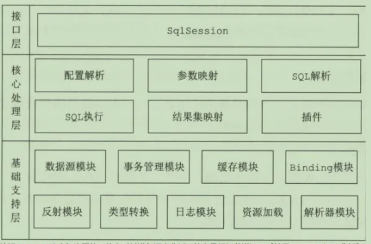
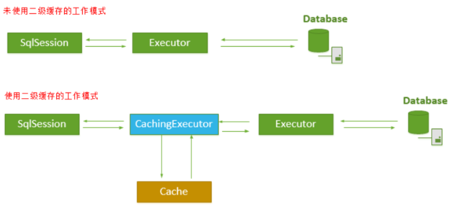
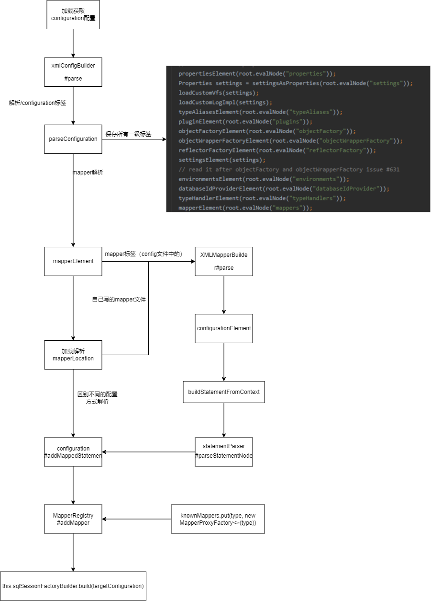

## 整体架构

Mybatis的整体架构分为三层：基础支持层、核心处理层和接口层。



[Mybatis源码结构](MyBatis源码结构.xmind)

# 注解

## @Arg

用于为构造函数参数指定映射定义的注释：

```java
	@Select("select * from mk_user")
	@ConstructorArgs(value = {
			@Arg(column = "id", javaType = Integer.class),
			@Arg(column = "name", javaType = String.class),
			@Arg(column = "gender", javaType = Gender.class, typeHandler = EnumTypeHandler.class),
			@Arg(column = "id", javaType = List.class, select = "com.demo.mapper.RoleMapper.getRoleByUserId")
	})
	List<User> findAll2();
```

可以在@ConstructorArgs重复使用，这点在源码中可以看到：

```java
@Documented
@Retention(RetentionPolicy.RUNTIME)
@Target(ElementType.METHOD)
@Repeatable(ConstructorArgs.class)// @ConstructorArgs中重复使用
public @interface Arg {
```

## @ConstructorArgs

作为实体类的构造函数，结合上面的@Arg进行使用，构建实体类：

```java
@ConstructorArgs(value = {
    @Arg(column = "id", javaType = Integer.class),
    @Arg(column = "other", javaType = String.class),
    @Arg(column = "an_other", javaType = String.class),
    @Arg(column = "date", javaType = Date.class)})
@Select("select * from test")
List<Test> selectFull();
```

<span style="color:red">实体类必须有这个入参的构造函数。</span>

## @AutomapConstructor

用于自动映射的构造函数的标记批注。


## @Case

结合@TypeDiscriminatort条件映射的注解，作为条件选择的注解：

```java
@TypeDiscriminator(column = "type",javaType = String.class,
                   cases = {
                       @Case(value = "1", type = CatTest.class,results = {@Result(property = "catTest",column = "cat_test")}),
                       @Case(value = "2", type = DogTest.class,results = {@Result(property = "dogTest",column = "dog_test")})})
@Select("SELECT id, type, other, date,cat_test, dog_test FROM test")
List<Test> selectFull2();
```

## @TypeDiscriminator

分组映射的注解，与@Case一起使用。

## @CacheNamespace

指定在命名空间上使用缓存的注释，作用于mapper接口上面，是用来实现二级缓存的。

```java
@CacheNamespace
public interface TestMapper {

    /**
     * xml定义查询
     *
     * @param test
     * @return
     */
    List<Test> selectList(Test test);
```

配置文件需要开启缓存：

```xml
<setting name="cacheEnabled" value="true"/>
```

配置文件和接口注释配合使用时，需要在xml配置文件中配置<cache>属性， 同时在接口中修改注释为@CacheNamespaceRef。

## @CacheNamespaceRef

引用缓存注解，只有两个属性vlaue和name，都需要指定。Java里面没有指针，但是Java里面有引用，CacheNamespaceRef就是一个引用。CacheNamespaceRef当做CacheNamespace的短链接、快捷键，它是CacheNamespace的引用。CacheNamespaceRef的作用：

我们知道，MyBatis分为一级缓存和二级缓存。一级缓存是会话（session）级别的，二级缓存是应用（application）级别的。但是，MyBatis并不是简单地对整个Application就只有一个Cache缓存对象，它将缓存划分的更细，即是Mapper级别的，即每一个Mapper都可以拥有一个Cache对象，具体如下： 

1. 为每一个Mapper分配一个Cache缓存对象使用<cache>节点配置或者 @CacheNamespace注解 ）；
2. 多个Mapper共用一个Cache缓存对象（使用<cache-ref>节点配置或者本文所提到的@CacheNamespaceRef注解）；

Mybatis 二级缓存示意图：

## @MapKey

指定键值的属性名（或列名）作为map的key值，实体类作为value：

```
@MapKey("id")
@Select("select * from test")
Map<Integer,Test> selectMapKey();
```

## @One

指定用于检索单个对象的嵌套语句的注释（结合Result使用）。

```java
@Documented
@Retention(RetentionPolicy.RUNTIME)
@Target({})
public @interface One {
  /**
   * 返回字段前缀
   *
   * @return the columnPrefix.
   *
   * @since 3.5.5
   */
  String columnPrefix() default "";
  /**
   * 返回用于映射单个对象的结果映射id。
   *
   * @return the result map id
   *
   * @since 3.5.5
   */
  String resultMap() default "";
  /**
   * 返回检索单个对象的语句id。
   *
   * @return the statement id
   */
  String select() default "";
  /**
   * 返回嵌套语句的获取策略。
   *
   * @return the fetch strategy
   */
  FetchType fetchType() default FetchType.DEFAULT;
}
```

## @Many

指定用于检索集合的嵌套语句的注释。

```java
@Result(property = "roleInfoList",column = "user_id", many = @Many(select = "com.pjb.mapper.UserMapper.getRoleList", fetchType = FetchType.LAZY))
})
public UserInfo getUserAndRolesInfo(@Param("userId")int userId);
```

具体属性与@One一样，结合Result使用。

## @Result

返回结果集属性映射。

```java
public @interface Result {
  /**
   * 是否是id字段
   *
   * @return {@code true} if id column; {@code false} if otherwise
   */
  boolean id() default false;

  /**
   * 数据库字段名
   *
   * @return the column name(or column label)
   */
  String column() default "";

  /**
   * 实体类属性名
   *
   * @return the property name
   */
  String property() default "";

  /**
   * 实体类java类型
   *
   * @return the java type
   */
  Class<?> javaType() default void.class;

  /**
   * 数据库类型
   *
   * @return the jdbc type
   */
  JdbcType jdbcType() default JdbcType.UNDEFINED;

  /**
   * 使用那种类型控制器
   *
   * @return the {@link TypeHandler} type
   */
  Class<? extends TypeHandler> typeHandler() default UnknownTypeHandler.class;

  /**
   * 子查询一对一
   *
   * @return the mapping definition for single relationship
   */
  One one() default @One;

  /**
   * 子查询一对多
   *
   * @return the mapping definition for collection relationship
   */
  Many many() default @Many;
}
```

## @Results

对属性的映射定义进行分组的注释，内部可以包含多个Result。

## @ResultMap

结合注释sql一起使用，指定返回结果集属性映射的map的id。

## @Select

用于填写sql的注释，@Select注解的目的是为了取代xml中的select标签，只作用于方法上面。普通的字符串值，只能实现变量的替换功能，如下所示：

```java
@Select("SELECT id, type, other, date FROM test where id = #{id}")
Test selectById(Long id);
```

实现复杂的逻辑判断，则需要使用`<script></script>`标签，如下所示：

```java
@Select("<script> SELECT id, type, other, date FROM test where id = #{id}<when test='address !=null'> and address = #{address} </when> </script>")
Test selectById(Long id);
```

<script></script> 标签并非是@Select注解专用的，其他的注解，例如@Insert，@Update等等，都可以使用的。

@Update、@Delete、@Insert类似。

# Mybatis初始化

在Mybatis初始化过程中，大致会有以下几个步骤：

1. 创建Configuration全局配置文件，会往typeAliasesPackage别名注册中心添加Mybatis需要用到的类，并设置默认的语言驱动为XMLLanguageDriver；
2. 加载Mybatis-config配置文件，Mapper接口中的注解信息和XML映射文件，解析后的配置信息会设置进Configuration里；
3. 构建DefaultSqlSessionFactory对象，通过这个对象可以创建DefaultSqlSession对象。DefaultSqlSession是Mybatis中SqlSession默认实现类。

## 初始化Configuration配置

结合spring的mybatis配置文件选项汇总：

```java
/**
 * MyBatis的配置项总汇
 *
 * @author Eddú Meléndez
 * @author Kazuki Shimizu
 */
// 前缀
@ConfigurationProperties(prefix = MybatisProperties.MYBATIS_PREFIX)
public class MybatisProperties {

  public static final String MYBATIS_PREFIX = "mybatis";

  private static final ResourcePatternResolver resourceResolver = new PathMatchingResourcePatternResolver();

  /**
   * 本地MyBatis的xml配置文件位置
   */
  private String configLocation;

  /**
   * MyBatis的mapper的mapper文件位置
   */
  private String[] mapperLocations;

  /**
   * 用于搜索类型别名的包。（包分隔符为“，；\t\t”）
   */
  private String typeAliasesPackage;

  /**
   * 用于筛选类型别名的超级类。如果未指定，MyBatis会将从typeAliasesPackage中搜索的所有类作为类型别名处
   * 理。
   */
  private Class<?> typeAliasesSuperType;

  /**
   * 要搜索类型处理程序的包。（包分隔符为“，；\t\t”）
   */
  private String typeHandlersPackage;

  /**
   * 指示是否执行MyBatis xml配置文件的状态检查。
   */
  private boolean checkConfigLocation = false;

  /**
   * sql执行模式（SIMPLE, REUSE, BATCH）。
   */
  private ExecutorType executorType;

  /**
   * 默认脚本语言驱动程序类。（与mybatis spring 2.0.2+一起使用时可用）
   */
  private Class<? extends LanguageDriver> defaultScriptingLanguageDriver;

  /**
   * MyBatis外部配置properties文件
   */
  private Properties configurationProperties;

  /**
   * 用于自定义默认设置的配置对象。如果指定了configLocation，则此属性为未使用。
   */
  private CoreConfiguration configuration;

 /**
   * Mybatis总配置信息类
   *
   * @since 3.0.0
   */
  public static class CoreConfiguration {

    /**
     * 允许在嵌套语句中使用分页（RowBounds）。如果允许使用则设置为 false。
     */
    private Boolean safeRowBoundsEnabled;

    /**
     * 允许在嵌套语句中使用分页（ResultHandler）。如果允许使用则设置为 false。
     */
    private Boolean safeResultHandlerEnabled;

    /**
     * 是否开启自动驼峰命名规则（camel case）映射，即从经典数据库列名 A_COLUMN 到经典 Java 属性名 aColumn 的类似映射。
     */
    private Boolean mapUnderscoreToCamelCase;

    /**
      * 当开启时，任何方法的调用都会加载该对象的所有属性。 否则，每个属性会按需加载（参考 lazyLoadTriggerMethods)。
      * 默认为false （在 3.4.1 及之前的版本默认值为 true）
     */
    private Boolean aggressiveLazyLoading;

    /**
     * 是否允许单一语句返回多结果集（需要驱动支持）。默认为true。
     */
    private Boolean multipleResultSetsEnabled;

    /**
     * 允许 JDBC 支持自动生成主键。
     */
    private Boolean useGeneratedKeys;

    /**
     * 使用列标签代替列名。不同的驱动在这方面会有不同的表现，具体可参考相关驱动文档或通过测试这两种不同的模式来观察所用驱动的结果。
     *<p>
     *isUseColumnLabel，默认为true。根据Javadoc，这个ColumnLabel就是AS后的那个名字，如果没有AS的话，就是获取的原生的字段名
     * </p>
     * 默认为true。
     */
    private Boolean useColumnLabel;

    /**
     * 全局地开启或关闭配置文件中的所有映射器已经配置的任何缓存。默认开启
     */
    private Boolean cacheEnabled;

    /**
     * 指定当结果集中值为 null 的时候是否调用映射对象的 setter（map 对象时为 put）方法，
   	 * 这在依赖于 Map.keySet() 或 null 值初始化的时候比较有用。注意基本类型（int、boolean 等）是不能设置成 null 的。
     */
    private Boolean callSettersOnNulls;

    /**
     * 允许使用构造函数的参数名作为语句参数名称。
     * 为了使用该特性，你的项目必须采用 Java 8 编译。
     */
    private Boolean useActualParamName;

    /**
     * 当返回行的所有列都是空时，MyBatis默认返回 null。
     * 当开启这个设置时，MyBatis会返回一个空实例。 请注意，它也适用于嵌套的结果集 （如集合或关联）。（新增于 3.4.2）
     */
    private Boolean returnInstanceForEmptyRow;

    /**
     * 从SQL中删除多余的空白字符。注意，这也会影响SQL中的文本字符串。
     * 
     */
    private Boolean shrinkWhitespacesInSql;

    /**
     * 指定“foreach”标记上“nullable”属性的默认值。默认值为false。
     */
    private Boolean nullableOnForEach;

    /**
     * 应用构造函数自动映射时，参数名称用于搜索要映射的列，而不是依赖于*列顺序。默认值为false。
     */
    private Boolean argNameBasedConstructorAutoMapping;

    /**
     * 全局启用或禁用延迟加载。启用后，所有关系都将延迟加载。通过使用fetchType属性，可以为特定关系替换此	 * 值。默认值为False。
     */
    private Boolean lazyLoadingEnabled;

    /**
     * 设置驱动程序等待数据库响应的秒数。
     */
    private Integer defaultStatementTimeout;

    /**
     * 为驱动程序设置一个提示，以控制返回结果的获取大小。查询设置可以覆盖此参数值。
     */
    private Integer defaultFetchSize;

    /**
     * MyBatis使用本地缓存来防止循环引用并加快重复的嵌套查询。
     * 默认情况下（SESSION），缓存会话期间执行的所有查询。
     * 如果localCacheScope=STATEMENT本地会话将仅用于语句执行，则不会在对同一SqlSession的两个不同调用
     * 之间共享数据。默认值为SESSION。
     */
    private LocalCacheScope localCacheScope;

    /**
     * 当没有为参数提供特定的JDBC类型时，为空值指定JDBC类型。
     * 一些驱动程序需要指定列JDBC类型，但其他驱动程序使用NULL、VARCHAR或OTHER等泛型值。
     * 默认值为OTHER。
     */
    private JdbcType jdbcTypeForNull;

    /**
     * 指定在忽略每语句设置时的滚动策略。
     */
    private ResultSetType defaultResultSetType;

    /**
     * 配置默认执行器。SIMPLE执行器没有做任何特殊的事情。REUSE执行器重用准备好的语句。
	 * BATCH执行器重用语句和批处理更新。默认值为SIMPLE。
     */
    private ExecutorType defaultExecutorType;

    /**
     * 指定MyBatis是否以及如何自动将列映射到字段。
     * NONE禁用自动映射。PARTIAL将仅自动映射内部未定义嵌套结果映射的结果。
     * FULL将自动映射任何复杂度的结果映射（包含嵌套或其他）。默认值为PARTIAL。
     */
    private AutoMappingBehavior autoMappingBehavior;

    /**
     * 指定检测到自动映射目标的未知列（或未知属性类型）时的行为。
     * 默认值为NONE。
     */
    private AutoMappingUnknownColumnBehavior autoMappingUnknownColumnBehavior;

    /**
     * 指定MyBatis将添加到记录器名称的前缀字符串。
     */
    private String logPrefix;

    /**
     * 指定哪个Object的方法触发延迟加载。默认值为[equals，clone，hashCode，toString]。
     */
    private Set<String> lazyLoadTriggerMethods;

    /**
     * 指定MyBatis应使用的日志记录实现。如果不存在此设置，则记录实现将自动发现。
     * 
     */
    private Class<? extends Log> logImpl;

    /**
     * 指定VFS实现。
     */
    private Class<? extends VFS> vfsImpl;

    /**
     * 指定保存提供程序方法的sql提供程序类。当省略这些属性时，此类应用于sql提供程序注释（例如@SelectProvider）上的类型（或值）属性。
     */
    private Class<?> defaultSqlProviderType;

    /**
     * 指定默认情况下用于枚举的TypeHandler。
     */
    Class<? extends TypeHandler> defaultEnumTypeHandler;

    /**
     * 指定提供Configuration实例的类。返回的Configuration实例用于加载反序列化对象的惰性properties。
     * 此类必须具有具有签名静态配置的方法*getConfiguration（）。
     */
    private Class<?> configurationFactory;

    /**
     * 指定任何配置变量。
     */
    private Properties variables;

   /**
     * 指定任何配置变量（3.0.0后添加新方法）。
     */
 void applyTo(Configuration target) {
      PropertyMapper mapper = PropertyMapper.get().alwaysApplyingWhenNonNull();
      mapper.from(getSafeRowBoundsEnabled()).to(target::setSafeRowBoundsEnabled);
      mapper.from(getSafeResultHandlerEnabled()).to(target::setSafeResultHandlerEnabled);
      mapper.from(getMapUnderscoreToCamelCase()).to(target::setMapUnderscoreToCamelCase);
      mapper.from(getAggressiveLazyLoading()).to(target::setAggressiveLazyLoading);
      mapper.from(getMultipleResultSetsEnabled()).to(target::setMultipleResultSetsEnabled);
      mapper.from(getUseGeneratedKeys()).to(target::setUseGeneratedKeys);
      mapper.from(getUseColumnLabel()).to(target::setUseColumnLabel);
      mapper.from(getCacheEnabled()).to(target::setCacheEnabled);
      mapper.from(getCallSettersOnNulls()).to(target::setCallSettersOnNulls);
      mapper.from(getUseActualParamName()).to(target::setUseActualParamName);
      mapper.from(getReturnInstanceForEmptyRow()).to(target::setReturnInstanceForEmptyRow);
      mapper.from(getShrinkWhitespacesInSql()).to(target::setShrinkWhitespacesInSql);
      mapper.from(getNullableOnForEach()).to(target::setNullableOnForEach);
      mapper.from(getArgNameBasedConstructorAutoMapping()).to(target::setArgNameBasedConstructorAutoMapping);
      mapper.from(getLazyLoadingEnabled()).to(target::setLazyLoadingEnabled);
      mapper.from(getLogPrefix()).to(target::setLogPrefix);
      mapper.from(getLazyLoadTriggerMethods()).to(target::setLazyLoadTriggerMethods);
      mapper.from(getDefaultStatementTimeout()).to(target::setDefaultStatementTimeout);
      mapper.from(getDefaultFetchSize()).to(target::setDefaultFetchSize);
      mapper.from(getLocalCacheScope()).to(target::setLocalCacheScope);
      mapper.from(getJdbcTypeForNull()).to(target::setJdbcTypeForNull);
      mapper.from(getDefaultResultSetType()).to(target::setDefaultResultSetType);
      mapper.from(getDefaultExecutorType()).to(target::setDefaultExecutorType);
      mapper.from(getAutoMappingBehavior()).to(target::setAutoMappingBehavior);
      mapper.from(getAutoMappingUnknownColumnBehavior()).to(target::setAutoMappingUnknownColumnBehavior);
      mapper.from(getVariables()).to(target::setVariables);
      mapper.from(getLogImpl()).to(target::setLogImpl);
      mapper.from(getVfsImpl()).to(target::setVfsImpl);
      mapper.from(getDefaultSqlProviderType()).to(target::setDefaultSqlProviderType);
      mapper.from(getConfigurationFactory()).to(target::setConfigurationFactory);
      mapper.from(getDefaultEnumTypeHandler()).to(target::setDefaultEnumTypeHandler);
    }
  }
}
```

> Currently, we use the `org.apache.ibatis.session.Configuration` as the nested configuration properties in `MybatisPropertes`. But this coding style has not been recommended as Spring Boot development teams. Therefore we rewrite a recommended coding style.
>
> 目前，我们使用org.apache.ibatis.session.Configuration作为MybatisPropertes中的嵌套配置财产。但是这种编码风格并没有被推荐给Spring Boot开发团队。因此，我们重写了推荐的编码样式。

结合spring-boot进行装配初始化。spring boot的自动装配原理是在自动装配包的META-INF下创建spring.factories文件，在文件里面配置EnableAutoConfiguration的配置类全名即可实现自动装配，以下是mybatis-spring-boot-autoconfigure包的spring.factories文件：

```properties
# Auto Configure (3.0.0之后已弃用)
org.springframework.boot.autoconfigure.EnableAutoConfiguration=\
org.mybatis.spring.boot.autoconfigure.MybatisLanguageDriverAutoConfiguration,\
org.mybatis.spring.boot.autoconfigure.MybatisAutoConfiguration

# Depends On Database Initialization Detectors (2.3.0之后使用)
org.springframework.boot.sql.init.dependency.DependsOnDatabaseInitializationDetector=\
org.mybatis.spring.boot.autoconfigure.MybatisDependsOnDatabaseInitializationDetector
```

更改初始化配置的原因为[^p1]：

> Using `spring.factories` to find auto-configuration classes is causing problems with our native work. We initially used it because the code was already available, but we want to offer an alternative in 2.7 and stop using spring.factories for auto-configuration in 3.0.
>
> 使用spring.factories查找自动配置类会导致本机工作出现问题。我们最初使用它是因为代码已经可用，但我们希望在2.7中提供一个替代方案，并在3.0中停止使用spring.factories进行自动配置。

### MybatisLanguageDriverAutoConfiguration

自动加载额外的LanguageDriver配置:

- FreeMarkerLanguageDriver
- VelocityLanguageDriver

#### LanguageDriver

LanguageDriver主要用于构造SqlSource和ParameterHandler，从LanguageDriver在Mybatis中调用链路来看，Configuration#newParameterHandler通过调用LanguageDriver#createParameterHandler完成构建ParameterHandler，通过调用LanguageDriver#createSqlSource来完成构建SqlSource。

```java
/**
 * 语言驱动
 */
public interface LanguageDriver {

  /**
   * Creates a {@link ParameterHandler} that passes the actual parameters to the the JDBC statement.
   * 创建 {@link ParameterHandler} 通过JDBC的实际参数
   * @param mappedStatement The mapped statement that is being executed 映射的正在执行语句
   * @param parameterObject The input parameter object (can be null) 输入的参数对象（可以为空）
   * @param boundSql The resulting SQL once the dynamic language has been executed. 生成的SQL，一旦动态语言被执行
   * @return
   * @author Frank D. Martinez [mnesarco]
   * @see DefaultParameterHandler
   */
  ParameterHandler createParameterHandler(MappedStatement mappedStatement, Object parameterObject, BoundSql boundSql);

  /**
   * Creates an {@link SqlSource} that will hold the statement read from a mapper xml file.
   * It is called during startup, when the mapped statement is read from a class or an xml file.
   * 创建一个{@link SqlSource} 读取映射XML文件
   * @param configuration The MyBatis configuration MyBatis配置
   * @param script XNode parsed from a XML file
   * @param parameterType input parameter type got from a mapper method or specified in the parameterType xml attribute. Can be null.
   *                      输入参数类型从一个xml类型映射器参数中指定的方法或属性。可以为空。;
   * @return
   */
  SqlSource createSqlSource(Configuration configuration, XNode script, Class<?> parameterType);

  /**
   * Creates an {@link SqlSource} that will hold the statement read from an annotation.
   * It is called during startup, when the mapped statement is read from a class or an xml file.
   * 创建一个{@link SqlSource} 从一个字解里，它在启动期间,当映射语句从一个类或读取一个xml文件被调用。;
   * @param configuration The MyBatis configuration
   * @param script The content of the annotation
   * @param parameterType input parameter type got from a mapper method or specified in the parameterType xml attribute. Can be null.
   *                      输入参数类型从一个xml类型映射器参数中指定的方法或属性。可以为空。;
   * @return
   */
  SqlSource createSqlSource(Configuration configuration, String script, Class<?> parameterType);

}
```

#### XMLLanguageDriver

```java
/**
 * XML语言驱动
 * <p>
 *     Mybatis默认XML驱动类为XMLLanguageDriver，其主要作用于解析select|update|insert|delete节点为完整的SQL语句。
 * </p>
 * @author Eduardo Macarron
 */
public class XMLLanguageDriver implements LanguageDriver {
    @Override
  public ParameterHandler createParameterHandler(MappedStatement mappedStatement, Object parameterObject, BoundSql boundSql) {
    return new DefaultParameterHandler(mappedStatement, parameterObject, boundSql);
  }

  @Override
  public SqlSource createSqlSource(Configuration configuration, XNode script, Class<?> parameterType) {
    XMLScriptBuilder builder = new XMLScriptBuilder(configuration, script, parameterType);
    /***
     *  当sql中包含有${}时，就认为是动态SQL
     *       或者 当DML标签存在动态SQL标签名，如&lt;if&gt;,&lt;trim&gt;等，就认为是动态SQL
     *  ，如果是动态返回 {@link DynamicSqlSource} ，否则 {@link RawSqlSource}
     */
    return builder.parseScriptNode();
  }
  @Override
  public SqlSource createSqlSource(Configuration configuration, String script, Class<?> parameterType) {
    // issue #3 此处兼容XML方式的解析，条件以<script>为头结点
    if (script.startsWith("<script>")) {
      XPathParser parser = new XPathParser(script, false, configuration.getVariables(), new XMLMapperEntityResolver());
      return createSqlSource(configuration, parser.evalNode("/script"), parameterType);
    } else {
      // issue #127
      /**
       * 解析Configuration#variable变量,将有${...}形式的字符串转换成对应字符串,
       *    eg:  '${first_name},${initial},${last_name}' => 'James,T,Kirk'
       */
      script = PropertyParser.parse(script, configuration.getVariables());
      TextSqlNode textSqlNode = new TextSqlNode(script);
      //根据TextSqlNode的内部属性isDynamic来进行解析帮助类的分配
      if (textSqlNode.isDynamic()) {
        return new DynamicSqlSource(configuration, textSqlNode);
      } else {
        return new RawSqlSource(configuration, script, parameterType);
      }
    }
  }
```

#### XMLScriptBuilder

```java
/**
 * XML脚本构建器
 * @author Clinton Begin
 */
public class XMLScriptBuilder extends BaseBuilder {

  /**
   * DML标签
   */
  private final XNode context;

  /**
   * 是否是动态SQL脚本.
   * <ol style='margin-top:0px'>
   *     <li>当sql中包含有${}时，就认为是动态SQL</li>
   *     <li>当DML标签存在动态SQL标签名，如&lt;if&gt;,&lt;trim&gt;等，就认为是动态SQL</li>
   * </ol>
   */
  private boolean isDynamic;

  /**
   * DML标签的参数类型
   */
  private final Class<?> parameterType;
   /**
   *
   * @param configuration mybatis全局配置
   * @param context DML标签
   */
  public XMLScriptBuilder(Configuration configuration, XNode context) {
    this(configuration, context, null);
  }

  /**
   *
   * @param configuration mybatis全局配置
   * @param context DML标签
   * @param parameterType 参数类型
   */
  public XMLScriptBuilder(Configuration configuration, XNode context, Class<?> parameterType) {
    super(configuration);
    this.context = context;
    this.parameterType = parameterType;
    initNodeHandlerMap();
  }
  
  /**
   * 将所有的动态SQL标签处理器添加到 {@link #nodeHandlerMap}
   */
  private void initNodeHandlerMap() {
    nodeHandlerMap.put("trim", new TrimHandler());
    nodeHandlerMap.put("where", new WhereHandler());
    nodeHandlerMap.put("set", new SetHandler());
    nodeHandlerMap.put("foreach", new ForEachHandler());
    nodeHandlerMap.put("if", new IfHandler());
    nodeHandlerMap.put("choose", new ChooseHandler());
    nodeHandlerMap.put("when", new IfHandler());
    nodeHandlerMap.put("otherwise", new OtherwiseHandler());
    nodeHandlerMap.put("bind", new BindHandler());
  }
    /**
   * 解析脚本标签节点
   * @return
   *  当sql中包含有${}时，就认为是动态SQL
   *      或者 当DML标签存在动态SQL标签名，如&lt;if&gt;,&lt;trim&gt;等，就认为是动态SQL
   * ，如果是动态返回 {@link DynamicSqlSource} ，否则 {@link RawSqlSource}
   */
  public SqlSource parseScriptNode() {
    //解析DML标签下的子节点，封装成MixedSqlNode
    MixedSqlNode rootSqlNode = parseDynamicTags(context);
    SqlSource sqlSource;
    if (isDynamic) {
      //只创建DynamicSqlSource对象。完整可执行的sql，需要在调用getBoundSql(Parameter)方法时才能组装完成。
      sqlSource = new DynamicSqlSource(configuration, rootSqlNode);
    } else {
      /**
       * 调用 SqlSourceBuilder类将"#{xxx}“ 替换为占位符”?"，并绑定ParameterMapping，
       * 最后返回的RawSqlSource中持有一个由SqlSourceBuilder构建的SqlSource对象。
       */
      sqlSource = new RawSqlSource(configuration, rootSqlNode, parameterType);
    }
    return sqlSource;
  }
 /**
   * 解析动态SQL标签，对 {@code node} 的子节点和文本节点进行解析，
   *  这里会检测是否属于动态就会对isDynamic设置对应的值
   * @param node DML标签或者是动态SQL标签
   * @return 混合着 {@code node} 的子节点的MixedSqlNode实例
   */
  protected MixedSqlNode parseDynamicTags(XNode node) {
    List<SqlNode> contents = new ArrayList<>();
    NodeList children = node.getNode().getChildNodes();
    for (int i = 0; i < children.getLength(); i++) {
      /**
       * XNode.newXNode(Node node)：新建一个XNode,XNode只是mybatis对Node实例的封装，用于方便操作。
       * 并不是添加node节点的功能
       */
      XNode child = node.newXNode(children.item(i));
      /**
       * Node.CDATA_SECTION_NODE:代表文档中的 CDATA 部（不会由解析器解析的文本）
       * Node.TEXT_NODE:代表元素或属性中的文本内容
       */
      if (child.getNode().getNodeType() == Node.CDATA_SECTION_NODE || child.getNode().getNodeType() == Node.TEXT_NODE) {
        //获取文本节点的文本内容
        String data = child.getStringBody("");
        //文本SQL节点。用传入的实际参数对象中的属性值对${}进行直接替换，并且不会进行任何检查！
        TextSqlNode textSqlNode = new TextSqlNode(data);
        //当sql中包含有${}时，就认为是动态SQL.下面就是根据是否是动态SQL来添加对应SqlNode类型
        if (textSqlNode.isDynamic()) {
          contents.add(textSqlNode);
          isDynamic = true;
        } else {
          //StaticTextSqlNode:静态文本SQL节点，其apply方法使得只是将存储的文本内容直接添加到DynamicContext对象中
          contents.add(new StaticTextSqlNode(data));
        }
      } else if (child.getNode().getNodeType() == Node.ELEMENT_NODE) { // issue #628 Node.ELEMENT_NODE:代表元素
        String nodeName = child.getNode().getNodeName();
        //根据标签名找到对应的NodeHandler
        NodeHandler handler = nodeHandlerMap.get(nodeName);
        if (handler == null) {
          throw new BuilderException("Unknown element <" + nodeName + "> in SQL statement.");
        }
        handler.handleNode(child, contents);
        isDynamic = true;
      }
    }
    return new MixedSqlNode(contents);
  }
    
  /**
   * 标签节点处理器,解析标签节点，封装到对应sqlNode中
   */
  private interface NodeHandler {
    /**
     * 解析标签节点，封装到对应sqlNode中，并将sqlNode添加到 {@code targetContents}
     * @param nodeToHandle 动态SQL标签名,如&lt;if&gt;,&lt;trim&gt;等
     * @param targetContents 解析完 {@code nodeToHandle}SqlNode后，
     */
    void handleNode(XNode nodeToHandle, List<SqlNode> targetContents);
  }

  /**
   * &lt;bind&gt;处理器:元素可以从 OGNL 表达式中创建一个变量并将其绑定到上下文
   * <p>如：</p>
   * <p>
   *     &lt;bind name="pattern" value="'%' + _parameter.getTitle() + '%'" /&gt;
   * </p>
   */
  private class BindHandler implements NodeHandler {
    public BindHandler() {
      // Prevent Synthetic Access
    }
      
    @Override
    public void handleNode(XNode nodeToHandle, List<SqlNode> targetContents) {
      //获取bind标签的name属性值
      final String name = nodeToHandle.getStringAttribute("name");
      //获取bind标签的value属性值
      final String expression = nodeToHandle.getStringAttribute("value");
      //OGNL解析
      final VarDeclSqlNode node = new VarDeclSqlNode(name, expression);
      targetContents.add(node);
    }
  }
  /**
   * trim标签处理器
   */
  private class TrimHandler implements NodeHandler {
    public TrimHandler() {
      // Prevent Synthetic Access
    }
      
    @Override
    public void handleNode(XNode nodeToHandle, List<SqlNode> targetContents) {
      //解析trim标签下的字节点，封装成MixedSqlNode
      MixedSqlNode mixedSqlNode = parseDynamicTags(nodeToHandle);
      //获取trim标签的prefix属性，给sql语句拼接的前缀
      String prefix = nodeToHandle.getStringAttribute("prefix");
      /**
       * 获取trim标签的prefixOverrides属性
       * 去除sql语句前面的关键字或者字符，该关键字或者字符由prefixOverrides属性指定，
       * 假设该属性指定为"AND"，当sql语句的开头为"AND"，trim标签将会去除该"AND"
       */
      String prefixOverrides = nodeToHandle.getStringAttribute("prefixOverrides");
      //获取trim标签的suffix属性，给sql语句拼接的后缀
      String suffix = nodeToHandle.getStringAttribute("suffix");
      //获取trim标签的suffixOverride,去除sql语句后面的关键字或者字符，该关键字或者字符由suffixOverrides属性指定
      String suffixOverrides = nodeToHandle.getStringAttribute("suffixOverrides");
      //Trim标签的功能逻辑交给TrimSqlNode
      TrimSqlNode trim = new TrimSqlNode(configuration, mixedSqlNode, prefix, prefixOverrides, suffix, suffixOverrides);
      targetContents.add(trim);
    }
  }
 
  /**
   * where标签处理器
   */
  private class WhereHandler implements NodeHandler {
    public WhereHandler() {
      // Prevent Synthetic Access
    }

    @Override
    public void handleNode(XNode nodeToHandle, List<SqlNode> targetContents) {
      //解析where标签下的字节点，封装成MixedSqlNode
      MixedSqlNode mixedSqlNode = parseDynamicTags(nodeToHandle);
      //where标签的功能逻辑交给whereSqlNode处理
      WhereSqlNode where = new WhereSqlNode(configuration, mixedSqlNode);
      targetContents.add(where);
    }
  }

  /**
   * Set标签处理器
   */
  private class SetHandler implements NodeHandler {
    public SetHandler() {
      // Prevent Synthetic Access
    }

    @Override
    public void handleNode(XNode nodeToHandle, List<SqlNode> targetContents) {
      //解析set标签下的子节点，封装成MixedSqlNode
      MixedSqlNode mixedSqlNode = parseDynamicTags(nodeToHandle);
      //set标签的功能逻辑交给whereSqlNode处理
      SetSqlNode set = new SetSqlNode(configuration, mixedSqlNode);
      targetContents.add(set);
    }
  }

  /**
   * forEach标签接收处理器
   */
  private class ForEachHandler implements NodeHandler {
    public ForEachHandler() {
      // Prevent Synthetic Access
    }

    @Override
    public void handleNode(XNode nodeToHandle, List<SqlNode> targetContents) {
      ///解析forEach标签下的子节点，封装成MixedSqlNode
      MixedSqlNode mixedSqlNode = parseDynamicTags(nodeToHandle);
      //获取foreach标签的collection属性，循环的集合对象名
      String collection = nodeToHandle.getStringAttribute("collection");
      //获取foreach标签的item属性，集合对象的元素名
      String item = nodeToHandle.getStringAttribute("item");
      //获取foreach标签的index属性，在list和数组中,index是元素的序号，在map中，index是元素的key，该参数可选。
      String index = nodeToHandle.getStringAttribute("index");
      //获取foreach标签的open属性，foreach代码的开始符号，一般是(和close=")"合用。常用在in(),values()时。该参数可选。
      String open = nodeToHandle.getStringAttribute("open");
      //获取foreach标签的close属性,foreach代码的关闭符号，一般是)和open="("合用。常用在in(),values()时。该参数可选。
      String close = nodeToHandle.getStringAttribute("close");
      /**
       * 获取foreach标签的separator属性,元素之间的分隔符，例如在in()的时候，
       * separator=","会自动在元素中间用“,“隔开，避免手动输入逗号导致sql错误，如in(1,2,)这样。该参数可选
       */
      String separator = nodeToHandle.getStringAttribute("separator");
      ForEachSqlNode forEachSqlNode = new ForEachSqlNode(configuration, mixedSqlNode, collection, index, item, open, close, separator);
      targetContents.add(forEachSqlNode);
    }
  }

  /**
   * if标签接收处理器
   */
  private class IfHandler implements NodeHandler {
    public IfHandler() {
      // Prevent Synthetic Access
    }

    @Override
    public void handleNode(XNode nodeToHandle, List<SqlNode> targetContents) {
      //解析if标签下的子节点，封装成MixedSqlNode
      MixedSqlNode mixedSqlNode = parseDynamicTags(nodeToHandle);
      //获取if标签的test属性，ognl表达式
      String test = nodeToHandle.getStringAttribute("test");
      IfSqlNode ifSqlNode = new IfSqlNode(mixedSqlNode, test);
      targetContents.add(ifSqlNode);
    }
  }

  /**
   * otherwise标签，当 when 元素中的条件都不生效，就可以使用 otherwise 元素的默认文本。
   */
  private class OtherwiseHandler implements NodeHandler {
    public OtherwiseHandler() {
      // Prevent Synthetic Access
    }

    @Override
    public void handleNode(XNode nodeToHandle, List<SqlNode> targetContents) {
      //解析otherwise标签下的子节点，封装成MixedSqlNode
      MixedSqlNode mixedSqlNode = parseDynamicTags(nodeToHandle);
      /**
       * 因为otherwise标签的应用情况是由choose标签控制，而且应用otherwise标签不过是
       * 应用otherwise标签的所有子节点对应sqlNode，所有otherwise不需要对应的sqlNode
       */
      targetContents.add(mixedSqlNode);
    }
  }

  /**
   * choose标签是按顺序判断其内部when标签中的test条件出否成立，如果有一个成立，则 choose 结束。
   * 当 choose 中所有 when 的条件都不满则时，则执行 otherwise 中的sql。
   * 类似于Java 的 switch 语句，choose 为 switch，when 为 case，otherwise 则为 default。
   */
  private class ChooseHandler implements NodeHandler {
    public ChooseHandler() {
      // Prevent Synthetic Access
    }

    @Override
    public void handleNode(XNode nodeToHandle, List<SqlNode> targetContents) {
      List<SqlNode> whenSqlNodes = new ArrayList<>();
      List<SqlNode> otherwiseSqlNodes = new ArrayList<>();
      //接收处理when标签和otherwise标签
      handleWhenOtherwiseNodes(nodeToHandle, whenSqlNodes, otherwiseSqlNodes);
      //获取otherwise标签
      SqlNode defaultSqlNode = getDefaultSqlNode(otherwiseSqlNodes);
      ChooseSqlNode chooseSqlNode = new ChooseSqlNode(whenSqlNodes, defaultSqlNode);
      targetContents.add(chooseSqlNode);
    }

    /**
     * 接收处理when标签和otherwise标签
     * @param chooseSqlNode choose标签
     * @param ifSqlNodes when标签集合
     * @param defaultSqlNodes otherwise标签集合
     */
    private void handleWhenOtherwiseNodes(XNode chooseSqlNode, List<SqlNode> ifSqlNodes, List<SqlNode> defaultSqlNodes) {
      List<XNode> children = chooseSqlNode.getChildren();
      for (XNode child : children) {
        String nodeName = child.getNode().getNodeName();
        NodeHandler handler = nodeHandlerMap.get(nodeName);
        if (handler instanceof IfHandler) {//when标签的处理器是IfHandler
          //handleNode方法会将child添加到ifSqlNodes集合中
          handler.handleNode(child, ifSqlNodes);
        } else if (handler instanceof OtherwiseHandler) {//Otherwise标签
          //handleNode方法会将child添加到defaultSqlNodes集合中
          handler.handleNode(child, defaultSqlNodes);
        }
      }
    }

    /**
     * 获取otherwise标签
     * @param defaultSqlNodes otherwise标签集合
     * @return 返回集合的第一个元素， {@code defaultSqlNodes} 只能存在一个元素或者没有元素，
     *      超过一个都会抛出BuilderException
     */
    private SqlNode getDefaultSqlNode(List<SqlNode> defaultSqlNodes) {
      SqlNode defaultSqlNode = null;
      if (defaultSqlNodes.size() == 1) {
        defaultSqlNode = defaultSqlNodes.get(0);
      } else if (defaultSqlNodes.size() > 1) {
        throw new BuilderException("Too many default (otherwise) elements in choose statement.");
      }
      return defaultSqlNode;
    }
  }

}
```

#### RawLanguageDriver

```java
/**
 * 这是一个简单的语言驱动，只能针对静态SQL的处里，如果出现动态SQL标签会抛出异常
 * As of 3.2.4 the default XML language is able to identify static statements
 * and create a {@link RawSqlSource}. So there is no need to use RAW unless you
 * want to make sure that there is not any dynamic tag for any reason.
 * 默认XML语言是能够识别静态语句并创建一个{@link RawSqlSource}，所以没有需要使用原始的,除非你想确保没有任何动态标记任何理由。
 * @since 3.2.0
 * @author Eduardo Macarron
 */
public class RawLanguageDriver extends XMLLanguageDriver {

  @Override
  public SqlSource createSqlSource(Configuration configuration, XNode script, Class<?> parameterType) {
    SqlSource source = super.createSqlSource(configuration, script, parameterType);
    checkIsNotDynamic(source);
    return source;
  }
    
  @Override
  public SqlSource createSqlSource(Configuration configuration, String script, Class<?> parameterType) {
    SqlSource source = super.createSqlSource(configuration, script, parameterType);
    checkIsNotDynamic(source);
    return source;
  }

  private void checkIsNotDynamic(SqlSource source) {
    if (!RawSqlSource.class.equals(source.getClass())) {
      throw new BuilderException("Dynamic content is not allowed when using RAW language");
    }
  }

}
```

### MybatisAutoConfiguration

1. 首先是该Enable起作用是当前环境下存在SqlSessionFactory.class, SqlSessionFactoryBean.class这两个类，还记得之前分析mybatis和spring整合的，就是通过SqlSessionFactoryBean,这就表示需要引入mybatis-spring依赖，而SqlSessionFactory则是mybatis本身的依赖，即pom需要引入mybatis和mybatis-spring这两个依赖MybatisAutoConfiguration才会起作用。

~~~java
/**
  * Mybatis的自动配置提供了SqlSessionFactory和SqlSessionTemplate。
  * 如果MapperScan被使用，或者配置文件是被指定
  * 指定为属性时，将考虑这些属性，否则此自动配置将尝试注册映射器
  * 基于根自动配置包中或下的接口定义。
  */
@org.springframework.context.annotation.Configuration(proxyBeanMethods = false)
@ConditionalOnClass({ SqlSessionFactory.class, SqlSessionFactoryBean.class })
@ConditionalOnSingleCandidate(DataSource.class)
@EnableConfigurationProperties(MybatisProperties.class)
@AutoConfigureAfter({ DataSourceAutoConfiguration.class, MybatisLanguageDriverAutoConfiguration.class })
public class MybatisAutoConfiguration implements InitializingBean {

  private static final Logger logger = LoggerFactory.getLogger(MybatisAutoConfiguration.class);

  private final MybatisProperties properties;

  private final Interceptor[] interceptors;

  private final TypeHandler[] typeHandlers;

  private final LanguageDriver[] languageDrivers;

  private final ResourceLoader resourceLoader;

  private final DatabaseIdProvider databaseIdProvider;

  private final List<ConfigurationCustomizer> configurationCustomizers;

  private final List<SqlSessionFactoryBeanCustomizer> sqlSessionFactoryBeanCustomizers;
  
  ``````
~~~

自动配置所拥有的属性变量：

- MybatisProperties：Mybaits以及包括和spring相关的配置；
- interceptors：Mybatis拦截器；
- TypeHandler：Mybatis类型处理器；
- LanguageDriver：语言驱动解析接口；
- ResourceLoader：资源加载类；
- DatabaseIdProvider：数据厂商标识；
- configurationCustomizers：用户自定义配置列表；
- SqlSessionFactoryBeanCustomizer：自定义SqlSessionFactory；

~~~java
  ``````
  @Override
  public void afterPropertiesSet() {
      checkConfigFileExists();
  }
  // 检查是否有且存在本地配置文件
  private void checkConfigFileExists() {
      if (this.properties.isCheckConfigLocation() && StringUtils.hasText(this.properties.getConfigLocation())) {
          Resource resource = this.resourceLoader.getResource(this.properties.getConfigLocation());
          Assert.state(resource.exists(),
                         "Cannot find config location: " + resource + " (please add config file or check your Mybatis configuration)");
      }
  }
  ``````
~~~

2. 获取SqlSessionFactory，如果当前IOC容器没有SqlSessionFactory类型的bean，则这里会创建一个。通过SqlSessionFactoryBean创建SqlSessionFactory：

~~~java
``````
@Bean
@ConditionalOnMissingBean
public SqlSessionFactory sqlSessionFactory(DataSource dataSource) throws Exception {
  SqlSessionFactoryBean factory = new SqlSessionFactoryBean();
  factory.setDataSource(dataSource);
  // 添加vfs配置
  if (properties.getConfiguration() == null || properties.getConfiguration().getVfsImpl() == null) {
    factory.setVfs(SpringBootVFS.class);
  }
  // 查找是否存在本地配置
  if (StringUtils.hasText(this.properties.getConfigLocation())) { factory.setConfigLocation(this.resourceLoader.getResource(this.properties.getConfigLocation()));
  }
  applyConfiguration(factory);
  // 装配一些配置信息
  if (this.properties.getConfigurationProperties() != null) {
    factory.setConfigurationProperties(this.properties.getConfigurationProperties());
  }
  if (!ObjectUtils.isEmpty(this.interceptors)) {
    factory.setPlugins(this.interceptors);
  }
  if (this.databaseIdProvider != null) {
    factory.setDatabaseIdProvider(this.databaseIdProvider);
  }
  if (StringUtils.hasLength(this.properties.getTypeAliasesPackage())) {
    factory.setTypeAliasesPackage(this.properties.getTypeAliasesPackage());
  }
  if (this.properties.getTypeAliasesSuperType() != null) {
    factory.setTypeAliasesSuperType(this.properties.getTypeAliasesSuperType());
  }
  if (StringUtils.hasLength(this.properties.getTypeHandlersPackage())) {
    factory.setTypeHandlersPackage(this.properties.getTypeHandlersPackage());
  }
  if (!ObjectUtils.isEmpty(this.typeHandlers)) {
    factory.setTypeHandlers(this.typeHandlers);
  }
  Resource[] mapperLocations = this.properties.resolveMapperLocations();
  if (!ObjectUtils.isEmpty(mapperLocations)) {
    factory.setMapperLocations(mapperLocations);
  }
  Set<String> factoryPropertyNames = Stream
      .of(new BeanWrapperImpl(SqlSessionFactoryBean.class).getPropertyDescriptors()).map(PropertyDescriptor::getName)
      .collect(Collectors.toSet());
  Class<? extends LanguageDriver> defaultLanguageDriver = this.properties.getDefaultScriptingLanguageDriver();
  if (factoryPropertyNames.contains("scriptingLanguageDrivers") && !ObjectUtils.isEmpty(this.languageDrivers)) {
    // Need to mybatis-spring 2.0.2+
    factory.setScriptingLanguageDrivers(this.languageDrivers);
    if (defaultLanguageDriver == null && this.languageDrivers.length == 1) {
      defaultLanguageDriver = this.languageDrivers[0].getClass();
    }
  }
  if (factoryPropertyNames.contains("defaultScriptingLanguageDriver")) {
    // mybatis-spring版本2.0.2以上
    factory.setDefaultScriptingLanguageDriver(defaultLanguageDriver);
  }
  applySqlSessionFactoryBeanCustomizers(factory);
  // 生成SqlSessionFactory工厂类
  return factory.getObject();
}
// 自带内部配置类和配置类的填充
private void applyConfiguration(SqlSessionFactoryBean factory) {
    MybatisProperties.CoreConfiguration coreConfiguration = this.properties.getConfiguration();
    Configuration configuration = null;
    if (coreConfiguration != null || !StringUtils.hasText(this.properties.getConfigLocation())) {
        configuration = new Configuration();
    }
    if (configuration != null && coreConfiguration != null) {
        coreConfiguration.applyTo(configuration);
    }
    if (configuration != null && !CollectionUtils.isEmpty(this.configurationCustomizers)) {
        for (ConfigurationCustomizer customizer : this.configurationCustomizers) {
            customizer.customize(configuration);
        }
    }
    factory.setConfiguration(configuration);
}
// 自定义SqlSessionFactory的bean添加
private void applySqlSessionFactoryBeanCustomizers(SqlSessionFactoryBean factory) {
    if (!CollectionUtils.isEmpty(this.sqlSessionFactoryBeanCustomizers)) {
        for (SqlSessionFactoryBeanCustomizer customizer : this.sqlSessionFactoryBeanCustomizers) {
            customizer.customize(factory);
    }
}
``````
~~~

3. 创建SqlSessionTemplate，如果当前IOC容器没有SqlSessionTemplate类型bean，则这里会创建一个：


```java
@Bean
@ConditionalOnMissingBean
public SqlSessionTemplate sqlSessionTemplate(SqlSessionFactory sqlSessionFactory) {
  ExecutorType executorType = this.properties.getExecutorType();
  if (executorType != null) {
    return new SqlSessionTemplate(sqlSessionFactory, executorType);
  } else {
    return new SqlSessionTemplate(sqlSessionFactory);
  }
}
```

4. 如果当前IOC容器没有MapperFactoryBean.class, MapperScannerConfigurer.class这两个bean，则会通过：

```java
  /**
   * 这将只扫描与Spring Boot相同的基本包。 {@link org.mybatis.spring.annotation.MapperScan}但这将使键入的映射器能够正常工作，
   * 开箱即用，类似于使用Spring Data JPA存储库。
   */
  public static class AutoConfiguredMapperScannerRegistrar
      implements BeanFactoryAware, EnvironmentAware, ImportBeanDefinitionRegistrar {

```

通过`AutoConfiguredMapperScannerRegistrar`导入，其通过实现`registerBeanDefinitions`方法，将`MapperScannerConfigurer`这个类注入到了IOC容器中。

#### SqlSessionFactoryBean

```java
/**
 * {@inheritDoc}
 */
@Override
public SqlSessionFactory getObject() throws Exception {
  if (this.sqlSessionFactory == null) {
    afterPropertiesSet();
  }

  return this.sqlSessionFactory;
}

@Override
public void afterPropertiesSet() throws Exception {
    notNull(dataSource, "Property 'dataSource' is required");
    notNull(sqlSessionFactoryBuilder, "Property 'sqlSessionFactoryBuilder' is required");
    state((configuration == null && configLocation == null) || !(configuration != null && configLocation != null),
          "Property 'configuration' and 'configLocation' can not specified with together");

    this.sqlSessionFactory = buildSqlSessionFactory();
}
```

buildSqlSessionFactory()方法这里的核心目的就是将configurationProperties解析到Configuration对象中。

```java
/**
 * 构建SqlSessionFactory，使用标准的Mybatis XMLConfigBuilder接口构建。
 */
protected SqlSessionFactory buildSqlSessionFactory() throws Exception {
```



通过buildSqlSessionFactory()解析得到的Configuration对象创建一个DefaultSqlSessionFactory(config)。

#### SqlSessionTemplate

这个自动配置类还创建了SqlSessionTemplate这个类，具体构建源码入下：

```java
public SqlSessionTemplate(SqlSessionFactory sqlSessionFactory, ExecutorType executorType) {
    this(sqlSessionFactory, executorType, new MyBatisExceptionTranslator(sqlSessionFactory.getConfiguration().getEnvironment().getDataSource(), true));
}

public SqlSessionTemplate(SqlSessionFactory sqlSessionFactory, ExecutorType executorType, PersistenceExceptionTranslator exceptionTranslator) {
    Assert.notNull(sqlSessionFactory, "Property 'sqlSessionFactory' is required");
    Assert.notNull(executorType, "Property 'executorType' is required");
    this.sqlSessionFactory = sqlSessionFactory;
    this.executorType = executorType;
    this.exceptionTranslator = exceptionTranslator;
    this.sqlSessionProxy = (SqlSession)Proxy.newProxyInstance(SqlSessionFactory.class.getClassLoader(), new Class[]{SqlSession.class}, new SqlSessionTemplate.SqlSessionInterceptor());
}
```

这里通过动态代理创建了一个SqlSession。

## 解析Mapper接口和xml文件

### XMLMapperBuilder

解析入口为XMLConfigBuilder的mapperElement方法：

```java
private void mapperElement(XNode parent) throws Exception {
  if (parent != null) {
    for (XNode child : parent.getChildren()) {
      if ("package".equals(child.getName())) {
        String mapperPackage = child.getStringAttribute("name");
        configuration.addMappers(mapperPackage);
      } else {
        String resource = child.getStringAttribute("resource");
        String url = child.getStringAttribute("url");
        String mapperClass = child.getStringAttribute("class");
        if (resource != null && url == null && mapperClass == null) {
          ErrorContext.instance().resource(resource);
          try (InputStream inputStream = Resources.getResourceAsStream(resource)) {
            XMLMapperBuilder mapperParser = new XMLMapperBuilder(inputStream, configuration, resource,
                configuration.getSqlFragments());
            mapperParser.parse();
          }
        } else if (resource == null && url != null && mapperClass == null) {
          ErrorContext.instance().resource(url);
          try (InputStream inputStream = Resources.getUrlAsStream(url)) {
            XMLMapperBuilder mapperParser = new XMLMapperBuilder(inputStream, configuration, url,
                configuration.getSqlFragments());
            mapperParser.parse();
          }
        } else if (resource == null && url == null && mapperClass != null) {
          Class<?> mapperInterface = Resources.classForName(mapperClass);
          configuration.addMapper(mapperInterface);
        } else {
          throw new BuilderException(
              "A mapper element may only specify a url, resource or class, but not more than one.");
        }
      }
    }
  }
}
```

调用XMLMapperBuilder中parse：


```java
  /**
   * 解析Mapper.xml，解析mapper标签下的所有标签，并对解析出来的标签信息加以封装，
   * 然后添加到Mybatis全局配置信息中。然后重新解析Mybatis全局配置信息中未能完成解析的
   * ResultMap标签信息，CacheRef标签信息，DML标签信息
   */
  public void parse() {
    //如果没有加载过resource
    if (!configuration.isResourceLoaded(resource)) {
      //解析mapper标签下的所有标签，并对解析出来的标签信息加以封装，然后添加到Mybatis全局配置信息中
      configurationElement(parser.evalNode("/mapper"));
      //将resouce添加到Mybatis全局配置信息中，以防止重新加载对应的resource
      configuration.addLoadedResource(resource);
      //找出对应当前Mapper.xml的java类型,并添加到Mybatis全局配置信息中
      bindMapperForNamespace();
    }
    //重新解析Mybatis全局配置信息中未能完成解析的ResultMap标签信息
    parsePendingResultMaps();
    //重新解析Mybatis全局配置信息中未能完成解析的CacheRef标签信息
    parsePendingCacheRefs();
    //重新解析Mybatis全局配置信息中未能完成解析的DML标签信息
    parsePendingStatements();
  }


  /**
   *  解析mapper标签下的所有标签，并对解析出来的标签信息加以封装，然后添加到Mybatis全局配置信息中
   * @param context mapper标签
   */
  private void configurationElement(XNode context) {
    try {
      //获取命名空间属性
      String namespace = context.getStringAttribute("namespace");
      if (namespace == null || namespace.equals("")) {
        throw new BuilderException("Mapper's namespace cannot be empty");
      }
      builderAssistant.setCurrentNamespace(namespace);
      //解析 cache-ref 标签
      cacheRefElement(context.evalNode("cache-ref"));
      //解析 cache 标签
      cacheElement(context.evalNode("cache"));
      //解析 paramterMap 标签
      parameterMapElement(context.evalNodes("/mapper/parameterMap"));
      //解析 resultMap 表
      resultMapElements(context.evalNodes("/mapper/resultMap"));
      //解析sql标签
      sqlElement(context.evalNodes("/mapper/sql"));
      //构建每个DML标签对应的XMLStatmentBuilder，并通过XMLStatementBuilder对DML标签进行解析
      buildStatementFromContext(context.evalNodes("select|insert|update|delete"));
    } catch (Exception e) {
      throw new BuilderException("Error parsing Mapper XML. The XML location is '" + resource + "'. Cause: " + e, e);
    }
  }

  /**
   * 找出对应当前Mapper.xml的java类型,并添加到Mybatis全局配置信息中
   */
  private void bindMapperForNamespace() {
    //获取当前命名空间
    String namespace = builderAssistant.getCurrentNamespace();
    //如果当前命名空间不为null
    if (namespace != null) {
      Class<?> boundType = null;
      try {
        //获取Mapper.xml需要绑定java类型
        boundType = Resources.classForName(namespace);
      } catch (ClassNotFoundException e) {
        //ignore, bound type is not required 因为绑定的java类型并不是必须的，所有忽略
      }
      //如果绑定类型不为null
      if (boundType != null) {
        //如果Mybatis全局配置信息中没有注册boundType
        if (!configuration.hasMapper(boundType)) {
          // Spring may not know the real resource name so we set a flag
          // to prevent loading again this resource from the mapper interface
          // look at MapperAnnotationBuilder#loadXmlResource
          // 译：
          // Spring框架可能不知道真正的资源名称，所以我们设置一个标签
          // 去防止再次加载这个资源映射接口
          // 查看MapperAnnotationBuilder#loadXmlResource
          //将{@code resource} 添加到mybatis全局配置信息的已加载资源集合里
          configuration.addLoadedResource("namespace:" + namespace);
          //将boundType加入到mybatis全局配置信息的mapperRegistry中
          configuration.addMapper(boundType);
        }
      }
    }
  }

  /**
   * 重新解析Mybatis全局配置信息中未能完成的ResultMap标签信息
   */
  private void parsePendingResultMaps() {
    //获取Mybatis全局配置信息中未能完成的ResultMap标签信息
    Collection<ResultMapResolver> incompleteResultMaps = configuration.getIncompleteResultMaps();
    //同步,防止重新解析
    synchronized (incompleteResultMaps) {
      //获取incompleteResultMaps的迭代器
      Iterator<ResultMapResolver> iter = incompleteResultMaps.iterator();
      //遍历incompleteResultMaps
      while (iter.hasNext()) {
        try {
          //获取ResultMap标签信息解析器重新解析
          iter.next().resolve();
          //如果解析成功，就从集合中移除
          iter.remove();
        } catch (IncompleteElementException e) {
          //抛出异常时，不做任何操作，让未能完成的ResultMap标签信息继续在Mybatis全局配置信息中等待下次解析
          // ResultMap is still missing a resource... ResultMap标签仍然丢失一个资源
        }
      }
    }
  }

  /**
   * 重新解析Mybatis全局配置信息中未能完成解析的CacheRef标签信息
   */
  private void parsePendingCacheRefs() {
    //获取Mybatis全局配置信息中未能完成解析的CacheRef标签信息
    Collection<CacheRefResolver> incompleteCacheRefs = configuration.getIncompleteCacheRefs();
    //同步,防止重新解析
    synchronized (incompleteCacheRefs) {
      //获取incompleteCacheRefs的迭代器
      Iterator<CacheRefResolver> iter = incompleteCacheRefs.iterator();
      //遍历incompleteCacheRefs
      while (iter.hasNext()) {
        try {
          //获取CacheRef标签信息解析器重新解析
          iter.next().resolveCacheRef();
          //如果解析成功，就从集合中移除
          iter.remove();
        } catch (IncompleteElementException e) {
          //抛出异常时，不做任何操作，让未能完成解析的CacheRef标签信息继续在Mybatis全局配置信息中等待下次解析
          // Cache ref is still missing a resource... CacheRef标签仍然丢失一个资源
        }
      }
    }
  }

  /**
   * 重新解析Mybatis全局配置信息中未能完成解析的DML标签信息
   */
  private void parsePendingStatements() {
    //获取Mybatis全局配置信息中未能完成解析的DML标签信息
    Collection<XMLStatementBuilder> incompleteStatements = configuration.getIncompleteStatements();
    //同步,防止重新解析
    synchronized (incompleteStatements) {
      //获取incompleteStatements的迭代器
      Iterator<XMLStatementBuilder> iter = incompleteStatements.iterator();
      //遍历incompleteStatements
      while (iter.hasNext()) {
        try {
          //获取DML标签信息解析器重新解析
          iter.next().parseStatementNode();
          //如果解析成功，就从集合中移除
          iter.remove();
        } catch (IncompleteElementException e) {
          //抛出异常时，不做任何操作，让未能完成解析的DML标签信息继续在Mybatis全局配置信息中等待下次解析
          // Statement is still missing a resource... DML标签仍然丢失一个资源
        }
      }
    }
  }

```
### XMLStatementBuilder

通过statementParser.parseStatementNode方法对Mapper的xml文件进行解析：

```java
  /**
   * 解析DML标签
   * <p>将DML标签中的include标签替换成对应sql标签下的所有子标签</p>
   * <p>将DML标签中的selectKey标签封装成KeyGenerator对象，然后添加到Mybatis全局配置信息信息，然后删除DML标签里的所有selectKey标签</p>
   * <p>将DML标签，封装成MapperStatement对象，然后添加到Mybatis全局配置信息中</p>
   */
  public void parseStatementNode() {
    //获取DML标签的id属性
    String id = context.getStringAttribute("id");
    //获取DML标签的databaseId属性
    String databaseId = context.getStringAttribute("databaseId");
    //如果当前DML标签不对应当前配置的数据库Id
    if (!databaseIdMatchesCurrent(id, databaseId, this.requiredDatabaseId)) {
      //结束方法
      return;
    }
    //获取DML标签名：select|insert|update|delete 标签
    String nodeName = context.getNode().getNodeName();
    //获取对应的DML标签名的SQLCommentType枚举实例
    SqlCommandType sqlCommandType = SqlCommandType.valueOf(nodeName.toUpperCase(Locale.ENGLISH));
    //只有不是select语句，isSelect才会为true
    boolean isSelect = sqlCommandType == SqlCommandType.SELECT;
    //获取DML标签的flushCache属性，flushCache表示执行DML语句时是否刷新缓存，默认是只要不是select语句就会刷新缓存
    boolean flushCache = context.getBooleanAttribute("flushCache", !isSelect);
    //获取DML标签的flushCache属性，useCache表示是否对该语句进行二级缓存，默认是对select语句进行缓存。
    boolean useCache = context.getBooleanAttribute("useCache", isSelect);
    /**
     * 这个设置仅针对嵌套结果 select 语句适用：如果为 true，就是假设包含了嵌套结果集或是分组了，
     * 这样的话当返回一个主结果行的时候，就不会发生有对前面结果集的引用的情况。
     * 这就使得在获取嵌套的结果集的时候不至于导致内存不够用。默认值：false。
     */
    boolean resultOrdered = context.getBooleanAttribute("resultOrdered", false);

    // Include Fragments before parsing
    /**
     * 处理include标签。其实就是将include标签替换成对应sql标签下的所有子标签
     *
     * 根据include标签的refid属性值去找到存在mybatis全局配置里的对应的SQL标签，
     * 如果sql标签和include标签不在同一个mapper.xml中，会将sql标签加入到与include标签对应的
     * mapper.xml中，然后将include标签替换成sql标签,再将sql标签下的所有子节点（sql标签下面的文本也是子节点的一部分）
     * 全部复制插入到sql标签的父标签下，又在sql标签前面的位置。这里的sql父标签其实就是DML标签，
     * 也就是这里context。最后将sql标签删除。
     *
     * 在覆盖过程中，还会对include标签下的property标签传递给sql标签的'${...}'参数，并更改掉
     */
    XMLIncludeTransformer includeParser = new XMLIncludeTransformer(configuration, builderAssistant);
    includeParser.applyIncludes(context.getNode());

    /**
     * 获取DML标签的parameterType属性。
     * parmeterType:将要传入语句的参数的完全限定类名或别名。这个属性是可选的，
     * 因为 MyBatis 可以通过 TypeHandler 推断出具体传入语句的参数，默认值为 unset。
     */
    String parameterType = context.getStringAttribute("parameterType");
    Class<?> parameterTypeClass = resolveClass(parameterType);

    /**
     * 获取DML标签的lang属性:
     * lang:指定该DML标签使用的语言驱动
     * 语言驱动：MyBatis 从 3.2 开始支持可插拔脚本语言，这允许你插入一种脚本语言驱动，
     * 并基于这种语言来编写动态 SQL 查询语句
     */
    String lang = context.getStringAttribute("lang");
    LanguageDriver langDriver = getLanguageDriver(lang);

    // Parse selectKey after includes and remove them.
    /**
     * 获取DML标签中的所有对应配置的当前项目引用的databaseId的SelectKey标签，获取没有配置databaseId的SelectKey标签，
     * 遍历selectKey标签集合，将selectKey标签封装成KeyGenerator，然后添加到Mybatis全局配置信息中，
     * 然后删除DML标签中的所有selectKey标签
     */
    processSelectKeyNodes(id, parameterTypeClass, langDriver);

    // Parse the SQL (pre: <selectKey> and <include> were parsed and removed)
    KeyGenerator keyGenerator;
    //拼装selectKey标签的Id,selectKey标签的Id=DML标签ID+!selectKey
    String keyStatementId = id + SelectKeyGenerator.SELECT_KEY_SUFFIX;
    //检查ID是否简写，简写就应用当前命名空间
    keyStatementId = builderAssistant.applyCurrentNamespace(keyStatementId, true);
    //如果Mybatis全局配置信息中有keyStatementId对应的KeyGenerator
    if (configuration.hasKeyGenerator(keyStatementId)) {
      //获取keyGenerator
      keyGenerator = configuration.getKeyGenerator(keyStatementId);
    } else {
      //如果DML标签配置了useGeneratorKeys为true，就使用JDBC3KeyGenertor作为keyGenerator;如果为false,就是用NoKeyGenerator
      //默认情况下，配置了MyBatis全局配置信息中的useGenerateKey为true时，只要是SQL是Insert类型的，useGeneratorKeys都会为true.
      /**
       * Jdbc3KeyGenerator:主要用于数据库的自增主键，比如 MySQL、PostgreSQL；会将执行SQL后从Statemenet中获取主键放到参数对象对应的属性里
       * NoKeyGenerator: 什么事情都不干，里面是空实现方法
       */
      keyGenerator = context.getBooleanAttribute("useGeneratedKeys",
          configuration.isUseGeneratedKeys() && SqlCommandType.INSERT.equals(sqlCommandType))
          ? Jdbc3KeyGenerator.INSTANCE : NoKeyGenerator.INSTANCE;
    }
    //创建DML标签对应的动态SQL
    SqlSource sqlSource = langDriver.createSqlSource(configuration, context, parameterTypeClass);
    //获取StatementType，默认情况下是StatementType.PREPARED
    /**
     * StatementType.STATEMENT:对应于Statement对象，有SQL注入的风险
     * StatementType.PREPARED: PreparedStatement，预编译处理,默认
     * StatementType.CALLABLE:CallableStatement一般调用存储过程的时候使用
     */
    StatementType statementType = StatementType.valueOf(context.getStringAttribute("statementType", StatementType.PREPARED.toString()));
    //fetchSize:尝试让驱动程序每次批量返回的结果行数和这个设置值相等。 默认值为未设置（unset）（依赖驱动）。
    Integer fetchSize = context.getIntAttribute("fetchSize");
    //timeout:这个设置是在抛出异常之前，驱动程序等待数据库返回请求结果的秒数。默认值为未设置（unset）（依赖驱动）。
    Integer timeout = context.getIntAttribute("timeout");
    //获取参数映射ID,对应于parameterMap标签
    String parameterMap = context.getStringAttribute("parameterMap");
    /**
     * 获取结果的类型。MyBatis 通常可以推断出来，但是为了更加精确，写上也不会有什么问题。
     * MyBatis 允许将任何简单类型用作主键的类型，包括字符串。如果希望作用于多个生成的列，则可以使用一个包含期望属性的 Object 或一个 Map。
     */
    String resultType = context.getStringAttribute("resultType");
    //通过类别名注册器typeAliasRegistry解析出对应的类 实际调用{@link #resolveAlias(String)}，返回类实例
    Class<?> resultTypeClass = resolveClass(resultType);
    // 获取结果映射Id，对应于resultMap标签
    String resultMap = context.getStringAttribute("resultMap");
    /**
     * ResultSetType.DEFAULT:依赖驱动,默认
     * ResultSetType.FORWARD_ONLY:结果集的游标只能向下滚动
     * ResultSetType.SCROLL_INSENSITIVE:结果集的游标可以上下移动，当数据库变化时，当前结果集不变
     * ResultSetType.SCROLL_SENSITIVE:返回可滚动的结果集，当数据库变化时，当前结果集同步改变
     */
    String resultSetType = context.getStringAttribute("resultSetType");
    //将resultSetType转换成ResultSetType枚举
    ResultSetType resultSetTypeEnum = resolveResultSetType(resultSetType);
    /**
     * （仅对 insert 和 update 有用）唯一标记一个属性，MyBatis 会通过
     * getGeneratedKeys 的返回值或者通过 insert 语句的 selectKey 子元素设置它的键值，
     * 默认值：未设置（unset）。如果希望得到多个生成的列，也可以是逗号分隔的属性名称列表。
     */
    String keyProperty = context.getStringAttribute("keyProperty");
    /**
     * （仅对 insert 和 update 有用）通过生成的键值设置表中的列名，这个设置仅在某些数据库
     * （像 PostgreSQL）是必须的，当主键列不是表中的第一列的时候需要设置。
     * 如果希望使用多个生成的列，也可以设置为逗号分隔的属性名称列表。
     */
    String keyColumn = context.getStringAttribute("keyColumn");
    /**
     * 这个设置仅对多结果集的情况适用。它将列出语句执行后返回的结果集并给每个结果集一个名称，
     * 名称是逗号分隔的。
     */
    String resultSets = context.getStringAttribute("resultSets");
    // 构建MapperStatement对象，并添加到全局配置信息中
    builderAssistant.addMappedStatement(id, sqlSource, statementType, sqlCommandType,
        fetchSize, timeout, parameterMap, parameterTypeClass, resultMap, resultTypeClass,
        resultSetTypeEnum, flushCache, useCache, resultOrdered,
        keyGenerator, keyProperty, keyColumn, databaseId, langDriver, resultSets);
  }
```

### MapperBuilderAssistant


[^p1]:配置初始化版本问题。


