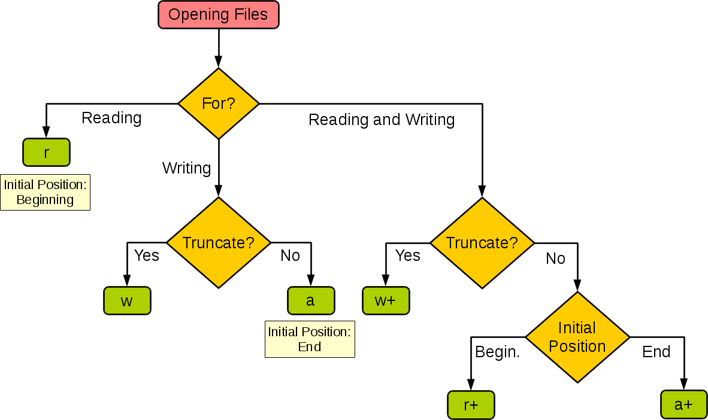
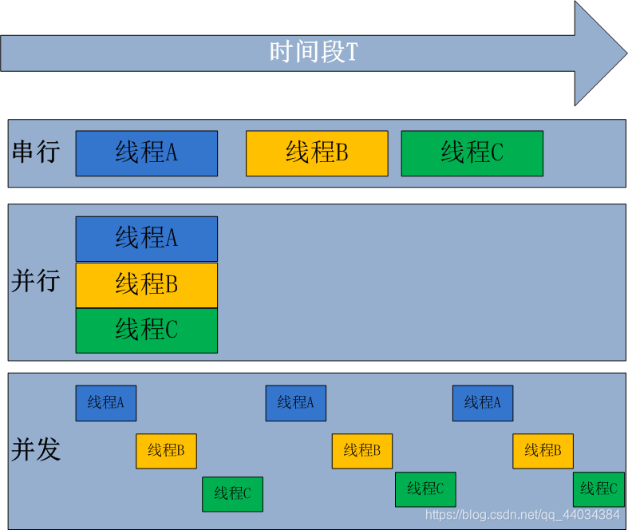

# Python概述

## Python简介

1. 1989年圣诞节：Guido von Rossum开始写Python语言的编译器。
2. 1991年2月：第一个Python编译器（同时也是解释器）诞生，它是用C语言实现的（后面），可以调用C语言的库函数。在最早的版本中，Python已经提供了对“类”，“函数”，“异常处理”等构造块的支持，还有对列表、字典等核心数据类型，同时支持以模块为基础来构造应用程序。
3. 1994年1月：Python 1.0正式发布。
4. 2000年10月16日：Python 2.0发布，增加了完整的垃圾回收，提供了对Unicode的支持。与此同时，Python的整个开发过程更加透明，社区对开发进度的影响逐渐扩大，生态圈开始慢慢形成。
5. 2008年12月3日：Python 3.0发布，它并不完全兼容之前的Python代码，不过因为目前还有不少公司在项目和运维中使用Python 2.x版本，所以Python 3.x的很多新特性后来也被移植到Python 2.6/2.7版本中。

Python的版本号分为三段，形如A.B.C。其中A表示大版本号，一般当整体重写，或出现不向后兼容的改变时，增加A；B表示功能更新，出现新功能时增加B；C表示小的改动（例如：修复了某个Bug），只要有修改就增加C。（[Python简史](https://www.cnblogs.com/vamei/archive/2013/02/06/2892628.html)）

## Python的优缺点

优点：

* 简单明了，学习曲线低，比很多编程语言都容易上手。
* 开放源代码，拥有强大的社区和生态圈，尤其是在数据分析和机器学习领域。
* 解释型语言，天生具有平台可移植性，代码可以工作于不同的操作系统。
* 对两种主流的编程范式（面向对象编程和函数式编程）都提供了支持。
* 代码规范程度高，可读性强，适合有代码洁癖和强迫症的人群。

缺点：

* 执行效率稍低，对执行效率要求高的部分可以由其他语言（如：C、C++）编写。
* 代码无法加密，但是现在很多公司都不销售卖软件而是销售服务，这个问题会被弱化。
* 在开发时可以选择的框架太多（如Web框架就有100多个），有选择的地方就有错误。

## Python的应用领域

目前Python在Web应用后端开发、云基础设施建设、DevOps、网络数据采集（爬虫）、自动化测试、数据分析、机器学习等领域都有着广泛的应用。

# 基础语法

 可以用文本编辑工具（推荐使用<span lang="EN-US">Sublime</span>、<span lang="EN-US">Visual Studio Code</span>等高级文本编辑工具）编写<span lang="EN-US">Python</span>源代码并用<span lang="EN-US">py</span>作为后缀名保存该文件，代码内容如下所示。

```python
print('hello, world!')
```

<span lang="EN-US"> print</span>是一个常用函数，其功能就是输出括号中得字符串。（在<span lang="EN-US">Python 2.x</span>中，<span lang="EN-US">print</span>还可以是一个关键字，可写成<span lang="EN-US">print 'Hello World!'</span>，但这在<span lang="EN-US">3.x</span>中行不通）。

## 变量命名
对于每个变量我们需要给它取一个名字，就如同我们每个人都有属于自己的响亮的名字一样。在</span><span lang="EN-US">Python</span>中，变量命名需要遵循以下这些必须遵守硬性规则和强烈建议遵守的非硬性规则。

* 硬性规则：
    * 变量名由字母（广义的<span lang="EN-US">Unicode</span>字符，不包括特殊字符）、数字和下划线构成，数字不能开头。
    * 大小写敏感（大写的<span lang="EN-US">a</span>和小写的<span lang="EN-US">A</span>是两个不同的变量）。
    * 不要跟关键字（有特殊含义的单词，后面会讲到）和系统保留字（如函数、模块等的名字）冲突。
* <span lang="EN-US">PEP 8</span>要求：
    * 用小写字母拼写，多个单词用下划线连接。
    * 受保护的实例属性用单个下划线开头。
    * 私有的实例属性用两个下划线开头。

<span lang="EN-US"> Python</span>的变量不需要声明，你可以直接输入：

```python
a = 10
print(type(a))
```

 如果你想让<span lang="EN-US">a</span>存储不同的数据，你不需要删除原有变量就可以直接赋值（<span lang="EN-US">print</span>后跟多个输出，以逗号分隔）。

```python
a = 1.3
print(a,type(a))
```

## 基本数据类型

几种常用的数据类型：
* 整型：Python中可以处理任意大小的整数（Python 2.x中有int和long两种类型的整数，但这种区分对Python来说意义不大，因此在Python 3.x中整数只有int这一种了），而且支持二进制（如0b100，换算成十进制是4）、八进制（如0o100，换算成十进制是64）、十进制（100）和十六进制（0x100，换算成十进制是256）的表示法。
* 浮点型：浮点数也就是小数，之所以称为浮点数，是因为按照科学记数法表示时，一个浮点数的小数点位置是可变的，浮点数除了数学写法（如123.456）之外还支持科学计数法（如1.23456e2）。
* 字符串型：字符串是以单引号或双引号括起来的任意文本，比如'hello'和"hello",字符串还有原始字符串表示法、字节字符串表示法、Unicode字符串表示法，而且可以书写成多行的形式（用三个单引号或三个双引号开头，三个单引号或三个双引号结尾）。
* 布尔型：布尔值只有True、False两种值，要么是True，要么是False，在Python中，可以直接用True、False表示布尔值（请注意大小写），也可以通过布尔运算计算出来（例如3 < 5会产生布尔值True，而2 == 1会产生布尔值False）。
* 复数型：形如3+5j，跟数学上的复数表示一样，唯一不同的是虚部的i换成了j。实际上，这个类型并不常用。

可以使用Python中内置的函数对变量类型进行转换：
* int()：将一个数值或字符串转换成整数，可以指定进制。
* float()：将一个字符串转换成浮点数。
* str()：将指定的对象转换成字符串形式，可以指定编码。
* chr()：将整数转换成该编码对应的字符串（一个字符）。
* ord()：将字符串（一个字符）转换成对应的编码（整数）。

下面的代码通过键盘输入两个整数来实现对两个整数的算术运算：
```python
"""
使用input()函数获取键盘输入(字符串)
使用int()函数将输入的字符串转换成整数
使用print()函数输出带占位符的字符串

Version: 0.1
Author: Crimson
"""
a = int(input('a = '))
b = int(input('b = '))
print('%d + %d = %d' % (a, b, a + b))
print('%d - %d = %d' % (a, b, a - b))
print('%d * %d = %d' % (a, b, a * b))
print('%d / %d = %f' % (a, b, a / b))
print('%d // %d = %d' % (a, b, a // b))
print('%d %% %d = %d' % (a, b, a % b))
print('%d ** %d = %d' % (a, b, a ** b))
```
上面的print函数中输出的字符串使用了占位符语法，其中%d是整数的占位符，%f是小数的占位符，%%表示百分号（因为百分号代表了占位符，所以带占位符的字符串中要表示百分号必须写成%%），字符串之后的%后面跟的变量值会替换掉占位符然后输出到终端中，运行上面的程序,查看输出结果。

## 字符串

所谓字符串，就是由零个或多个字符组成的有限序列。在Python程序中，如果我们把单个或多个字符用单引号或者双引号包围起来，就可以表示一个字符串。
```python
s1 = 'hello, world!'
s2 = "hello, world!"
# 以三个双引号或单引号开头的字符串可以折行
s3 = """
hello, 
world!
"""
print(s1, s2, s3, end='')
```
可以在字符串中使用\（反斜杠）来表示转义，也就是说\后面的字符不再是它原来的意义，例如：\n不是代表反斜杠和字符n，而是表示换行；而\t也不是代表反斜杠和字符t，而是表示制表符。所以如果想在字符串中表示'要写成\'，同理想表示\要写成\\。

如果不希望字符串中的\表示转义，我们可以通过在字符串的最前面加上字母r来加以说明：
```python
s1 = r'\'hello, world!\''
s2 = r'\n\\hello, world!\\\n'
print(s1, s2, end='')
```
Python为字符串类型提供了非常丰富的运算符，我们可以使用+运算符来实现字符串的拼接，可以使用*运算符来重复一个字符串的内容，可以使用in和not in来判断一个字符串是否包含另外一个字符串（成员运算），我们也可以用[]和[:]运算符从字符串取出某个字符或某些字符（切片运算），代码如下所示。
```python
s1 = 'hello ' * 3
print(s1) # hello hello hello 
s2 = 'world'
s1 += s2
print(s1) # hello hello hello world
print('ll' in s1) # True
print('good' in s1) # False
str2 = 'abc123456'
# 从字符串中取出指定位置的字符(下标运算)
print(str2[2]) # c
# 字符串切片(从指定的开始索引到指定的结束索引)
print(str2[2:5]) # c12
print(str2[2:]) # c123456
print(str2[2::2]) # c246
print(str2[::2]) # ac246
print(str2[::-1]) # 654321cba
print(str2[-3:-1]) # 45
```
在Python中，还可以通过一系列的方法来完成对字符串的处理，代码如下所示。
```python
str1 = 'hello, world!'
# 通过内置函数len计算字符串的长度
print(len(str1)) # 13
# 获得字符串首字母大写的拷贝
print(str1.capitalize()) # Hello, world!
# 获得字符串每个单词首字母大写的拷贝
print(str1.title()) # Hello, World!
# 获得字符串变大写后的拷贝
print(str1.upper()) # HELLO, WORLD!
# 从字符串中查找子串所在位置
print(str1.find('or')) # 8
print(str1.find('shit')) # -1
# 与find类似但找不到子串时会引发异常
# print(str1.index('or'))
# print(str1.index('shit'))
# 检查字符串是否以指定的字符串开头
print(str1.startswith('He')) # False
print(str1.startswith('hel')) # True
# 检查字符串是否以指定的字符串结尾
print(str1.endswith('!')) # True
# 将字符串以指定的宽度居中并在两侧填充指定的字符
print(str1.center(50, '*'))
# 将字符串以指定的宽度靠右放置左侧填充指定的字符
print(str1.rjust(50, ' '))
str2 = 'abc123456'
# 检查字符串是否由数字构成
print(str2.isdigit())  # False
# 检查字符串是否以字母构成
print(str2.isalpha())  # False
# 检查字符串是否以数字和字母构成
print(str2.isalnum())  # True
str3 = '  jackfrued@126.com '
print(str3)
# 获得字符串修剪左右两侧空格之后的拷贝
print(str3.strip())
```
Python 3.6以后，格式化字符串还有更为简洁的书写方式，就是在字符串前加上字母f，可以使用下面的语法糖来简化上面的代码。
```python
a, b = 5, 10
print(f'{a} * {b} = {a * b}')
```
## 常用数据结构
### 列表
字符串类型（str）和数值类型（int和float）有一些区别。数值类型是标量类型，也就是说这种类型的对象没有可以访问的内部结构；而字符串类型是一种结构化的、非标量类型，所以才会有一系列的属性和方法。接下来我们要介绍的列表（list），也是一种结构化的、非标量类型，它是值的有序序列，每个值都可以通过索引进行标识，定义列表可以将列表的元素放在[]中，多个元素用,进行分隔，可以使用for循环对列表元素进行遍历，也可以使用[]或[:]运算符取出列表中的一个或多个元素。下面的代码演示了如何定义列表、如何遍历列表以及列表的下标运算。
```python
list1 = [1, 3, 5, 7, 100]
print(list1) # [1, 3, 5, 7, 100]
# 乘号表示列表元素的重复
list2 = ['hello'] * 3
print(list2) # ['hello', 'hello', 'hello']
# 计算列表长度(元素个数)
print(len(list1)) # 5
# 下标(索引)运算
print(list1[0]) # 1
print(list1[4]) # 100
# print(list1[5])  # IndexError: list index out of range
print(list1[-1]) # 100
print(list1[-3]) # 5
list1[2] = 300
print(list1) # [1, 3, 300, 7, 100]
# 通过循环用下标遍历列表元素
for index in range(len(list1)):
    print(list1[index])
# 通过for循环遍历列表元素
for elem in list1:
    print(elem)
# 通过enumerate函数处理列表之后再遍历可以同时获得元素索引和值
for index, elem in enumerate(list1):
    print(index, elem)
下面的代码演示了如何向列表中添加元素以及如何从列表中移除元素。
list1 = [1, 3, 5, 7, 100]
# 添加元素
list1.append(200)
list1.insert(1, 400)
# 合并两个列表
# list1.extend([1000, 2000])
list1 += [1000, 2000]
print(list1) # [1, 400, 3, 5, 7, 100, 200, 1000, 2000]
print(len(list1)) # 9
# 先通过成员运算判断元素是否在列表中，如果存在就删除该元素
if 3 in list1:
	list1.remove(3)
if 1234 in list1:
    list1.remove(1234)
print(list1) # [1, 400, 5, 7, 100, 200, 1000, 2000]
# 从指定的位置删除元素
list1.pop(0)
list1.pop(len(list1) - 1)
print(list1) # [400, 5, 7, 100, 200, 1000]
# 清空列表元素
list1.clear()
print(list1) # []
还可以使用列表的生成式语法来创建列表，代码如下所示。
f = [x for x in range(1, 10)]
print(f)
f = [x + y for x in 'ABCDE' for y in '1234567']
print(f)
# 用列表的生成表达式语法创建列表容器
# 用这种语法创建列表之后元素已经准备就绪所以需要耗费较多的内存空间
f = [x ** 2 for x in range(1, 1000)]
print(sys.getsizeof(f))  # 查看对象占用内存的字节数
print(f)
# 请注意下面的代码创建的不是一个列表而是一个生成器对象
# 通过生成器可以获取到数据但它不占用额外的空间存储数据
# 每次需要数据的时候就通过内部的运算得到数据(需要花费额外的时间)
f = (x ** 2 for x in range(1, 1000))
print(sys.getsizeof(f))  # 相比生成式生成器不占用存储数据的空间
print(f)
for val in f:
    print(val)
```
### 元组
Python中的元组与列表类似也是一种容器数据类型，可以用一个变量（对象）来存储多个数据，不同之处在于元组的元素不能修改，在前面的代码中已经不止一次使用过元组了。顾名思义，把多个元素组合到一起就形成了一个元组，所以它和列表一样可以保存多条数据。下面的代码演示了如何定义和使用元组。
```python
# 定义元组
t = ('骆昊', 38, True, '四川成都')
print(t)
# 获取元组中的元素
print(t[0])
print(t[3])
# 遍历元组中的值
for member in t:
    print(member)
# 重新给元组赋值
# t[0] = '王大锤'  # TypeError
# 变量t重新引用了新的元组原来的元组将被垃圾回收
t = ('王大锤', 20, True, '云南昆明')
print(t)
# 将元组转换成列表
person = list(t)
print(person)
# 列表是可以修改它的元素的
person[0] = '李小龙'
person[1] = 25
print(person)
# 将列表转换成元组
fruits_list = ['apple', 'banana', 'orange']
fruits_tuple = tuple(fruits_list)
print(fruits_tuple)
```
### 元组合列表的比较
1. 元组中的元素是无法修改的，事实上我们在项目中尤其是多线程环境（后面会讲到）中可能更喜欢使用的是那些不变对象（一方面因为对象状态不能修改，所以可以避免由此引起的不必要的程序错误，简单的说就是一个不变的对象要比可变的对象更加容易维护；另一方面因为没有任何一个线程能够修改不变对象的内部状态，一个不变对象自动就是线程安全的，这样就可以省掉处理同步化的开销。一个不变对象可以方便的被共享访问）。所以结论就是：如果不需要对元素进行添加、删除、修改的时候，可以考虑使用元组，当然如果一个方法要返回多个值，使用元组也是不错的选择。
2. 元组在创建时间和占用的空间上面都优于列表。我们可以使用sys模块的getsizeof函数来检查存储同样的元素的元组和列表各自占用了多少内存空间，这个很容易做到。我们也可以在ipython中使用魔法指令%timeit来分析创建同样内容的元组和列表所花费的时间。
### 集合
Python中的集合跟数学上的集合是一致的，不允许有重复元素，而且可以进行交集、并集、差集等运算。可以按照下面代码所示的方式来创建和使用集合。
```python
# 创建集合的字面量语法
set1 = {1, 2, 3, 3, 3, 2}
print(set1)
print('Length =', len(set1))
# 创建集合的构造器语法(面向对象部分会进行详细讲解)
set2 = set(range(1, 10))
set3 = set((1, 2, 3, 3, 2, 1))
print(set2, set3)
# 创建集合的推导式语法(推导式也可以用于推导集合)
set4 = {num for num in range(1, 100) if num % 3 == 0 or num % 5 == 0}
print(set4)
向集合添加元素和从集合删除元素。
set1.add(4)
set1.add(5)
set2.update([11, 12])
set2.discard(5)
if 4 in set2:
    set2.remove(4)
print(set1, set2)
print(set3.pop())
print(set3)
集合的成员、交集、并集、差集等运算。
# 集合的交集、并集、差集、对称差运算
print(set1 & set2)
# print(set1.intersection(set2))
print(set1 | set2)
# print(set1.union(set2))
print(set1 - set2)
# print(set1.difference(set2))
print(set1 ^ set2)
# print(set1.symmetric_difference(set2))
# 判断子集和超集
print(set2 <= set1)
# print(set2.issubset(set1))
print(set3 <= set1)
# print(set3.issubset(set1))
print(set1 >= set2)
# print(set1.issuperset(set2))
print(set1 >= set3)
# print(set1.issuperset(set3))
```
<span style="color: red">Python中允许通过一些特殊的方法来为某种类型或数据结构自定义运算符。</span>
### 字典
字典是另一种可变容器模型，Python中的字典跟生活中使用的字典是一样一样的，它可以存储任意类型对象，与列表、集合不同的是，字典的每个元素都是由一个键和一个值组成的“键值对”，键和值通过冒号分开。下面的代码演示了如何定义和使用字典。

```python
# 创建字典的字面量语法
scores = {'骆昊': 95, '白元芳': 78, '狄仁杰': 82}
print(scores)
# 创建字典的构造器语法
items1 = dict(one=1, two=2, three=3, four=4)
# 通过zip函数将两个序列压成字典
items2 = dict(zip(['a', 'b', 'c'], '123'))
# 创建字典的推导式语法
items3 = {num: num ** 2 for num in range(1, 10)}
print(items1, items2, items3)
# 通过键可以获取字典中对应的值
print(scores['骆昊'])
print(scores['狄仁杰'])
# 对字典中所有键值对进行遍历
for key in scores:
    print(f'{key}: {scores[key]}')
# 更新字典中的元素
scores['白元芳'] = 65
scores['诸葛王朗'] = 71
scores.update(冷面=67, 方启鹤=85)
print(scores)
if '武则天' in scores:
    print(scores['武则天'])
print(scores.get('武则天'))
# get方法也是通过键获取对应的值但是可以设置默认值
print(scores.get('武则天', 60))
# 删除字典中的元素
print(scores.popitem())
print(scores.popitem())
print(scores.pop('骆昊', 100))
# 清空字典
scores.clear()
print(scores)
```
### 运算符
Python支持多种运算符，下表大致按照优先级从高到低的顺序列出了所有的运算符，运算符的优先级指的是多个运算符同时出现时，先做什么运算然后再做什么运算。
|  运算符   | 描述  |
|  ----  | ----  |
| [] [:]  | 下标，切片 |
| **  | 指数 |
| ~ + -  | 按位取反, 正负号 |
| * / % //  | 乘，除，模，整除 |
| + -  | 加，减 |
| >> <<  | 右移，左移 |
| &  | 按位与 |
| ^\| | 按位异或，按位或 |
| <= < > >=  | 小于等于，小于，大于，大于等于 |
| == !=  | 等于，不等于 |
| is is not  | 身份运算符 |
| in not in  | 成员运算符 |
| not or and  | 逻辑运算符 |
| = += -= *= /= %= //= **= &= `  | = ^= >>= <<=` |

```python
"""
输入半径计算圆的周长和面积

Version: 0.1
Author: Crimson
"""
radius = float(input('请输入圆的半径: '))
perimeter = 2 * 3.1416 * radius
area = 3.1416 * radius * radius
print('周长: %.2f' % perimeter)
print('面积: %.2f' % area)

"""
输入年份 如果是闰年输出True 否则输出False

Version: 0.1
Author: Crimson
"""
year = int(input('请输入年份: '))
# 如果代码太长写成一行不便于阅读 可以使用\对代码进行折行
is_leap = year % 4 == 0 and year % 100 != 0 or \
          year % 400 == 0
print(is_leap)
```
## 程序结构
### if结构
在Python中，要构造分支结构可以使用if、elif和else关键字。所谓关键字就是有特殊含义的单词，像if和else就是专门用于构造分支结构的关键字，很显然你不能够使用它作为变量名（事实上，用作其他的标识符也是不可以）。下面的例子中演示了如何构造一个分支结构。
```python
"""
用户身份验证

Version: 0.1
Author: Crimosn
"""
username = input('请输入用户名: ')
password = input('请输入口令: ')
# 用户名是admin且密码是123456则身份验证成功否则身份验证失败
if username == 'admin' and password == '123456':
    print('身份验证成功!')
else:
    print('身份验证失败!')
```
Python中没有用花括号来构造代码块而是使用了缩进的方式来表示代码的层次结构，如果if条件成立的情况下需要执行多条语句，只要保持多条语句具有相同的缩进就可以了。换句话说连续的代码如果又保持了相同的缩进那么它们属于同一个代码块，相当于是一个执行的整体。缩进可以使用任意数量的空格，但通常使用4个空格，建议大家不要使用制表键或者设置你的代码编辑工具自动将制表键变成4个空格。

如果要构造出更多的分支，可以使用if...elif...else...结构或者嵌套的if...else...结构，下面的代码演示了如何利用多分支结构实现分段函数求值。以下的例子：
```python
"""
分段函数求值

        3x - 5  (x > 1)
f(x) =  x + 2   (-1 <= x <= 1)
        5x + 3  (x < -1)

Version: 0.1
Author: Crimson
"""

x = float(input('x = '))
if x > 1:
    y = 3 * x - 5
elif x >= -1:
    y = x + 2
else:
    y = 5 * x + 3
print('f(%.2f) = %.2f' % (x, y))
```
### for-in循环
如果明确的知道循环执行的次数或者要对一个容器进行迭代，那么推荐使用for-in循环，例如下面代码中计算1~100求和的结果。
```python
"""
用for循环实现1~100求和

Version: 0.1
Author: Crimson
"""

sum = 0
for x in range(101):
    sum += x
print(sum)
```
上面代码中的range(1, 101)可以用来构造一个从1到100的范围，当我们把这样一个范围放到for-in循环中，就可以通过前面的循环变量x依次取出从1到100的整数。当然，range的用法非常灵活，下面给出了一个例子：
* range(101)：可以用来产生0到100范围的整数，需要注意的是取不到101。
* range(1, 101)：可以用来产生1到100范围的整数，相当于前面是闭区间后面是开区间。
* range(1, 101, 2)：可以用来产生1到100的奇数，其中2是步长，即每次数值递增的值。
* range(100, 0, -2)：可以用来产生100到1的偶数，其中-2是步长，即每次数字递减的值。

### while循环
如果要构造不知道具体循环次数的循环结构，推荐使用while循环。while循环通过一个能够产生或转换出bool值的表达式来控制循环，表达式的值为True则继续循环；表达式的值为False则结束循环。
```python
"""
猜数字游戏

Version: 0.1
Author: Crimosn
"""
import random

answer = random.randint(1, 100)
counter = 0
while True:
    counter += 1
    number = int(input('请输入: '))
    if number < answer:
        print('大一点')
    elif number > answer:
        print('小一点')
    else:
        print('恭喜你猜对了!')
        break
print('你总共猜了%d次' % counter)
if counter > 7:
    print('你的智商余额明显不足')
```
上面的代码中使用了break关键字来提前终止循环，需要注意的是break只能终止它所在的那个循环，这一点在使用嵌套的循环结构需要引起注意。除了break之外，还有另一个关键字是continue，它可以用来放弃本次循环后续的代码直接让循环进入下一轮。
## 函数和模块
在Python中可以使用def关键字来定义函数，和变量一样每个函数也有一个响亮的名字，而且命名规则跟变量的命名规则是一致的。在函数名后面的圆括号中可以放置传递给函数的参数，这一点和数学上的函数非常相似，程序中函数的参数就相当于是数学上说的函数的自变量，而函数执行完成后可以通过return关键字来返回一个值，这相当于数学上说的函数的因变量。
```python
"""
输入M和N计算C(M,N)

Version: 0.1
Author: Crimson
"""
def fac(num):
    """求阶乘"""
    result = 1
    for n in range(1, num + 1):
        result *= n
    return result


m = int(input('m = '))
n = int(input('n = '))
# 当需要计算阶乘的时候不用再写循环求阶乘而是直接调用已经定义好的函数
print(fac(m) // fac(n) // fac(m - n))
```
### 函数的参数
函数是绝大多数编程语言中都支持的一个代码的"构建块"，但是Python中的函数与其他语言中的函数还是有很多不太相同的地方，其中一个显著的区别就是Python对函数参数的处理。在Python中，函数的参数可以有默认值，也支持使用可变参数，所以Python并不需要像其他语言一样<span style="color: red">支持函数的重载</span>，因为我们在定义一个函数的时候可以让它有多种不同的使用方式，下面是两个小例子。
```python
from random import randint

def roll_dice(n=2):
    """摇色子"""
    total = 0
    for _ in range(n):
        total += randint(1, 6)
    return total

def add(a=0, b=0, c=0):
    """三个数相加"""
    return a + b + c

# 如果没有指定参数那么使用默认值摇两颗色子
print(roll_dice())
# 摇三颗色子
print(roll_dice(3))
print(add())
print(add(1))
print(add(1, 2))
print(add(1, 2, 3))
# 传递参数时可以不按照设定的顺序进行传递
print(add(c=50, a=100, b=200))
```
上面两个函数的参数都设定了默认值，这也就意味着如果在调用函数的时候如果没有传入对应参数的值时将使用该参数的默认值，所以在上面的代码中我们可以用各种不同的方式去调用add函数，这跟其他很多语言中函数重载的效果是一致的。

因此在不确定参数个数的时候，我们可以使用可变参数，代码如下所示。
```python
# 在参数名前面的*表示args是一个可变参数
def add(*args):
    total = 0
    for val in args:
        total += val
    return total

# 在调用add函数时可以传入0个或多个参数
print(add())
print(add(1))
print(add(1, 2))
print(add(1, 2, 3))
print(add(1, 3, 5, 7, 9))
```
### 用模块管理函数
对于任何一种编程语言来说，给变量、函数这样的标识符起名字都是一个让人头疼的问题，因为会遇到命名冲突这种尴尬的情况。最简单的场景就是在同一个.py文件中定义了两个同名函数，由于Python没有函数重载的概念，那么后面的定义会覆盖之前的定义，也就意味着两个函数同名函数实际上只有一个是存在的。

为了解决这种命名冲突，Python中每个文件就代表了一个模块（module），在不同的模块中可以有同名的函数，在使用函数的时候我们通过import关键字导入指定的模块就可以区分到底要使用的是哪个模块中的foo函数，代码如下所示（也可以使用as 指定别名）。
```python
module1.py
def foo():
print('hello, world!')

module2.py
def foo():
print('goodbye, world!')

test.py
from module1 import foo
# 输出hello, world!
foo()
from module2 import foo
# 输出goodbye, world!
foo()
```
需要说明的是，如果导入的模块除了定义函数之外还有可以执行代码，那么Python解释器在导入这个模块时就会执行这些代码，因此如果在模块中编写了执行代码，最好是将这些执行代码放入如下所示的条件中，这样的话除非直接运行该模块，if条件下的这些代码是不会执行的，因为只有直接执行的模块的名字才是"__main__"。
```python
def foo():
    pass
def bar():
    pass
# __name__是Python中一个隐含的变量它代表了模块的名字
# 只有被Python解释器直接执行的模块的名字才是__main__
if __name__ == '__main__':
    print('call foo()')
    foo()
    print('call bar()')
bar()
```
### 函数的使用方式
* 将函数视为“一等公民”
  * 函数可以赋值给变量
  * 函数可以作为函数的参数
  * 函数可以作为函数的返回值
* 高阶函数的用法（filter、map以及它们的替代品）
```python
items1 = list(map(lambda x: x ** 2, filter(lambda x: x % 2, range(1, 10))))
items2 = [x ** 2 for x in range(1, 10) if x % 2]
```
* 位置参数、可变参数、关键字参数、命名关键字参数
* 参数的元信息（代码可读性问题）
* 匿名函数和内联函数的用法（lambda函数）
* 闭包和作用域问题
  * Python搜索变量的LEGB顺序（Local >>> Embedded >>> Global >>> Built-in）
  * global和nonlocal关键字的作用。
    * global：声明或定义全局变量（要么直接使用现有的全局作用域的变量，要么定义一个变量放到全局作用域）。
    * nonlocal：声明使用嵌套作用域的变量（嵌套作用域必须存在该变量，否则报错）。
* 装饰器函数（使用装饰器和取消装饰器）
  
例子：输出函数执行时间的装饰器。
```python
def record_time(func):
    """自定义装饰函数的装饰器"""
    
    @wraps(func)
    def wrapper(*args, **kwargs):
        start = time()
        result = func(*args, **kwargs)
        print(f'{func.__name__}: {time() - start}秒')
        return result
        
    return wrapper
```
例子：用装饰器来实现单例模式。
```python
from functools import wraps

def singleton(cls):
    """装饰类的装饰器"""
    instances = {}

    @wraps(cls)
    def wrapper(*args, **kwargs):
        if cls not in instances:
            instances[cls] = cls(*args, **kwargs)
        return instances[cls]

    return wrapper


@singleton
class President:
    """总统(单例类)"""
    pass
```
上面的代码用到了with上下文语法来进行锁操作，因为锁对象本身就是上下文管理器对象（支持__enter__和__exit__魔术方法）。在wrapper函数中，先做了一次不带锁的检查，然后再做带锁的检查，这样做比直接加锁检查性能要更好，如果对象已经创建就没有必须再去加锁而是直接返回该对象就可以了。

# 面向对象编程
面向对象就是把一组数据结构和处理它们的方法组成对象（object），把相同行为的对象归纳为类（class），通过类的封装（encapsulation）隐藏内部细节，通过继承（inheritance）实现类的特化（specialization）和泛化（generalization），通过多态（polymorphism）实现基于对象类型的动态分派。

面向对象设计原则：
* 单一职责原则 （SRP）- 一个类只做该做的事情（类的设计要高内聚）
* 开闭原则 （OCP）- 软件实体应该对扩展开发对修改关闭
* 依赖倒转原则（DIP）- 面向抽象编程（在弱类型语言中已经被弱化）
* 里氏替换原则（LSP） - 任何时候可以用子类对象替换掉父类对象
* 接口隔离原则（ISP）- 接口要小而专不要大而全（Python中没有接口的概念）
* 合成聚合复用原则（CARP） - 优先使用强关联关系而不是继承关系复用代码
* 最少知识原则（迪米特法则，LoD）- 不要给没有必然联系的对象发消息
GoF设计模式：
* 创建型模式：单例、工厂、建造者、原型
* 结构型模式：适配器、门面（外观）、代理
* 行为型模式：迭代器、观察者、状态、策略
## 类和对象
简单的说，类是对象的蓝图和模板，而对象是类的实例。这个解释虽然有点像用概念在解释概念，但是从这句话可以看出，类是抽象的概念，而对象是具体的东西。在面向对象编程的世界中，一切皆为对象，对象都有属性和行为，每个对象都是独一无二的，而且对象一定属于某个类（型）。把一大堆拥有共同特征的对象的静态特征（属性）和动态特征（行为）都抽取出来后，就可以定义出一个叫做“类”的东西。

## 定义类
在Python中可以使用class关键字定义类，然后在类中通过之前学习过的函数来定义方法，这样就可以将对象的动态特征描述出来，代码如下所示。
```python
class Student(object):

    # __init__是一个特殊方法用于在创建对象时进行初始化操作
    # 通过这个方法我们可以为学生对象绑定name和age两个属性
    def __init__(self, name, age):
        self.name = name
        self.age = age

    def study(self, course_name):
        print('%s正在学习%s.' % (self.name, course_name))

    # PEP 8要求标识符的名字用全小写多个单词用下划线连接
    # 但是部分程序员和公司更倾向于使用驼峰命名法(驼峰标识)
    def watch_movie(self):
        if self.age < 18:
            print('%s只能观看《熊出没》.' % self.name)
        else:
            print('%s正在观看岛国爱情大电影.' % self.name)
```            
当我们定义好一个类之后，可以通过下面的方式来创建对象并给对象发消息。
```python
def main():
    # 创建学生对象并指定姓名和年龄
    stu1 = Student('骆昊', 38)
    # 给对象发study消息
    stu1.study('Python程序设计')
    # 给对象发watch_av消息
    stu1.watch_movie()
    stu2 = Student('王大锤', 15)
    stu2.study('思想品德')
stu2.watch_movie()

if __name__ == '__main__':
    main()
```
## 访问可见性
对于上面的代码，有C++、Java、C#等编程经验的程序员可能会问，我们给Student对象绑定的name和age属性到底具有怎样的访问权限（也称为可见性）。因为在很多面向对象编程语言中，我们通常会将对象的属性设置为私有的（private）或受保护的（protected），简单的说就是不允许外界访问，而对象的方法通常都是公开的（public），因为公开的方法就是对象能够接受的消息。在Python中，属性和方法的访问权限只有两种，也就是公开的和私有的，如果希望属性是私有的，在给属性命名时可以用两个下划线作为开头，下面的代码可以验证这一点。
```python
class Test:

    def __init__(self, foo):
        self.__foo = foo

    def __bar(self):
        print(self.__foo)
        print('__bar')


def main():
    test = Test('hello')
    # AttributeError: 'Test' object has no attribute '__bar'
    test.__bar()
    # AttributeError: 'Test' object has no attribute '__foo'
    print(test.__foo)


if __name__ == "__main__":
    main()
```
但是，Python并没有从语法上严格保证私有属性或方法的私密性，它只是给私有的属性和方法换了一个名字来妨碍对它们的访问，事实上如果你知道更换名字的规则仍然可以访问到它们，下面的代码就可以验证这一点。之所以这样设定，可以用这样一句名言加以解释，就是"We are all consenting adults here"。因为绝大多数程序员都认为开放比封闭要好，而且程序员要自己为自己的行为负责。
```python
class Test:

    def __init__(self, foo):
        self.__foo = foo

    def __bar(self):
        print(self.__foo)
        print('__bar')


def main():
    test = Test('hello')
    test._Test__bar()
    print(test._Test__foo)


if __name__ == "__main__":
    main()
```
在实际开发中，我们并不建议将属性设置为私有的，因为这会导致子类无法访问（后面会讲到）。所以大多数Python程序员会遵循一种命名惯例就是让属性名以单下划线开头来表示属性是受保护的，本类之外的代码在访问这样的属性时应该要保持慎重。
## @property装饰器
之前Python中属性和方法访问权限的问题，虽然不建议将属性设置为私有的，但是如果直接将属性暴露给外界也是有问题的，比如我们没有办法检查赋给属性的值是否有效。之前的建议是将属性命名以单下划线开头，通过这种方式来暗示属性是受保护的，不建议外界直接访问，那么如果想访问属性可以通过属性的getter（访问器）和setter（修改器）方法进行对应的操作。如果要做到这点，就可以考虑使用@property包装器来包装getter和setter方法，使得对属性的访问既安全又方便，代码如下所示。
```python
class Person(object):

    def __init__(self, name, age):
        self._name = name
        self._age = age

    # 访问器 - getter方法
    @property
    def name(self):
        return self._name

    # 访问器 - getter方法
    @property
    def age(self):
        return self._age

    # 修改器 - setter方法
    @age.setter
    def age(self, age):
        self._age = age

    def play(self):
        if self._age <= 16:
            print('%s正在玩飞行棋.' % self._name)
        else:
            print('%s正在玩斗地主.' % self._name)


def main():
    person = Person('王大锤', 12)
    person.play()
    person.age = 22
    person.play()
    # person.name = '白元芳'  # AttributeError: can't set attribute


if __name__ == '__main__':
    main()

```
## \_\_slots\_\_
Python是一门动态语言。通常，动态语言允许我们在程序运行时给对象绑定新的属性或方法，当然也可以对已经绑定的属性和方法进行解绑定。但是如果我们需要限定自定义类型的对象只能绑定某些属性，可以通过在类中定义__slots__变量来进行限定。需要注意的是__slots__的限定只对当前类的对象生效，对子类并不起任何作用。
```python
class Person(object):

    # 限定Person对象只能绑定_name, _age和_gender属性
    __slots__ = ('_name', '_age', '_gender')

    def __init__(self, name, age):
        self._name = name
        self._age = age

    @property
    def name(self):
        return self._name

    @property
    def age(self):
        return self._age

    @age.setter
    def age(self, age):
        self._age = age

    def play(self):
        if self._age <= 16:
            print('%s正在玩飞行棋.' % self._name)
        else:
            print('%s正在玩斗地主.' % self._name)


def main():
    person = Person('王大锤', 22)
    person.play()
    person._gender = '男'
    # AttributeError: 'Person' object has no attribute '_is_gay'
    # person._is_gay = True
```
## 静态方法和类方法
在类中定义的方法都是对象方法，也就是说这些方法都是发送给对象的消息。实际上，写在类中的方法并不需要都是对象方法，例如我们定义一个“三角形”类，通过传入三条边长来构造三角形，并提供计算周长和面积的方法，但是传入的三条边长未必能构造出三角形对象，因此可以先写一个方法来验证三条边长是否可以构成三角形，这个方法很显然就不是对象方法，因为在调用这个方法时三角形对象尚未创建出来（因为都不知道三条边能不能构成三角形），所以这个方法是属于三角形类而并不属于三角形对象的。我们可以使用静态方法来解决这类问题，代码如下所示。
```python
from math import sqrt


class Triangle(object):

    def __init__(self, a, b, c):
        self._a = a
        self._b = b
        self._c = c

    @staticmethod
    def is_valid(a, b, c):
        return a + b > c and b + c > a and a + c > b

    def perimeter(self):
        return self._a + self._b + self._c

    def area(self):
        half = self.perimeter() / 2
        return sqrt(half * (half - self._a) *
                    (half - self._b) * (half - self._c))


def main():
    a, b, c = 3, 4, 5
    # 静态方法和类方法都是通过给类发消息来调用的
    if Triangle.is_valid(a, b, c):
        t = Triangle(a, b, c)
        print(t.perimeter())
        # 也可以通过给类发消息来调用对象方法但是要传入接收消息的对象作为参数
        # print(Triangle.perimeter(t))
        print(t.area())
        # print(Triangle.area(t))
    else:
        print('无法构成三角形.')


if __name__ == '__main__':
    main()
```
和静态方法比较类似，Python还可以在类中定义类方法，类方法的第一个参数约定名为cls，它代表的是当前类相关的信息的对象（类本身也是一个对象，有的地方也称之为类的元数据对象），通过这个参数可以获取和类相关的信息并且可以创建出类的对象，代码如下所示。
```python
from time import time, localtime, sleep


class Clock(object):
    """数字时钟"""

    def __init__(self, hour=0, minute=0, second=0):
        self._hour = hour
        self._minute = minute
        self._second = second

    @classmethod
    def now(cls):
        ctime = localtime(time())
        return cls(ctime.tm_hour, ctime.tm_min, ctime.tm_sec)

    def run(self):
        """走字"""
        self._second += 1
        if self._second == 60:
            self._second = 0
            self._minute += 1
            if self._minute == 60:
                self._minute = 0
                self._hour += 1
                if self._hour == 24:
                    self._hour = 0

    def show(self):
        """显示时间"""
        return '%02d:%02d:%02d' % \
               (self._hour, self._minute, self._second)


def main():
    # 通过类方法创建对象并获取系统时间
    clock = Clock.now()
    while True:
        print(clock.show())
        sleep(1)
        clock.run()


if __name__ == '__main__':
    main()
```
## 类之间的关系

简单的说，类和类之间的关系有三种：is-a、has-a和use-a关系。
* is-a关系也叫继承或泛化，比如学生和人的关系、手机和电子产品的关系都属于继承关系。
* has-a关系通常称之为关联，比如部门和员工的关系，汽车和引擎的关系都属于关联关系；关联关系如果是整体和部分的关联，那么我们称之为聚合关系；如果整体进一步负责了部分的生命周期（整体和部分是不可分割的，同时同在也同时消亡），那么这种就是最强的关联关系，我们称之为合成关系。
* use-a关系通常称之为依赖，比如司机有一个驾驶的行为（方法），其中（的参数）使用到了汽车，那么司机和汽车的关系就是依赖关系。
## 继承和多态
可以在已有类的基础上创建新类，这其中的一种做法就是让一个类从另一个类那里将属性和方法直接继承下来，从而减少重复代码的编写。提供继承信息称之为父类，也叫超类或基类；得到继承信息称之为子类，也叫派生类或衍生类。子类除了继承父类提供的属性和方法，还可以定义自己特有的属性和方法，所以子类比父类拥有的更多的能力，在实际开发中，经常会用子类对象去替换掉一个父类对象，这是面向对象编程中一个常见的行为，对应的原则称之为里氏替换原则。下面先看一个继承的例子。
```python
class Person(object):
"""人"""
…………
class Student(Person):
    """学生"""
…………
class Teacher(Person):
    """老师"""
…………
```
子类在继承了父类的方法后，可以对父类已有的方法给出新的实现版本，这个动作称之为方法重写（override）。通过方法重写我们可以让父类的同一个行为在子类中拥有不同的实现版本，当我们调用这个经过子类重写的方法时，不同的子类对象会表现出不同的行为，这个就是多态（poly-morphism）。
```python
class Pet(object, metaclass=ABCMeta):
    """宠物"""

    def __init__(self, nickname):
        self._nickname = nickname

    @abstractmethod
    def make_voice(self):
        """发出声音"""
        pass
class Dog(Pet):
    """狗"""

    def make_voice(self):
        print('%s: 汪汪汪...' % self._nickname)


class Cat(Pet):
    """猫"""

    def make_voice(self):
        print('%s: 喵...喵...' % self._nickname)
```
在上面的代码中，Pet类处理成了一个抽象类，所谓抽象类就是不能够创建对象的类，这种类的存在就是专门为了让其他类去继承它。Python从语法层面并没有像Java或C#那样提供对抽象类的支持，但是我们可以通过abc模块的ABCMeta元类和abstractmethod包装器来达到抽象类的效果，如果一个类中存在抽象方法那么这个类就不能够实例化（创建对象）。

# 文件操作

在Python中实现文件的读写操作其实非常简单，通过Python内置的open函数，就可以指定文件名、操作模式、编码信息等来获得操作文件的对象，接下来就可以对文件进行读写操作了。这里所说的操作模式是指要打开什么样的文件（字符文件还是二进制文件）以及做什么样的操作（读、写还是追加），具体的如下表所示。
| 操作模式 | 具体含义 |
| --- | --- |
| 'r' | 读取 （默认） |
| 'w' | 写入（会先截断之前的内容） |
| 'x' | 写入，如果文件已经存在会产生异常 |
| 'a' | 追加，将内容写入到已有文件的末尾 |
| 'b' | 二进制模式 |
| 't' | 文本模式（默认） |
| '+' | 更新（既可以读又可以写） |

open函数流程图：



## 读写文本文件
读取文本文件时，需要在使用open函数时指定好带路径的文件名（可以使用相对路径或绝对路径）并将文件模式设置为'r'（如果不指定，默认值也是'r'），然后通过encoding参数指定编码（如果不指定，默认值是None，那么在读取文件时使用的是操作系统默认的编码），如果不能保证保存文件时使用的编码方式与encoding参数指定的编码方式是一致的，那么就可能因无法解码字符而导致读取失败。下面的例子演示了如何读取一个纯文本文件。
```python
def main():
    f = open('致橡树.txt', 'r', encoding='utf-8')
    print(f.read())
    f.close()


if __name__ == '__main__':
    main()
```
如果open函数指定的文件并不存在或者无法打开，那么将引发异常状况导致程序崩溃。为了让代码有一定的健壮性和容错性，我们可以使用Python的异常机制对可能在运行时发生状况的代码进行适当的处理，如下所示。
```python
def main():
    f = None
    try:
        f = open('致橡树.txt', 'r', encoding='utf-8')
        print(f.read())
    except FileNotFoundError:
        print('无法打开指定的文件!')
    except LookupError:
        print('指定了未知的编码!')
    except UnicodeDecodeError:
        print('读取文件时解码错误!')
    finally:
        if f:
            f.close()


if __name__ == '__main__':
    main()
```
在Python中，可以将那些在运行时可能会出现状况的代码放在try代码块中，在try代码块的后面可以跟上一个或多个except来捕获可能出现的异常状况。例如在上面读取文件的过程中，文件找不到会引发FileNotFoundError，指定了未知的编码会引发LookupError，而如果读取文件时无法按指定方式解码会引发UnicodeDecodeError，在try后面跟上了三个except分别处理这三种不同的异常状况。最后使用finally代码块来关闭打开的文件，释放掉程序中获取的外部资源，由于finally块的代码不论程序正常还是异常都会执行到（甚至是调用了sys模块的exit函数退出Python环境，finally块都会被执行，因为exit函数实质上是引发了SystemExit异常），因此我们通常把finally块称为“总是执行代码块”，它最适合用来做释放外部资源的操作。如果不愿意在finally代码块中关闭文件对象释放资源，也可以使用上下文语法，通过with关键字指定文件对象的上下文环境并在离开上下文环境时自动释放文件资源，代码如下所示
```python
def main():
    try:
        with open('致橡树.txt', 'r', encoding='utf-8') as f:
            print(f.read())
    except FileNotFoundError:
        print('无法打开指定的文件!')
    except LookupError:
        print('指定了未知的编码!')
    except UnicodeDecodeError:
        print('读取文件时解码错误!')


if __name__ == '__main__':
    main()
```
除了使用文件对象的read方法读取文件之外，还可以使用for-in循环逐行读取或者用readlines方法将文件按行读取到一个列表容器中，代码如下所示。
```python
import time


def main():
    # 一次性读取整个文件内容
    with open('致橡树.txt', 'r', encoding='utf-8') as f:
        print(f.read())

    # 通过for-in循环逐行读取
    with open('致橡树.txt', mode='r') as f:
        for line in f:
            print(line, end='')
            time.sleep(0.5)
    print()

    # 读取文件按行读取到列表中
    with open('致橡树.txt') as f:
        lines = f.readlines()
    print(lines)
    

if __name__ == '__main__':
    main()
```
要将文本信息写入文件文件也非常简单，在使用open函数时指定好文件名并将文件模式设置为'w'即可。注意如果需要对文件内容进行追加式写入，应该将模式设置为'a'。如果要写入的文件不存在会自动创建文件而不是引发异常。
## 读写二进制文件
知道了如何读写文本文件要读写二进制文件也就很简单了，下面的代码实现了复制图片文件的功能。
```python
def main():
    try:
        with open('guido.jpg', 'rb') as fs1:
            data = fs1.read()
            print(type(data))  # <class 'bytes'>
        with open('吉多.jpg', 'wb') as fs2:
            fs2.write(data)
    except FileNotFoundError as e:
        print('指定的文件无法打开.')
    except IOError as e:
        print('读写文件时出现错误.')
    print('程序执行结束.')


if __name__ == '__main__':
    main()
```
## 读写JSON文件
在Python中，把一个列表或者一个字典中的数据保存到文件中，将数据以JSON格式进行保存。下面是一个JSON的简单例子。
```json
{
    "name": "骆昊",
    "age": 38,
    "qq": 957658,
    "friends": ["王大锤", "白元芳"],
    "cars": [
        {"brand": "BYD", "max_speed": 180},
        {"brand": "Audi", "max_speed": 280},
        {"brand": "Benz", "max_speed": 320}
    ]
}
```
上面的JSON跟Python中的字典其实是一样一样的，事实上JSON的数据类型和Python的数据类型是很容易找到对应关系的，如下面两张表所示。
| JSON | python |
| -- | -- |
| object | dict |
| array | list |
| string | str |
| number(int/real) | int/float |
| true/false | True/False |
| null | None |

使用Python中的json模块就可以将字典或列表以JSON格式保存到文件中，代码如下所示。
```python
import json


def main():
    mydict = {
        'name': '骆昊',
        'age': 38,
        'qq': 957658,
        'friends': ['王大锤', '白元芳'],
        'cars': [
            {'brand': 'BYD', 'max_speed': 180},
            {'brand': 'Audi', 'max_speed': 280},
            {'brand': 'Benz', 'max_speed': 320}
        ]
    }
    try:
        with open('data.json', 'w', encoding='utf-8') as fs:
            json.dump(mydict, fs)
    except IOError as e:
        print(e)
    print('保存数据完成!')
if __name__ == '__main__':
    main()
```
json模块主要有四个比较重要的函数，分别是：
* dump - 将Python对象按照JSON格式序列化到文件中
* dumps - 将Python对象处理成JSON格式的字符串
* load - 将文件中的JSON数据反序列化成对象
* loads - 将字符串的内容反序列化成Python对象

# 异常处理
在Python中，和部分高级语言一样，使用了try/except/finally语句块来处理异常。
## 异常处理语句try...excpet...finally
* except语句不是必须的，finally语句也不是必须的，但是二者必须要有一个，否则就没有try的意义了。
* except语句可以有多个，Python会按except语句的顺序依次匹配你指定的异常，如果异常已经处理就不会再进入后面的except语句。
* except语句可以以元组形式同时指定多个异常，参见实例代码。
* except语句后面如果不指定异常类型，则默认捕获所有异常，你可以通过logging或者sys模块获取当前异常。
* 如果要捕获异常后要重复抛出，请使用raise，后面不要带任何参数或信息。
* 不建议捕获并抛出同一个异常，请考虑重构你的代码。
* 不建议在不清楚逻辑的情况下捕获所有异常，有可能你隐藏了很严重的问题。
* 尽量使用内置的异常处理语句来替换try/except语句，比如with语句，getattr()方法。
## 抛出异常 raise
如果你需要自主抛出异常一个异常，可以使用raise关键字，等同于C#和Java中的throw，其语法规则如下。
```python
raise NameError("bad name!")
```
raise关键字后面可以指定你要抛出的异常实例，一般来说抛出的异常越详细越好，Python在exceptions模块内建了很多的异常类型，通过使用dir()函数来查看exceptions中的异常类型，如下：
```python
import exceptions

print dir(exceptions)
# ['ArithmeticError', 'AssertionError'...]
捕捉到了异常，但是又想重新抛出它（传递异常），使用不带参数的raise语句即可：
def f1():
    print(1/0)

def f2():
    try:
        f1()
    except Exception as e:
        raise  # don't raise e !!!

f2()
```
在Python2中，为了保持异常的完整信息，那么你捕获后再次抛出时千万不能在raise后面加上异常对象，否则你的trace信息就会从此处截断。以上是最简单的重新抛出异常的做法，也是推荐的做法。
## 自定义异常类型
Python中自定义自己的异常类型非常简单，只需要要从Exception类继承即可(直接或间接)：
```python
class SomeCustomException(Exception):
    pass
class AnotherException(SomeCustomException):
    pass
```
# 进程和线程
进程就是操作系统中执行的一个程序，操作系统以进程为单位分配存储空间，每个进程都有自己的地址空间、数据栈以及其他用于跟踪进程执行的辅助数据，操作系统管理所有进程的执行，为它们合理的分配资源。进程可以通过fork或spawn的方式来创建新的进程来执行其他的任务，不过新的进程也有自己独立的内存空间，因此必须通过进程间通信机制（IPC，Inter-Process Communication）来实现数据共享，具体的方式包括管道、信号、套接字、共享内存区等。

一个进程还可以拥有多个并发的执行线索，简单的说就是拥有多个可以获得CPU调度的执行单元，这就是所谓的线程。由于线程在同一个进程下，它们可以共享相同的上下文，因此相对于进程而言，线程间的信息共享和通信更加容易。

Python既支持多进程又支持多线程，因此使用Python实现并发编程主要有3种方式：多进程、多线程、多进程+多线程。
## 多进程
Unix和Linux操作系统上提供了fork()系统调用来创建进程，调用fork()函数的是父进程，创建出的是子进程，子进程是父进程的一个拷贝，但是子进程拥有自己的PID。fork()函数非常特殊它会返回两次，父进程中可以通过fork()函数的返回值得到子进程的PID，而子进程中的返回值永远都是0。Python的os模块提供了fork()函数。由于Windows系统没有fork()调用，因此要实现跨平台的多进程编程，可以使用multiprocessing模块的Process类来创建子进程，而且该模块还提供了更高级的封装，例如批量启动进程的进程池（Pool）、用于进程间通信的队列（Queue）和管道（Pipe）等。

使用多进程的方式将两个下载任务放到不同的进程中，代码如下所示。
```python
from random import randint
from time import time, sleep
from multiprocessing import Process
from os import getpid


def download_task(filename):
    print('开始下载%s...' % filename)
    time_to_download = randint(5, 10)
    sleep(time_to_download)
    print('%s下载完成! 耗费了%d秒' % (filename, time_to_download))


def main():
    start = time()
    p1 = Process(target=download_task, args=('Python从入门到住院.pdf', ))
    p1.start()
    p2 = Process(target=download_task, args=('Peking Hot.avi', ))
    p2.start()
    p1.join()
    p2.join()
    end = time()
    print('总共耗费了%.2f秒.' % (end - start))


if __name__ == '__main__':
    main()
```
Process类创建了进程对象，通过target参数传入一个函数来表示进程启动后要执行的代码，后面的args是一个元组，它代表了传递给函数的参数。Process对象的start方法用来启动进程，而join方法表示等待进程执行结束。输出为：
```
开始下载Python从入门到住院.pdf...
开始下载Peking Hot.avi...
Python从入门到住院.pdf下载完成! 耗费了7秒
Peking Hot.avi下载完成! 耗费了8秒
总共耗费了8.38秒.
```
## 多线程
在Python早期的版本中就引入了thread模块（现在名为_thread）来实现多线程编程，然而该模块过于底层，而且很多功能都没有提供，因此目前的多线程开发推荐使用threading模块，该模块对多线程编程提供了更好的面向对象的封装。
```python
from random import randint
from time import time, sleep
from threading import Thread


def download_task(filename):
    print('开始下载%s...' % filename)
    time_to_download = randint(5, 10)
    sleep(time_to_download)
    print('%s下载完成! 耗费了%d秒' % (filename, time_to_download))


def main():
    start = time()
    t1 = Thread(target=download_task, args=('Python从入门到住院.pdf',))
    t1.start()
    t2 = Thread(target=download_task, args=('Peking Hot.avi',))
    t2.start()
    t1.join()
    t2.join()
    end = time()
    print('总共耗费了%.2f秒.' % (end - start))


if __name__ == '__main__':
main()
```
我们可以直接使用threading模块的Thread类来创建线程，但是我们之前讲过一个非常重要的概念叫“继承”，我们可以从已有的类创建新类，因此也可以通过继承Thread类的方式来创建自定义的线程类，然后再创建线程对象并启动线程。
因为多个线程可以共享进程的内存空间，因此要实现多个线程间的通信相对简单，大家能想到的最直接的办法就是设置一个全局变量，多个线程共享这个全局变量即可。但是当多个线程共享同一个变量（我们通常称之为“资源”）的时候，很有可能产生不可控的结果从而导致程序失效甚至崩溃。如果一个资源被多个线程竞争使用，那么我们通常称之为“临界资源”，对“临界资源”的访问需要加上保护，否则资源会处于“混乱”的状态。
可以通过“锁”来保护“临界资源”，只有获得“锁”的线程才能访问“临界资源”，而其他没有得到“锁”的线程只能被阻塞起来，直到获得“锁”的线程释放了“锁”，其他线程才有机会获得“锁”，进而访问被保护的“临界资源”。下面的代码演示了如何使用“锁”来保护对银行账户的操作，从而获得正确的结果。
```python
from time import sleep
from threading import Thread, Lock


class Account(object):

    def __init__(self):
        self._balance = 0
        self._lock = Lock()

    def deposit(self, money):
        # 先获取锁才能执行后续的代码
        self._lock.acquire()
        try:
            new_balance = self._balance + money
            sleep(0.01)
            self._balance = new_balance
        finally:
            # 在finally中执行释放锁的操作保证正常异常锁都能释放
            self._lock.release()

    @property
    def balance(self):
        return self._balance


class AddMoneyThread(Thread):

    def __init__(self, account, money):
        super().__init__()
        self._account = account
        self._money = money

    def run(self):
        self._account.deposit(self._money)


def main():
    account = Account()
    threads = []
    for _ in range(100):
        t = AddMoneyThread(account, 1)
        threads.append(t)
        t.start()
    for t in threads:
        t.join()
    print('账户余额为: ￥%d元' % account.balance)


if __name__ == '__main__':
    main()
```
Python的多线程并不能发挥CPU的多核特性，这一点只要启动几个执行死循环的线程就可以得到证实了。之所以如此，是因为Python的解释器有一个“全局解释器锁”（GIL）的东西，任何线程执行前必须先获得GIL锁，然后每执行100条字节码，解释器就自动释放GIL锁，让别的线程有机会执行。
## 多线程和多进程
无论是多进程还是多线程，只要数量一多，效率一定不高。

是否采用多任务的第二个考虑是任务的类型，可以把任务分为计算密集型和I/O密集型。计算密集型任务的特点是要进行大量的计算，消耗CPU资源，比如对视频进行编码解码或者格式转换等等，这种任务全靠CPU的运算能力，虽然也可以用多任务完成，但是任务越多，花在任务切换的时间就越多，CPU执行任务的效率就越低。计算密集型任务由于主要消耗CPU资源，这类任务用Python这样的脚本语言去执行效率通常很低，最能胜任这类任务的是C语言，我们之前提到过Python中有嵌入C/C++代码的机制。

除了计算密集型任务，其他的涉及到网络、存储介质I/O的任务都可以视为I/O密集型任务，这类任务的特点是CPU消耗很少，任务的大部分时间都在等待I/O操作完成（因为I/O的速度远远低于CPU和内存的速度）。对于I/O密集型任务，如果启动多任务，就可以减少I/O等待时间从而让CPU高效率的运转。有一大类的任务都属于I/O密集型任务，这其中包括了网络应用和Web应用。
## GIL（全局解释锁）
GIL：又称全局解释器锁。作用就是限制多线程同时执行，保证同一时间内只有一个线程在执行。线程非独立的，所以同一进程里线程是数据共享，当各个线程访问数据资源时会出现“竞争”状态，即数据可能会同时被多个线程占用，造成数据混乱，这就是线程的不安全。所以引进了互斥锁，确保某段关键代码、共享数据只能由一个线程从头到尾完整地执行。<span style="color: red" >GIL并不是Python的特性，Python完全可以不依赖于GIL。</span>



总结：
* 因为GIL的存在，只有IO Bound场景下的多线程会得到较好的性能。
* 如果对并行计算性能较高的程序可以考虑把核心部分也成C模块，或者索性用其他语言实现。
* GIL在较长一段时间内将会继续存在，但是会不断对其进行改进。
## 单线程+异步I/O
现代操作系统对I/O操作的改进中最为重要的就是支持异步I/O。如果充分利用操作系统提供的异步I/O支持，就可以用单进程单线程模型来执行多任务，这种全新的模型称为事件驱动模型。Nginx就是支持异步I/O的Web服务器，它在单核CPU上采用单进程模型就可以高效地支持多任务。在多核CPU上，可以运行多个进程（数量与CPU核心数相同），充分利用多核CPU。用Node.js开发的服务器端程序也使用了这种工作模式，这也是当下并发编程的一种流行方案。

在Python语言中，单线程+异步I/O的编程模型称为协程，有了协程的支持，就可以基于事件驱动编写高效的多任务程序。协程最大的优势就是极高的执行效率，因为子程序切换不是线程切换，而是由程序自身控制，因此，没有线程切换的开销。协程的第二个优势就是不需要多线程的锁机制，因为只有一个线程，也不存在同时写变量冲突，在协程中控制共享资源不用加锁，只需要判断状态就好了，所以执行效率比多线程高很多。如果想要充分利用CPU的多核特性，最简单的方法是多进程+协程，既充分利用多核，又充分发挥协程的高效率，可获得极高的性能。
## 网络编程
网络应用模式：
* C/S模式和B/S模式。这里的C指的是Client（客户端），通常是一个需要安装到某个宿主操作系统上的应用程序；而B指的是Browser（浏览器），它几乎是所有图形化操作系统都默认安装了的一个应用软件；通过C或B都可以实现对S（服务器）的访问。关于二者的比较和讨论在网络上有一大堆的文章，在此我们就不再浪费笔墨了。
* 去中心化的网络应用模式。不管是B/S还是C/S都需要服务器的存在，服务器就是整个应用模式的中心，而去中心化的网络应用通常没有固定的服务器或者固定的客户端，所有应用的使用者既可以作为资源的提供者也可以作为资源的访问者。
## requests库
requests是一个基于HTTP协议来使用网络的第三库，其官方网站有这样的一句介绍它的话：“Requests是唯一的一个非转基因的Python HTTP库，人类可以安全享用。”简单的说，使用requests库可以非常方便的使用HTTP，避免安全缺陷、冗余代码以及“重复发明轮子”。 通过requests来实现一个访问网络，并下载图片的例子：
``` python
from time import time
from threading import Thread

import requests


# 继承Thread类创建自定义的线程类
class DownloadHanlder(Thread):

    def __init__(self, url):
        super().__init__()
        self.url = url

    def run(self):
        filename = self.url[self.url.rfind('/') + 1:]
        resp = requests.get(self.url)
        with open('/Users/Hao/' + filename, 'wb') as f:
            f.write(resp.content)


def main():
    # 通过requests模块的get函数获取网络资源
    # 下面的代码中使用了天行数据接口提供的网络API
    # 要使用该数据接口需要在天行数据的网站上注册
    # 然后用自己的Key替换掉下面代码的中APIKey即可
    resp = requests.get(
        'http://api.tianapi.com/meinv/?key=APIKey&num=10')
    # 将服务器返回的JSON格式的数据解析为字典
    data_model = resp.json()
    for mm_dict in data_model['newslist']:
        url = mm_dict['picUrl']
        # 通过多线程的方式实现图片下载
        DownloadHanlder(url).start()


if __name__ == '__main__':
    main()
```
## 基于传输层协议的套接字编程
套接字就是一套用C语言写成的应用程序开发库，主要用于实现进程间通信和网络编程，在网络应用开发中被广泛使用。在Python中也可以基于套接字来使用传输层提供的传输服务，并基于此开发自己的网络应用。实际开发中使用的套接字可以分为三类：流套接字（TCP套接字）、数据报套接字和原始套接字。
### TCP套接字
TCP套接字就是使用TCP协议提供的传输服务来实现网络通信的编程接口。在Python中可以通过创建socket对象并指定type属性为SOCK_STREAM来使用TCP套接字。端口的取值范围是0~65535，而1024以下的端口我们通常称之为“著名端口”（留给像FTP、HTTP、SMTP等“著名服务”使用的端口，有的地方也称之为“周知端口”），自定义的服务通常不使用这些端口，除非自定义的是HTTP或FTP这样的著名服务。下面的代码实现了一个提供时间日期的服务器。
```python
from socket import socket, SOCK_STREAM, AF_INET
from datetime import datetime


def main():
    # 1.创建套接字对象并指定使用哪种传输服务
    # family=AF_INET - IPv4地址
    # family=AF_INET6 - IPv6地址
    # type=SOCK_STREAM - TCP套接字
    # type=SOCK_DGRAM - UDP套接字
    # type=SOCK_RAW - 原始套接字
    server = socket(family=AF_INET, type=SOCK_STREAM)
    # 2.绑定IP地址和端口(端口用于区分不同的服务)
    # 同一时间在同一个端口上只能绑定一个服务否则报错
    server.bind(('192.168.1.2', 6789))
    # 3.开启监听 - 监听客户端连接到服务器
    # 参数512可以理解为连接队列的大小
    server.listen(512)
    print('服务器启动开始监听...')
    while True:
        # 4.通过循环接收客户端的连接并作出相应的处理(提供服务)
        # accept方法是一个阻塞方法如果没有客户端连接到服务器代码不会向下执行
        # accept方法返回一个元组其中的第一个元素是客户端对象
        # 第二个元素是连接到服务器的客户端的地址(由IP和端口两部分构成)
        client, addr = server.accept()
        print(str(addr) + '连接到了服务器.')
        # 5.发送数据
        client.send(str(datetime.now()).encode('utf-8'))
        # 6.断开连接
        client.close()


if __name__ == '__main__':
    main()
```
改造为使用多线程技术处理多个用户请求的服务器：
```python
from socket import socket, SOCK_STREAM, AF_INET
from base64 import b64encode
from json import dumps
from threading import Thread


def main():
    
    # 自定义线程类
    class FileTransferHandler(Thread):

        def __init__(self, cclient):
            super().__init__()
            self.cclient = cclient

        def run(self):
            my_dict = {}
            my_dict['filename'] = 'guido.jpg'
            # JSON是纯文本不能携带二进制数据
            # 所以图片的二进制数据要处理成base64编码
            my_dict['filedata'] = data
            # 通过dumps函数将字典处理成JSON字符串
            json_str = dumps(my_dict)
            # 发送JSON字符串
            self.cclient.send(json_str.encode('utf-8'))
            self.cclient.close()

    # 1.创建套接字对象并指定使用哪种传输服务
    server = socket()
    # 2.绑定IP地址和端口(区分不同的服务)
    server.bind(('192.168.1.2', 5566))
    # 3.开启监听 - 监听客户端连接到服务器
    server.listen(512)
    print('服务器启动开始监听...')
    with open('guido.jpg', 'rb') as f:
        # 将二进制数据处理成base64再解码成字符串
        data = b64encode(f.read()).decode('utf-8')
    while True:
        client, addr = server.accept()
        # 启动一个线程来处理客户端的请求
        FileTransferHandler(client).start()


if __name__ == '__main__':
    main()
```
### UDP套接字
传输层除了有可靠的传输协议TCP之外，还有一种非常轻便的传输协议叫做用户数据报协议，简称UDP。TCP和UDP都是提供端到端传输服务的协议，二者的差别就如同打电话和发短信的区别，后者不对传输的可靠性和可达性做出任何承诺从而避免了TCP中握手和重传的开销，所以在强调性能和而不是数据完整性的场景中（例如传输网络音视频数据），UDP可能是更好的选择。
## 网络应用开发
### 发送电子邮件
Python中的smtplib模块将这些操作简化成了几个简单的函数。下面的代码演示了如何在Python发送邮件。
```python
from smtplib import SMTP
from email.header import Header
from email.mime.text import MIMEText
from email.mime.image import MIMEImage
from email.mime.multipart import MIMEMultipart

import urllib


def main():
    # 创建一个带附件的邮件消息对象
    message = MIMEMultipart()
    
    # 创建文本内容
    text_content = MIMEText('附件中有本月数据请查收', 'plain', 'utf-8')
    message['Subject'] = Header('本月数据', 'utf-8')
    # 将文本内容添加到邮件消息对象中
    message.attach(text_content)

    # 读取文件并将文件作为附件添加到邮件消息对象中
    with open('/Users/Hao/Desktop/hello.txt', 'rb') as f:
        txt = MIMEText(f.read(), 'base64', 'utf-8')
        txt['Content-Type'] = 'text/plain'
        txt['Content-Disposition'] = 'attachment; filename=hello.txt'
        message.attach(txt)
    # 读取文件并将文件作为附件添加到邮件消息对象中
    with open('/Users/Hao/Desktop/汇总数据.xlsx', 'rb') as f:
        xls = MIMEText(f.read(), 'base64', 'utf-8')
        xls['Content-Type'] = 'application/vnd.ms-excel'
        xls['Content-Disposition'] = 'attachment; filename=month-data.xlsx'
        message.attach(xls)
    
    # 创建SMTP对象
    smtper = SMTP('smtp.126.com')
    # 开启安全连接
    # smtper.starttls()
    sender = 'abcdefg@126.com'
    receivers = ['uvwxyz@qq.com']
    # 登录到SMTP服务器
    # 请注意此处不是使用密码而是邮件客户端授权码进行登录
    # 对此有疑问的读者可以联系自己使用的邮件服务器客服
    smtper.login(sender, 'secretpass')
    # 发送邮件
    smtper.sendmail(sender, receivers, message.as_string())
    # 与邮件服务器断开连接
    smtper.quit()
    print('发送完成!')


if __name__ == '__main__':
    main()
```
### 发送短信
```python
import urllib.parse
import http.client
import json


def main():
    host  = "106.ihuyi.com"
    sms_send_uri = "/webservice/sms.php?method=Submit"
    # 下面的参数需要填入自己注册的账号和对应的密码
    params = urllib.parse.urlencode({'account': '你自己的账号', 'password' : '你自己的密码', 'content': '您的验证码是：147258。请不要把验证码泄露给其他人。', 'mobile': '接收者的手机号', 'format':'json' })
    print(params)
    headers = {'Content-type': 'application/x-www-form-urlencoded', 'Accept': 'text/plain'}
    conn = http.client.HTTPConnection(host, port=80, timeout=30)
    conn.request('POST', sms_send_uri, params, headers)
    response = conn.getresponse()
    response_str = response.read()
    jsonstr = response_str.decode('utf-8')
    print(json.loads(jsonstr))
    conn.close()


if __name__ == '__main__':
    main()
```
# 高级特性
## 切片
切片就相当于其他语言中的截断函数，取部分指定元素用的。
```python
#利用切片取部分元素
print(L[0:10]) #取从索引从0到9的前10个元素
print(L[-10:]) #取最后10个元素
print(L[10:20])#取从索引10到19的10个元素
print(L[:10:2])#从前10个元素中每两个取一个元素
print(L[::10]) #所有元素中每10个取一个元素
```
## 迭代
迭代，即遍历。使用for循环的时候，只要是作用于一个可迭代对象，for循环就能正常运行。判断一个对象是够是可迭代对象:
```python
from collections import Iterable
 
print('字符串 is Iterable ?',isinstance('abc',Iterable))# True
print('list is Iterable ?',isinstance([1,2,3],Iterable))# True
print('整数 is Iterable ?',isinstance(123,Iterable))# False
遍历可迭代对象的几种方法:
#遍历字符串:
for ch in 'abc':
  print(ch)
#遍历list
L = ['A','B','C']
for tmp in L:
  print(tmp)
for i,value in enumerate(L):
  print(i,':',value)
#遍历dict
d = {'1':'111','2':'222','3':'333'}
for key,v in d.items():
  print('key:',key,'value:',v)
```
## 生成式
生成式（推导式）可以用来生成列表、集合和字典。
```python
prices = {
    'AAPL': 191.88,
    'GOOG': 1186.96,
    'IBM': 149.24,
    'ORCL': 48.44,
    'ACN': 166.89,
    'FB': 208.09,
    'SYMC': 21.29
}

# 用股票价格大于100元的股票构造一个新的字典
prices2 = {key: value for key, value in prices.items() if value > 100}
print(prices2)
嵌套的列表的坑：
names = ['关羽', '张飞', '赵云', '马超', '黄忠']
courses = ['语文', '数学', '英语']
# 录入五个学生三门课程的成绩
# 错误 - 参考http://pythontutor.com/visualize.html#mode=edit
# scores = [[None] * len(courses)] * len(names)
scores = [[None] * len(courses) for _ in range(len(names))]
for row, name in enumerate(names):
    for col, course in enumerate(courses):
        scores[row][col] = float(input(f'请输入{name}的{course}成绩: '))
        print(scores)
```
### heapq模块（堆排序）
```python
"""
从列表中找出最大的或最小的N个元素
堆结构(大根堆/小根堆)
"""
import heapq

list1 = [34, 25, 12, 99, 87, 63, 58, 78, 88, 92]
list2 = [
    {'name': 'IBM', 'shares': 100, 'price': 91.1},
    {'name': 'AAPL', 'shares': 50, 'price': 543.22},
    {'name': 'FB', 'shares': 200, 'price': 21.09},
    {'name': 'HPQ', 'shares': 35, 'price': 31.75},
    {'name': 'YHOO', 'shares': 45, 'price': 16.35},
    {'name': 'ACME', 'shares': 75, 'price': 115.65}
]
print(heapq.nlargest(3, list1))
print(heapq.nsmallest(3, list1))
print(heapq.nlargest(2, list2, key=lambda x: x['price']))
print(heapq.nlargest(2, list2, key=lambda x: x['shares']))
```
### itertools模块
```python
"""
迭代工具模块
"""
import itertools

# 产生ABCD的全排列
itertools.permutations('ABCD')
# 产生ABCDE的五选三组合
itertools.combinations('ABCDE', 3)
# 产生ABCD和123的笛卡尔积
itertools.product('ABCD', '123')
# 产生ABC的无限循环序列
itertools.cycle(('A', 'B', 'C'))
```
### collections模块
常用的工具类：
* namedtuple：命令元组，它是一个类工厂，接受类型的名称和属性列表来创建一个类。
* deque：双端队列，是列表的替代实现。Python中的列表底层是基于数组来实现的，而deque底层是双向链表，因此当你需要在头尾添加和删除元素时，deque会表现出更好的性能，渐近时间复杂度为O(1)O(1)。
* Counter：dict的子类，键是元素，值是元素的计数，它的most_common()方法可以帮助我们获取出现频率最高的元素。Counter和dict的继承关系我认为是值得商榷的，按照CARP原则，Counter跟dict的关系应该设计为关联关系更为合理。
* OrderedDict：dict的子类，它记录了键值对插入的顺序，看起来既有字典的行为，也有链表的行为。
* defaultdict：类似于字典类型，但是可以通过默认的工厂函数来获得键对应的默认值，相比字典中的setdefault()方法，这种做法更加高效。
```python
"""
找出序列中出现次数最多的元素
"""
from collections import Counter

words = [
    'look', 'into', 'my', 'eyes', 'look', 'into', 'my', 'eyes',
    'the', 'eyes', 'the', 'eyes', 'the', 'eyes', 'not', 'around',
    'the', 'eyes', "don't", 'look', 'around', 'the', 'eyes',
    'look', 'into', 'my', 'eyes', "you're", 'under'
]
counter = Counter(words)
print(counter.most_common(3))
```
## 迭代器
列表、元组、字典和集合都是可迭代的对象。它们是可迭代的容器，您可以从中获取迭代器（Iterator）。所有这些对象都有用于获取迭代器的 iter() 方法
* 迭代是 Python 最强大的功能之一，是访问集合元素的一种方式。
* 迭代器是一个可以记住遍历的位置的对象。
* 迭代器对象从集合的第一个元素开始访问，直到所有的元素被访问完结束。迭代器只能往前不会后退。
* 迭代器有两个基本的方法：iter() 和 next()。

iter()获取一个可迭代对象的迭代器：
```python
nums = [1, 2, 3, 4]	# 是可迭代对象
print(type(nums))	# <class 'list'>
nums_iter = iter(nums)	# 是迭代器
print(type(nums_iter))	# <class 'list_iterator'>
next()获取迭代器的数据：
nums = [1, 2, 3, 4]	# 可迭代对象
nums_iter = iter(nums)	# 迭代器
num = next(nums_iter)
print(num)
num = next(nums_iter)
print(num)
```
for循环的过程可以通过上面的iter()和next()函数来实现，即：
1. 先调用iter()，将nums当作实参，得到nums这个可迭代对象的迭代器
2. 调用next()，将上一步得到的迭代器 进行取值
3. 将上一步取出来的值 赋值给num这个变量
4. 执行for循环体中的代码，print(num)
5. 重复执行2/3/4步，当nums中所有数据都获取完毕后，会在下一次调用next的时候产生Stopiteration异常。只不过 for循环中自带了异常处理，当它遇到Stopiteration异常的时候，会自动结束for循环
### 自定义"迭代器"
#### iter 方法
迭代器是用来帮助记录每次迭代访问到的位置，当对迭代器使用 next()函数的时候，迭代器会返回它所记录位置的下一个位置的数据。实际上，在使用 next()函数的时候，调用的就是迭代器对象的 next 方法（Python2中是对象的next()方法）。

但这还不够，python要求迭代器本身也是可迭代的，所以我们还要为迭代器实现 __iter__方法，而 __iter__方法要返回一个迭代器，迭代器自身正是一个迭代器，所以迭代器的 __iter__方法返回自身即可。

一个实现了__iter__方法和__next__方法的对象，就是迭代器可以使用 isinstance() 判断一个对象是否是Iterator对象：
```python
from collections.abc import Iterable

class MyList(object):
	def __init__(self):
		self.container = []
	
	def __iter__(self):	# 只要有此方法最下面的结果就是True
		pass

	def add(self, item):
		self.container.append(item)

myList = MyList()
mylist.add(11)
mylist.add(22)
mylist.add(33)

print(isinstance(mylist, Iterable))	# 如果结果是True 则表示mylist一定是可迭代对象，否则是不可迭代对象
```
<span style="color: red" >总结：如果定义类时，有__iter__方法，那么这个类创建出来的对象一定是可迭代对象。</span>
#### __next__方法

```python
from collections.abc import Iterable
from collections.abc import Iterator

class MyList(object):
	"""自定义的一个可迭代对象"""
	def __init__(self):
		self.items = []

	def add(self, val):
		self.items.append(val)

	def __iter__(self):
		# 这个方法有两个功能
		# 1.标记用当前类创建出来的对象一定是 可迭代对象
		# 2.当调用iter()函数的时候 这个方法会被自动调用 它返回自己指定的哪个迭代器
		return MyIterator()

class MyIterator(object):
	"""自定义的供上面可迭代对象使用的一个迭代器"""
	def __init__(self):
		pass

	def __next__(self):
		# 这个方法有两个功能
		# 1.标记当前类创建出来的对象（当然还必须有__iter__方法）一定是迭代器
		# 2.当调用next()函数的时候 这个方法会被自动调用 它返回一个数据
		pass

	def __iter__(self):
		pass

mylist = MyList()	# 可迭代对象
mylist_iter = iter(mylist)	# 当对mylist调用iter()函数的时候，会自动调用MyList类中的__iter__方法，返回的就是mylist这个可迭代对象的迭代器

print("mylist是否是可迭代对象", isinstance(mylist, Iterable))	# True
print("mylist是否是迭代器", isinstance(mylist, Iterator))	# False

print("mylist_iter是否是可迭代对象", isinstance(mylist_iter, Iterable))	# True
print("mylist_iter是否是迭代器", isinstance(mylist_iter, Iterator))	# True

# next(mylist_iter)
```
总结：__iter__方法、__next__方法 与 iter()函数、next()函数的区别是:
* 当对一个可迭代对象调用iter()函数时，它会自动调用这个可迭代对象的__iter__方法，这个方法返回的对象当作迭代器
* 当对一个迭代器对象调用 next()函数时，它会自动调用这个迭代器对象的__next__方法，这个方法返回想要那个数据
* 迭代器对象一定是可迭代对象；可迭代对象不一定是迭代器
## 生成器
生成器（generator）也是一种迭代器，在每次迭代时返回一个值，直到抛出 StopIteration 异常。它有两种构造方式：
1. 生成器表达式：和列表推导式的定义类似，生成器表达式使用 () 而不是 [] ，比如：
    ```python
    print([x for x in range(5)])
    print((x for x in range(5)))
    num = (x for x in range(5))
    for item in num:
    print(item, end="")
    # result
    [0, 1, 2, 3, 4]
    <generator object <genexpr> at 0x0000018611209A10>
    01234
    ```
    可以看出生成器表达式无法像列表推导式那样直接输出，它和可迭代对象一样只能采用for循环调用next（）函数，原因在于range返回的是一个可迭代对象，列表推导式之所以能直接print就是因为[]将可迭代对象转为列表。
2. 生成器函数:含有 yield 关键字的函数，调用该函数时会返回一个生成器。
   ```python
   def generator_function():
    print('h1')
    yield 1
    print('h2')
    yield 2
    print('h3')
    g = generator_function()
    g.__next__()
    g.__next__()
    g.__next__()
    g.__next__()
    # result
    h1
    h2
    h3
    Traceback (most recent call last):
    File "f:\Python-100-Days\mytest\test.py", line 10, in <module>
        g.__next__()
    StopIteration
上面的函数没有使用 return 语句返回值，而是使用了 yield 返回一个值。一个带有 yield 的函数就是一个生成器函数，当我们使用 yield 时，它帮我们自动创建了__iter__() 和 next() 方法，而且在没有数据时，也会抛出 StopIteration 异常，也就是我们不费吹灰之力就获得了一个迭代器，非常简洁和高效。带有 yield 的函数执行过程比较特别：
1. 调用该函数的时候不会立即执行代码，而是返回了一个生成器对象；
2. 当使用 next() (在 for 循环中会自动调用 next() ) 作用于返回的生成器对象时，函数 开始执行，在遇到 yield 的时候会『暂停』，并返回当前的迭代值；
3. 当再次使用 next() 的时候，函数会从原来『暂停』的地方继续执行，直到遇到 yield语 句，如果没有 yield 语句，则抛出异常；

生成器类的写法：
```python
class Run(object):

    def __init__(self,a):
        self.a = a
        self.b = 0
    
    def __iter__(self):
        while 1:
            if self.b >= self.a:
                raise StopIteration
            yield self.b
            self.b += 1

if __name__ == '__main__':
    fib = Run(5)
    for i in fib:
        print(i, end=" ")
# result
0 1 2 3 4 Traceback (most recent call last):
```
### 进阶使用
我们除了能对生成器进行迭代使它返回值外，还能：
* 使用 send() 方法给它发送消息；
    ```python
    def generator_function():
        value1 = yield 1
        value1 = yield 0
        print("value1 is  ", value1)
        value2 = yield 1
        print("value2 is  ", value2)
        value3 = yield 2
        print("value3 is  ", value3)
    g = generator_function()
    print(g.__next__())
    print(g.send(1))
    g.send(1)
    print(g.send(2))
    ```
    在上面的代码中，先调用 next() 方法，使函数开始执行，代码执行到 yield 1 的时候暂停，返回了 1；接着，我们执行了 send() 方法，它会恢复生成器的运行，并将发送的值赋给上次中断时 yield 表达式的执行结果，也就是 value1，这时我们又执行了send（）方法控制台打印出 value1 的值，并继续执行，直到遇到 yield 后暂停，此时返回 2；类似地，再次执行 send() 方法，将值赋给value2。<span style="color: red">简单地说， send() 方法就是 next() 的功能，加上传值给 yield 。</span>
* 使用 throw() 方法给它发送异常；
   ```python
   def generator_function():
    try:
        yield 'Normal'
    except ValueError:
        yield 'Error'
    finally:
        print('finally')
    g = generator_function()
    print(g.__next__())
    print(g.throw(ValueError))
    print(g.__next__())
    #result
    Normal
    Error
    finally
    Traceback (most recent call last):
    File "f:\Python-100-Days\mytest\test.py", line 11, in <module>
        print(g.__next__())
    StopIteration
    ```
    throw() 方法向生成器函数传递了 ValueError 异常，此时代码进入 exceptValueError 语句，遇到 yield ‘Error’，暂停并返回 Error 字符串。<span style="color: red">简单的说， throw() 就是 next() 的功能，加上传异常给 yield。</span>
* 使用 close() 方法关闭生成器；
    我们可以使用 close() 方法来关闭一个生成器。生成器被关闭后，再次调用 next() 方法，不管能否遇到 yield 关键字，都会抛出 StopIteration 异常
    ```python
    def generator_function():
     yield 1
     yield 2
     yield 3
    g = generator_function()
    print(g.__next__())
    print(g.close())
    print(g.__next__())
    #result
    1
    None
    Traceback (most recent call last):
    File "f:\Python-100-Days\mytest\test.py", line 8, in <module>
        print(g.__next__())
    StopIteration
    ```
* yield 把函数变成了一个生成器。
* 生成器函数的执行过程看起来就是不断地 执行->中断->执行->中断 的过程。
* 一开始，调用生成器函数的时候，函数不会立即执行，而是返回一个生成器对象；
* 然后，当我们使用 next() 作用于它的时候，它开始执行，遇到 yield 语句的时候，执行被中断，并返回当前的迭代值，要注意的是，此刻会记住中断的位置和所有的数 据，也就是执行时的上下文环境被保留起来；
* 当再次使用 next() 的时候，从原来中断的地方继续执行，直至遇到 yield ，如果没有 yield ，则抛出异常。

## 装饰器
python中的装饰器(decorator)一般采用语法糖的形式，是一种语法格式。比如：@classmethod，@staticmethod，@property，@xxx.setter，@wraps()，@func_name等都是python中的装饰器。装饰器，装饰的对象是函数或者方法。各种装饰器的作用都是一样的：改变被装饰函数或者方法的功能，性质。

装饰器本质上是一个Python函数(其实就是闭包)，它可以让其他函数在不需要做任何代码变动的前提下增加额外功能，装饰器的返回值也是一个函数对象。装饰器用于有以下场景，比如:插入日志、性能测试、事务处理、缓存、权限校验等场景。

为函数添加一个统计运行时长的功能：
```python
# 为函数添加一个统计运行时长的功能
import time
import threading
 
def how_much_time(func):
    def inner():
        t_start = time.time()
        func()
        t_end = time.time()
        print("一共花费了{0}秒时间".format(t_end - t_start, ))
 
    return inner
 
 
@how_much_time
# @how_much_time等价于sleep_5s = how_much_time(sleep_5s)
def sleep_5s():
    time.sleep(5)
    print("%d秒结束了" % (5,))
 
@how_much_time
def sleep_6s():
    time.sleep(6)
    print("%d秒结束了" % (6,))
 
t1 = threading.Thread(target=sleep_5s)
t2 = threading.Thread(target=sleep_6s)
t1.start()
t2.start()
```
添加多个装饰器：
```python
import time
import threading
 
def how_much_time(func):
    print("how_much_time函数开始了")
    def inner():
        t_start = time.time()
        func()
        t_end = time.time()
        print("一共花费了{0}秒时间".format(t_end - t_start, ))
    return inner
 
def mylog(func):
    print("mylog函数开始了")
    def inner_1():
        print("start")
        func()
        print("end")
    return inner_1
 
@mylog
@how_much_time
# 等价于mylog(how_much_time(sleep_5s))
def sleep_5s():
    time.sleep(5)
    print("%d秒结束了" % (5,))
 
if __name__ == '__main__':
    sleep_5s()
#how_much_time函数开始了
#mylog函数开始了
#start
#5秒结束了
#一共花费了5.012601613998413秒时间
#end
```
带参数装饰器的典型写法：
```python
def myylog(type):
    def decorator(func):
        def infunc(*args, **kwargs):
            if type == "文件":
                print('1111')
            else:
                print('1212')
            return func(*args, **kwargs)
        return infunc
    return decorator

@myylog("文件")
def fun2(a,b):
    print("3211",a,b)

if __name__ == "__main__":
    fun2(100,200)
```
## with关键字
一段基本的 with 表达式，其结构是这样的：
```python
with EXPR as VAR:
  BLOCK
```
其中： EXPR 可以是任意表达式； as VAR 是可选的。其一般的执行过程是这样的：
1. 计算 EXPR ，并获取一个上下文管理器。
2. 上下文管理器的 __exit()__ 方法被保存起来用于之后的调用。
3. 调用上下文管理器的 __enter()__ 方法。
4. 如果 with 表达式包含 as VAR ，那么 EXPR 的返回值被赋值给 VAR 。
5. 执行 BLOCK 中的表达式。
6. 调用上下文管理器的 __exit()__ 方法。如果 BLOCK 的执行过程中发生了一个异常导致程序退出，那么异常的 type 、 value 和 traceback (即 sys.exc_info()的返回值 )将作为参数传递给 __exit()__ 方法。否则，将传递三个 None 。

将这个过程用代码表示，是这样的：
```python
mgr = (EXPR)
exit = type(mgr).__exit__ # 这里没有执行
value = type(mgr).__enter__(mgr)
exc = True
 
try:
  try:
    VAR = value # 如果有 as VAR
    BLOCK
  except:
    exc = False
    if not exit(mgr, *sys.exc_info()):
      raise
finally:
  if exc:
    exit(mgr, None, None, None)
```
如果上下文管理器中没有 __enter()__ 或者 __exit()__ 中的任意一个方法，那么解释器会抛出一个 AttributeError 。在 BLOCK 中发生异常后，如果 __exit()__ 方法返回一个可被看成是 True 的值，那么这个异常就不会被抛出，后面的代码会继续执行。
### 上下文管理器
首先先要理解上下文。拿文件操作举例，打开文件就相当于上文，操作文件就相当于文中，关闭文件就相当于下文。

上下文管理器：上下文管理器本质就是能够支持with操作的类或对象。任何实现了__ enter __ ()和__ exit __()方法的类对象对可以称之为上下文管理器。上下文管理器对象可以使用with关键字对上下文管理，显然，文件(file对象)也实现了上下文管理协议(上面的两个方法)。
### 自定义上下文管理器

```python
class MyFile():
	# 1. __init__()  初始化方法
	def __init__(self,file_name,file_mode):
		self.file_name = file_name
		self.file_mode = file_mode
		
	# 2. __enter__() 上文方法
	def __enter__(self):
		print("进入上文")
		self.file = open(self.file_name,self.file_mode)
		return self.file
	
	# 3. __exit__() 下文方法
	def __exit__():
		print("进入下文")
		self.file.close()

# hello.txt为自己定义的文件
# file 并不是MyFile的一个对象，而是上文__enter__函数返回的内容，是一种资源
with MyFile('hello.txt','r') as file:
	file_data = file.read()
	print(file_data)

# result
进入上文
这里是你文件里的内容
进入下文
```
### 使用装饰器实现管理上下文
通过装饰器@ contextmanager实现上下文管理：
```python
from contextlib import contextmanager

@contextmanager
def myopen(file_name,file_mode):
	print("进入上文")
	# 1.打开资源
	file = open(file_name,file_mode)
	# 2.返回资源
	yield file
	print("进入下文")
	# 3.关闭资源
	file.close()

with myopen('hello.txt','r') as file:
	file_data = file.read()
	print(file_data)
```
装饰器contextmanager的作用是什么，他就是把enter和exit函数装饰给了myopen函数，使得文件资源得以自动打开退出（如果你进入该装饰器的源码可以看到里边实现了enter和exit函数）


