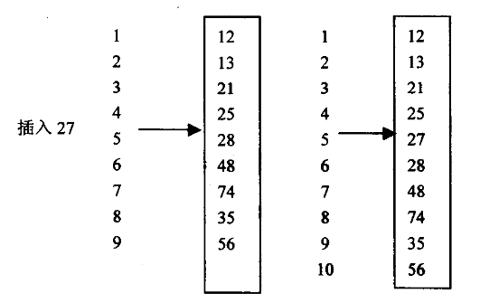

# 线性表
线性表是最基本、最简单、也是最常用的一种数据结构。一般情况下，在线性表中每个a描述的是一组相同属性的数据。
$$
A=(\mathbf{a}_1,\mathbf{a}_2,\mathbf{a}_3,……,\mathbf{a}_n)
$$

线性表的离散定义：B=<A, R>，其中A包含n个节点a1到an，R中只包含一个关系，即线性关系。线性表中包含的数据元素个数为线性表的长度。
## 顺序表

线性表的顺序存储，也称为向量存储。线性表中节点存放的物理顺序与逻辑顺序完全一致，它叫向量存储。实际上，数据的逻辑存储位置由线性表的下标决定。所以相邻的元素之间地址的计算公式为（假设每个数据元素占有c个存储单元）：
$$
LOC(\mathbf{a}_{i+1})=LOC(\mathbf{a}_{i}) + c
$$
### 基本操作实现
顺序表存储结构容易实现线性表的某些操作，例如随机存取第i个元素等，但是在插入和删除数据元素时则比较繁琐。

>例1：在线性表的第i-1个数据元素和第i个数据元素之间插入一个新的数据元素使线性表的长度增加一个元素空间。
算法分析：用顺序表作为线性表的存储结构时，必须保证数据存储的连续性，必须从第i个元素到第array.lenght - 1个元素向后平移，空出一个存储单元后，插入该元素：

```java
private void arrayinsert(int[] array,int i, int item){
    if (i > array.length - 1 ){
        System.out.println("i not exist");
    }else {
        for (int k = array.length - 1;k <= i;k--){
            array[k+1] = array[k];
            array[i]= item;
        }
        array.length = array.length + 1;
    }
}
```
插入结束后要修改线性表长度。以上算法的时间主要花费在后移语句for循环上。该语句最坏的情况下，移动次数是array.length，最好的情况下是0。其时间复杂度是Ο(n)
>例2：顺序存储结构中，删除线性表的第i个元素，使线性表的长度减少一个元素空间。
算法分析：用顺序表作为线性表的存储结构时，必须保证数据存储的连续性，必须从第array.lenght - 1个元素到第i个元素向前平移，直接删除一个数据元素。