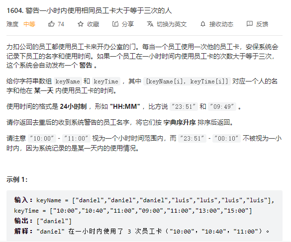

# 2023-02-07




代码：

``` java
public static List<String> alertNames(String[] keyName,String[] keyTime){
        List<String> result = new ArrayList<>();
        Set<String> re = new HashSet<>();
        Set<String> names = new HashSet<>();
        Map<String,String> now = new HashMap<>();
        Map<String,String> time = new HashMap<>();
        for (int i = 0;i < keyName.length;i++){
            // 判断之前是否有刷过卡
            if (!names.add(keyName[i])){
                // 字符串处理
                String nowTime = now.get(keyName[i]);
                String rangeAndTime = time.get(keyName[i]);
                int timeH1 = Integer.parseInt(nowTime.split(":")[0]);
                int timeM1 = Integer.parseInt(nowTime.split(":")[1]);
                int timeH2 = Integer.parseInt(keyTime[i].split(":")[0]);
                int timeM2 = Integer.parseInt(keyTime[i].split(":")[1]);
                int sum = Integer.parseInt(rangeAndTime.split(",")[1]);
                int count = Integer.parseInt(rangeAndTime.split(",")[1]);
                if (timeH2 - timeH1 < 0){
                    count = 1;
                    sum = 0;
                }else if (timeH2 - timeH1 <= 1){
                    if (timeH2 - timeH1 == 0){
                        sum += timeM2 - timeM1;
                    }else {
                        sum += timeM2 + (60 - timeM1);
                    }
                    if (sum > 60){
                        count = 1;
                        sum = 0;
                    }else {
                        count++;
                    }
                }else {
                    count = 1;
                    sum = 0;
                }
                now.put(keyName[i],keyTime[i]);
                if (count == 3){
                    count = 1;
                    sum = 0;
                    re.add(keyName[i]);
                }
                time.put(keyName[i],sum + "," + count);
            }else {
                now.put(keyName[i],keyTime[i]);
                time.put(keyName[i],"0,1");
            }
        }
        result.addAll(re);
        Collections.sort(result);
        return  result;
    }
```

# 2023-02-08


代码：

```java
public static List<String> removeSubfolders(String[] folder) {
		return new ArrayList<>(
                Arrays.stream(folder).sorted().collect(Collectors.toCollection(() -> 
                        new TreeSet<>((a, b)-> 
                                a.startsWith(b+"/")?0:a.compareTo(b)
                        )
                    )
                )
        );
}
```

# 2023-02-10


```java
static final int MOD = 1000000007;

public int dieSimulator(int n, int[] rollMax) {
    int[][] dp = new int[n][6];
        Arrays.fill(dp[0], 1);
        for (int i = 1; i < n; i++) {
            for (int j = 0; j < 6; j++) {
                dp[i][j] = Arrays.stream(dp[i - 1]).reduce(0, (a, b) -> (a + b) % MOD);
                if (i == rollMax[j])
                    --dp[i][j];
                else if (i > rollMax[j])
                    for (int k = 0; k < 6; k++)
                        if (j != k)
                            dp[i][j] = (dp[i][j] - dp[i - rollMax[j] - 1][k] + MOD) % MOD;
            }
        }
        return Arrays.stream(dp[n - 1]).reduce(0, (a, b) -> (a + b) % MOD);
}
```

# 2023-02-23


